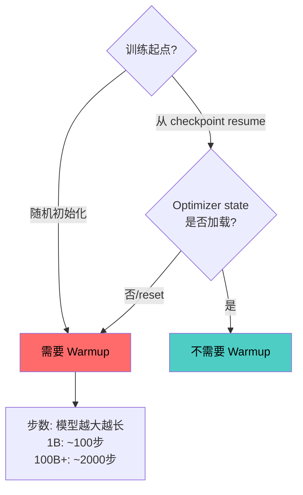
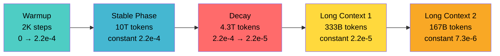
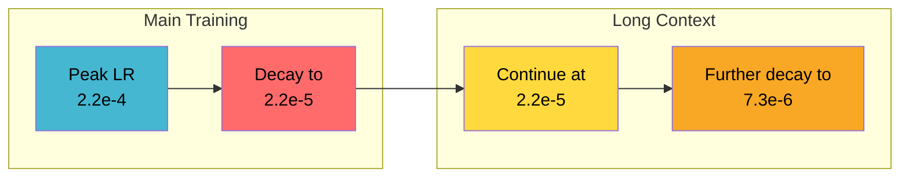
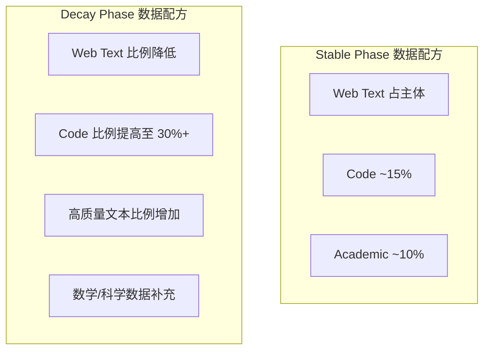

我第一次看到多模态预训练的配置文件时，被一行参数震住了：

```yaml
lr-warmup-fraction: 0.0   # ← no warmup at all
```

这是一个 3B 多模态模型的真实配置。Peak LR 设为 2.9919e-4，min-lr = 3e-5，cosine decay——和同系列的纯文本 baseline 几乎一模一样，唯一的区别是：**warmup 被完全去掉了**。

同系列的 3B 纯文本 baseline 配置呢？lr = 3e-4，min-lr = 3e-5，cosine decay，warmup-samples = 1,638,400（约 100 步）。有 warmup。

为什么？

答案藏在一个容易被忽略的前提里：多模态训练从一个已训练完成的文本 checkpoint 启动，optimizer states（Adam 的一阶矩 $m$ 和二阶矩 $v$）已经是 "warm" 的。Warmup 本质上是给 Adam 的二阶矩估计一个校准期——当你 cold-start 训练时，$v_t$ 的指数移动平均需要足够多的梯度样本才能反映真实的 per-parameter scale。但如果你从一个已训练数万步的 checkpoint resume，$v_t$ 已经稳定，不需要再校准。

**Warmup 是 cold-start 的产物。已有 optimizer state 时，warmup = 浪费算力。**

这一个细节让我重新审视了"LR schedule"这个话题——它远不是选 cosine 还是 linear decay 那么简单。真正影响工程决策的，是每个阶段背后的物理意义。下面我从四份真实的 LR 配置出发，拆解学习率调度的工程哲学。

---

## 四份配置的并排对比

先把数据摆出来：

| 配置 | Peak LR | Min/End LR | Schedule | Warmup | Batch Size | 备注 |
|------|---------|-----------|----------|--------|-----------|------|
| 3B 文本 baseline | 3e-4 | 3e-5 | Cosine | ~100 步 (1.6M samples) | 4096 | Cold-start |
| 3B 多模态 | 2.9919e-4 | 3e-5 | Cosine | **0** | 4096 | 从文本 checkpoint 启动 |
| 671B MoE (V3) | 2.2e-4 | 2.2e-5 → 7.3e-6 | WSD 变体 | 2K 步 | 渐增至 ~60M tokens | 多阶段 decay |
| 671B MoE (V4 Flash) | 2.7e-4 | 2.7e-5 | — | — | — | 迭代版本 |

几个值得注意的模式：

1. **3B 模型 lr = 3e-4，671B MoE 模型 lr = 2.2e-4**——更大的模型用更低的 LR。但差距没有想象中大（同一数量级），因为 MoE 的 active parameters 远小于 total parameters。

2. **Min LR = Peak LR / 10** 是一致的经验法则（3e-5 / 3e-4 = 1/10，2.2e-5 / 2.2e-4 = 1/10）。

3. **V4 Flash 的 peak LR (2.7e-4) > V3 (2.2e-4)**——迭代训练中逐步推高 LR boundary，说明训练稳定性工程在不断改进。

---

## Warmup 的真实角色：只看 optimizer state

把 warmup 理解清楚，需要回到 Adam 的更新公式：

$$\theta \leftarrow \theta - \frac{\eta}{\sqrt{\hat{v}_t} + \epsilon} \cdot \hat{m}_t$$

其中 $\hat{v}_t$ 是梯度平方的指数移动平均经 bias correction 后的值。关键在于：

- **Cold start**（随机初始化）：$v_t$ 从零开始累积，前几百步的估计极不准确。此时 $1/\sqrt{\hat{v}_t}$ 可能异常大，如果同时使用 peak LR，实际参数更新幅度远超预期 → loss spike、训练发散。Warmup 人为压低前期有效学习率。

- **Warm resume**（从 checkpoint 继续）：$v_t$ 已经积累了数万步的统计信息，per-parameter scale 估计是准确的。此时直接使用 peak LR 完全安全。

这解释了为什么：
- 3B 文本 baseline（cold-start）需要 ~100 步 warmup
- 3B 多模态（从文本 checkpoint resume）可以 warmup = 0
- 671B MoE（cold-start 训练万亿 token）需要 2K 步 warmup——模型越大，参数空间越复杂，$v_t$ 收敛需要更多步



> **工程经验**：如果你从一个 checkpoint 启动 continual pre-training 但 reset 了 optimizer state（有时为了兼容性不得不这样做），那仍然需要 warmup。判断标准永远是 "Adam 的二阶矩是否已稳定"，而非 "模型参数是否已初始化"。

---

## WSD 的真正优势：从 671B MoE 的 Schedule 说起

671B MoE (V3) 的完整 LR schedule 如下：

```
Warmup 2K 步 → Constant LR (2.2e-4) 持续 10T tokens → Cosine Decay 4.3T tokens → 2.2e-5
→ Constant (2.2e-5) 333B tokens → 7.3e-6 Constant 167B tokens
```

把它画成图：



这本质上就是一个 WSD schedule——只不过 decay 之后还有两段 constant-LR 的 fine-tuning。核心观察：

### 1. Stable Phase 长达 10T tokens

在这 10T tokens 的训练中，LR 恒定在 2.2e-4。这意味着什么？

**如果训练在 10T tokens 的任何时刻 crash——比如在 6T tokens 处遭遇硬件故障——拿到的 checkpoint 与 10T 处的 checkpoint 在 LR 状态上完全等价。** 你只需要：
1. 从最近的 checkpoint resume
2. 继续跑到想要的 token 数
3. 再启动 decay

对比 cosine schedule：如果你在总步数 60% 处 crash，当前 LR 已经衰减到远低于 peak，而你想要的是"跑完 100% 后的模型"。这个中间状态的 checkpoint 几乎不可用——LR 已经降下去了，不能直接当 base model 用；要继续训练也尴尬，因为 cosine 曲线是固定的。

### 2. Decay Phase 的意义

4.3T tokens 的 decay（从 2.2e-4 降到 2.2e-5）做了什么？从优化理论看：

- Stable phase 的高 LR 让模型在 loss landscape 中大幅探索，跳出局部最优
- Decay phase 的低 LR 让模型在找到的好区域内精细收敛

类比退火工艺：高温让金属原子自由移动寻找最优排列，降温让它们在好的位置固定下来。

### 3. Cosine 的结构性问题

Cosine schedule 的公式：

$$\eta_t = \eta_{min} + \frac{1}{2}(\eta_{peak} - \eta_{min})\left(1 + \cos\left(\frac{\pi \cdot t}{T}\right)\right)$$

它要求你在训练开始前确定 $T$（总步数）。这在万亿 token 训练中是一个巨大的约束：

| 场景 | Cosine 的问题 | WSD 的解法 |
|------|--------------|-----------|
| 训练中途发现数据质量问题，想延长 | 整个 schedule 需要重设计 | Stable phase 自然延长 |
| 硬件故障中断 | 中间 checkpoint 的 LR 状态不理想 | 任意 stable checkpoint 等价 |
| 想从同一 base 尝试不同 cooldown 方案 | 做不到，decay 是 schedule 内置的 | 分支 decay 低成本探索 |
| 预算变更，需要提前结束 | 模型只训了"半条 cosine"，效果差 | 立即启动 decay，正常收敛 |

**一句话：Cosine 把训练变成一次性射击，WSD 把训练变成可暂停的流水线。**

---

## LR 与 Batch Size 的关系：Sqrt Scaling in Action

回到那两个 baseline 配置：

- **3B 模型**：global-batch-size = 4096，lr = 3e-4
- **0.6B 模型**：global-batch-size = 8192，lr = 4e-4

两个规律叠加在一起：

1. **更大模型 → 更低 LR**：3B 用 3e-4，0.6B 用 4e-4
2. **更大 batch → 可以用更高 LR**：0.6B 的 batch 是 3B 的 2 倍，LR 也更高

这背后是 Adam 优化器下的 square root scaling rule：

$$\eta' = \eta \cdot \sqrt{\frac{B'}{B}}$$

直觉：batch size 翻倍，梯度估计的方差降低为原来的 $1/2$，标准差降低为 $1/\sqrt{2}$。所以你可以把 LR 提高 $\sqrt{2}$ 倍来利用这个更低的噪声。

验证：0.6B 的 batch 是 3B 的 2 倍 → 允许 LR 提高 $\sqrt{2} \approx 1.41$ 倍。3e-4 × 1.41 = 4.24e-4 ≈ 4e-4。吻合。

> **注意**：这只是 Adam 下的经验法则。Linear scaling ($\eta' = \eta \cdot B'/B$) 在 SGD 时代更常用但在 Adam + Transformer 中容易导致不稳定。Sqrt rule 是更安全的默认选择。

---

## muP：32 GPU-hours 替代 1M GPU-hours 的搜索

Peak LR 的选择是预训练中最关键的超参决策。选高了训练发散，选低了浪费算力。对于 3B+ 模型，每次 full training run 的成本都不允许大量尝试。

muP（Maximal Update Parameterization, [arXiv:2203.03466](https://arxiv.org/abs/2203.03466)）的核心 insight：传统参数化下，最优 LR 随模型宽度变化；muP 通过重定义各层的 init scale 和 LR multiplier，让**最优超参在不同宽度下保持不变**。

### 实际操作

以某个 4B 模型的 muP 实践为例（来自 [arXiv:2404.06395](https://arxiv.org/abs/2404.06395) 的方法论）：

1. 构建一系列 proxy model（width = 128, 256, 512, 1024）
2. 对每个 width 做 LR grid search（跑几十 B token 足够判断趋势）
3. 验证 muP 下最优 LR 在不同 width 间一致
4. 将该 LR 直接用于 production model（width = 4096+）

**成本对比**：
- Proxy model 搜索总成本：~32 GPU-hours
- 在 production 规模暴力搜索的等价成本：~1,000,000 GPU-hours
- **压缩比：约 4 个数量级**

这不是理论估算——某个公开的 4B 模型训练 report 明确记录了这个数据。

### muP 的边界

muP 保证 "宽度方向" 的 transfer。以下维度不在理论保证范围内：

- **深度**（layer 数）：从 12 层 transfer 到 64 层可能需要微调
- **训练数据量**：proxy model 只跑 1-5B token，目标可能跑 2T+ token
- **Batch size**：不同 batch size 的最优 LR 仍需 sqrt rule 校准

实践中的做法：用 muP 确定 LR 的数量级（比如确认在 3e-4 附近而非 3e-5），然后在目标模型上只做极窄范围的 fine-tuning search。

---

## 多阶段 LR：从 main training 到 long context

671B MoE (V3) 的 long context 阶段的 LR 选择透露了一个重要原则：

```
Main training 最终 LR: 2.2e-5 (decay 终点)
Long context stage 1: constant 2.2e-5  ← 未变
  ↓ 衰减至
Long context stage 2: constant 7.3e-6
```

另一个例子，某个 4B 模型的 long context extension：

```
Main training 使用 cosine decay 3e-5 → 1e-5
```

规律一致：**Context extension 从 main training 的结束 LR 开始，不做 re-warmup。**

为什么？

1. **Long context 是 capability extension，不是 distribution shift**。模型不需要大幅调整已有知识，只需要学会处理更长的 positional encoding 和更深的 attention pattern。低 LR 足够。

2. **Re-warmup 的风险极大**。如果在 long context 阶段用高 LR，可能破坏 main training 学到的短文本能力——这是 catastrophic forgetting 的经典触发条件。

3. **Optimizer state 已热**。和多模态的道理一样——从 checkpoint resume 时 Adam 的统计量已经稳定，不需要 warmup。



### 多阶段 LR 的决策框架

| 下游阶段的性质 | LR 策略 | 理由 |
|--------------|---------|------|
| Capability extension（长上下文、工具调用） | 从 end LR 继续或微降 | 保留已有能力 |
| Distribution shift（新语言、新 domain） | Partial reset（peak × 0.1~0.5） | 需要更大更新幅度 |
| Fine-tuning（SFT/RLHF） | 独立的小 LR（1e-5~5e-6） | 避免 overfit |

---

## Cooldown 阶段的数据配方

671B MoE (V3) 的 decay 阶段长达 4.3T tokens——这不是简单的"降 LR"，而是一个独立的训练阶段。在这个阶段，数据配方通常会发生变化：



逻辑：当 LR 低时，模型参数变化幅度小，高质量数据的 signal 更容易被"记住"（不会被后续高 LR 的更新覆盖）。相当于最后阶段用好数据"定型"。

WSD 在这里的优势：stable phase 和 decay phase 的边界是你决定的，你可以在 decay 开始时同时切换数据配方——这在 cosine schedule 中做不到，因为 cosine 的 decay 是从第一步就开始的，没有明确的"切换点"。

---

## 工程 Checklist

从四份真实配置中提炼的操作指南：

**Warmup 决策**：
- Cold-start → warmup 1K~2K 步（模型越大越长）
- 从 checkpoint resume 且加载 optimizer state → warmup = 0
- 从 checkpoint resume 但 reset optimizer → 仍需 warmup

**Peak LR 选择**：
- 同等条件参考同规模公开配置
- Batch size 变化时用 sqrt scaling 修正
- 有条件时用 muP 从 proxy model transfer（~32 GPU-hours 定位数量级）

**Schedule 选择**：
- 训练 > 1T tokens → WSD（容错性、可中断性）
- 探索性实验 < 100B tokens → Cosine（简单直接）
- Min LR 设为 Peak LR / 10 是安全默认

**多阶段衔接**：
- Capability extension → 从 end LR 继续，不 re-warmup
- 大 distribution shift → partial reset（peak × 0.1~0.5）
- 始终保留并加载 optimizer state，除非有明确理由 reset

---

## 总结：LR Schedule 的三层思考

| 层次 | 问题 | 真实配置中的答案 |
|------|------|----------------|
| **物理层** | Adam 的 $v_t$ 是否稳定？ | 决定了是否需要 warmup |
| **工程层** | 训练能否安全中断和恢复？ | WSD 的 stable phase 解决 |
| **经济层** | 超参搜索成本能否承受？ | muP 压缩 4 个数量级 |

这三层不是独立的选择题，而是一个 LR schedule 设计需要同时回答的三个约束。理解了每层的物理意义，具体的数值选择反而是最简单的部分——因为答案几乎总是"参考同规模的成功配置，然后用 muP 做局部搜索"。

真正需要原创思考的是那些不在经验法则内的决策：多模态为什么去掉 warmup？Long context 为什么不 re-warmup？这些"反直觉"的配置选择，恰恰是对底层原理理解最好的测试。

---

## 参考文献

1. **muP (Maximal Update Parameterization)**: Yang et al., "Tensor Programs V: Tuning Large Neural Networks via Zero-Shot Hyperparameter Transfer", 2022. [arXiv:2203.03466](https://arxiv.org/abs/2203.03466)

2. **Chinchilla / Scaling Laws**: Hoffmann et al., "Training Compute-Optimal Large Language Models", 2022. [arXiv:2203.15556](https://arxiv.org/abs/2203.15556)

3. **MiniCPM (WSD + muP 系统性验证)**: Hu et al., "MiniCPM: Unveiling the Potential of Small Language Models with Scalable Training Strategies", 2024. [arXiv:2404.06395](https://arxiv.org/abs/2404.06395)

4. **DeepSeek-V3**: Liu et al., "DeepSeek-V3 Technical Report", 2024. [arXiv:2412.19437](https://arxiv.org/abs/2412.19437)
