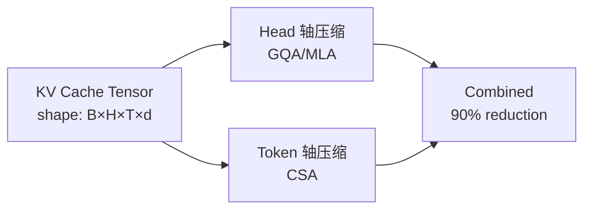
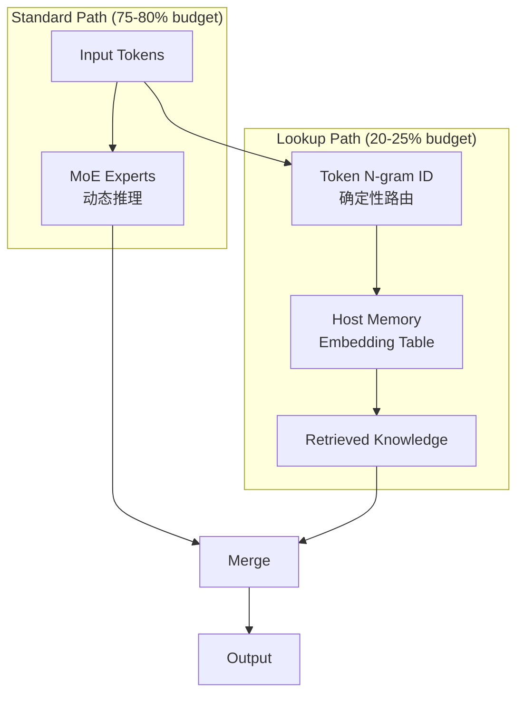
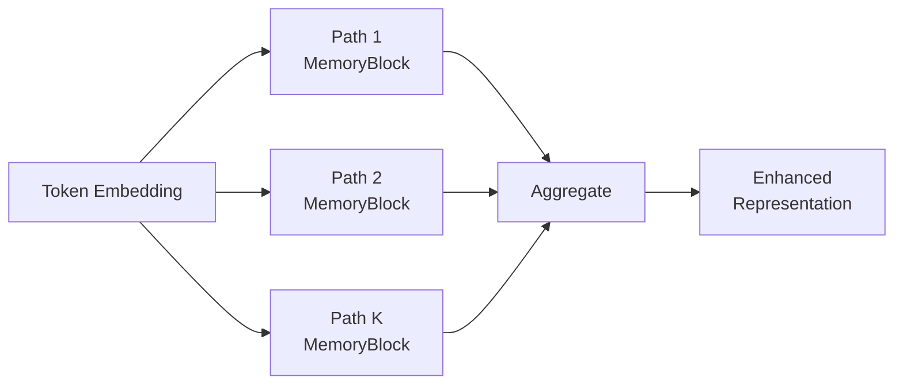

做了几年大模型架构相关的工作，越来越感觉到：好的架构设计不是在"调参数"，而是在"找结构"。参数是连续的、可优化的，而结构是离散的、需要洞察的。这篇文章整理了最近一批让我觉得"有品味"的架构设计，它们的共同特征是：**找到问题的正交分解，然后用结构性手段各个击破**。

---

## 1. 双轴 KV Cache 压缩：head 维度 × token 维度

KV Cache 是长上下文推理的内存瓶颈。先前的方法可以画在一个二维空间中：

- **Head 轴压缩**：GQA、MQA、MLA — 多个 query head 共享 KV head，压缩 head 维度
- **Token 轴压缩**：CSA (Compressed Shared Attention) — 沿序列维度做 block-level 聚合，4x 压缩率

关键洞察：**这两个轴是正交的**，可以自由组合。MLA 把多个 head 的 KV 投射到低秩共享空间（压缩 H 维），CSA 在此基础上进一步把连续 token block 聚合为 compressed representation（压缩 T 维）。两者组合在 1M context 下实现 90% KV cache 缩减 + 73% FLOPs 节省。

### 架构细节：两阶段检索

设计的精巧之处在于不是暴力地对所有 compressed block 做 full attention，而是分两步：

1. **Coarse scoring**：用一个极轻量的 index projection $c_I \ll d_{head}$ 对所有 compressed block 打分
2. **Top-k precise attention**：只对筛选出的 block 展开做标准 attention

这和搜索引擎的 recall → rerank 架构同构。轻量索引层的 FLOPs 几乎可忽略，heavy lifting 只在 top-k 上发生。

### 几个工程性的关键决策

- **Overlapped compression windows**：相邻压缩窗口有重叠，解决边界信息丢失。没有 overlap 的版本在长依赖任务上有显著退化
- **Single-Softmax joint attention**：local window attention 和 global compressed attention 合在一个 softmax 里联合归一化，不需要 learned gate。这比 "两路分别算再加权" 简单且更稳定
- **Attention Sink (virtual token)**：引入一个虚拟 token 吸收"没什么 relevant 的时候"的 attention weight，避免 probability mass 被迫分散到无关 token 上导致表征退化

---

## 2. 静态知识 vs 动态推理的结构分离

标准 Transformer 有一个隐含的低效：**它用 $O(L \cdot d^2)$ 的前向传播来"模拟"本质上是 $O(1)$ 的 table lookup**。

当模型被问到 "法国的首都是什么" 时，它并不需要"推理"——它需要的是一个 key-value 查找。但标准架构中，这种知识检索和多步逻辑推理共享同一组 layer，互相挤占 depth budget。

### Engram 架构的分离方案

关键设计：

- **确定性路由**（token N-gram hash）而非 learned routing，使得 lookup path 可完全 offload 到 host memory，latency overhead < 3%
- **U-shaped budget 分配**：~20-25% 容量给 sparse lookup，75-80% 给 dense MoE experts

### 反直觉的实验结果

你可能以为 "分离出知识查找" 最大的收益在 knowledge-intensive 任务（trivia QA 之类）。实际上：**最大增益在推理和代码**（BBH +5.0），知识任务增益反而较小。

这说明真正的瓶颈不是 "模型记不住知识"，而是 "记忆知识挤占了推理的 depth budget"。把检索路径单独拉出来后，剩余 layers 的全部深度可以专注于 composition 和 reasoning。

### Embedding 训练的特殊性

Lookup path 的 embedding table 需要特殊优化策略：

- **5x learning rate**：稀疏更新意味着每个 entry 的有效更新步数远少于 dense 参数
- **NO weight decay**：传统 weight decay 假设参数被频繁更新，但 sparse entry 可能几万步才被访问一次——weight decay 会错误地惩罚这些 "低频但正确" 的条目

---

## 3. 稀有 Token 的梯度饥饿：可证明的结构缺陷

这是一个我觉得特别优雅的工作，因为它把一个实践观察上升到了**可证明的理论界**。

### 问题：频率鸿沟

在自然语言中，token 频率服从 Zipf 分布。高频 token（"the", "is"）在整个训练过程中可能获得 $\sim 10^9$ 次梯度更新，而稀有 token（专业术语、罕见词）只有 $\sim 10^3$ 次。差距达到 **6 个数量级**。

### 为什么标准架构无法解决

TIDE 的关键贡献是证明了一个 Lipschitz bound：

对于标准 FFN 层，设输入为 $\mathbf{h}_i$ 和 $\mathbf{h}_j$，有：

$$\|f(\mathbf{h}_i) - f(\mathbf{h}_j)\| \leq L \cdot \|\mathbf{h}_i - \mathbf{h}_j\|$$

其中 $L$ 是 FFN 的 Lipschitz 常数。

当两个 rare token 的 embedding 因训练不充分而 "挤" 在一起时（$\|\mathbf{h}_i - \mathbf{h}_j\|$ 很小），FFN 输出的差异被 Lipschitz 常数上界限制——**模型在结构上无法区分它们**，无论你训练多久。

这不是一个可以通过 "训练更多步" 或 "调大学习率" 解决的问题。它是架构本身的结构缺陷。

### K-fold MemoryBlock：结构性解法

每个 MemoryBlock 是独立的 key-value memory，K 条独立路径各自提供梯度信号到同一个 embedding。即使某一条路径上 token 没被选中，其他路径仍有机会提供更新。

关键设计细节：

- **K=2 即可捕获 ~55% 的增益**，成本极低。这说明 bottleneck 确实是 "至少需要一条额外梯度路径"，而不是 "需要很多条"
- **Null bank（空银行）**：对于已经训练充分的高频 token，MemoryBlock 路由到 null bank（输出为零向量），避免额外路径干扰已经很好的表征

这是 "structural > parametric" 原则的典型案例：你不需要更多参数来解决问题，你需要的是一条**绕过 Lipschitz 瓶颈的替代路径**。

---

## 4. Looped Transformer 的设计约束

参数共享/循环 Transformer（同一组 layer 被重复执行多次）是一种优雅的 scaling 策略：推理时不增加参数量但增加 effective depth。但实践中有很多微妙的设计约束。

### 3 次循环是 Universal Sweet Spot

跨多个模型规模和任务，**3 loops** 一致地给出最好的 performance/cost 比。更多循环有微弱收益但 throughput 线性下降。

这个数字的直觉：每一轮 loop 大致对应 "refine → verify → correct" 的认知循环。2 次不够做完整的 self-correction，4 次开始重复已经稳定的表征。

### Gate 设计：简单胜过复杂

| Gate 类型 | 参数量 | PPL 改善 |
|----------|--------|---------|
| Sinkhorn doubly-stochastic | ~200K | -0.25 |
| **Diagonal sigmoid** | ~35K | **-0.45** |

Sinkhorn gate 强制 "conservation constraint"（输出权重之和为 1），这对于 evolving representation 是有害的——有时候模型需要 amplify 或 attenuate 整体信号，而非仅仅重新分配。

简单的 per-dimension sigmoid gate 只需要 $d$ 个参数，却更好地捕获了 "哪些维度该在这轮循环中被更新" 的语义。

### Hidden-state Conditioning (HC) 频率

**每个 loop 恰好一次 HC** 是最优频率。HC 的作用是把上一轮循环的 "结论" 注入下一轮的初始状态。太频繁会干扰中间计算，太稀疏则上轮信息衰减。

### LoRA 跨 loop 几乎无效

一个违反直觉的实验：

- LoRA across loops: 7.5M parameters → **-0.08 PPL**
- Loop-gate: 35K parameters → **-0.45 PPL**

参数效率差了 **200x → 5.6x 效果差距**。

这说明 looped Transformer 的瓶颈**不是**参数分化（"不同 loop 需要做不同的事"），而是**残差流管理**（"如何决定每一轮该更新什么、保留什么"）。LoRA 尝试让不同 loop 做不同 transformation，但真正 needed 的是一个 cheap signal 告诉模型 "这一轮该关注残差流的哪些维度"。

---

## 5. 训练时稀疏注意力几乎无损

长上下文注意力的稀疏化是老话题了，但之前的方法几乎都是 **post-hoc** 的：先用 full attention 训练，推理时再近似。这导致两个问题：

1. 训练和推理的 distribution mismatch
2. 模型从未学过 "在稀疏 pattern 下如何有效利用信息"

### Training-Integrated Sparse Attention

MiniCPM4 中集成的 InfLLM v2 做了一个关键改变：**在预训练阶段就引入 query-level Top-K block selection**。

具体做法：对每个 query，用轻量评分选出 Top-K 个 KV block（81% sparsity），只对选中 block 做 full attention。梯度正常回传。

结果：

$$\Delta_{\text{quality}} = 0.48 \text{ points (vs full attention)}$$

$$\text{Speedup}_{128K} = 7\times \text{ decoding}$$

0.48 point 的差距在实际使用中几乎不可感知，但 7x 加速是实打实的。

### 核心洞察：学习到的稀疏远优于后验近似

为什么 training-time sparsity 这么有效？因为模型在训练中**学会了把信息集中在少量 block 中**。它知道自己推理时只能看 Top-K，所以会主动把重要信息写入那些 "容易被 Top-K 选中" 的位置。

这是一种 co-adaptation：attention pattern 和 representation 互相适应，形成一个对 sparse access 友好的信息布局。Post-hoc 方法永远做不到这一点，因为 representation 是为 full attention 优化的。

---

## 6. TST：训练时高效、推理时标准

Token-Superposition Training 的设计哲学非常独特：**推理模型完全标准，加速只发生在训练时**。

### 核心机制

将 $s$ 个 token 的 embedding 做加权平均，合并为 1 个 latent representation：

$$\mathbf{z} = \frac{1}{s}\sum_{i=1}^{s} \mathbf{e}_i$$

这个 latent 走完整个 Transformer forward/backward，但 cost 是单个 token 的。训练完成后，模型以标准方式逐 token 推理，无任何架构修改。

效果：**2.5x training speedup**，推理完全无开销。

### 关键约束：表征连续性

TST 有一个 "phase transition"：从 superposed training 切换到 standard token 时，如果处理不当会导致灾难性退化。

实验表明：**重新初始化 embedding 是 catastrophic 的**。正确做法是让 superposition ratio $s$ 在训练后期渐进退火到 1，保持表征空间的连续演化。

直觉上，superposed embedding 占据了 embedding space 的某个子空间，模型的后续 layer 已经适应了这个分布。突然切换等于把输入分布瞬间改变，所有 layer 的假设同时失效。

### 适用边界

TST 只在 **compute-limited + data-abundant** 场景下有效。如果数据是瓶颈（每条数据只过一遍），那么把多个 token 合并为一个会丢失信息，得不偿失。只有当你有大量数据但算力不足（需要更多 token throughput）时，superposition 才是正确的 trade-off。

---

## 设计品味的 Meta-Principles

回顾这六个案例，可以提炼出几条关于"架构设计品味"的元原则：

### 1. 正交分解 (Orthogonality)

> 一个好的架构设计首先要找到问题的**正交轴**，然后在每个轴上独立求解。

KV Cache 的 head 轴和 token 轴是正交的。知识检索和动态推理是正交的。训练效率和推理效率是正交的（TST）。找到正交分解后，解法可以自由组合，且各自的创新不会互相干扰。

### 2. 结构性 > 参数化 (Structural > Parametric)

> 当一个问题有可证明的理论界（Lipschitz bound、梯度频率鸿沟），加参数不能解决它——你需要**新的结构路径**。

K-fold MemoryBlock 不是 "更大的 FFN"，而是 "绕过 FFN Lipschitz 约束的替代梯度路径"。Loop-gate 不是 "更多的 LoRA 参数"，而是 "直接控制残差流的开关"。区分 "需要更多参数" 和 "需要新结构" 是高级架构设计能力的核心。

### 3. 组合性 (Composability)

> 好的组件设计应该是**可组合的**——它不假设自己是唯一的优化手段。

CSA 不关心 head 维度是否被压缩过。Engram 的 lookup path 不关心 dense path 用的是 MoE 还是 dense FFN。InfLLM v2 的 sparse pattern 不关心具体的 attention variant。这种 "松耦合" 让各个创新可以独立验证、独立部署、自由组合。

### 4. 与训练动态对齐 (Training-Aware Design)

> 推理时的最优架构不等于训练时的最优架构。好的设计会考虑整个生命周期。

InfLLM v2 证明了 training-time sparsity 远优于 post-hoc sparsity。TST 证明了训练和推理可以用不同的 "模式" 但共享同一组参数。Engram 的 embedding 需要专门的优化策略（高 LR、无 weight decay）来适应其稀疏更新特性。

### 5. 最小有效干预 (Minimum Effective Intervention)

> 最优雅的解法往往参数量极小但精准命中瓶颈。

Loop-gate 35K 参数击败 LoRA 7.5M 参数。K=2 的 MemoryBlock 获得 55% 收益。Attention Sink 只需 1 个 virtual token。这些都指向同一个道理：**理解瓶颈在哪，比堆砌参数重要得多**。

---

## 写在最后

架构设计不是随机搜索。上面每一个成功的设计背后，都有一个清晰的思维链：

1. **观察现象**（KV Cache 太大、rare token 学不好、loop 不收敛…）
2. **定位结构性原因**（而非 "参数不够" 或 "训练不够"）
3. **找到正交分解**（把问题拆成独立子问题）
4. **用最小结构干预解决**（35K 参数的 gate，而非 7.5M 的 LoRA）

这就是所谓的 "design taste"——它不是审美偏好，而是一种**对计算结构的深层理解**。拥有它的人看到一个新问题时，不会立刻想 "我该加什么模块"，而是会问 "这个问题的瓶颈是结构性的还是参数性的？它和哪些已知问题正交？最小的有效干预是什么？"

---

## 参考文献

- [1] "Conditional Memory via Scalable Lookup: A New Axis of Sparsity for LLMs" (Engram), [arxiv](https://arxiv.org/abs/2601.07372)
- [2] "Token-ID-indexed DEcoupled memory blocks" (TIDE), [arxiv](https://arxiv.org/abs/2605.06216)
- [3] Hyperloop Transformers, [arxiv](https://arxiv.org/abs/2604.21254)
- [4] DeepSeek-V4, Technical Report, 2026
- [5] "Efficient Pre-Training with Token Superposition" (TST), Nous Research, [arxiv](https://arxiv.org/abs/2605.06546)
- [6] MiniCPM4 (InfLLM v2 sparse attention), OpenBMB, [arxiv](https://arxiv.org/abs/2506.07900)
- [7] PLE / Gemma 3, [arxiv](https://arxiv.org/abs/2503.19786)
- [8] DeepSeekMoE, [arxiv](https://arxiv.org/abs/2401.06066)
- [9] "multi-head Chunked attention" (mHC), [arxiv](https://arxiv.org/abs/2512.24880)
- [10] Over-Encoding, [arxiv](https://arxiv.org/abs/2501.16975)
