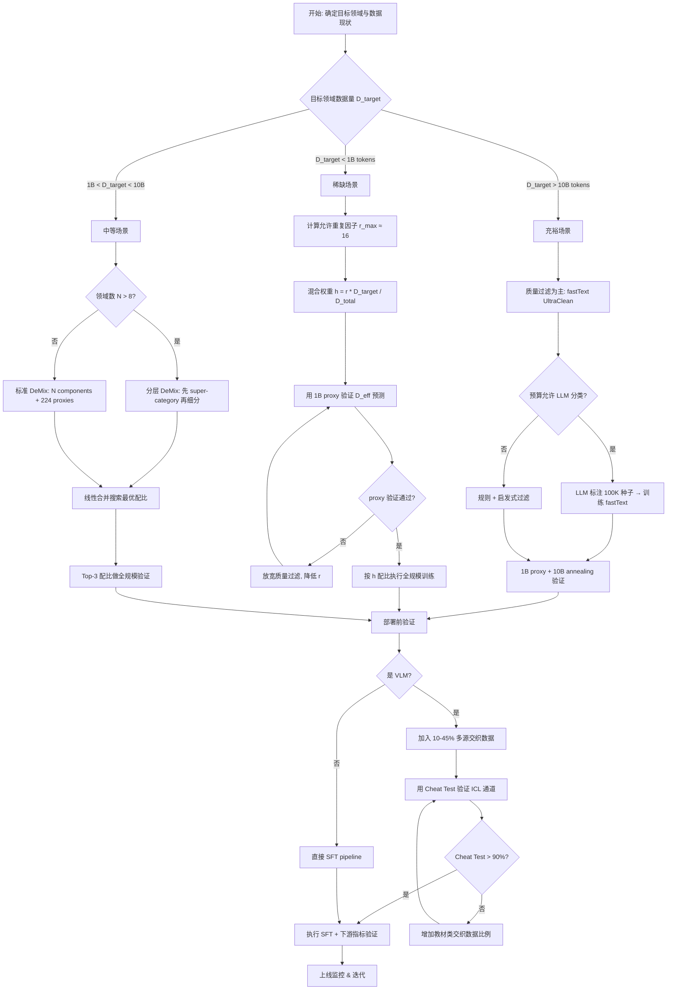

大模型训练中，数据工程的决策往往比模型架构更影响最终效果。本文从四个维度系统梳理数据配比、重复、多样性与质量的量化决策框架，提供可直接落地的方法论。

---

## 1. 通用数据是稀有领域重复的隐式正则化

在实际项目中，目标领域数据（如医疗、法律、代码）往往远少于通用语料。2026 年一项关于混合训练的 Scaling Law 研究揭示了一个关键机制：**通用数据的持续注入本质上是对稀缺领域重复的隐式正则化**。

### 核心发现

当将稀缺目标数据与充裕通用数据混合训练时：

- **单源训练**：目标数据重复超过 **4 epochs** 即出现明显退化（loss 上翘、下游指标掉点）
- **混合训练**：目标数据可容忍 **15-20 epochs** 重复而不退化

其机制在于：通用 token 持续为梯度提供"新鲜"信息方向，防止模型对重复 target 样本过拟合。

### 关键变量：重复因子 r

决定退化程度的核心变量是 **repetition factor r**，而非混合权重 h：

$$
h = \frac{r \cdot D_{\text{target}}}{D_{\text{total}}}
$$

其中：
- $r$ = 目标数据的重复次数
- $D_{\text{target}}$ = 目标数据的 unique token 数
- $D_{\text{total}}$ = 总训练 token 数

**关键结论**：相同的 $r$ 值在不同模型规模下造成相同程度的退化 — 这意味着可以用小模型精确预测大模型的最优混合比。

### 反直觉发现：质量过滤的"甜区"

最严格的质量过滤（top 1%）并**不是**大训练预算下的最优选择：

| 训练预算 | 最优过滤比例 | 原因 |
|---------|------------|------|
| ~1B tokens | top 1% | 数据充足无需重复 |
| ~5B tokens | top 10% | top 1% 被迫重复 50 次，退化严重 |
| ~20B tokens | top 20-30% | 更宽松的过滤换取更低的重复因子 |

### 实践价值：D_eff 公式的 20x ROI

有效数据量公式（Effective Data）允许用 **0.3-1B 参数的 proxy 模型**预测 **3-8B 目标模型**的最优混合配比：

$$
D_{\text{eff}} = D_{\text{unique}} \cdot \left(1 - e^{-r}\right) \cdot \frac{1}{1 + \alpha \cdot \max(0, r - r_{\text{crit}})}
$$

其中 $r_{\text{crit}} \approx 4$（单源）或 $\approx 16$（混合），$\alpha$ 为退化速率。

Proxy 实验成本约为全规模实验的 **1/20**，但预测准确率 > 90%。

---

## 2. 交织数据是 VLM Few-shot ICL 的唯一来源

多模态大模型（VLM）的 in-context learning 能力并非自然涌现，而是由特定数据格式驱动。

### 因果消融实验

一项系统性消融研究清晰揭示了交织数据（interleaved image-text）的不可替代性：

| 数据配置 | 0-shot | 4-shot | 8-shot | Few-shot 增益 |
|---------|--------|--------|--------|-------------|
| Caption-only | 39.3 | 42.1 | 45.0 | +5.7 |
| +50% Interleaved | 37.8 | 49.6 | 54.4 | **+16.6** |
| +50% Interleaved (多源) | 38.1 | 51.2 | 55.0 | **+16.9** |

Caption 数据贡献 zero-shot 能力，但 **few-shot scaling 几乎完全来自交织数据**。

### 规模不等于质量：来源多样性 > 绝对体量

令人惊讶的对比：

- **某 HTML-only 交织数据集 922B tokens** → MMMU 分数较低
- **多来源交织数据集 115B tokens** → MMMU 分数更高

8x 的数据量反而不如来源多样性。原因是 HTML 爬取的图文对齐噪声大、模式单一。

### "Cheat Test" 诊断法

一个简单但有效的诊断：**将答案字面放入 prompt**，测模型能否提取：

| 训练数据来源 | Cheat Test 准确率 |
|------------|-----------------|
| 网页爬取 | 67-72% |
| 教材/文档 | 94-98% |

如果模型连明示答案都无法利用，说明其 ICL 通道从未被训练打开。

### 配比演进的教训

从第一代到第二代 VLM 的实践显示：最优交织比例从 **45% 降至 10%**。原因是：

> Pretraining proxy metrics ≠ post-SFT deployment metrics

预训练阶段看 perplexity 认为交织越多越好，但经过 SFT 后部署到实际任务，过多交织反而引入噪声。

**教训：必须用下游部署指标验证，而非预训练 proxy 指标。**

---

## 3. DeMix: 用模型合并做免费数据配比搜索

传统数据配比搜索需要训练 K 个完整模型来比较 K 种混合策略，成本是 $O(K \cdot C_{\text{train}})$。DeMix 将其降至 $O(N + K \cdot C_{\text{merge}})$，其中 merge 成本几乎为零。

### 核心思路

1. 训练 N 个**单领域** component 模型（各自专注一个数据源）
2. 线性合并不同权重组合，模拟 K 种混合训练的结果
3. 用 LightGBM 拟合 surrogate model，在 simplex 上搜索最优

### 合并方法对比

| 方法 | Spearman $\rho$ (vs 真实训练) | 复杂度 |
|------|--------------------------|--------|
| Linear Average | **0.787** | $O(P)$ |
| SLERP | 0.752 | $O(P)$ |
| TIES | 0.731 | $O(P \log P)$ |
| DARE | 0.724 | $O(P)$ |

**简单线性平均胜过所有复杂方法。** 这可能是因为线性合并恰好对应了混合训练的梯度期望。

### 关键前提：参数位移 < 10%

DeMix 有效的前提是合并后的模型仍在"线性可插值"区域内。实现方法：

$$
\text{Component}_i = \text{Train}(50\% \text{ Generic} + 50\% \text{ Domain}_i)
$$

50% 通用数据作为 anchor，确保各 component 不会漂移太远（参数位移控制在 ~10%）。

### 实践参数

- **最优 proxy 评估数**：~224 个采样点；更多反而导致 LightGBM surrogate 过拟合
- **N 的上限**：当领域数 > 8-10 时，效果显著下降

### 规模化瓶颈

DeMix 在大 N 场景下失效的原因：

1. **线性成本增长**：N 个 component 各自训练
2. **Simplex 稀疏性**：高维 simplex 中绝大部分点无法被 224 个样本覆盖
3. **Sign conflict**：不同 component 在同一参数上方向相反，线性合并互相抵消
4. **非线性交叉项**：真实混合训练中 domain A 和 B 的交互效应无法被线性合并捕获

### 落地方案：分层搜索

```
Level 1 (DeMix): Super-categories (代码 / 自然语言 / 数学 / 多语)
Level 2 (Inner): 每个 super-category 内部细分 (Python/Java/C++ ...)
```

外层 DeMix 确定大类配比，内层在确定预算内精调子类比例。

---

## 4. 数据质量 vs 数据规模的量化关系

"质量优先"早已是共识，但**具体能节省多少**、**如何验证**，需要量化框架。

### 4.5x 数据效率提升

一项大规模实践表明，通过系统化的质量管线：

$$
\text{8T tokens (高质量)} \approx \text{36T tokens (普通清洗)}
$$

即 **4.5 倍数据效率**，模型在各 benchmark 上达到同等水平。

### 质量管线的成本对比

| 方法 | 成本 | 吞吐 | 精度 |
|------|------|------|------|
| fastText 分类器 | 80 CPU * 1000h | ~10M docs/h | 85-90% |
| LLM 分类器 | 6000 GPU-hours | ~0.1M docs/h | 95%+ |

fastText 方案比 LLM 方案便宜**两个数量级**，且在大规模场景下精度损失可接受（通过 cascade 补偿）。

### UltraClean Pipeline 的核心设计

```
Raw Crawl → Dedup (MinHash) → Language ID → fastText Quality Score
    → Top-K% Selection → Domain Rebalance → Final Corpus
```

关键 insight：fastText 分类器的训练数据来自 LLM 标注的种子集（~100K 样本），实现了"LLM 精度 + CPU 成本"的折中。

### 验证方法：1B Proxy + Two-stage Annealing

完整的质量验证流程：

1. 训练 **1B 参数 proxy 模型**
2. 在候选语料上做 **10B token two-stage annealing**（先 general 再 target）
3. 评估下游 benchmark 变化

总成本：**110 GPU-hours**（对比全规模验证 ~1000+ GPU-hours，**91% 成本缩减**）。

验证周期从"周级"降至"天级"，允许快速迭代清洗策略。

---

## 决策流程图



---

## 总结：关键决策参数速查

| 决策维度 | 核心指标 | 经验阈值 | 验证方法 |
|---------|---------|---------|---------|
| 重复容忍度 | Repetition factor $r$ | 单源 ≤ 4, 混合 ≤ 16 | Loss curve 拐点检测 |
| 质量过滤强度 | Top-K% | 随预算反向调整 | 1B proxy annealing |
| 交织数据比例 | Interleaved % | 10-45% (用部署指标定) | Cheat Test + downstream |
| 配比搜索效率 | DeMix proxy 数 | ~224 | Surrogate R² > 0.75 |
| 质量管线 ROI | 数据效率倍数 | 4-5x | A/B proxy 对比 |

数据工程的核心哲学：**用最小实验成本获取最大信息量**。所有方法论都指向同一目标 — 在 proxy 实验中快速定位最优策略，再在全规模训练中一次性执行。

---

## 参考文献

- [1] "Scaling Laws for Mixture Pretraining Under Data Constraints", Apple 2026, [arxiv](https://arxiv.org/abs/2605.12715)
- [2] "DeMix: Decouple Searching from Training", ICML 2026, [arxiv](https://arxiv.org/abs/2602.00747)
- [3] "MM1: Methods, Analysis & Insights from Multimodal LLM Pre-training", Apple 2024, [arxiv](https://arxiv.org/abs/2403.09611)
- [4] "MM1.5", Apple 2024, [arxiv](https://arxiv.org/abs/2409.20566)
- [5] "OBELICS", HuggingFace 2023, [arxiv](https://arxiv.org/abs/2306.16527)
- [6] "MINT-1T", 2024, [arxiv](https://arxiv.org/abs/2406.11271)
- [7] "Multimodal Textbook", 2025, [arxiv](https://arxiv.org/abs/2501.00958)
- [8] "Flamingo", DeepMind 2022, [arxiv](https://arxiv.org/abs/2204.14198)
- [9] "MiniCPM4: Ultra-Efficient LLMs on End Devices", OpenBMB, [arxiv](https://arxiv.org/abs/2506.07900)
- [10] "Compression Represents Intelligence Linearly", HKUST, COLM 2024, [arxiv](https://arxiv.org/abs/2404.09937)
- [11] "Training Compute-Optimal Large Language Models" (Chinchilla), DeepMind 2022, [arxiv](https://arxiv.org/abs/2203.15556)
- [12] "Scaling Data-Constrained Language Models", Muennighoff et al. 2023, [arxiv](https://arxiv.org/abs/2305.16264)
