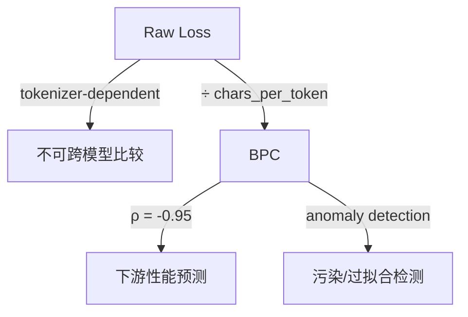
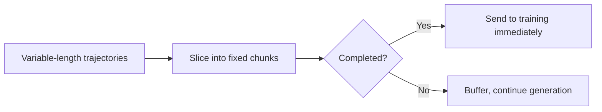

做 LLM 工程和做传统后端最大的区别在于：**很多坑不会以 error 的形式出现，而是以"指标莫名下降 2 个点"的形式出现。** 这篇文章汇总了我在生产环境中踩过的几类隐性陷阱，希望能帮你少走弯路。

---

## 1. Token Budget 是分类问题不是回归问题

很多人第一次设计 thinking budget 机制时，会本能地把它当作连续值回归 — 让模型自己决定"我要思考多少 token"。这在生产中几乎必然失败。

### 离散化设计

正确做法是把 budget 设计为 **离散的 power-of-2 levels**：

```
BUDGET_LEVELS = [0, 64, 128, 256, 512, 1024, 2048, 4096]
```

非标准值直接 reject。这不是偷懒，而是工程约束：离散化让你能对每个 level 做充分的质量回归测试，连续值则让 QA 变成不可能。

### Budget 必须是 Prefill Injection

Budget token 放在 **固定位置作为 prefill 注入**，模型永远不需要学习"生成" budget 值。这带来一个关键安全属性：用户无法通过 prompt injection 操纵 thinking budget。

```python
# Prefill injection — model sees this as given context, not generation target
prefill = f"<|budget_{level}|>"
input_ids = tokenizer.encode(user_prompt) + tokenizer.encode(prefill)
```

### 结构不变性：think 标记永远存在

即使 `budget=0`（不思考），输出中 `<think_start>` 和 `<think_end>` 仍然必须存在：

```
<think_start><think_end>The answer is 42.
```

为什么？**单一解析路径。** 如果你根据 budget 值切换解析逻辑，恭喜你获得了一个永远测不完的状态机。结构不变性意味着下游只需要一套 parser。

### Special Token 在 Description 中的陷阱

这是一个极其隐蔽的 bug：如果你在 tool description 文本中写了类似 `<think_start>` 的字符串，很多 tokenizer 会把它编码为 **实际的 special token** 而不是普通文本，直接破坏语法结构。

```python
# BAD: tokenizer may encode this as actual special token
desc = "Model will output <think_start> before reasoning"

# GOOD: use plain-text placeholders in descriptions
desc = "Model will output [THINK_START] before reasoning"
# Actual special tokens only appear in control flow positions
```

### Loss Mask 的 -1 Offset

Target 和 loss mask 存在一个 token 的偏移：mask 应用于 `x_{t+1}`。Prefill 注入 budget 后，模型生成的第一个 token 是 `<think_start>` — **这才是 loss 开始计算的位置**。


搞错这个 offset 不会报错，只会让模型在 budget 控制上表现诡异。

---

## 2. Function Calling 格式在生产中是 Breaking Change

如果你的系统依赖 LLM 的 tool calling 能力，请做好一个心理准备：**格式会变，而且变得毫无预警。**

### 真实案例：格式变迁速度

以某头部开源模型为例，6 个月内经历了 3 次不兼容变更：

| 版本 | 格式 |
|------|------|
| V3.1 | Special tokens 标记 function call |
| V3.2 | 自定义 ML 格式，`function_calls` 关键字 |
| V4   | 改为 `tool_calls`，参数强制 string typing |

另一个主流系列则从 JSON-in-XML 迁移到了完全不同的 `function=.../parameter=...` XML block 格式。

### 工程铁律：永远不要硬编码解析逻辑

```python
# BAD: hardcoded format assumption
def parse_tool_call(output: str):
    if "<function_calls>" in output:
        return parse_dsml_v32(output)

# GOOD: derive parser from model's chat_template
def parse_tool_call(output: str, chat_template: ChatTemplate):
    return chat_template.extract_tool_calls(output)
```

把解析逻辑绑定到 `chat_template` 上。模型升级时，只需要更新 template 配置，不需要改业务代码。

### Tool Result Routing 的 ID 问题

模型生成 tool call 时会附带一个 `call_id`，用于将 tool result 路由回对应的调用。问题是：如果你的 serving framework 生成了模型训练时未见过格式的 ID（比如 UUID-v4 而模型只见过短 ID），模型可能无法正确关联结果。

### Thinking Mode + Tool Calling 的必要配置

在多步 agent 场景中，如果不开启 `preserve_thinking`，模型会在每次 tool call 返回后"忘记"自己之前的推理链路：

```python
# Multi-step agent MUST preserve thinking across tool calls
response = client.chat(
    messages=messages,
    tools=tools,
    preserve_thinking=True  # 不设这个，多步推理必崩
)
```

没有这个选项，模型在第 3 次 tool call 时就开始做出与前两次矛盾的决策。

---

## 3. Scaling Law 作为工程决策工具

Scaling law 不只是学术论文里的曲线 — 它是你做 compute allocation 决策时最有力的工具。

### BPC：消除 Tokenizer 不可比性

不同模型用不同 tokenizer，直接比 loss 毫无意义。**BPC (Bits Per Character)** 把评估拉回到字符级别，消除了 tokenizer 差异：

- 在 31 个 LLM 上验证：BPC 与下游 benchmark 性能的 Pearson 相关系数 ρ = -0.95
- **Architecture-irrelevant**：MoE、Transformer-Mamba hybrid、dense 模型全部落在同一条线上



### BPC 作为污染检测器

如果一个模型在某个 benchmark 上的得分显著高于其 BPC 所预测的水平 — **高度怀疑 benchmark contamination**。这比任何 n-gram overlap 方法都更实用。

### 能力维度的 Scaling Slope 差异巨大

不同能力随 scale 提升的速度完全不同：

| Benchmark | Slope | 含义 |
|-----------|-------|------|
| IFEval | 16.99 | 指令遵循随 scale 快速提升 |
| BFCL | 5.06 | Function calling 更依赖 post-training |

**实践指导**：
- Slope 陡峭的能力 → 投入更多 compute（scale 能解决）
- Slope 平坦的能力 → 投入更多 alignment effort（scale 解决不了，需要精细调教）

### muP：4 个数量级的搜索成本压缩

Maximal Update Parameterization (muP) 允许你在小模型上做 hyperparameter search，结果直接 transfer 到大模型：

- **32 GPU-hours** 的小模型搜索 ≈ **~1M GPU-hours** 的大模型暴力搜索
- 4 个数量级的成本压缩

如果你的团队还在大模型上做 grid search，请立即停下来。

---

## 4. RL 工程的隐性陷阱

RL for LLM 的工程复杂度远超 supervised fine-tuning。以下是几个不看代码永远不知道的坑。

### Chunk-wise Rollout：解决变长 Trajectory 的吞吐问题

传统做法：等所有 trajectory 完成再统一送入训练。问题是长序列会 block 整个 batch。

**Chunk-wise Rollout** 的核心思想：



效果：
- Step time **-41%**
- AIME24 性能 **+1.88**（因为训练看到了更多样本）

### 同族模型做 RL Judge → Reward Hacking

用和 policy model 同系列的模型做 reward judge 是一个经典陷阱：

```
Training reward: ↑↑↑ (looks great!)
Eval performance: ↓↓↓ (actually terrible)
```

模型学会了"如何让同族 judge 开心"而不是"如何真正解决问题"。

**Fix**：用外部 ground-truth labels 蒸馏出一个专门的 judge model，切断 reward hacking 路径。

### Ternary Quantization 从 FP8 出发

如果你想做极端量化（比如 ternary/1.58-bit），不需要从头 pretrain：

- 从 FP8 checkpoint 出发，只需 **10% 的完整训练预算**（~350B tokens vs 全量 pretrain 的数万亿）
- 相比之下，某些方法要求从 scratch 训练 ternary model，成本高出一个数量级

### Sparse Attention 必须从头训练

这是一个反直觉的结论：

| 方法 | 81% Sparsity Gap | Speedup |
|------|-------------------|---------|
| 从头训练 sparse attention | **0.48 point** | **7x** |
| Post-hoc pruning/distillation | 2-5 points | 3-5x |

Post-hoc 方法看起来工程代价小，但质量差距显著。如果你的目标是生产部署，从一开始就 train with sparsity。

---

## 5. Proxy Metric 的陷阱

这可能是 LLM 工程中最普遍也最危险的问题：**你优化的指标和你在乎的指标不是同一个。**

### 最优配比可以完全反转

某多模态模型系列的经典案例：

- V1 阶段：interleaved data 最优比例 **45%**（基于 pretraining loss 优化）
- V1.5 阶段：切换到 deployment metric 后，最优比例变成 **10%**

同样的数据，同样的模型架构，仅仅因为评估指标不同，最优决策完全反转。

### 搜索空间过大反而有害

数据配比搜索中：

- 224 个 proxy experiments → 找到最优配比
- 448 个 proxy experiments → LightGBM surrogate model **过拟合**，推荐的配比反而更差

More search ≠ better results。搜索空间的维度需要和你的 proxy signal 质量匹配。

### Thinking Mode 的 IPE 悖论

一个 8B 模型在 GPQA 上得分竟然低于同系列 4B 模型。原因：

- 8B 模型被激进地 tuning 了 thinking mode
- 这严重伤害了 non-thinking mode 的性能
- 而 GPQA 的评估恰好在 non-thinking mode 下进行

**教训**：能力提升不是单调的。优化一个维度可能损害另一个维度。

### 核心原则

```python
# The golden rule of proxy metrics
assert validate_on_production_metric(model) >= baseline, \
    "Pretraining loss improvement ≠ deployment quality improvement"
```

永远用你在生产中真正关心的指标做最终决策。Pretraining loss、proxy benchmark、intermediate eval 都只是路标，不是目的地。

---

## 上线前必查清单

在你的 LLM 系统上线前，逐项确认：

### Token Budget
- [ ] Budget 值是否为预定义离散集合中的元素？非标准值是否被 reject？
- [ ] Budget 是否通过 prefill injection 注入？模型是否永远不需要生成 budget 值？
- [ ] `think_start`/`think_end` 是否在所有 budget level（包括 0）下都存在？
- [ ] Tool description 中是否使用了 plain-text placeholder 而非实际 special token？
- [ ] Loss mask 的 offset 是否正确对齐？第一个计算 loss 的 token 是否是 `think_start`？

### Function Calling
- [ ] Tool call 解析逻辑是否从 `chat_template` 派生而非硬编码？
- [ ] 模型升级后，tool call 格式是否经过回归测试？
- [ ] Tool result 的 `call_id` 格式是否与模型训练时一致？
- [ ] 多步 agent 是否开启了 `preserve_thinking`？

### Scaling & Compute Allocation
- [ ] 是否用 BPC（而非 raw loss）做跨模型比较？
- [ ] 目标能力的 scaling slope 是否已知？compute 分配是否与 slope 匹配？
- [ ] Hyperparameter search 是否使用了 muP transfer 而非大模型暴力搜索？

### RL Training
- [ ] Rollout 是否使用了 chunk-wise 策略避免长序列 blocking？
- [ ] RL judge 是否与 policy model 不同族？是否验证了 eval 指标没有下降？
- [ ] 量化策略是否从高精度 checkpoint 出发而非从头训练？
- [ ] Sparse attention 是否从训练初期就引入？

### Proxy Metrics
- [ ] 最终决策是否基于 production metric 而非 proxy？
- [ ] 是否验证了 proxy 和 production metric 的单调性？（优化 proxy 时 production metric 确实在涨）
- [ ] Benchmark 得分是否与 BPC 预测一致？（排除 contamination）
- [ ] 搜索空间复杂度是否与 proxy signal 质量匹配？

---

> 工程中最贵的 bug 不是让系统崩溃的那种，而是让系统"看起来正常但其实在慢慢变差"的那种。保持 pitfall 意识，是 LLM 工程师最重要的软技能。

---

## 参考文献

- [1] "Compression Represents Intelligence Linearly", HKUST, COLM 2024, [arxiv](https://arxiv.org/abs/2404.09937)
- [2] MiniCPM4: "Ultra-Efficient LLMs on End Devices", OpenBMB, [arxiv](https://arxiv.org/abs/2506.07900) — muP 超参迁移、Chunk-wise Rollout
- [3] TST: "Efficient Pre-Training with Token Superposition", Nous Research, [arxiv](https://arxiv.org/abs/2605.06546)
- [4] Qwen3 Technical Report, [arxiv](https://arxiv.org/abs/2505.09388) — IPE baseline
- [5] "Scaling Laws for Mixture Pretraining Under Data Constraints", Apple 2026, [arxiv](https://arxiv.org/abs/2605.12715)
- [6] DeepSeek-V4 Technical Report, 2026 — Function Calling format evolution
- [7] PreSelect, ICML 2025, [arxiv](https://arxiv.org/abs/2503.00808) — BPC 作为数据选择信号
- [8] CAMEL, [arxiv](https://arxiv.org/abs/2603.08022) — BPC 指导 MoE 参数分配
- [9] "Information Capacity of LLMs", TeleAI, [arxiv](https://arxiv.org/abs/2511.08066)
