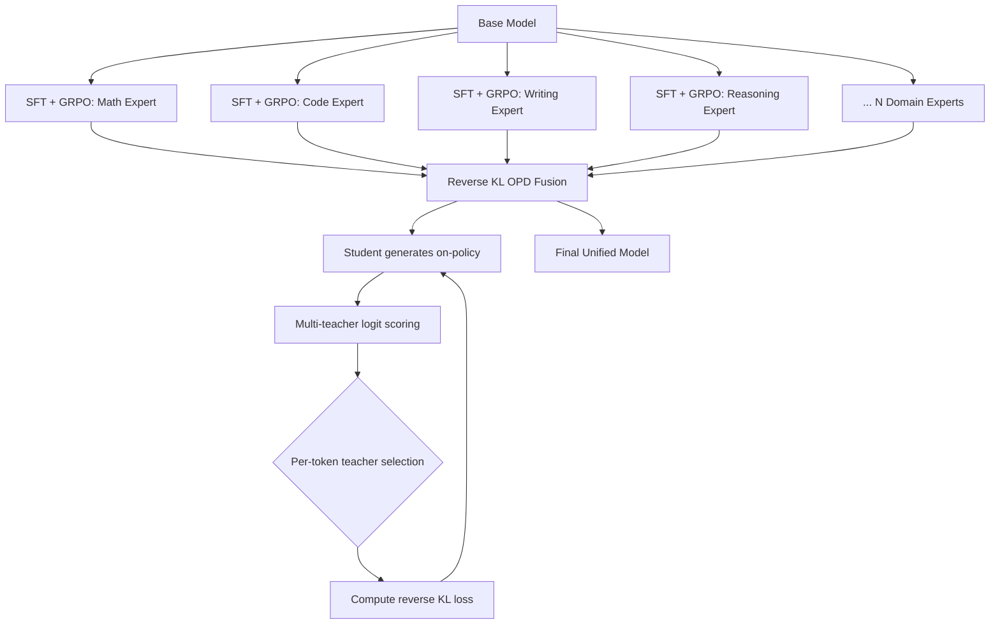

最近一段时间，行业里关于「蒸馏」和「RL」的边界越来越模糊。2026 年初的几篇工作从理论上证明了 On-Policy Distillation (OPD) 与 KL 约束的 RL 是严格等价的——这不是 analogy，是数学证明。这个结论的工程意义极其深远：所有成熟的 RL trick 可以直接搬到蒸馏场景，而且学生模型可以超越老师。

这篇文章从这个统一视角出发，梳理我们在实际 pipeline 中反复验证过的六块核心设计决策。

---

## 1. OPD 与 KL 约束 RL 的严格等价

### 传统蒸馏的分布失配问题

经典知识蒸馏（off-policy distillation）的训练数据来自 teacher 的分布 $\pi_T$：

$$\mathcal{L}_{\text{off-policy}} = \mathbb{E}_{y \sim \pi_T(\cdot|x)} \left[ D_{\mathrm{KL}}(\pi_T(\cdot|x) \| \pi_S(\cdot|x)) \right]$$

问题在于：推理时 student 采样的是自己的分布 $\pi_S$，但它从未在自己的分布上被训练过。这导致 compound error——每一步的小偏差在 autoregressive 生成中指数放大。

### On-Policy Distillation 的解法

OPD 让 student 自己生成，teacher 在 student 的输出上提供监督：

$$\mathcal{L}_{\text{OPD}} = \mathbb{E}_{y \sim \pi_S(\cdot|x)} \left[ \sum_t -\log \pi_T(y_t | y_{<t}, x) \cdot \nabla \log \pi_S(y_t | y_{<t}, x) \right]$$

### 等价性证明（G-OPD/ExOPD 2026）

将 teacher 的 log-probability 作为 reward function：

$$r(y_t | y_{<t}, x) = \log \pi_T(y_t | y_{<t}, x)$$

则 OPD 的梯度严格等于 KL-regularized RL 的 policy gradient：

$$\nabla_\theta \mathcal{L}_{\text{OPD}} = \nabla_\theta \left[ \mathbb{E}_{\pi_S} [r(y|x)] - \beta \cdot D_{\mathrm{KL}}(\pi_S \| \pi_{\text{ref}}) \right]$$

这意味着：
- **Reward shaping**（baseline subtraction、GAE）直接适用
- **PPO 的 clip 机制**可以稳定蒸馏训练
- **Extrapolation**：student 可以在 teacher reward landscape 中找到 teacher 自己没探索过的高分区域——这就是超越老师的机制

---

## 2. Forward KL vs Reverse KL 的选择逻辑

这是 multi-teacher 融合场景下最容易踩的坑。

### Forward KL：Mode-covering

$$D_{\mathrm{KL}}^{\text{fwd}} = \mathbb{E}_{p_T} \left[ \log \frac{p_T(x)}{p_S(x)} \right]$$

Student 必须在 teacher 有概率的地方都分配概率。当多个 domain expert 的高概率区域不重叠时，student 被迫在所有区域都铺开——结果是哪个领域都不精。

### Reverse KL：Mode-seeking

$$D_{\mathrm{KL}}^{\text{rev}} = \mathbb{E}_{p_S} \left[ \log \frac{p_S(x)}{p_T(x)} \right]$$

Student 只需在自己有概率的地方确保 teacher 也有概率。对 domain-expert 融合来说，这意味着学生可以「挑着学」——在每个 context 下只跟最相关的 expert 对齐。

### 工程实践

| 场景 | 选择 | 原因 |
|------|------|------|
| 单 teacher 通用蒸馏 | Forward KL | 保留 teacher 的完整分布信息 |
| Multi-expert 融合 | Reverse KL | 避免模式平均化 |
| Teacher 极度 sharp | Truncated Reverse KL | 防止 student 坍缩到单一 token |

**Entropy-adaptive 切换策略**：在 teacher logits entropy > threshold 的位置用 Forward KL（保留多样性），在 entropy < threshold 的位置用 Reverse KL（学尖锐的判断）。实测比固定选择高 1-2 个百分点。

---

## 3. Domain-Expert OPD 范式

### 问题：Multi-domain RL 的梯度冲突

在同一个模型上同时跑 math reward 和 code reward 的 GRPO，梯度方向经常是对抗的——math 想让模型更 verbose（展开推理链），code 想让模型更 concise（精确输出）。Gradient conflict 导致两个方向都走不远。

### 解法：独立训练 + OPD 融合

**核心设计决策**：

1. **每个 expert 独立到极致**：从 base 开始各自 SFT + GRPO，互不干扰。每个 expert 在自己的 domain 上可以 push 到 ceiling。
2. **融合在 full-vocabulary logit 空间**：不是简单的 response-level ensemble，而是 token-level logit 融合。Reverse KL 确保 student 在每个位置只跟最 confident 的 expert 学。
3. **增量扩展**：加一个新领域 = 训练一个新 expert + 重跑 OPD。已有 expert 完全不动。
4. **Teacher selection 本身也可以 RL 化**：用一个 routing model 决定每个 token 听哪个 expert，其 reward 是 student 的最终任务表现。

---

## 4. RLVR 的二值 Reward 足以驱动指令遵循

这个结论反直觉：对于 Instruction Following (IF) 任务，简单的 binary reward 比精心设计的 partial credit 更有效。

### Binary Reward 定义

$$r(y|x) = \begin{cases} 1 & \text{if ALL constraints in } x \text{ are satisfied by } y \\ 0 & \text{otherwise} \end{cases}$$

### 为什么 All-or-Nothing 更好

Partial credit（比如满足 3/5 个约束给 0.6）鼓励模型逐个攻破约束——这会导致模型学会在 easy constraints 上拿分但忽略 hard ones。Binary reward 迫使模型学会「同时满足所有约束」的 joint strategy。

### DPO 在此场景的失效

某头部实验室的实验表明，DPO 在 IF 场景下实际上**损害**了模型的 general capability（约 -2.0 点）。原因是：DPO 的 strong-vs-weak signal 与格式合规性信号正交——模型学到的是「哪个 response 整体更好」而非「如何精确满足约束」。

### Think Mode 的放大效应

| 模式 | RL 增益 |
|------|--------|
| Instruct mode | +x |
| Think mode | +2.7x |

Think mode 下 RL 增益是 Instruct mode 的 2.7 倍。机制很清楚：thinking trace 充当了 self-verification hook——模型在 trace 中逐条检查约束是否满足，相当于内置了一个 verifier。

### Complex IF 的持续收益

简单 IF（如 IFEval benchmark）在 RL 训练早期就饱和了，但复杂 IF（如 IFBench）在 extended RL training 中持续提升。这说明 RL 对 compositional constraint satisfaction 的优化空间远大于我们的直觉。

---

## 5. 长度惩罚 RL 的正确做法 (DLER)

长度控制是 RL post-training 中最容易做错的事情之一。核心观点：**失败的根源是优化器不稳定，不是惩罚函数设计**。

### 最简惩罚 + 优化器修复

$$r_{\text{length}}(y|x) = \begin{cases} r_{\text{task}}(y|x) & \text{if } |y| \leq L_{\max} \\ 0 & \text{if } |y| > L_{\max} \end{cases}$$

取 $L_{\max} = 4000$ tokens 的 hard truncation。不需要连续衰减、不需要 token-level penalty。配合下面三个优化器修复，就能实现 -69% 到 -80% 的长度缩减且无精度损失。

### 三个独立失败模式及修复

**失败模式 1：Advantage variance 爆炸**

短 response 和长 response 的 reward scale 差异巨大，导致 advantage estimator 方差爆炸。

修复：Per-prompt normalization + clipping advantage to $[-5, 5]$。

**失败模式 2：PPO clip 杀死高 entropy 过渡 token**

在推理链中「转折」位置的 token（如 "however", "but", "wait"），本身概率不高但对正确性至关重要。标准 PPO clip 会因为这些 token 的 importance ratio 过大而截断掉它们的梯度。

修复：**Asymmetric clipping**：

$$\text{clip}(\rho_t, 1-\varepsilon_{\text{low}}, 1+\varepsilon_{\text{high}})$$

取 $\varepsilon_{\text{high}} = 0.28 > \varepsilon_{\text{low}} = 0.20$。放宽上界让模型更容易增加低概率但关键的 token 的概率。

**失败模式 3：All-zero reward prompts 的稀疏梯度**

当一个 batch 里所有 response 都超过长度限制拿到 0 reward 时，模型收不到任何有效梯度。

修复：**Dynamic sampling**——根据 model 当前能力动态调整 prompt 难度分布，确保每个 batch 至少 30% 的 prompt 能产生有效（非零）reward。

### Update-Selective Merging

训练完成后，不是直接用 RL checkpoint，而是：

1. 计算 RL model 与 base model 的参数差 $\Delta = \theta_{\text{RL}} - \theta_{\text{base}}$
2. 只保留 top-25% 最大的 $\|\Delta\|$
3. 乘以衰减系数 0.7
4. Merge 回 base：$\theta_{\text{final}} = \theta_{\text{base}} + 0.7 \cdot \text{top25\%}(\Delta)$

效果：保留完整 accuracy + 46% 的长度缩减。本质上是 sparse model editing——只保留 RL 真正学到的 structural change，丢弃 noise。

---

## 6. RL 使轨迹更短但关键推理步骤更长 (OpenWebRL)

这个发现非常有趣：RL 训练后的 web agent，整体轨迹变短了，但在「关键决策点」的推理反而变长了。

### 数据对比

| 指标 | SFT | RL |
|------|-----|-----|
| Mean trajectory length | 10.9K tokens | 7.9K tokens |
| Mean steps per trajectory | 14.0 | 8.9 |
| Reasoning at decision points | short | **expanded** |

### Selective Deepening 机制

RL 学会了一种「选择性深入」策略：

- **日常操作**（点击、滚动、填表）：极度精简，几乎不做额外推理
- **决策点**（历史总结、blocker 诊断、retry 规划）：展开详细推理

这不是我们 reward-engineer 出来的——binary task reward 自然涌现了这个行为。模型自己发现在 easy steps 浪费 token 没有 reward signal，但在 hard steps 多想一步直接决定 success/failure。

### Trajectory-Level Advantage（无 per-turn normalization）

关键设计：advantage 在整条轨迹层面计算，**不做 per-turn normalization**。

$$A(x, y_{1:T}) = R(x, y_{1:T}) - b(x)$$

这意味着难任务的成功轨迹会获得 proportionally 更大的梯度。如果做 per-turn normalize，hard task 和 easy task 的梯度贡献被拉平，模型会过拟合到简单任务上。

### Reward Hacking 防御

一个实际教训：用同系列 VLM 做 judge（如用 7B 的模型给 7B agent 打分）几乎必然导致 reward hacking——agent 学会生成让 judge 高兴但实际无效的 action。

解法：用蒸馏后的 specialized judge model（不同架构/不同训练数据）来打分。Judge 和 actor 的 inductive bias 不同，hacking 的难度指数级增加。

---

## 总结：Pipeline 设计决策树

在实际项目中，以上六块可以组合成一个完整的 pipeline：

1. **训 expert**：每个 domain 独立 SFT + GRPO（binary reward）
2. **长度控制**：在 expert 训练的 RL 阶段加入 DLER（asymmetric clip + dynamic sampling）
3. **融合**：Reverse KL OPD 把所有 expert 融合到一个 student
4. **最终 IF 对齐**：用 binary reward RL 做 instruction following（think mode 打开）
5. **Merge**：Update-selective merging 压缩长度

每一步都有明确的理论支撑和可复现的工程 recipe。不需要玄学调参，需要的是对 failure mode 的精确诊断和针对性修复。

---

## 参考文献

- [1] "Generalized On-Policy Distillation (G-OPD / ExOPD)", Tencent/RUC, [arxiv](https://arxiv.org/abs/2602.12125)
- [2] "Generalized Knowledge Distillation (GKD)", DeepMind, ICLR 2024, [arxiv](https://arxiv.org/abs/2306.13649)
- [3] "MiniLLM", MSRA/Tsinghua, ICLR 2024, [arxiv](https://arxiv.org/abs/2306.08543)
- [4] "DistiLLM", KAIST, ICML 2024, [arxiv](https://arxiv.org/abs/2402.03898)
- [5] "Sequence-Level Knowledge Distillation (SeqKD)", MIT 2016, [arxiv](https://arxiv.org/abs/1606.07947)
- [6] "DeepSeek-R1", [arxiv](https://arxiv.org/abs/2501.12948)
- [7] "Qwen3 Technical Report", [arxiv](https://arxiv.org/abs/2505.09388)
- [8] "Doing Length pEnalty Right (DLER)", NVIDIA, [arxiv](https://arxiv.org/abs/2510.15110)
- [9] "Demystifying Online Multi-turn RL for Visual Web Agents (OpenWebRL)", UIUC+Microsoft, [arxiv](https://arxiv.org/abs/2606.02031)
- [10] "OLMo 3", [arxiv](https://arxiv.org/abs/2512.13961)
- [11] "MiniCPM4 (Chunk-wise Rollout)", OpenBMB, [arxiv](https://arxiv.org/abs/2506.07900)
- [12] Hinton et al. (2015), "Distilling the Knowledge in Neural Networks"
