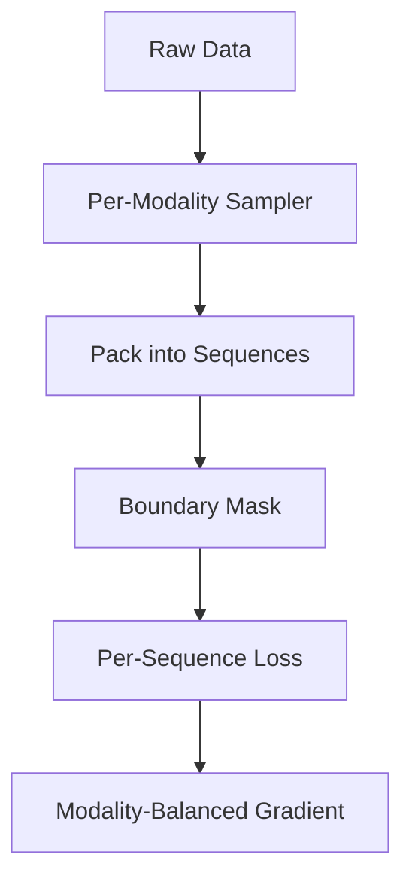

大模型训练中，很多"诡异现象"其实都有干净的数学解释。本文分享三个我在实际训练中踩过的坑，每个都涉及一个容易被忽视的底层机制。它们的共同特点是：**training loss 看起来完全正常，但模型已经在某个维度上悄悄劣化了**。

---

## 1. Adam 优化器在零梯度参数上的单调漂移

### 现象

某 3B 模型训练结束后做 INT8 量化，发现最后一层 RMSNorm 的 learnable scalar $s$ 从初始值 1.0 漂移到了约 56，导致量化后该层丢失 5.8 bits 动态范围。但整个训练过程中 loss 曲线完全正常。

### 根因分析

RMSNorm 的前向计算为：

$$y = \frac{x}{\text{RMS}(x)} \cdot s$$

当 $s$ 是最后一层的 scalar 且紧接 logits 计算时，softmax 对 logits 的 scale 不变性意味着：

$$\text{softmax}(s \cdot z) = \text{softmax}(z) \quad \text{(当所有 logits 等比例缩放时不严格成立，但梯度极小)}$$

实际上该参数的解析梯度接近零。但 Adam 在 bf16 精度下会产生约 $\epsilon_{\text{bf16}} \sim 10^{-8}$ 量级的数值噪声。关键在于 Adam 的更新公式：

$$\Delta \theta = -\eta \cdot \frac{m_t}{\sqrt{v_t} + \epsilon}$$

当真实梯度为零时，$m_t$ 和 $v_t$ 都由噪声驱动。$v_t$ 保持在极小值附近（$\sim 10^{-16}$），分母趋近 $\epsilon$（通常 $10^{-8}$），于是更新退化为：

$$|\Delta \theta| \approx \eta \cdot \frac{|m_t|}{\epsilon} \approx \pm \eta \quad \text{per step}$$

bf16 的舍入噪声存在方向性偏差（实测约 82% 为正），这使得漂移不是随机游走而是**单调增长**。以 $\eta = 10^{-5}$、100K steps 计算：

$$s_{\text{final}} \approx 1.0 + 0.82 \times 10^{-5} \times 100000 \approx 1.82$$

实际观察到 56x 的漂移，因为还叠加了一个放大因素：**optimizer state reset**。当训练 stage2 加入 ViT 参数时，整个 optimizer state 重置，$v_t$ 从零重新累积，相当于又经历一次"裸奔期"，放大约 4.5x。

### 完美风暴

Megatron 框架中 weight decay 的启发式规则是 `len(param.shape) == 1` 时不施加衰减（意图是保护 bias 和 LayerNorm 参数）。但这恰好也排除了这个 scalar——本应被衰减约束的参数失去了唯一的制动力。

另一个想当然的 fix 是设 `requires_grad=False`，但这会破坏 DDP 的 bucket 计数，导致多卡通信 hang。

### 正确修复

- 对所有 1D 参数显式审计 weight decay 覆盖情况
- 或使用 gradient hook 将该参数梯度 clamp 为零（保持 DDP 兼容）
- 训练监控中加入 1D 参数的 max/min 告警

**Takeaway**: 审计所有 1D 参数的 weight decay 覆盖情况。loss 正常不代表参数健康——量化才是照妖镜。

---

## 2. Softmax 饱和的隐形训练墙

### 现象

某生产模型做知识蒸馏，teacher 在 IE（信息抽取）类任务上置信度极高（name extraction 的 top-1 概率 $\sim 0.999$）。Student 在这些任务上 loss 持续下降，但 F1 在某个点后完全停滞。

### 根因分析

Softmax 输出 $q$ 对 logit $z$ 的 Jacobian 为：

$$\frac{\partial q}{\partial z} = q(1-q)$$

这个因子的行为：

| $q$ | $q(1-q)$ | 含义 |
|-----|-----------|------|
| 0.5 | 0.25 | 最大梯度传导 |
| 0.9 | 0.09 | 梯度衰减 3x |
| 0.99 | 0.0099 | 梯度衰减 25x |
| 0.999 | 0.001 | 梯度衰减 250x |

当 student 的预测概率从 0.95 提升到 0.99 时，需要的 logit 变化为：

$$\Delta z = \ln\frac{0.99/0.01}{0.95/0.05} = \ln(5.2) \approx 1.65$$

但从 0.99 到 0.999：

$$\Delta z = \ln\frac{0.999/0.001}{0.99/0.01} = \ln(10.1) \approx 2.31$$

**功能提升只有 +0.009，但需要的 logit 变化反而更大。** 这就是训练墙——模型在 logit 空间还在学习，loss 还在降，但概率空间的改善越来越微小。

### 蒸馏场景的恶化

Teacher 的分布越接近 one-hot，KL divergence 的梯度信号越集中在 top-1 token。其余 token 的梯度几乎为零——student 丧失了从"dark knowledge"中学习的能力。

### 解决方案

引入 task-specific temperature $\tau$：

$$q_i^{(\tau)} = \frac{\exp(z_i / \tau)}{\sum_j \exp(z_j / \tau)}$$

对 IE 类任务设 $\tau = 8$，效果：
- Jacobian 因子从 $q(1-q)$ 变为 $q^{(\tau)}(1-q^{(\tau)})$，当 $\tau=8$ 时原始 $q=0.999$ 被软化到 $q^{(\tau)} \approx 0.7$，梯度放大约 **4x**
- 更多 token 获得非零梯度（分布更平滑 → 更多 token 参与反传）
- 不影响其他任务（temperature 按 task routing 施加）

**Takeaway**: 蒸馏时 teacher 置信度 > 0.99 的 task 必须加温度。不加温度等于让 student 在饱和区空转。

---

## 3. Per-token Loss 在多模态训练中的致命稀释

### 现象

某生产模型加入多模态能力后，multimodal benchmark 下降 18%（与 Apple 公开报告的数字吻合）。排查发现不是数据问题，而是 loss 计算方式导致的梯度稀释。

### 根因分析

典型多模态样本构成：84% text（约 4000 tokens）+ 16% multimodal response（约 200 tokens）。

Per-token loss 的计算：

$$\mathcal{L} = \frac{1}{N_{\text{total}}} \sum_{i=1}^{N_{\text{total}}} \ell_i$$

Multimodal tokens 的梯度贡献比例：

$$\frac{200}{4000 + 200} = 4.76\%$$

但考虑到 text tokens 的梯度通常更大（更确定的 next-token prediction → 更集中的梯度），实际 multimodal 梯度贡献被压缩到约 **0.94%**——相比其 16% 的数据占比，这是 **17x 稀释**。

### Alpha-family 统一框架

不同的 loss 归一化策略可以用一个参数 $\alpha$ 统一描述：

$$\mathcal{L} = \frac{1}{N^{\alpha}} \sum_{i=1}^{N} \ell_i$$

- $\alpha = 0$: per-sample loss（每个样本等权，不管长度）
- $\alpha = 0.5$: $\sqrt{N}$ 归一化（某 VL 模型的选择，折中方案）
- $\alpha = 1$: per-token loss（标准做法，长序列主导梯度）

### 2025 行业共识

主流方案收敛为：**per-sequence loss + modality-balanced batch + packing boundary mask**

### 常见 Bug

1. **Mean-of-means in gradient accumulation**: 多个 micro-batch 的 loss 做平均时，如果每个 micro-batch 的 token 数不同，等价于给短序列更高权重——与 per-token 的初衷矛盾

2. **Packing without boundary mask**: 多个样本 pack 进一条序列时，如果不加 attention mask 边界，模型会在样本间做 cross-attention，且 loss 归一化被打乱

3. **HuggingFace Trainer 的历史 bug**（issue #34191）：在 gradient accumulation 中对 loss 做了两次平均，等价于对短序列 over-weight

### 反向问题

Unified tokenizer 模型（vision VQ tokens 直接参与 loss 计算）面临相反的稀释——vision tokens 数量远超 text，反而挤压了语言能力。某开源方案使用 0.5x weight 在 vision tokens 上来平衡。

**Takeaway**: 多模态训练必须显式设计 loss 归一化策略。per-token 是文本时代的默认值，不是多模态时代的正确答案。

---

## 总结对照表

| 症状 | 根因 | 诊断方法 | 修复 |
|------|------|----------|------|
| 量化后某层精度崩塌，训练 loss 正常 | Adam 在零梯度参数上的单调漂移（bf16 噪声 + 无 weight decay） | 监控所有 1D 参数的 min/max/std；量化前 per-layer sensitivity 扫描 | 显式 weight decay 覆盖所有 1D 参数；或 gradient hook clamp |
| 蒸馏 loss 下降但下游指标停滞 | Softmax 饱和区 Jacobian $q(1-q) \to 0$，梯度信号消失 | 观察 teacher top-1 概率分布；监控 student logit 变化 vs 概率变化 | Task-specific temperature（高置信任务 $\tau=5\sim10$） |
| 多模态能力训练后反而退化 | Per-token loss 对短 response 的梯度稀释（17x） | 按 modality 分别统计梯度 norm 贡献比；对比数据占比 vs 梯度占比 | Per-sequence loss + modality-balanced sampling + packing boundary mask |

---

这三个问题的共同教训是：**不要只看 training loss curve。** Loss 是所有维度的加权平均，它可以完美地掩盖局部的灾难性退化。建立 per-parameter、per-task、per-modality 的细粒度监控，才是大模型训练的生存之道。

---

## 参考文献

1. Qwen3-VL, "Qwen3-VL Technical Report", [arXiv:2511.21631](https://arxiv.org/abs/2511.21631).  — "we move from a per-sample loss to a square-root-normalized per-token loss, which better balances the contributions of text and multimodal data during training"
2. Qwen2-VL, "Qwen2-VL: Enhancing Vision-Language Model's Perception of the World at Any Resolution", [arXiv:2409.12191](https://arxiv.org/abs/2409.12191).  — per-sequence loss 的早期实践
3. Qwen2.5-VL, "Qwen2.5-VL Technical Report", [arXiv:2502.13923](https://arxiv.org/abs/2502.13923).  — 多模态 loss 演进
4. XLM, "Cross-lingual Language Model Pretraining", [arXiv:1901.07291](https://arxiv.org/abs/1901.07291).  — 多语言预训练中的 per-sample loss 设计
5. Dr. GRPO, "Dr. GRPO: Removing Bias from Group Relative Policy Optimization", [arXiv:2503.20783](https://arxiv.org/abs/2503.20783).  — token-level vs sequence-level loss 的讨论
6. Hinton et al. (2015), "Distilling the Knowledge in Neural Networks" — "the magnitudes of the gradients produced by the soft targets scale as 1/T², it is important to multiply them by T²"
7. GradNorm (Chen et al., ICML 2018), "GradNorm: Gradient Normalization for Adaptive Loss Balancing in Deep Multitask Networks" — 多任务梯度平衡
