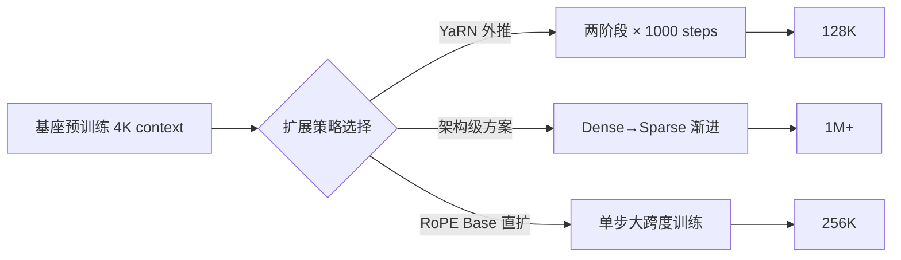
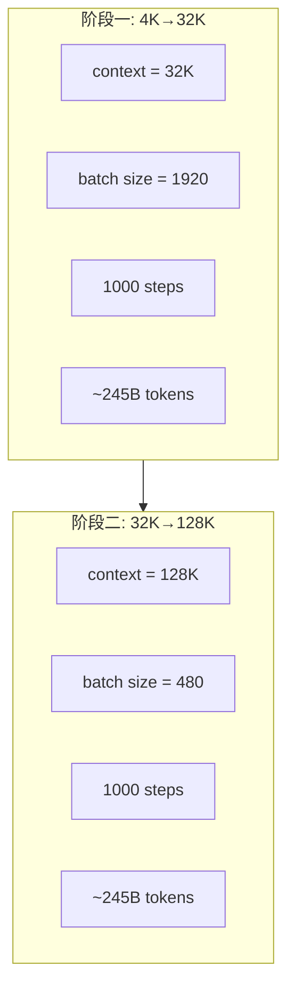
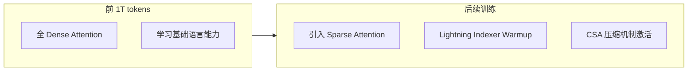
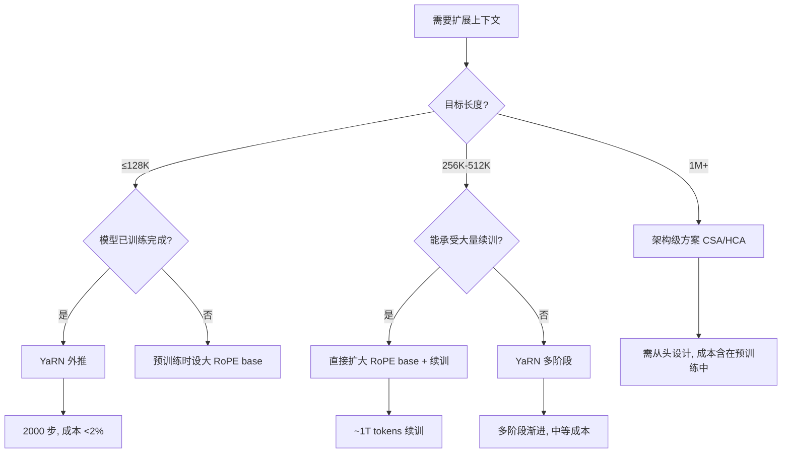

## 复盘：128K Eval 上 PPL 突然爆炸的定位过程

某 671B MoE 模型完成 14.8T tokens 主预训练后，第一次把序列长度从 4K 推到 32K 做 eval——PPL 从 7.2 飙到 142。位置编码完全没见过 >4K 的位置，外推失败是意料之中的。

工程团队的方案是 YaRN 扩展。但 YaRN 有几十个超参要配：scale、alpha、beta、target length、warmup steps... 最终他们找到了一组 surprisingly 简洁的配置：

```yaml
# Phase 1: 4K → 32K
yarn_scale: 40
yarn_alpha: 1
yarn_beta: 32
scaling_factor: 0.1 * ln(40) + 1 = 1.369
target_seq_len: 32768
lr: 7.3e-6  # 直接用预训练最后的 LR，不加 warmup
batch_size: 1920
steps: 1000

# Phase 2: 32K → 128K
# 超参完全相同！只改了序列长度和 batch size
target_seq_len: 131072
batch_size: 480  # 降低以适应显存
steps: 1000
```

两阶段超参相同这一点很关键——说明 YaRN 的配置在不同扩展比例下是 transferable 的。总共 2000 步，消耗 119K H800 GPU hours（对比主预训练的数百万 GPU hours，不到 2%）。

扩展后 128K 位置的 PPL 从 142 降到 8.1（4K 上为 7.2），needle-in-a-haystack 128K 通过率 >99%。

这个经验引出了长上下文工程的核心问题：是用 YaRN 这种'打补丁'方案（低成本但有理论上限），还是从架构层面重新设计注意力机制（高成本但无上限）？下面三份真实配置恰好代表了三种不同选择。

---

## 一、三种模型的真实配置对比

| 维度 | 模型 A（671B MoE） | 模型 B（Flash/Pro 系列） | 模型 C（27B MoE） |
|------|-------------------|------------------------|------------------|
| 基座上下文 | 4K | 4K | 32K |
| 目标上下文 | 128K | 1M | 256K |
| 扩展路径 | 4K→32K→128K | 4K→16K→64K→1M | 32K→256K（单步） |
| 阶段数 | 2 | 多阶段 | 1 |
| 核心技术 | YaRN 外推 | CSA + HCA 压缩注意力 | RoPE base 直接扩大 |
| 每阶段步数 | 1000 steps | 渐进式引入 sparse | ~1T tokens |
| 学习率 | 7.3e-6（固定） | 阶段性调整 | cosine 3e-5→1e-5 |
| Batch size | 1920→480 | 动态调整 | 固定 |
| 总训练代价 | 119K H800 GPU-hrs | 架构层面内置 | 1T tokens |



三条路线的本质区别在于：**在哪个层级解决位置编码的外推问题**。YaRN 在 embedding 层做插值修正；CSA 在注意力架构层面绕开问题；RoPE base 扩大则直接拉伸位置编码的频率基。

---

## 二、YaRN 外推的工程细节

模型 A 的长上下文方案是当前最成熟、成本最低的路线。具体实现有几个关键工程细节值得记录。

### 2.1 只对 decoupled shared key 做 YaRN

该模型采用了 MLA（Multi-head Latent Attention）架构，其中 key 被解耦为两部分：一个与 position 无关的 latent 部分，和一个携带位置信息的 shared key $k_t^R$。

**YaRN 只作用于 $k_t^R$**，而非所有 key-value 分量。这大幅降低了实现复杂度——你只需要在一个 head 维度为 64 的向量上做频率插值。

### 2.2 具体超参数

| 参数 | 值 | 含义 |
|------|-----|------|
| scale $s$ | 40 | 目标扩展倍数 |
| $\alpha$ | 1 | 频率分界下界 |
| $\beta$ | 32 | 频率分界上界 |
| scaling factor $\sqrt{t}$ | $0.1\ln(s) + 1$ | ≈1.369 |

YaRN 的核心思想：将 RoPE 的各维度频率分为三组——低频维度做 NTK-aware 插值、高频维度保持不变、中间频率线性插值。$\alpha$ 和 $\beta$ 划定了这三组的边界。

### 2.3 训练配置



关键设计选择：

- **学习率 = 预训练最终 LR（7.3e-6）**：不做额外 warmup，直接从预训练收敛点继续。这说明长上下文扩展本质上是一个"轻量微调"而非重新训练。
- **Batch size 从 1920 降到 480**：因为 context 从 32K 扩到 128K，单条序列长 4 倍，为保持总 tokens/step 不变（约 245B tokens/phase），batch size 需等比缩小。
- **两阶段而非一步到位**：先扩到 32K 稳定后再扩到 128K，降低训练不稳定风险。

### 2.4 为什么 2000 步就够？

长上下文扩展不需要模型学习新知识，只需要让注意力模式适应更远距离的 token 关系。这本质上是一个 distribution shift adaptation 问题，而非 capacity learning 问题。2000 步（约 490B tokens）足以让 attention pattern 重新收敛。

---

## 三、CSA 压缩注意力——无需 RoPE 调整的长上下文方案

模型 B 走了一条完全不同的路：**从架构层面就为超长上下文设计**，彻底绕开了 RoPE 外推的困境。

### 3.1 核心思路：Compressive Shared Attention (CSA)

传统 Transformer 的 full attention 在 1M context 下的 KV cache 开销和计算量都不可接受。CSA 的做法是：

1. **近距离用 SWA（Sliding Window Attention）**：窗口仅 128 tokens
2. **远距离用压缩 attention**：将远距离 KV 通过 learned compression 降维存储
3. **HCA（Hierarchical Compressed Attention）**：多层级压缩，越远的 token 压缩比越大

这意味着模型在预训练阶段就被设计为"近处精细、远处模糊"的注意力模式，不需要事后通过 RoPE 外推来处理长距离依赖。

### 3.2 Dense→Sparse 渐进式引入

模型 B 的训练分为两个明确阶段：



- **前 1T tokens**：使用标准 dense attention 训练，让模型先学好基础语言能力
- **Sparse 引入时**：需要对 lightning indexer 做专门的 warmup，让模型学会"哪些远距离 token 值得保留"
- **SWA window = 128 tokens**：极端激进的窗口大小，意味着除了最近 128 个 token 外的所有信息都走压缩通道

### 3.3 为什么能做到 1M？

| 方案 | 128K | 256K | 1M | 瓶颈 |
|------|------|------|-----|------|
| YaRN | ✅ 成熟 | ⚠️ 勉强 | ❌ | 外推精度衰减 |
| RoPE Base 扩大 | ✅ | ✅ | ⚠️ | 需要大量训练 |
| CSA 架构方案 | ✅ | ✅ | ✅ | 需要从头设计 |

CSA 能做到 1M 的原因是它不依赖位置编码的外推能力——位置信息通过 SWA 的相对位置和压缩层级隐式编码。但代价是：**你必须从预训练第一天就确定这个架构**，不能事后加装。

---

## 四、单步直接扩展 RoPE Base

模型 C 选择了最简单直接的方案：**把 RoPE 的频率基底直接从 640K 拉到 5M**。

### 4.1 具体配置

| 参数 | 值 |
|------|-----|
| GA（Global Attention）RoPE base | 640K → 5,000,000 |
| SWA RoPE base | 10K（保持不变） |
| Partial RoPE 维度 | 前 64 维 |
| 学习率 | cosine decay: 3e-5 → 1e-5 |
| 训练数据量 | 1T tokens |
| 上下文扩展 | 32K → 256K |

### 4.2 关键设计选择

**SWA RoPE base 不动**：Sliding Window Attention 只看局部窗口内的 token，其位置差值始终在窗口大小以内，因此不存在外推问题。只有 Global Attention 层需要处理远距离位置编码。

**Partial RoPE**：只对前 64 个维度施加旋转位置编码，其余维度不参与。这是一种平衡——太多维度参与 RoPE 会导致高频振荡在外推时失真，太少则位置信息不足。

**单步而非多阶段**：从 32K 直接跳到 256K（8 倍扩展），不做中间过渡。这与模型 A 的谨慎策略形成对比。可能的原因是：

1. 27B 参数量比 671B 小很多，训练更稳定
2. 1T tokens 的训练量远大于模型 A 的 490B tokens
3. 起始 context 已经是 32K（而非 4K），扩展倍数相对温和

### 4.3 代价分析

1T tokens 的训练量看起来很大，但对于 27B 模型来说算力开销远小于 671B 模型的方案。实际上：

- 模型 A（671B）：2000 steps × 大 batch = ~490B tokens，但因模型巨大，耗时 119K H800 GPU-hrs
- 模型 C（27B）：1T tokens，但模型小 25 倍，实际 GPU-hrs 可能相当

---

## 五、设计选择总结



### 5.1 什么时候用 YaRN？

- ✅ 模型已完成预训练，需要事后扩展
- ✅ 目标扩展倍数在 32x 以内（4K→128K）
- ✅ 算力预算极其有限（<2% 额外开销）
- ✅ 需要快速验证长上下文能力
- ❌ 不适合 256K+ 的极端扩展

### 5.2 什么时候用架构级方案（CSA/Sparse）？

- ✅ 从零开始设计新模型
- ✅ 目标上下文 1M 或更长
- ✅ 愿意接受架构复杂度换取推理效率
- ❌ 不能事后加装到已有模型
- ❌ Dense→Sparse 过渡需要精细工程（lightning indexer warmup）

### 5.3 什么时候用 RoPE base 直接扩大？

- ✅ 模型规模中等（≤100B），能承受较大续训量
- ✅ 扩展倍数中等（8x-16x）
- ✅ 偏好简单直接的方案，不想引入 YaRN 等额外机制
- ❌ 需要 ~1T tokens 级别的续训数据
- ❌ 对超大模型而言算力不划算

### 5.4 核心 Trade-off

| 维度 | YaRN | 架构级 | RoPE Base 扩大 |
|------|------|--------|---------------|
| 训练成本 | 极低（<2%） | 含在预训练中 | 中等（~1T tokens） |
| 最大扩展比 | ~32x | 理论无限 | ~8-16x |
| 实现复杂度 | 低 | 高 | 低 |
| 事后可加装 | ✅ | ❌ | ✅ |
| 长距离质量 | 中 | 高 | 中-高 |
| 推理效率 | 不变 | 大幅提升 | 不变 |

---

## 结语

长上下文扩展已经从"研究问题"变成了"工程选型问题"。关键 takeaway：

1. **对已有模型做 128K 扩展，YaRN 是性价比最高的选择**——2000 步、<2% 成本、生产验证充分
2. **追求 1M+ 需要在预训练前就做架构决策**——CSA/Sparse 方案不能事后加装
3. **中等规模模型的中等扩展，直接改 RoPE base 最省心**——没有额外超参数要调
4. **不要高估长上下文扩展的难度**——模型不需要学新知识，只需要适应新的 attention 距离分布

---

## 参考文献

1. YaRN: Efficient Context Window Extension of Large Language Models. [arXiv:2309.00071](https://arxiv.org/abs/2309.00071)
2. RoFormer: Enhanced Transformer with Rotary Position Embedding. [arXiv:2104.09864](https://arxiv.org/abs/2104.09864)
3. Extending Context Window of Large Language Models via Positional Interpolation. [arXiv:2306.15595](https://arxiv.org/abs/2306.15595)
4. LongRoPE: Extending LLM Context Window Beyond 2 Million Tokens. [arXiv:2402.13753](https://arxiv.org/abs/2402.13753)
5. Ring Attention with Blockwise Transformers for Near-Infinite Context. [arXiv:2310.01889](https://arxiv.org/abs/2310.01889)
