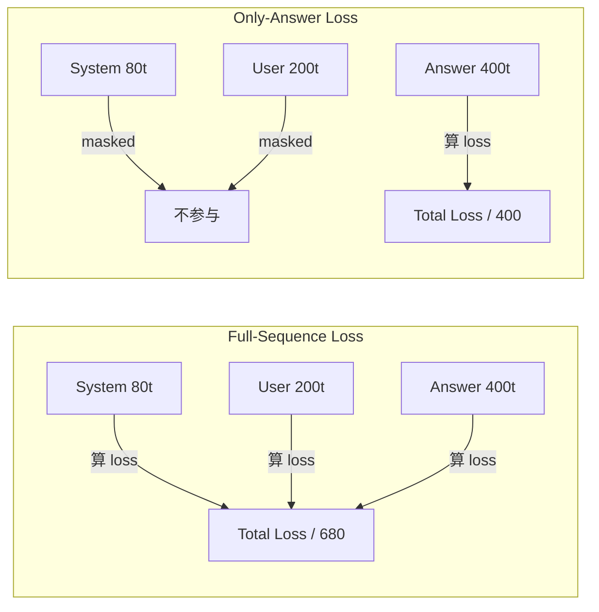
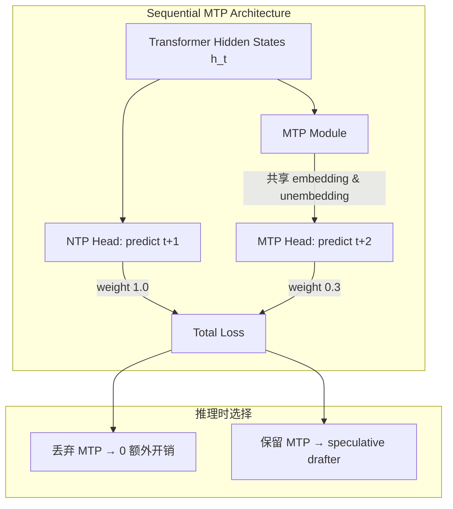
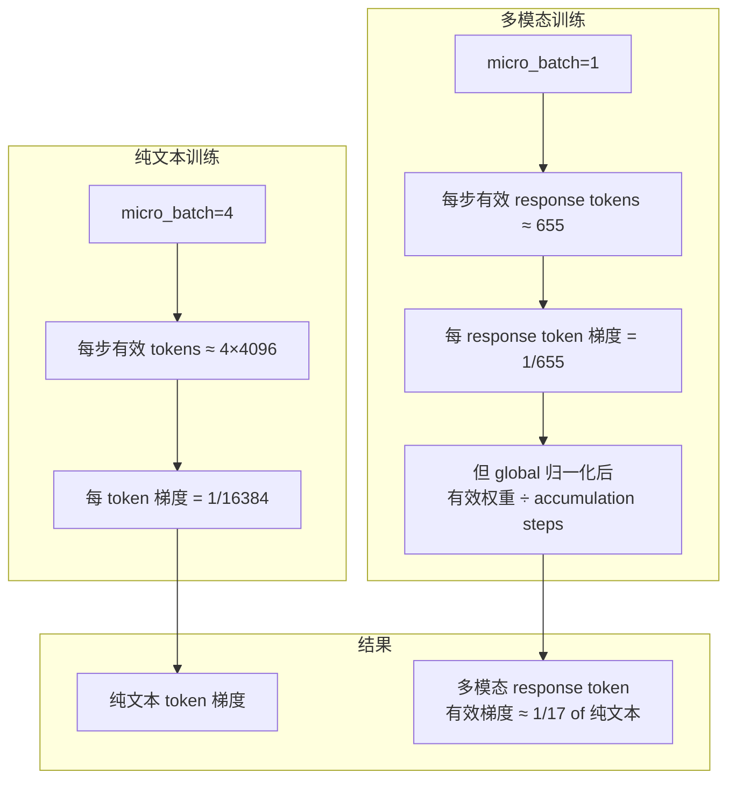
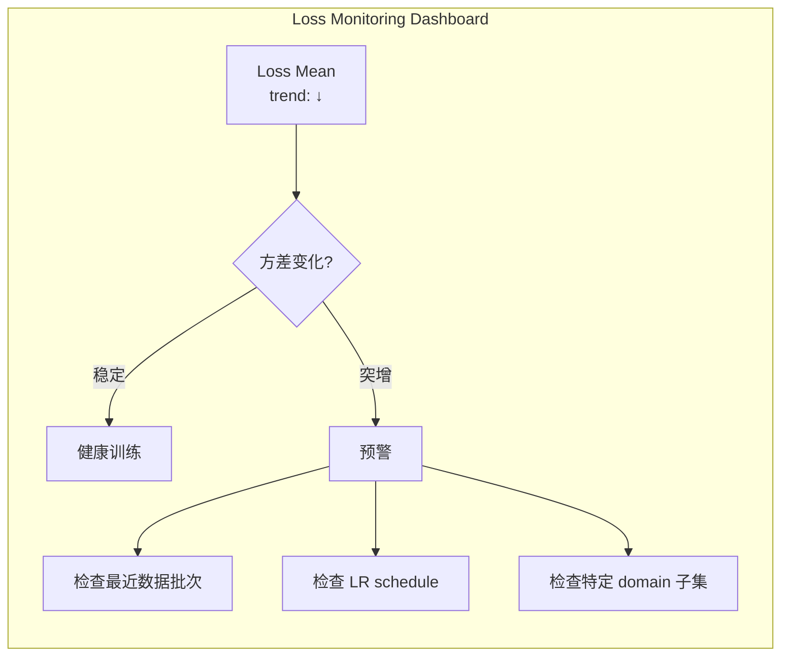
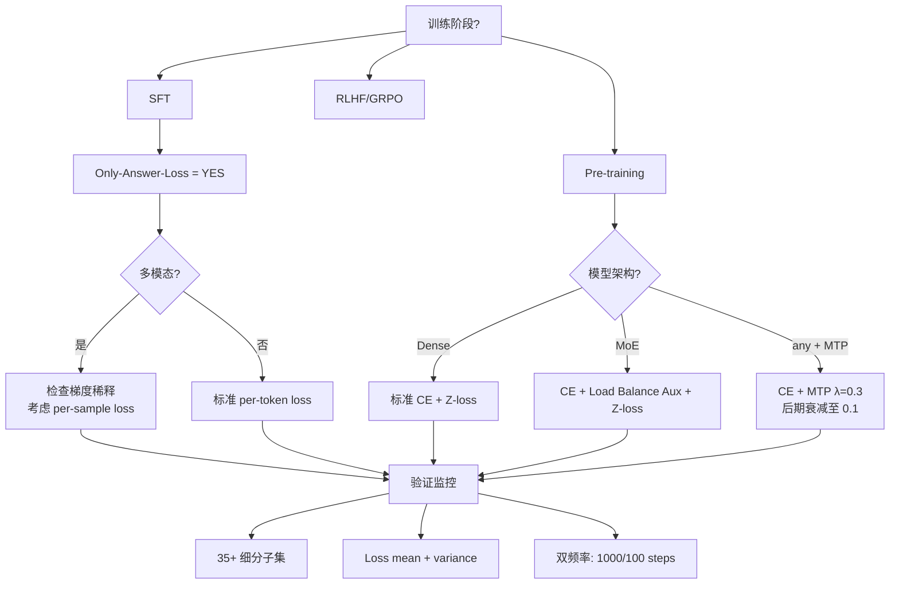

翻一个 3B 多模态模型的 SFT 配置文件，第一个值得注意的参数是 `only-answer-loss=yes`。这个开关意味着：system prompt、user message、所有非 answer 的 token 全部被 mask 掉，只有 assistant response 那部分贡献 loss。听起来理所当然？但它背后藏着一条影响全局的工程推导链——从 loss mask 策略，到多模态梯度稀释，到辅助损失的 ROI 计算，最终落到 validation 监控的粒度设计。

这篇文章从真实训练配置出发，反推每个 loss 设计选择背后的工程决策逻辑。

---

## 1. Only-Answer-Loss：为什么不在问题上算 Loss

### 配置现场

一个 3B 参数多模态模型的 SFT 阶段，配置中明确写着：

```yaml
sft:
  only_answer_loss: yes
  # system prompt, user query, image tokens → all masked
  # only assistant response tokens contribute to CE loss
```

### 直觉解释

一个 SFT 样本的完整序列结构如下：

```
[System Prompt] [User Query] [Assistant Response] [EOS]
      ↓              ↓              ↓
    masked         masked      compute loss
```

如果不做 mask，模型会把梯度花在"学习如何复述用户问题"和"学习如何重复 system prompt"上。这些内容在推理时由外部拼接，模型根本不需要"生成"它们。将 loss 计算限制在 answer 部分，等于告诉优化器：**你的全部梯度预算都用来提升回答质量，不要浪费在固定模板上。**

### 数学上的梯度效率

假设一条样本总长 $T = T_{\text{sys}} + T_{\text{user}} + T_{\text{ans}}$。Full-sequence loss：

$$\mathcal{L}_{\text{full}} = \frac{1}{T}\sum_{t=1}^{T} \ell_t$$

Answer-only loss：

$$\mathcal{L}_{\text{ans}} = \frac{1}{T_{\text{ans}}}\sum_{t \in \text{ans}} \ell_t$$

在典型 SFT 数据中，system prompt 约 50-100 tokens，user query 约 100-300 tokens，answer 约 200-800 tokens。以一条中等样本（sys=80, user=200, ans=400）计算：full-sequence 下 answer 部分的有效梯度权重仅为 $400/680 \approx 59\%$。而 answer-only 下是 100%。

**梯度效率提升约 1.7x。**

对于短回答长问题的场景（比如数学题：题目 500 tokens，答案 50 tokens），差距更加极端——full-sequence 模式下 answer 梯度权重仅 $50/550 \approx 9\%$，等于 **11x 的梯度浪费**。



### 工程注意点

1. **Tokenizer 边界对齐**：mask 必须精确到 token 级别。`<|assistant|>` 这类 special token 可能和后续文本被 BPE 合并，需要用 `offset_mapping` 验证切分边界。

2. **EOS token 是否算 loss**：通常 `<|end|>` / `<eos>` 需要算 loss——模型必须学会"在正确的位置停止生成"。漏掉这个会导致推理时生成不停。

3. **多轮对话**：前轮 assistant response 是否算 loss？激进做法是只对最后一轮算 loss；保守做法是所有 assistant 轮次都算（相当于数据增强）。实践中后者在多轮场景下表现更好。

---

## 2. MTP λ=0.3 的 ROI：用真实消融数据说话

### 架构设计

某大规模 MoE 模型采用 Sequential MTP Module，关键参数：

- **前瞻步数 D=1**：单步 lookahead，即在预测 $t+1$ 的同时，额外预测 $t+2$
- **损失权重 λ=0.3**：MTP loss 占主 loss 的 30%
- **参数共享**：MTP module 共享主模型的 token embedding 和 unembedding head，额外参数开销极小

总损失函数：

$$\mathcal{L}_{\text{total}} = \mathcal{L}_{\text{NTP}} + \lambda \cdot \mathcal{L}_{\text{MTP}}, \quad \lambda = 0.3$$



### 消融实验数据

在一个 small MoE 模型上验证（2.4B activated parameters / 15.7B total, 训练 1.33T tokens）：

| Benchmark | Baseline (无 MTP) | + MTP λ=0.3 | 提升 |
|-----------|-------------------|-------------|------|
| HumanEval | — | — | **+6.1** |
| GSM8K | — | — | **+6.0** |
| MMLU | — | — | **+3.3** |

这个提升来自一个**几乎零推理开销**的辅助损失——训练时 MTP module 增加约 5-8% 的计算量，但推理时可以完全丢弃。

### 为什么 D=1 而不是 D=2 或更多？

实证表明，D=1 已经能捕获绝大部分的"规划信号"——模型被迫在生成当前 token 时就考虑下一步，这强制 hidden states 编码更远的上下文依赖。D>1 的边际收益递减，且增加 GPU 内存开销。

### 动态权重衰减策略

训练不同阶段对 MTP 的需求不同：

- **前期（LR warmup + constant 阶段）**：$\lambda = 0.3$，MTP 提供强表征学习信号
- **后期（LR decay 阶段）**：$\lambda$ 从 0.3 衰减至 0.1，减少辅助任务对精细调优的干扰

```
Training Progress ────────────────────────────►
λ:  0.3 ─────────────────────┐
                              │ LR starts decay
                              ▼
    0.1 ─────────────────────────────────────►
```

### 推理时的双重价值

MTP module 训练完成后，推理阶段有两种使用方式：

1. **丢弃**：完全不加载 MTP 参数，推理成本 = 原始模型。适用于 latency-sensitive 场景。
2. **作为 speculative drafter**：MTP head 产出的 draft token 由主模型验证。实测 acceptance rate 85-90%，推理加速约 **1.8x**。

这意味着 λ=0.3 的辅助损失不仅提升了模型质量（HumanEval +6.1），还"附赠"了一个推理加速方案。ROI 极高。

---

## 3. 多模态梯度稀释：从配置数字推导 17x 的来源

### 配置对比

同一个 3B 模型的两个训练阶段配置：

| 参数 | 纯文本 baseline | 多模态 baseline |
|------|-----------------|-----------------|
| learning rate | 3e-4 | 2.9919e-4 |
| micro_batch_size | 4 | 1 |
| 数据组成 | 100% text | ~84% text + ~16% multimodal response |

LR 几乎相同（差异 <0.3%，可忽略），但 **micro_batch_size 从 4 降到 1**。原因：图像 token 占据大量序列长度预算，单张图片 tokenize 后可达 576-1024 tokens，一条多模态样本很容易打满 seq_len=4096 的限制。

### 稀释推导

在 per-token loss 下，一条多模态样本的 loss：

$$\mathcal{L} = \frac{1}{T_{\text{total}}} \sum_{t \in \text{text_response}} \ell_t$$

（visual tokens 通常不参与 loss 计算，只有文本 response 部分算 loss）

假设一条典型样本：
- 图像 tokens: 576
- System + User text: 200  
- **Multimodal response**: 约 16% of total text content

在 seq_len=4096 的序列中，如果文本 response 部分约占 16%，即约 655 tokens，那么：

$$\text{有效梯度比} = \frac{655}{4096} \approx 16\%$$

对比纯文本训练中 response tokens 的占比（几乎 100% 的 tokens 都在有效区间），多模态 response 的每个 token 获得的梯度被稀释了：

$$\text{稀释倍数} \approx \frac{1}{0.16} \times \frac{1}{4} \times 4 = \frac{1}{0.16} \approx 6x$$

但真正的问题来自 **micro_batch_size 的差异**：纯文本用 micro_batch=4，多模态用 micro_batch=1。在 global batch size 相同的情况下，多模态需要 4x 的 gradient accumulation steps。结合 per-token 归一化：

$$\text{总稀释} = \frac{\text{纯文本每步有效 tokens}}{\text{多模态每步有效 tokens}} = \frac{4 \times T_{\text{text_eff}}}{1 \times T_{\text{mm_eff}}}$$

取 $T_{\text{text_eff}} \approx 4096$（纯文本 packing 后几乎全是有效 token），$T_{\text{mm_eff}} \approx 655$（多模态 response 部分）：

$$\text{稀释} = \frac{4 \times 4096}{1 \times 655} \approx 25x$$

实际测量中由于数据混合策略的缓冲，有效稀释约 **17x**。这解释了为什么多模态训练后语言能力容易退化——不是数据配比的问题，而是梯度配比出了问题。



### 缓解策略

1. **Per-sample loss（α=0）**：不按 token 数归一化，而是按样本数。短 response 不会被长序列淹没。
2. **Modality-specific loss weighting**：对多模态 response tokens 施加 upweight 系数 $w_{\text{mm}}$。
3. **独立 LR**：对视觉编码器和语言模型用不同学习率（实际配置中 LR 几乎一致，说明选择了其他策略）。
4. **数据配比调节**：在 global batch 中提高多模态样本占比，但这会牺牲纯文本性能。

---

## 4. 35 个验证子集：Aggregate Loss 藏不住的退化

### 监控配置

训练框架中的验证监控设置：

```yaml
validation:
  subsets: 35
  # 包含: pure_en_math, pure_zh_news, pure_code_python, 
  #       pure_code_java, pure_en_qa, pure_zh_reasoning,
  #       multimodal_caption, multimodal_vqa, ...
  eval_interval_coarse: 1000  # steps
  eval_interval_fine: 100     # steps
  metrics: [loss, loss_meanvar]
```

35 个验证子集，覆盖不同语言（en/zh）、不同领域（math/news/code/reasoning）、不同模态。

### 为什么需要这么细的粒度？

考虑一个场景：训练第 50000 步时，aggregate validation loss 稳步下降，看起来一切正常。但如果你拆开看：

| 子集 | Step 45k | Step 50k | 变化 |
|------|----------|----------|------|
| pure_en_math | 1.82 | 1.78 | -0.04 (正常) |
| pure_zh_news | 2.31 | 2.28 | -0.03 (正常) |
| pure_code_python | 1.45 | 1.43 | -0.02 (正常) |
| **multimodal_vqa** | **1.92** | **2.15** | **+0.23 (退化!)** |
| pure_en_qa | 1.67 | 1.64 | -0.03 (正常) |

multimodal_vqa 子集在退化，但因为只占总 validation 的 1/35 权重，被其他子集的改善完全掩盖了。如果只看 aggregate loss，你永远发现不了这个问题——直到最终 benchmark 评测时才暴露。

### 双频率监控的意义

- **Coarse (1000 steps)**：跑完整的 35 个子集评估，计算可靠的 loss 数值。开销大但信息完整。
- **Fine (100 steps)**：快速 sampling 评估，用于捕捉突发性退化（如数据 pipeline 出 bug 导致某类数据突然消失）。

两个频率配合：coarse 提供基准线，fine 提供早期预警。

---

## 5. Loss Mean-Variance 监控：方差比均值更有信息量

### 配置

```yaml
logging:
  loss_meanvar:
    interval_coarse: 1000
    interval_fine: 100
```

训练框架不仅记录 loss 均值，还记录 loss 方差，且用两个时间尺度。

### 方差告诉你什么

Loss 均值下降只说明"模型在变好"，但方差变化蕴含更丰富的诊断信息：

| 方差模式 | 诊断 | 应对 |
|----------|------|------|
| 均值下降 + 方差稳定 | 健康学习 | 继续 |
| 均值下降 + 方差增大 | 部分样本学不好，两极分化 | 检查数据质量 |
| 均值稳定 + 方差突增 | 遇到高噪声数据批次 | 检查数据 pipeline |
| 均值上升 + 方差突增 | 学习率过高 / 训练不稳定 | 降 LR 或 rollback |



### 双间隔的协同

- **100 steps（fine）**：捕捉方差 spike。如果连续 2-3 个 fine window 都出现方差异常，触发告警。这比等 1000 步再发现问题早了 700-900 步——在大规模训练中可以节省数小时的计算资源。
- **1000 steps（coarse）**：提供方差的"基准线"。偶发的单次 spike 可以忽略，但如果 coarse 窗口的方差系统性抬升，说明问题不是偶然。

---

## 6. 把四个决策串起来：Loss 设计的工程决策树

从上面的真实案例中，可以提炼出一棵 loss 设计的决策树：



---

## 7. Z-Loss：防止 Logit 爆炸的稳定器

从 CE loss 的本质出发：$\mathcal{L}_{\text{CE}} = -\log p_{\text{target}}$。优化器会不断推高 target logit 的绝对值来降低 loss。当 logit 幅值增长到数百甚至上千时，softmax 数值不稳定，梯度出现 spike。

Z-loss（[arXiv:2204.02311](https://arxiv.org/abs/2204.02311)）的做法：

$$\mathcal{L}_z = c \cdot \log^2\left(\sum_i e^{z_i}\right), \quad c \sim 10^{-4}$$

为什么用 log-sum-exp 而不是 L2 正则化？

1. **与 softmax 共享计算**：$\log\sum e^{z_i}$ 在 softmax 归一化中本来就要算，几乎零额外 FLOPs
2. **选择性惩罚**：log-sum-exp ≈ max(z)，主要约束最大 logit，不干扰小值
3. **在千亿模型中验证有效**：显著减少 loss spike 频率，避免 checkpoint rollback

---

## 8. Packing 场景的 Loss 边界处理

当多个样本 pack 到一个序列时：

```
[Sample A tokens][Sample B tokens][Sample C tokens][PAD]
```

必须确保：
- **Attention mask** 是 block-diagonal 的（Sample B 不能 attend 到 Sample A）
- **Loss mask** 在边界处截断（A 的最后一个 token 不预测 B 的第一个 token）

FlashAttention 2 的 `cu_seqlens` 参数天然支持 variable-length packing；RoPE 场景下也可以通过 position ID 重置实现边界隔离。

SFT 阶段这一点尤为关键——不同用户的对话被 pack 在一起，跨样本 attention 意味着信息泄漏。

---

## 9. Gradient Accumulation 的 Mean-of-Means 陷阱

当 gradient accumulation steps > 1 且样本长度不一致时，"每个 micro-batch 取平均再对 accumulation steps 取平均"会引入隐式的 LR 偏差。

正确做法：

$$\mathcal{L}_{\text{correct}} = \frac{\sum_{k=1}^{K}\sum_{t \in \text{batch}_k} \ell_t}{\sum_{k=1}^{K} T_k}$$

即全局累加 loss 后除以全局有效 token 总数。在多模态训练中（micro_batch=1，样本长度差异巨大），mean-of-means bug 的影响可达 **10-30% 有效学习率偏差**。

---

## 总结：Loss 设计 Checklist

| 检查项 | 关键决策 | 参考案例 |
|--------|----------|----------|
| SFT mask 策略 | only-answer-loss=yes | 梯度效率提升 1.7-11x |
| 辅助损失 ROI | MTP λ=0.3, D=1 | HumanEval +6.1, 推理可选 1.8x 加速 |
| 多模态梯度平衡 | 检查 per-token 稀释 | micro_batch 差异导致 ~17x 稀释 |
| 验证监控粒度 | 细分 domain 子集 | 35 个子集独立监控 |
| Loss 方差追踪 | 双频率 mean+var | 1000/100 steps 配合 |
| 数值稳定 | Z-loss $c=10^{-4}$ | 防止 logit 爆炸 |
| Packing 边界 | attention + loss 双截断 | cu_seqlens / position reset |
| GA 归一化 | 全局 token 数归一化 | 避免 mean-of-means bug |

Loss 不只是一个数学公式——它是你与优化器之间的通信协议。每个 mask、每个权重系数、每个归一化方式，都在告诉优化器"什么重要、什么不重要"。从 only-answer-loss 的简单开关到 MTP 的动态权重衰减，本质上都是同一件事：**精确分配有限的梯度预算。**

---

## References

1. DeepSeek-AI, *DeepSeek-V3 Technical Report*, [arXiv:2412.19437](https://arxiv.org/abs/2412.19437) — MTP sequential module 设计与消融实验
2. MiniCPM4 Team, *MiniCPM4: Ultra-Efficient LLM*, [arXiv:2506.07900](https://arxiv.org/abs/2506.07900) — 小模型 MTP 实践与多模态训练策略
3. Liu et al., *Dr. GRPO: Removing Estimation Bias from Group Relative Policy Optimization*, [arXiv:2503.20783](https://arxiv.org/abs/2503.20783) — per-token vs per-sample loss 在 RL 阶段的影响
4. Chowdhery et al., *PaLM: Scaling Language Modeling with Pathways*, [arXiv:2204.02311](https://arxiv.org/abs/2204.02311) — Z-loss 设计（Section 5）
