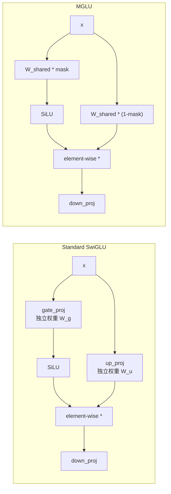

某 3B 模型想减 FFN 参数：让 up_proj 和 gated_proj 共享权重，只用 1-bit mask 区分。听起来很聪明——参数减半，推理 IO 少一半。实测：16 个验证集全部退化，平均 +0.04，没有任何一个域有收益。67B token 后放弃。

## MGLU 是什么

MGLU（Masked Gated Linear Unit）的核心想法：SwiGLU FFN 里的 gate_proj 和 up_proj 是两个形状完全相同的矩阵，训练后往往高度相关。如果能共享一个权重矩阵，仅通过 learned 1-bit mask 区分两个角色，就能砍掉 ~50% FFN 参数量，推理时 memory-bound I/O 直接减半。

标准 SwiGLU FFN：

```
output = down_proj(silu(gate_proj(x)) * up_proj(x))
```

MGLU 变体：

```
mask = learn_binary_mask(W_shared)   # 1-bit per element
gate = silu((W_shared * mask) @ x)
up   = (W_shared * (1 - mask)) @ x
output = down_proj(gate * up)
```



Motivation 很直觉：既然两个矩阵形状一样、初始化一样、作用于同一个输入 x，何不让它们共享底层参数，通过 mask 分工？

## Training Loss Timeline：先收敛再发散

实验配置：某 3B 模型 from scratch，3T token pretraining data，跑了 ~67B tokens（6k steps），足够观察趋势。

| Token Count | Baseline Loss | MGLU Loss | Gap |
|---|---|---|---|
| 4.1B | 4.35 | 4.43 | +0.08 |
| 8.2B | 2.63 | 2.63 | **0.00** |
| 16.4B | 2.14 | 2.32 | +0.18 |
| 24.6B | 2.17 | 2.21 | +0.04 |

这条曲线很有意思：

1. **初始阶段（~4B tokens）**：MGLU 落后 +0.08，共享初始化让 gate 和 up 无法快速分化
2. **8.2B tokens**：gap 短暂收敛到 0——mask 正在学会合理的分区
3. **16.4B tokens**：gap 急剧扩大到 +0.18——mask 分区的表达能力瓶颈暴露
4. **24.6B tokens**：gap 稳定在 +0.04——模型适应了约束但永远无法追平

如果只看到 8.2B 就停下来，你会觉得 MGLU 有戏。但 16.4B 之后的发散是致命的——它说明 mask partition 的 representational capacity 有硬上限。

## 16 个验证集：全军覆没

在 24.6B tokens checkpoint 上评估 16 个验证集：

| Validation Set | Baseline | MGLU | Gap |
|---|---|---|---|
| en_math | 1.6904 | 1.7353 | +0.045 |
| en_novel | 3.0276 | 3.0818 | +0.054 |
| en_world_knowledge | 2.1081 | 2.1525 | +0.044 |
| skywork_gsm8k | 1.1599 | 1.1644 | +0.005 |
| zh_news | 2.8981 | 2.9558 | +0.058 |
| zh_qa | 3.7321 | 3.7831 | +0.051 |
| code | 1.1397 | 1.1743 | +0.035 |
| en_news | 2.6333 | 2.6778 | +0.045 |
| en_qa | 2.7868 | 2.8218 | +0.035 |
| zh_math | 1.5917 | 1.6289 | +0.037 |
| zh_novel | 3.3541 | 3.4116 | +0.058 |
| zh_world_knowledge | 2.9545 | 3.0174 | +0.063 |
| code_python | 0.9499 | 0.9888 | +0.039 |
| code_java | 0.7672 | 0.7888 | +0.022 |
| code_javascript | 0.9374 | 0.9858 | +0.048 |
| code_c++ | 1.0754 | 1.0958 | +0.020 |

**16/16 全部退化。** 平均 gap +0.04。没有任何一个 domain 显示出哪怕微弱的收益。

这是一个非常干净的 negative result：不是某些 domain 好某些差的 trade-off，而是 uniform degradation across all tasks。

## Root Cause：gate 和 up 的数学角色不可调和

为什么 1-bit mask 共享注定失败？核心在于 SwiGLU 里 gate 和 up 服务于**截然相反**的数学角色：

**gate_proj 的角色**：content-dependent filter。经过 SiLU 后输出近似 sigmoid，决定**哪些 feature 通过**。它需要学会对输入做二值化判断——"这个维度重要/不重要"。

**up_proj 的角色**：value generator。决定**通过 gate 的信号的数值是多少**。它需要生成高保真的连续值表示。

一个做 selection，一个做 generation——这两个目标需要权重矩阵朝完全不同的方向优化。1-bit mask 只能翻转单个权重元素的归属，无法让同一个底层矩阵同时服务两种截然不同的映射需求。

用一个类比：这就像试图用同一张照片通过裁剪得到两张完全不同的图。mask 能选择哪些像素属于图 A 或图 B，但底层像素值是共享的——你永远无法让同一个像素同时在图 A 里表达亮红色，在图 B 里表达深蓝色。

## "8.2B 收敛"的错觉

8.2B tokens 时 gap 归零并非 MGLU 真的追上了 baseline。更准确的解释：

- 训练初期（<8B tokens），模型主要在学 low-rank 的通用 pattern——语言的基本统计规律
- 这些 pattern 不需要 gate 和 up 做精细分工，共享矩阵 + 粗糙 mask 就够用
- 8.2B 之后进入 fine-grained specialization 阶段，模型需要 gate 做更精确的 feature selection，up 做更精确的 value projection
- 此时 mask partition 的 capacity ceiling 暴露

这给我们一个教训：**early convergence 不能作为架构可行性的证据**。只有度过 specialization phase 后的稳态 gap 才有意义。

## Weight Sharing 何时有效 vs 何时失败

并非所有 weight sharing 都失败。对比几个案例：

**成功的 sharing：**
- **Tied embeddings**（input embedding = output projection transpose）：两者本质都在同一个 token-to-vector 空间操作，共享语义上合理
- **Cross-layer sharing**（如 ALBERT）：同一个 transformation 在不同位置重复使用，角色相同
- **LoRA / adapter**：共享 base weight，低秩增量做 task adaptation——增量本身是独立的

**失败的 sharing：**
- **MGLU（本文）**：gate 和 up 角色对立，mask 提供的自由度不足
- **Attention QK sharing**（已知 negative）：Q 和 K 需要不同的投影空间来计算 attention score

规律：**当两个组件的数学角色相同或高度对齐时，sharing 有效；当角色对立或正交时，sharing 必然损失 capacity。**

## Negative Result 的价值

这个实验虽然失败了，但贡献了几个 clean takeaway：

1. **SwiGLU 的 gate/up 分离不是冗余**——它是 representational capacity 的核心来源。任何试图合并二者的方案都需要提供等价的 capacity compensation
2. **1-bit mask 的表达力上限**——对于需要根本不同 transformation 的场景，binary mask 提供的 2^n 种分区方式远远不够
3. **Training dynamics 的误导性**——early phase 的 gap closure 不代表长期可行性。只有跑过 specialization phase（通常 >10B tokens）才能判断
4. **Uniform degradation = architectural limitation**——如果 16/16 domain 全部退化且 gap 稳定，说明问题在架构层面而非超参或训练策略层面

下一步如果还想减 FFN 参数，更有希望的方向可能是：
- Structured pruning（剪掉 intermediate_size 的某些维度）
- Low-rank factorization（W = AB 分解，但保持 gate/up 独立）
- MoE sparse activation（不减参数总量但减 per-token compute）

## References

- Shazeer, 2020. "GLU Variants Improve Transformer" — SwiGLU 原始提出
- Lan et al., 2020. "ALBERT: A Lite BERT for Self-supervised Learning" — cross-layer weight sharing 的成功案例
- Dauphin et al., 2017. "Language Modeling with Gated Convolutional Networks" — GLU 的数学分析
