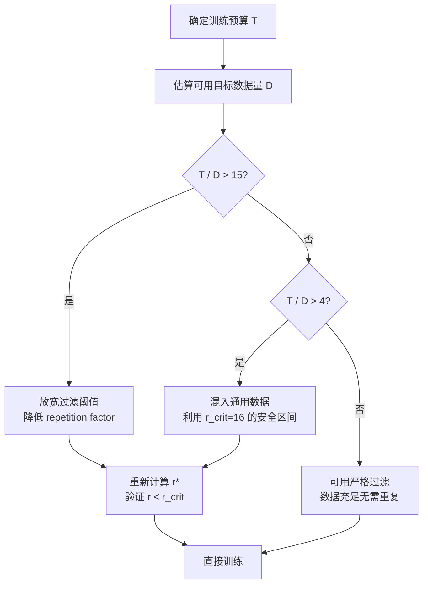

> 通用 Scaling Law 说目标数据重复超过 4 轮就开始退化。我们在混合训练中发现完全不是这回事——目标数据可以重复 15-20 轮而不退化，前提是有通用数据持续注入"新鲜梯度"。这个发现来自 2000+ 次训练实验的 power-law 拟合。

## "4-epoch 定律"以及它在混合训练中为什么不成立

2023 年的经典结论（Muennighoff et al.）清晰且简单：**单一数据源重复训练超过 4 epoch，模型就开始退化**。这条规则深深影响了业界实践——很多团队宁可用更多低质量数据，也不敢把精选数据多跑几轮。

但这条规则的适用条件被忽视了：它是在 **single-source** 设定下测得的。当训练流中只有目标数据，模型确实在第 4 轮左右开始 memorize 而非 generalize。

混合训练（target + generic data）完全改变了动态。2000+ 次实验（101M 到 805M 参数）显示：

- **单源训练**：~4 epoch 后 loss 停止下降甚至反弹
- **混合训练**：目标数据可以安全重复 **15-20 epoch** 才出现退化迹象

机制并不神秘：generic tokens 提供了持续的"新鲜梯度方向"。当模型同时学习通用知识和领域知识时，通用数据的梯度信号充当了隐式正则化——它不断扰动参数，让模型无法完全 memorize 目标分布中的重复 pattern。

## Effective Data 公式与重复因子 r

核心变量是 **repetition factor r**——目标数据被重复的次数。定义混合比例：

$$h = \frac{r \times D_{\text{target}}}{D_{\text{total}}}$$

关键发现：**相同的 r 在不同模型规模下造成的退化程度几乎一致**。这意味着可以用小模型做 proxy 实验来预测大模型的最优配比，成本仅为全量实验的 1/20，准确度 >90%。

Effective data 的完整公式：

$$D_{\text{eff}} = D_{\text{unique}} \times (1 - e^{-r}) \times \frac{1}{1 + \alpha \cdot \max(0,\; r - r_{\text{crit}})}$$

三项分别对应：

1. **$(1 - e^{-r})$**：数据利用的收益递减——第一次见的数据信息量最大，后续递减
2. **$r_{\text{crit}}$**：退化开始的临界重复次数。单源训练 $r_{\text{crit}} \approx 4$；混合训练 $r_{\text{crit}} \approx 16$
3. **$\alpha$**：退化速率，超过临界点后 effective data 加速缩水

混合训练把 $r_{\text{crit}}$ 从 4 提升到 16——这不是微调，是 **4 倍的安全区间扩展**。

## Quality Filtering 悖论：最严格的过滤不一定最好

直觉告诉我们：数据越干净越好，过滤越严格越好。实验告诉我们这是错的——取决于训练预算。

| Training Budget | 最优过滤比例 | 原因 |
|---|---|---|
| ~1B tokens | top 1% | 数据充裕，无需重复，极致质量 |
| ~5B tokens | top 10% | top 1% 被迫重复 50×，严重退化 |
| ~20B tokens | top 20-30% | 更宽松的过滤 = 更低的重复因子 |

这是一个非平凡的 trade-off：

核心逻辑：**过滤严格度应该是训练预算的函数，而非固定超参数。**

## 最优重复次数随预算增长

Scaling law 拟合出的最优重复次数 $r^*$（以 German domain data 为 target）：

| 训练预算 | 最优 $r^*$ | 直觉解释 |
|---|---|---|
| 2B tokens | ~5 | 预算小，少量重复即够 |
| 10B tokens | ~12 | 中等预算，充分利用混合的安全区间 |
| 50B tokens | ~19 | 大预算，接近 $r_{\text{crit}}$ 上限但不越过 |

$r^*$ 随预算增长是 sublinear 的——大致是对数关系。这意味着即使预算翻 25 倍（从 2B 到 50B），最优重复只翻 ~4 倍。通用数据的稀释效应是有上限的。

## 算力浪费对比：旧公式 vs 新公式

这是最有说服力的对比：

| 方法 | 中位算力浪费 | 说明 |
|---|---|---|
| Muennighoff 2023 公式 | 88% | 过度保守，严重低估可用重复次数 |
| 新 mixture scaling law | 26% | 准确建模混合训练动态 |

**3.4× 的效率提升**——不需要更多数据、不需要更大模型、不需要更新架构。只需要正确理解重复在混合环境中的行为。

88% 的浪费意味着什么？如果你有 1000 GPU-hours 的预算：
- 旧方法：仅 120 GPU-hours 的有效训练
- 新方法：740 GPU-hours 的有效训练

差距来自旧公式让你过早停止使用目标数据，转而填充更多低信息量的 generic tokens。

## 实际应用：3B 模型 + 2T 训练 + 1B 目标数据

一个具体场景——训练一个 3B 模型，总预算 2T tokens，手上有 1B 高质量领域数据：

**旧规则（4 epoch 上限）：**
- 目标数据最多用 4B tokens（1B × 4 轮）
- 剩余 1.996T 全靠通用数据填充
- 目标数据仅占混合的 0.2%——几乎没有存在感

**新规则（混合训练 $r_{\text{crit}} \approx 16$）：**
- 可以安全重复 10-13 次 = 10-13B 目标 tokens
- 目标数据占比提升到 0.5-0.65%
- 领域性能显著更强，且不触发退化

看起来比例差距不大？对于 2T 规模的训练，0.2% vs 0.65% 意味着目标 tokens 从 4B 增加到 13B——**3× 以上的领域信号注入**。在 domain-specific benchmark 上这往往是 5-10% 绝对提升的差距。

## Engineering Lessons

**1. Proxy 实验是可行的。** 由于 repetition factor r 的退化效应跨模型规模一致，你可以用 101M 模型跑 grid search 找到最优 $r^*$，然后直接应用到 3B/7B 目标模型。成本节省 20×。

**2. 数据质量过滤不是一劳永逸的决策。** 它需要和训练预算联合优化。一个实用的启发式：

- 如果 budget / unique_target_data < 5：放心用严格过滤
- 如果 5 < ratio < 15：混入通用数据，利用混合的高 $r_{\text{crit}}$
- 如果 ratio > 15：必须放宽过滤，否则强制重复会杀死数据多样性

**3. 通用数据不是"填充物"，是正则化器。** 重新理解 generic tokens 的角色——它们不仅贡献通用知识，更重要的是提供梯度多样性，阻止模型对重复目标数据的 memorization。

**4. Scaling law 是可预测的。** 2000+ 次实验拟合的 power-law 关系，让"trial and error"变成了"计算最优配比 → 一次性训练"。这是工程范式的转变。

**5. 混合比例是动态的。** 最优 $h$ 不是一个固定值，它取决于当前的 repetition 状态。更先进的实现可以在训练过程中动态调整混合比例——前期低 $r$ 时可以灌更多目标数据，后期 $r$ 接近 $r_{\text{crit}}$ 时逐步降低目标占比。

## References

1. Scaling Laws for Mixture Pretraining Under Data Constraints. [arXiv:2605.12715](https://arxiv.org/abs/2605.12715), 2026.
2. Muennighoff et al. Scaling Data-Constrained Language Models. [arXiv:2305.16264](https://arxiv.org/abs/2305.16264), 2023.
