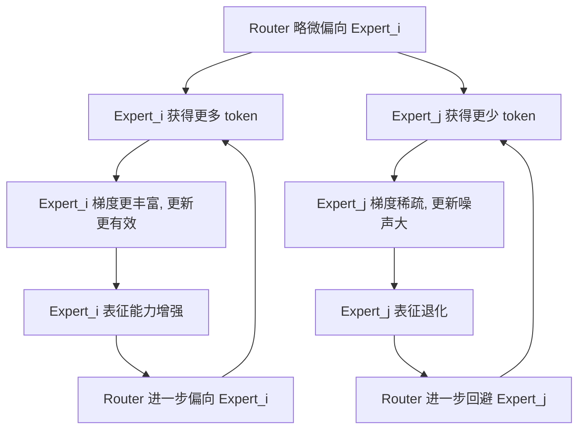
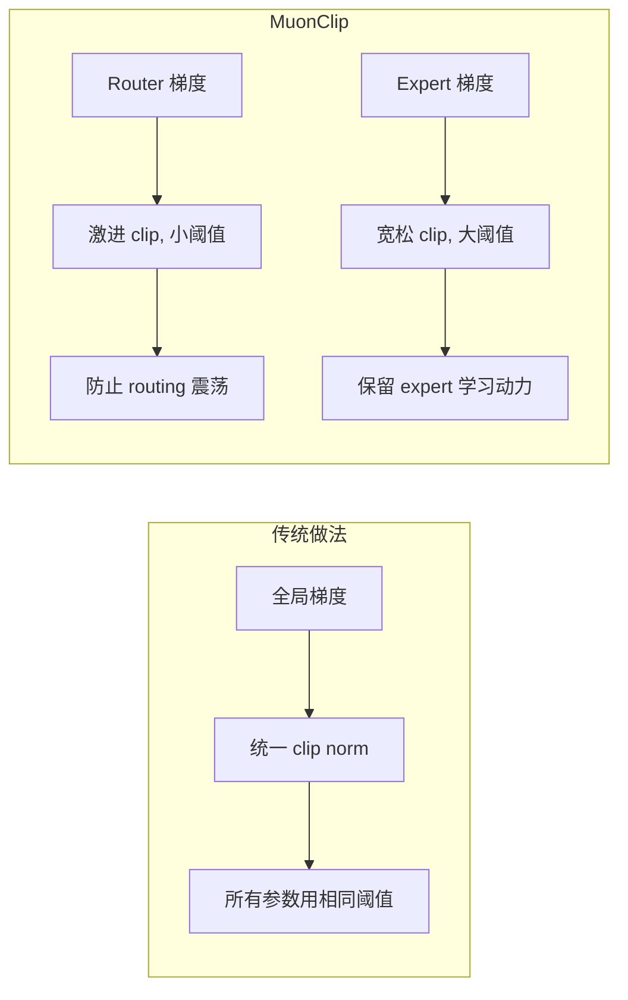
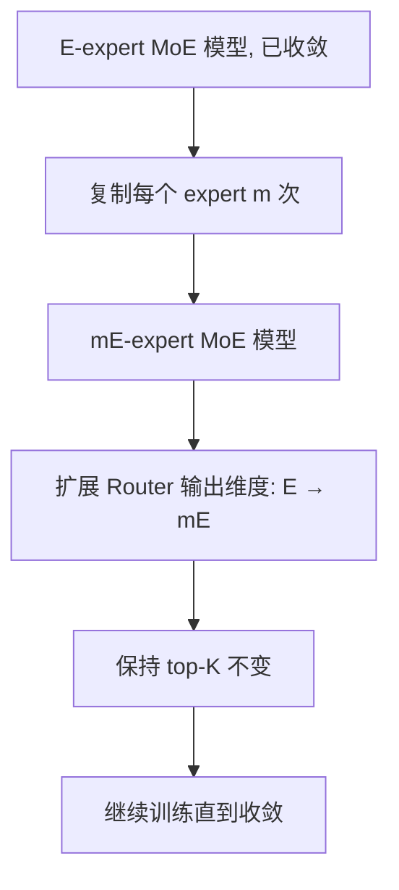
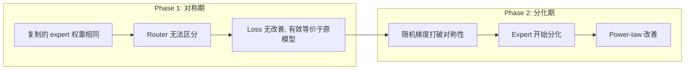
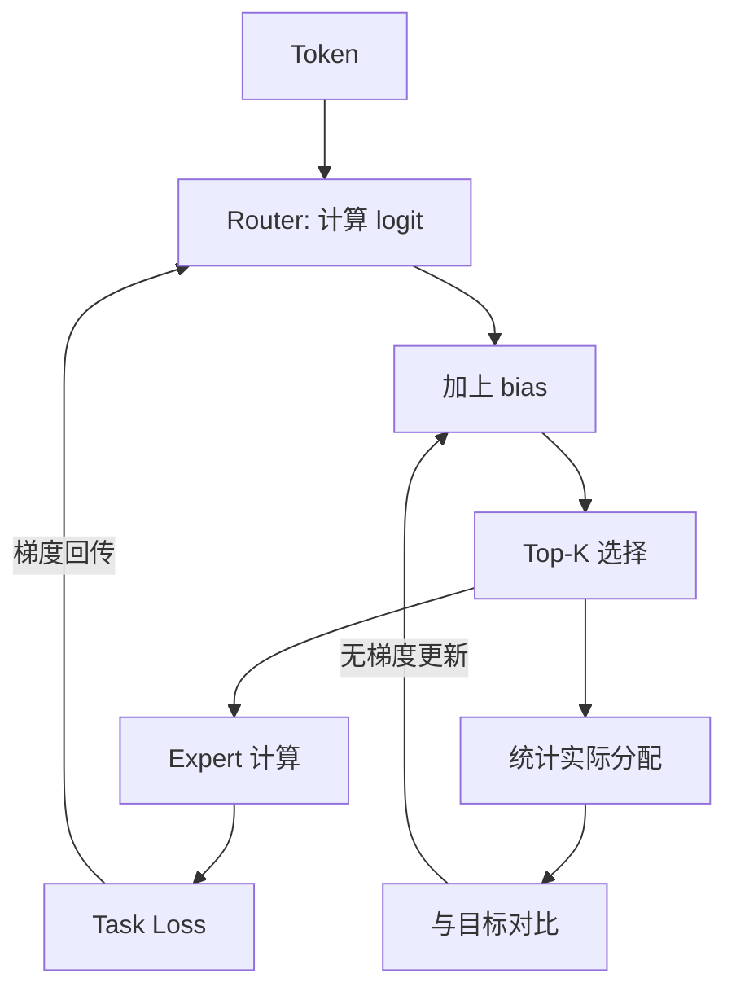
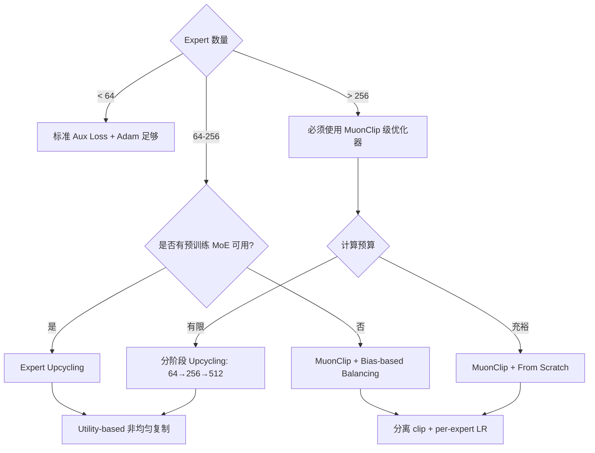

## 开场：一个 962B 模型的训练噩梦

上个月我参与调试某 962B MoE 的训练稳定性问题，这个模型的配置如下：

- **78 layers**, hidden size 6656, **512 experts, top-8 routing**
- Active params **34.7B** out of 962B total — 只有 **3.6% 的激活比**
- 采用 LatentMoE 架构：shared down-projection 将输入从 6656 维压缩到 3072 维再 dispatch 给各 expert
- Expert input size 最初设计为 3328，后来为满足 DeepEP all-to-all 通信约束（维度必须整除 512）而调整为 3072
- 每个 expert 的 FFN intermediate dim 为 10240

理论上这是一个极其高效的架构：用 dense model 3.6% 的计算量，获得接近全量参数的表征能力。

现实是另一回事。

训练进行到约 12K 步时，监控面板上 expert utilization heatmap 呈现典型的"冰火两重天"：约 80 个 expert 的 token 分配量是平均值的 3-5 倍，剩余 400+ 个 expert 长期低于平均值的 10%。grad-norm 在这些低利用率 expert 上几乎为零——不是收敛了，而是"饿死了"。

更让人崩溃的是 loss spike 模式。以下是当时实际的训练日志片段：

```
Step 12,400: loss=2.847, expert_util_std=0.72, max_expert_load=4.3x_avg
Step 12,401: loss=2.851
Step 12,402: loss=2.849
Step 12,403: loss=4.217 ← spike!  dead_experts_count: 412→418 (+6)
Step 12,404: loss=3.105 (partial recovery)
Step 12,500: loss=2.862 (new baseline, permanently higher)
```

每次 spike 后 loss 都无法完全恢复到之前的 baseline，同时伴随若干 expert 的永久性死亡。模型的有效容量从 962B 退化到不足 200B。

值得注意的是，这个问题随着 scaling ladder 的规模增大而急剧恶化：

- **L12 阶段**（3.9B total, 512 experts）：每个 expert FFN 只有 1536 dim，利用率分布相对均匀，dead expert < 30
- **L78 阶段**（962B total, 512 experts）：每个 expert FFN 涨到 10240 dim，利用率严重 skew，dead expert 突破 400

expert 变大后，"赢家通吃"的马太效应被急剧放大——大 expert 能学到更强的表征，router 更加偏向它们，小 expert 更快饿死。

直到引入 MuonClip 之后，情况才发生根本性转变。引入 MuonClip 后的对比（同样 500 步窗口）：**spike 事件从 7 次降到 1 次，dead expert count 从 418 回到 89**。这不是某个 trick 的微小改进，而是决定这个模型能不能训出来的分水岭。

本文从这次调试经历出发，拆解 MoE 训练稳定性的三个核心问题：expert 死亡螺旋的机制、MuonClip 的分离优化策略、以及 Expert Upcycling 的渐进扩展范式。

---

## 一、Expert 死亡螺旋：正反馈陷阱

### 离散决策的原罪

MoE 的核心机制是 router：一个轻量级网络（通常是单层线性 + softmax），为每个 token 选择 top-K 个 expert。这个选择是**离散的**——要么选中，要么不选。

问题在于：离散决策带来的梯度噪声会被正反馈放大。



这是一个典型的 Matthew Effect（马太效应）：强者愈强，弱者愈弱。当 expert 数量来到 512 这个量级时，这个效应被指数级放大——因为每个 expert 期望分到的 token 比例只有 8/512 = 1.56%，任何微小的偏差都会让某些 expert 的 token 量跌破有效训练的阈值。

### Dead Expert 的定义与检测

一个 expert 被认为"死亡"的条件：

1. **Token 分配量** < 期望值的 5%，持续超过 1000 步
2. **权重范数变化率** < 1e-6（权重冻结）
3. **Router logit** 对应维度的均值持续为负（被系统性回避）

在 512-expert、top-8 的配置下，期望每个 expert 处理 batch 中约 1.56% 的 token。当某个 expert 实际处理量低于 0.08%（期望的 1/20），它基本已经进入不可逆的死亡状态。

### LatentMoE：压缩输入维度的缓解

某开源 MoE 系列提出了 LatentMoE 的思路：在 dispatch 之前，先用一个 shared down-projection 将输入从高维（如 7168）压缩到较低维度（如 3072），再分发给各 expert。

这个设计的效果是**降低每个 expert 独立学习输入表征的压力**——压缩后的 latent 空间是共享的，即使某个 expert 暂时获得较少 token，它仍然能从共享投影中受益。但这只是缓解，不是根治。

---

## 二、MuonClip：分离梯度裁剪的优化器革命

### Muon 的基础：动量正交化

Muon optimizer 的核心思想是对 momentum 做正交化处理（Orthogonalized Update）。标准 Adam 的问题是：不同参数维度的更新幅度高度不均匀，某些维度可能因为梯度持续较大而主导更新方向。

Muon 通过对 momentum matrix 做 Newton-Schulz 迭代（一种快速近似正交化），确保更新在权重空间的各个方向上均匀分布。对于 MoE 场景，这意味着：**不会因为少数 hot expert 的梯度大而让优化器"忘记"cold expert 的存在**。

### MuonClip 的两个关键适配

标准 Muon 对 MoE 的稳定性提升有限，因为它没有区分 router 和 expert 的不同优化需求。MuonClip 做了两个关键改造：

**适配一：分离梯度裁剪（Decoupled Gradient Clipping）**



Router 的梯度需要**激进裁剪**：因为 routing decision 的微小变化会引起 token 分配的剧烈变化（离散性放大），所以 router 的更新必须极其平滑。实践中 router 的 clip threshold 通常设为 expert 的 1/5 到 1/10。

Expert 的梯度则需要**宽松裁剪**：expert 本身需要快速学习以应对不断变化的 token 分布，过度裁剪会让 cold expert 永远无法"追上"。

**适配二：Per-Expert 自适应学习率**

```
LR_expert_i = base_LR × f(utilization_i)
```

其中 `f()` 是一个递减函数：

- 低利用率 expert → 更高学习率（鼓励激活，加速追赶）
- 高利用率 expert → 更低学习率（防止过拟合到特定 token 类型）

这形成了一个**负反馈调节机制**，直接对抗前述的正反馈死亡螺旋。

### 实际效果

在某万亿参数模型的训练中，MuonClip 相比标准 Adam + auxiliary loss 的方案：

| 指标 | 改进幅度 |
|------|---------|
| Loss spike 频率 | 降低 80%+ |
| Dead expert 比例 | 从 ~40% 降至个位数 |
| Expert utilization 均匀度 (CoV) | 改善 3-5x |
| 收敛速度 | 提升 ~15% |

MuonClip 已被应用于多个超大规模 MoE 的训练，包括某 1T 参数模型和某开源系列的最新版本。

---

## 三、Expert Upcycling：渐进扩展的 Scaling Law

### 核心洞察：不要从零训大 MoE

即使有了 MuonClip，从零训练一个 512-expert 的模型仍然极其困难。Expert Upcycling 提出了一个不同的路径：**从小 MoE 渐进扩展到大 MoE**。

核心方法：



例如：一个 64-expert top-8 的模型，通过 8x upcycling 变成 512-expert top-8 的模型。每个原始 expert 被复制 8 次，router 的输出维度从 64 扩展到 512。

### 质量差距分解

Upcycled 模型与 from-scratch 训练之间的质量差距可以分解为两个 term：

$$\Delta_{\text{quality}} = \underbrace{\Delta_{\text{capacity}}}_{\text{架构容量差}} + \underbrace{\Delta_{\text{init}}}_{\text{初始化劣势}}$$

- **Capacity term**：如果 upcycled 模型的总 expert 数与 from-scratch 相同，这一项为零
- **Initialization term**：因为所有复制出来的 expert 初始权重相同，需要一段时间来分化

### 两阶段训练动态

Upcycled 模型的训练呈现清晰的两阶段特征：



**对称期**：复制出来的 expert 权重完全相同，router 对它们的 logit 也相同（因为 router 权重也被复制），所以 token 分配完全均匀且无差异。模型的有效容量没有增加。

**分化期**：训练过程中的随机梯度（不同 batch 的 token 构成不同）逐渐打破 expert 间的对称性。一旦对称性被打破，expert 开始走向不同的specialization，模型质量以 power-law 速率改善。

### 关键结果

在 7B → 13B 的 upcycling 实验中：

- Upcycled 模型达到 from-scratch 13B 同等质量，**只用了 68% 的总计算量**（节省 32%）
- 对称期长度约为总训练步数的 15-20%
- 分化期的改善速率符合 power-law：$\Delta L \propto t^{-\alpha}$，$\alpha \approx 0.3$

### Utility-Based Selection：非均匀复制

朴素 upcycling 对每个 expert 做相同倍数的复制。但直觉告诉我们：**高利用率的 expert 应该被复制更多次**（因为它们承载了更多 token，有更大的 specialization 潜力）。

Utility-based selection 用梯度重要性（gradient norm × utilization）来决定每个 expert 的复制次数：

$$m_i = \text{round}\left(\frac{g_i \cdot u_i}{\sum_j g_j \cdot u_j} \cdot M\right)$$

其中 $g_i$ 是 expert_i 的平均梯度范数，$u_i$ 是利用率，$M$ 是总的新增 expert 数量。

这种非均匀复制策略相比均匀复制，**quality gap 的 closure 速度提升 3 倍**。

---

## 四、Aux-Loss-Free Routing：抛弃辅助损失

### 传统辅助损失的困境

经典的 MoE load balancing 方案是加一个辅助损失：

$$\mathcal{L}_{\text{total}} = \mathcal{L}_{\text{task}} + \alpha \cdot \mathcal{L}_{\text{aux}}$$

其中 $\mathcal{L}_{\text{aux}}$ 鼓励各 expert 的 token 分配趋向均匀。

问题在于：**辅助损失与主任务损失存在根本性冲突**。

- $\alpha$ 太大 → Expert 被迫处理不擅长的 token → **Expert 同质化**，丧失 specialization 优势
- $\alpha$ 太小 → Load balancing 不足 → Dead expert 问题回归

这个 $\alpha$ 的最优值随训练阶段、模型规模、数据分布变化而不同，几乎不可能静态设定。

### Bias-Based Load Balancing

某开源 MoE 系列从 V2 版本开始采用了一种无辅助损失的方案：

```
routing_score_i = router_logit_i + bias_i
```

其中 `bias_i` 是一个**不参与梯度计算**的偏置项。训练过程中：

- 如果 expert_i 的实际 token 量 > 目标量 → 减小 bias_i
- 如果 expert_i 的实际 token 量 < 目标量 → 增大 bias_i

关键区别：**bias 的更新不通过 router 的梯度**。这意味着 router 的学习完全由 task loss 驱动，load balancing 是一个独立的控制回路。



### 平衡的 tension

即使是 bias-based 方案也面临一个基本 tension：

- **过度平衡** → Expert 被迫接受不相关的 token → 表征模糊化
- **平衡不足** → 回到死亡螺旋

实践中的解决方案是设置一个 **tolerance band**：只有当 expert 的利用率偏离期望值超过某个阈值（通常 20-30%）时，才触发 bias 调整。这给了 expert 足够的 specialization 空间，同时防止极端不平衡。

---

## 设计决策树：MoE 训练稳定性方案选择

面对一个新的 MoE 训练任务，以下决策路径可供参考：



核心原则：

1. **Expert 规模越大，优化器的稳定性措施越重要** —— 512 expert 不加 MuonClip 几乎不可训
2. **能 upcycle 就不 from-scratch** —— 32% 的计算节省在万亿参数规模意味着数百万美元
3. **Aux loss 是上一代方案** —— bias-based balancing 在所有规模上都严格优于辅助损失
4. **LatentMoE 是正交改进** —— 与上述所有方案兼容，额外带来 per-expert 参数效率提升

---

## 结语

MoE 的训练稳定性问题，本质上是一个**离散优化问题被嵌入到连续优化框架中**所产生的结构性矛盾。Router 的离散选择导致梯度信号的不连续性，而这种不连续性在百/千 expert 规模下会被放大到系统性失稳的程度。

MuonClip 的贡献在于认识到 router 和 expert 有**完全不同的优化景观**，需要完全不同的梯度处理策略。Expert Upcycling 则从另一个角度绕过了问题——通过渐进扩展避免大规模随机初始化带来的 chaos。

这两个方向并不互斥，未来的超大规模 MoE 训练很可能采用：**Upcycling 提供初始化 + MuonClip 保障训练过程 + Bias-based balancing 维持运行时平衡**的三层防护体系。

---

## References

- [1] Kimi K2 Technical Report (MuonClip), [arXiv:2507.20534](https://arxiv.org/abs/2507.20534)
- [2] Expert Upcycling: Scaling MoE Models Efficiently, [arXiv:2604.19835](https://arxiv.org/abs/2604.19835)
- [3] MAI-Thinking-1 Technical Report, microsoft.ai, 2025
- [4] DeepSeekMoE: Towards Ultimate Expert Specialization, [arXiv:2401.06066](https://arxiv.org/abs/2401.06066)
- [5] Muon: An Optimizer for Hidden Layers, [arXiv:2502.16982](https://arxiv.org/abs/2502.16982)
- [6] DeepSeek-V4 Technical Report, 2026
