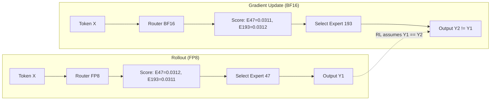
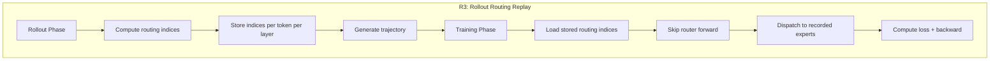

某 309B MoE 模型做 Agentic RL 训练，reward 上升但比预期慢 30%。排查发现一个隐蔽问题：rollout 阶段（FP8）和梯度更新阶段（BF16）对同一个 token 选择了不同的 expert——MoE 的离散路由决策让浮点精度差异变成了路径分歧。修复只需 50 行代码：记录 rollout 时的路由索引，训练时直接重放。

---

## 1. RL 训练的两阶段结构

RL 训练（无论 PPO、GRPO 还是 REINFORCE）每个 step 分两个阶段：

1. **Rollout**：用当前策略生成 trajectory（推理模式，追求速度）
2. **Gradient Update**：在这些 trajectory 上计算 loss 并反向传播（训练模式，追求精度）

核心假设：梯度更新阶段对 trajectory 的评估，必须与 rollout 阶段生成 trajectory 时的策略**完全一致**。否则 importance sampling ratio $\rho = \pi_\text{new}(a\|s) / \pi_\text{old}(a\|s)$ 的分母就是错的，梯度方向被污染。

对 Dense 模型，这个假设自然成立——同样的权重、同样的输入，前向传播结果相同（数值噪声只影响连续值，不改变决策边界）。

对 MoE 模型，这个假设**静默失效**。

---

## 2. 离散路由：连续噪声变成不连续跳变

某 309B MoE 的路由配置：256 routed experts，top-8 selection。Router 是一个线性层，对每个 token 产出 256 维 gating score，取 top-8 作为激活的 expert。

问题出在精度差异：

| 阶段 | 精度模式 | 原因 |
|------|---------|------|
| Rollout | FP8 inference | 生成速度是 RL 瓶颈，FP8 快 2-4x |
| Gradient Update | BF16/FP32 training | 梯度精度决定收敛质量 |

FP8 和 BF16 对同一组权重、同一个输入，计算出的 gating score 会有 ~1e-4 量级的差异。对连续输出（如 logits），这种差异可以忽略。但对 top-K selection，这是**离散决策**：

- Rollout（FP8）：expert 47 的 score = 0.0312，expert 193 的 score = 0.0311 → 选 expert 47
- Training（BF16）：expert 47 的 score = 0.0311，expert 193 的 score = 0.0312 → 选 expert 193

Score 差异不到 0.01%，但 token 走了完全不同的 expert pathway。这不是噪声——这是路径分歧。

---

## 3. 为什么这个 bug 是静默的

三个原因让它难以被发现：

1. **RL 本身方差大**。Reward 曲线波动剧烈，30% 的收敛减速很容易归因于 hyperparameter 或数据质量
2. **不是所有 token 都受影响**。只有 gating score 接近的 token 会 flip——可能只占 5-15%，但足以污染梯度方向
3. **模型仍然在学**。错误的 $\rho$ 不会让训练崩溃，只是让 policy gradient 的方向偏了，表现为 reward ceiling 偏低

检测方法：在 training 阶段同时用 FP8 和 BF16 计算 routing，统计 expert selection 不一致的比例。如果 > 2%，问题显著。Expert 数量越多（384 experts 的某 1T MoE 模型），top-K 中出现 tie 的概率越高，flip 越频繁。

---

## 4. R3：Rollout Routing Replay

解法极简：

1. **Rollout 时**：记录每个 token 在每个 MoE 层的 expert 选择结果（integer indices）
2. **Training 时**：跳过 router forward，直接用记录的 indices 做 expert dispatch

实现约 50 行代码改动：在 MoE forward 中加一个 `routing_indices` 参数，非 None 时跳过 gating 计算直接 dispatch。

---

## 5. 成本分析：零开销

| 维度 | 开销 |
|------|------|
| 存储 | 每 token 每层 8 个 int16 index = 16 bytes/token/layer。32 层 MoE → 512 bytes/token。对比 KV cache 的 MB 级占用，可忽略 |
| 计算 | 省掉了 training 阶段的 router forward pass（256 维线性层 + top-K sort）→ 微小加速 |
| 实现 | ~50 行代码，不改变模型架构 |
| 净效果 | 略微加速 + 消除精度不一致 |

---

## 6. 为什么不直接统一精度？

两个方向都不可行：

**方案 A：Rollout 也用 BF16**
- 推理速度降低 2-4x
- RL 训练的瓶颈本来就是 rollout（生成 trajectory 是 autoregressive，不可并行）
- 训练吞吐直接腰斩

**方案 B：Training 也用 FP8**
- 梯度精度下降 → 收敛质量退化
- FP8 training 目前只在特定算子上稳定，全链路 FP8 backward 不成熟

R3 的精妙之处：让两个阶段各用最优精度，只在离散决策点（routing）强制一致。连续值（activation、gradient）的精度差异不影响正确性，离散选择的不一致才致命。

---

## 7. 适用范围与工程细节

**谁会遇到这个问题：**
- 任何 MoE + RL 训练组合（GRPO、PPO、REINFORCE、DPO with reference model）
- Rollout 和 training 使用不同精度（几乎所有高效 RL 实现都这样做）
- Expert 数量越多越严重（256 → 384 experts，flip 率显著上升）

**Seamless Rollout Engine 让问题更突出：**
- 连续 rollout + 异步 reward 计算意味着 rollout 和 training 在时间上重叠
- 同一组权重可能同时在 FP8（rollout）和 BF16（training）下执行
- 没有 R3，这种架构下 routing inconsistency 几乎必然发生

**实际部署：**
- 某 309B MoE（256 experts, 15B active）：Agentic RL on 100K+ GitHub issues
- 某 1T MoE（384 experts, 42B active）：同样采用 R3

---

## 8. Engineering Lessons

1. **离散决策对数值噪声不鲁棒**。任何涉及 argmax/top-K 的组件，在混合精度环境下都需要审计一致性
2. **RL 的 on-policy 假设比看起来更脆弱**。Dense 模型天然满足，MoE 需要显式保障
3. **Silent degradation 是最危险的 bug**。不 crash、不 NaN，只是"没那么好"——最容易被归因为其他问题
4. **修复成本和问题严重性不成正比**。50 行代码解决 30% reward gap，ROI 极高

---

## 参考

- R3 (Rollout Routing Replay) 技术：MiMo-V2 Technical Report, Section 3.2.2
- Seamless Rollout Engine：同上，Section 3.2.1
- MoE routing precision analysis：DeepSeek-V3 Technical Report, Appendix on FP8 training
