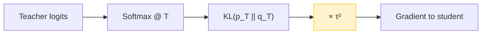
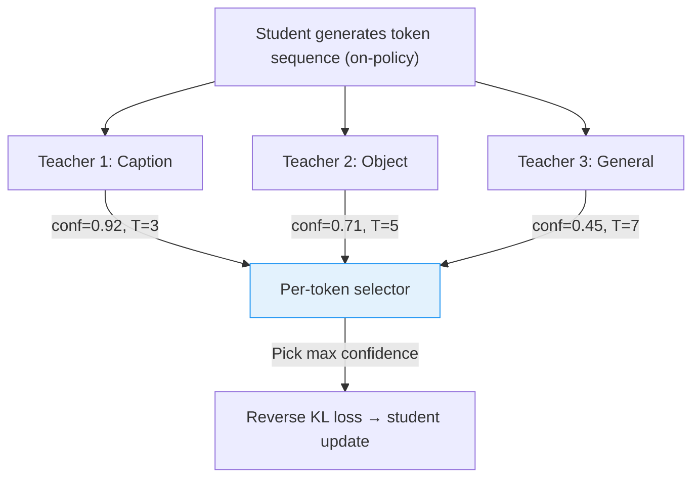

某 3B 多模态模型的多教师蒸馏实验，统一用 T=6 做 caption 教师的温度，F1 涨了 0.029。第三天加入更多教师后，caption 质量突然掉了 0.985——"budget dilution" 让每个教师的信号都被稀释了。这篇文章记录从 uniform temperature 到 per-teacher adaptive temperature 的完整实验路径，以及为什么温度设计本质上是一个 RL 问题。

---

## 为什么温度在蒸馏中如此关键

Knowledge distillation 的核心操作是让 student 拟合 teacher 的 soft label。温度 $T$ 控制 softmax 输出的 "软化程度"：

$$p_i = \frac{\exp(z_i / T)}{\sum_j \exp(z_j / T)}$$

三个极端情况：

| 温度 | 效果 | 问题 |
|------|------|------|
| $T=1$ | Teacher logits 原样输出，分布尖锐 | Student 只学 top-1，丢失 dark knowledge |
| $T \approx 4\text{-}8$ | 分布软化，次优 token 的概率关系暴露 | 需要 $\tau^2$ 梯度校正 |
| $T \to \infty$ | 分布趋近 uniform | 教师信号退化为噪声 |

单教师场景下，$T$ 通常是个 grid search 的 hyperparameter。但 multi-teacher 场景引入了新维度：**不同教师的置信度分布天然不同**。Caption 教师对 next-token 极度确信（entropy 低），而 general reasoning 教师的输出分布更平坦。用同一个 $T$ 处理所有教师，必然有人被 over-smooth 或 under-smooth。

---

## Day 1：Uniform T=6 的初步成功

实验设置：某头部实验室的 3B 多模态 student，单 caption 教师，从 T=1 baseline 切换到 T=6。

**结果：**

- Caption task F1: **+0.029** over baseline (T=1)
- Object recognition accuracy: 持平（无回归）
- Training loss 收敛速度略快（soft label 提供更平滑的 gradient landscape）

T=6 的直觉是对的：caption 教师在 T=1 下过于 "独断"，student 只能做 hard imitation 而非学习 token 之间的语义关系。升温后，teacher 暴露了 "第二选择" 和 "第三选择" 的概率关系，student 获得了更丰富的监督信号。

但问题是：**T=6 对所有教师都是最优的吗？**

---

## Day 2：$\tau^2$ Tradeoff 的发现

第二天的实验聚焦于 loss 数值与实际学习效果的脱节。

KL divergence 在温度 $T$ 下的标准写法带一个 $\tau^2$ scaling：

$$\mathcal{L} = \tau^2 \cdot \text{KL}(p_T \| q_T)$$

其中 $p_T, q_T$ 分别是 teacher 和 student 在温度 $T$ 下的 softmax 输出。

**关键发现**：如果不乘 $\tau^2$，高温下 KL 数值本身会变小（因为两个接近 uniform 的分布之间 KL 天然小），给出 "loss 很低 = 学得很好" 的假象。实际上 student 什么也没学到——你不能从 uniform noise 中提取有用梯度。

$\tau^2$ 的作用是 **梯度校正**：保证不同温度下 loss 对 logits 的梯度量级一致。没有它，高温教师会产生微弱梯度，在 multi-teacher 混合中被低温教师淹没。

**教训**：Loss 曲线下降不等于 student 在进步。必须看 downstream task metric。

---

## Day 3：Budget Dilution 的惨痛回归

第三天，实验扩展到多教师同时蒸馏：caption 教师 + object detection 教师 + general instruction 教师，总 compute budget 不变。

**结果让人意外**：

- Caption quality: **-0.985**（严重回归）
- Object recognition: 微涨 +0.01
- General instruction following: 微涨 +0.02

Caption 教师贡献了最多改进的 Day 1 结果，在多教师场景下被彻底稀释了。

**Root cause 分析——Budget Dilution**：

固定 batch 中，每条样本只能被一位教师 "教"。三个教师平分 budget 后，caption 教师只获得 ~33% 的原始 token exposure。而 caption 是一个需要高频 repetition 才能学好的任务（类似语言模型的 rare word 问题），token 减少直接导致 underfitting。

这不是温度问题，而是 **资源分配问题**——但温度设计是解法的一部分。

---

## Per-Teacher Adaptive Temperature 方案

Budget dilution 的 fix 需要两个组件协同工作：

### 1. Per-Teacher Temperature

每个教师根据自身置信度分布获得独立温度：

- **Caption 教师**（高置信度，低 entropy）→ $T = 3\text{-}4$，保留精确信号
- **General instruction 教师**（低置信度，高 entropy）→ $T = 6\text{-}8$，允许 student 探索
- **Object detection 教师**（中等置信度）→ $T = 5$

温度通过 held-out validation set 上的 domain-specific metric 来 tune：对每个教师，sweep $T \in [2, 10]$，选择使 student 在该教师 domain 上表现最好的 $T$。

### 2. Per-Token Teacher Selection

不再让所有教师同时提供信号，而是在每个 token position 只选最自信的教师：

$$\text{teacher}^*(t) = \arg\max_k \; \max_v \; p_k(v | x_{<t})$$

只有被选中的教师的 KL loss 被 backprop。这避免了 "多个教师互相冲突" 的梯度混乱。

### 3. Reverse KL 防止 Mode Covering

Multi-teacher 场景下用 forward KL（$\text{KL}(p_T \| q_S)$）会让 student 试图覆盖所有教师的所有 mode，导致 "什么都会一点但什么都不精" 的 mediocre 模型。

Reverse KL（$\text{KL}(q_S \| p_T)$）让 student 选择性地 mode-seek，只追踪教师最确信的区域。配合 per-token teacher selection，student 在每个位置只需追踪一个清晰的信号。

---

## OPD = RL 等价性：为什么温度设计是 reward shaping

2026 年的 G-OPD 工作给出了一个关键理论结果：

> On-policy distillation 的梯度 $\equiv$ KL-constrained RL 的 policy gradient。

具体地，teacher log-probability $\log p_T(y\|x)$ 可以视为 reward function，而蒸馏过程等价于：

$$\max_\theta \; \mathbb{E}_{y \sim q_\theta} [\log p_T(y|x)] - \beta \cdot \text{KL}(q_\theta \| q_{\text{ref}})$$

这个等价性的实践意义：

1. **温度 = reward scaling**：调高 $T$ 等价于压缩 reward 的 dynamic range，让 policy 更 explorative
2. **所有 RL tricks 适用**：baseline subtraction、GAE、PPO clip 可以直接用在 OPD 上
3. **Student 可以超越 teacher**：通过 exploration，student 可能发现 teacher 从未到达的高 reward 区域（这在 ExOPD 中被实验验证）

对多教师场景的启示：per-teacher temperature 本质上是 **per-task reward shaping**。Caption 教师的 reward 需要保持 sharp（低 T = 高 reward discrimination），而 general 教师的 reward 可以更 smooth（高 T = 鼓励 exploration）。

---

## Engineering Lessons

**1. $\tau^2$ gradient correction 是非可选的。** 没有它，multi-teacher 场景下高温教师的梯度会被淹没，你以为它在工作但实际上它是沉默的。

**2. Loss 下降 ≠ 学到东西。** 高温 KL 天然小，必须看 downstream metric。建立 eval-driven 而非 loss-driven 的实验流程。

**3. Budget dilution 是多教师蒸馏的首要工程敌人。** 在增加教师之前，先问："我的 compute budget 能否支撑每个教师的最低有效曝光量？" 如果不能，per-token teacher selection 比 uniform mixing 好得多。

**4. Per-teacher temperature 通过 validation metric 搜索，不要手调。** 教师的置信度分布会随训练进度变化，手调的 T 很快过期。

**5. 把蒸馏当 RL 来思考。** Temperature 是 reward shaping，teacher selection 是 reward switching，budget allocation 是 sample efficiency。RL 的工程直觉（不要同时改太多东西、先稳定 reward 再优化 policy）全部适用。

---

## References

1. **G-OPD** (2026) — Generalized On-Policy Distillation，证明 OPD gradient = KL-constrained RL policy gradient
2. **ExOPD** — Exploratory On-Policy Distillation，student 通过 exploration 超越 teacher 的实验验证
3. **GKD** (Agarwal et al., 2024) — Generalized Knowledge Distillation，on-policy + reverse KL 的组合
4. **MiniLLM** (Gu et al., 2024) — 首次在 LLM 蒸馏中系统使用 reverse KL
5. **Hinton et al., 2015** — Knowledge Distillation 原始论文，$\tau^2$ scaling 的来源
