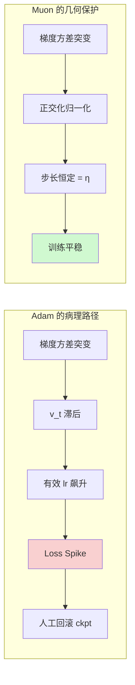
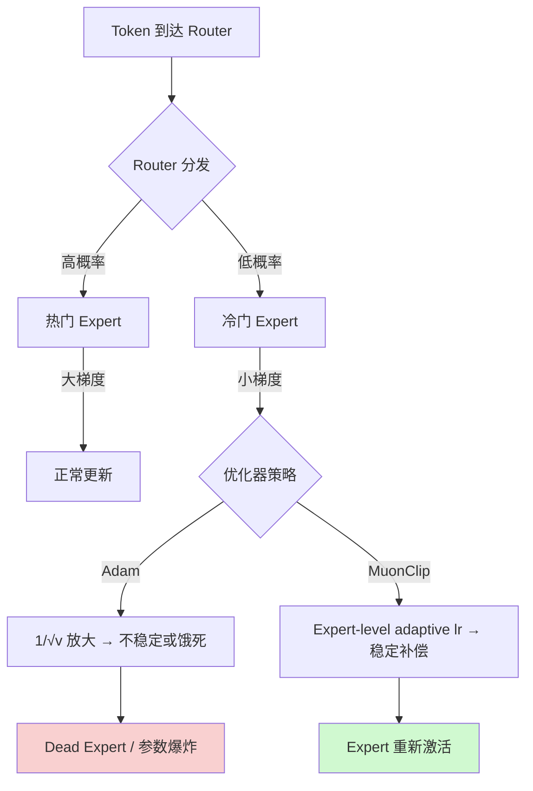

两份优化器配置，同一个 3B 模型底座，一份跑纯文本预训练，一份跑多模态对齐。把它们的超参数差异摊开来看，就能直观理解为什么 Adam 在大规模训练中需要如此多的"场景特化"——以及为什么业界正在转向 Muon。

---

## 一个 3B 模型的两套优化器配置

某 3B 模型的纯文本预训练基线：

```yaml
optimizer: AdamW
beta1: 0.9
beta2: 0.95
epsilon: 1e-8
lr: 3e-4
weight_decay: 0.1
grad_clip: 1.0
precision: bf16
warmup_steps: 2000
```

同一底座的多模态变体（文本 + 视觉）：

```yaml
optimizer: AdamW
beta1: 0.9
beta2: 0.98      # ← 变大
epsilon: 1e-6    # ← 变大两个数量级
weight_decay: 0.05  # ← 减半
grad_clip: 1.0
precision: bf16
warmup_steps: 0     # ← 不做 warmup
```

三个关键差异背后各有原因：

**beta2: 0.95 → 0.98**。视觉编码器（ViT）的梯度方差显著高于纯文本 Transformer——图像 patch 之间的梯度分布远比 token embedding 更不稳定。更大的 beta2 意味着对梯度平方的 EMA 平滑窗口从 ~20 步拉长到 ~50 步，压住方差估计的抖动。

**epsilon: 1e-8 → 1e-6**。视觉梯度中存在更多接近零的分量（稀疏激活区域）。1e-8 的 epsilon 在除以 $\sqrt{v_t}$ 时会被放大到不合理的有效学习率；1e-6 相当于给分母加了一个更厚的"安全垫"。

**weight_decay: 0.1 → 0.05**。ViT 参数需要更大的自由度来适应跨模态对齐——过强的权重衰减会压制视觉编码器对新分布的适应能力。

这些调整是经验驱动的 patch。**问题的本质是 Adam 的逐元素自适应机制无法统一处理梯度分布差异巨大的异构参数。**

---

## Adam 在万亿参数尺度的三个结构性失效

### 1. 方差估计滞后 → Loss Spike

Adam 的核心更新：

$$\Delta \theta_t = -\frac{\eta}{\sqrt{\hat{v}_t} + \epsilon} \cdot \hat{m}_t$$

$v_t$ 使用 beta2 做 EMA。当 beta2=0.95 时，有效窗口 ~20 步；当 beta2=0.999 时，~1000 步。训练进入 loss landscape 高曲率区域时，$v_t$ 来不及反映真实梯度幅度，有效学习率瞬间飙升——这是 loss spike 的主要诱因。

### 2. 更新方向低秩坍缩

实验观测表明 Adam 的更新矩阵 $\Delta W$ 呈高度低秩特征：有效更新集中在少数方向，参数空间大部分维度未被充分利用。

### 3. 参数间更新幅度极端不均匀

逐元素除以 $\sqrt{v_t}$ 导致：梯度长期很小的参数获得极大有效学习率，梯度较大的参数被过度压制。Attention 层不同 head 之间的梯度分布相差数个数量级，Adam 加剧了这种不均匀性。



---

## Muon：丢掉幅度，只留方向

### 核心数学

Muon（Momentum Orthogonalized Update, [arXiv:2502.16982](https://arxiv.org/abs/2502.16982)）的设计哲学：与其用启发式的逐元素缩放来适应梯度幅度分布，不如直接将幅度信息丢掉，只保留方向。

对权重矩阵 $W \in \mathbb{R}^{m \times n}$，更新三步走：

**Step 1: 动量累积**

$$M_t = \beta \cdot M_{t-1} + G_t$$

**Step 2: 正交化**

对 $M_t$ 做 SVD 分解 $M_t = U\Sigma V^T$，取正交投影：

$$\tilde{M}_t = UV^T$$

所有奇异值统一为 1——保留方向结构，抹去幅度差异。

**Step 3: 更新**

$$W_{t+1} = W_t - \eta \cdot \tilde{M}_t$$

### Newton-Schulz 迭代：避免显式 SVD

实际实现中用 Newton-Schulz 迭代近似正交投影：

$$X_0 = \frac{M_t}{\|M_t\|_F}, \quad X_{k+1} = X_k \cdot \frac{3I - X_k^T X_k}{2}$$

5 次迭代即达到足够精度，额外计算开销约为前向传播的 2-5%。

### 为什么正交化解决了 Adam 的三个问题

| Adam 的病理 | Muon 的几何解 |
|------------|--------------|
| $v_t$ 滞后 → 有效 lr 飙升 | 正交化后 $\|\tilde{M}_t\|_F = \sqrt{\min(m,n)}$，步长仅由 $\eta$ 控制 |
| 更新低秩坍缩 | SVD 投影保证更新近似满秩，每个方向都在"干活" |
| 参数间幅度不均 | 矩阵级正交化天然跨参数均匀化 |
| 多模态需要不同 beta2/epsilon | 正交化对梯度分布不敏感，无需场景特化 |

---

## MuonClip：让 Muon 跑通万亿参数 MoE

某 1T 参数 MoE 模型（[arXiv:2507.20534](https://arxiv.org/abs/2507.20534)）在训练中面临三大 MoE 特有挑战，催生了 MuonClip 方案。

### MoE 训练的三重困境

**Router 梯度不稳定**：MoE 的 expert 选择本质是离散决策（top-k gating），每个 token 只激活少量 expert，router 梯度信号极度稀疏且噪声大。

**Expert 坍缩（Dead Expert）**：热门 expert 获得多数梯度更新 → 变得更强 → 被选中更多 → 正反馈循环。冷门 expert 梯度饥饿，逐渐"死亡"。

**Loss Spike**：Router 梯度的高方差 + Expert 负载不均的振荡，共同制造训练中的突发不稳定。

### MuonClip 的三个核心适配

**1. Router / Expert 分离裁剪**

$$G_{\text{router}}^{\text{clip}} = \text{clip}(G_{\text{router}}, \tau_r), \quad G_{\text{expert}}^{\text{clip}} = \text{clip}(G_{\text{expert}}, \tau_e)$$

$\tau_r$ 通常设为 $\tau_e$ 的 0.1-0.3 倍，匹配 router 梯度天然更高的方差。

**2. Expert-Level 自适应学习率**

$$\eta_i = \eta_{\text{base}} \cdot \frac{\bar{g}_{\text{global}}}{\bar{g}_i + \epsilon}$$

每个 expert 维护独立的梯度范数 EMA $\bar{g}_i$。冷门 expert 的 $\bar{g}_i$ 小 → 有效学习率被放大 → 防止梯度饥饿。

**3. 正交化作用域控制**

Router 矩阵（$d_{\text{model}} \times n_{\text{experts}}$）尺寸太小，正交化意义有限且可能引入噪声——只对 Expert 内部 FFN 权重做正交化。

### 实战效果

该 1T MoE 模型在 2T token 训练中的对比：

| 指标 | AdamW Baseline | MuonClip |
|------|---------------|----------|
| Loss spike 次数（> 3σ） | ~45 次 | ~8 次 |
| 最大 spike 幅度 | 0.35 | 0.08 |
| 需人工干预的 spike | 12 次 | 0 次 |
| Dead expert 比例 | ~15% | <2% |
| 平均恢复时间 | ~2000 steps | ~200 steps |

**Loss spike 频率降低 80%+**，剩余 spike 幅度小到可自动恢复，无需回滚 checkpoint。Dead expert 比例从 ~15% 降至 <2%，不需要额外的 expert balancing loss 或定期重初始化。



---

## 某头部开源系列的 Muon 实践

某头部开源系列（[arXiv:2412.19437](https://arxiv.org/abs/2412.19437)）最新一代模型（Flash 和 Pro 两个版本）同时使用了 Muon 和 AdamW 的混合策略：

```yaml
# 2D 权重矩阵（Attention/FFN projections）
optimizer: Muon
momentum: 0.95

# 1D 参数（Embedding, LayerNorm, Bias）
optimizer: AdamW
beta1: 0.9
beta2: 0.95
epsilon: 1e-20  # ← 极小值，几乎不做截断
```

几个值得注意的细节：

- **epsilon = 1e-20**：比常规的 1e-8 小了 12 个数量级。这意味着 AdamW 部分几乎完全信任 $\sqrt{v_t}$ 的缩放，不做人为截断——只有当参数完全没有梯度时才会触发保护。这是对 1D 参数（embedding/norm）梯度分布非常有信心的表现。
- **Muon momentum = 0.95**：与 Adam 的 beta1=0.9 形成对比，稍大的动量系数使正交化的方向更加平滑。
- **MTP loss weight 动态衰减**：Multi-Token Prediction 的辅助 loss 权重初始为 0.3，当主学习率开始 decay 阶段时衰减至 0.1。这避免了训练后期辅助任务对主任务的干扰。

---

## HyperP：跨规模超参迁移的第一个统一框架

### 问题

大模型训练的超参搜索代价极高。150M proxy 模型上调好的学习率能否直接迁移到 7B/70B？传统做法下，最优学习率随宽度 $d$、深度 $L$、训练 token 数 $T$、MoE 粒度的变化而剧烈漂移。

### Frobenius-Sphere + Muon 的天然契合

HyperP（[arXiv:2603.28743](https://arxiv.org/abs/2603.28743)）提出 Frobenius-sphere 参数化：

$$W = \gamma \cdot \frac{\hat{W}}{\|\hat{W}\|_F}$$

在此参数化下，Muon 的正交化更新保证每步移动的"角度"一致——不同宽度的模型，每步更新改变权重的"相对比例"相同。

### 核心发现

**最优学习率的 data-scaling 指数 = 0.32**——与 AdamW 下的指数相同。这意味着 Muon 没有引入额外的 token-scaling 复杂度，迁移规则同样简洁：

$$\eta(T) \propto T^{-0.32}$$

**SqrtGate 机制**：当改变 MoE 粒度（expert 数量/大小比例）时，输出 RMS 会漂移。HyperP 提出 SqrtGate 保持输出 RMS 恒定，使学习率迁移在不同 MoE 配置间同样成立。

**迁移精度**：从 150M 迁移到 7B，最优学习率误差控制在 5% 以内。这是首个覆盖宽度、深度、token 数、MoE 粒度四个维度的统一迁移框架。

---

## 工程取舍：更好的架构 ≠ 更好的工程

某模型（0.6B 规模）的结构实验提供了一个重要提醒：

| 指标 | v3.0 结构 | v3.5 结构 | 变化 |
|------|----------|----------|------|
| Training loss | 2.107 | 2.079 | -0.028 |
| Eval 提升子集数 | — | 34/35 | 97% |
| 单步迭代时间 | 12.09s | 38.32s | +3.17× |

v3.5 架构在 loss 和 eval 上全面优于 v3.0，34/35 个评测子集获得提升。但单步迭代时间从 12.09s 涨到 38.32s——3.17 倍的计算开销。

**这意味着**：在固定算力预算下，v3.5 跑 1 步的时间 v3.0 能跑 3.17 步。如果 v3.0 在 3.17 倍 token 训练下的最终性能反超 v3.5 的 1x token 结果，那"更好的架构"实际上是亏的。

同样的逻辑适用于优化器选择——Muon 的 Newton-Schulz 迭代增加 2-5% 计算开销，但换来的是 80%+ loss spike 减少和 dead expert 比例从 15% 降至 2%。这个 trade-off 在万亿参数训练中是极度划算的。

---

## 实践指南

### 何时从 Adam 切换到 Muon

| 场景 | 推荐 |
|------|------|
| 参数 < 1B，token < 100B | AdamW 足够 |
| 参数 > 1B，token > 500B | Muon 稳定性优势开始显现 |
| MoE 架构 | 必须用 MuonClip 变体 |
| 多模态训练 | Muon 免去 beta2/epsilon 调参 |
| 超参迁移需求 | Frobenius-sphere + Muon + HyperP |

### 超参起点

```yaml
# Muon 部分（2D 权重）
momentum: 0.95
lr: Adam_lr × 3~5  # 正交化抹平幅度，需更大 lr 补偿

# AdamW 部分（1D 参数）
beta1: 0.9
beta2: 0.95
epsilon: 1e-8 ~ 1e-20  # 视训练稳定性调整

# MoE 场景
router_clip: expert_clip × 0.1~0.3
orthogonalize: expert FFN only
```

### 不能用 Muon 的参数

Muon 的正交化只对 2D 权重矩阵有意义。以下参数仍需 AdamW：
- Embedding 矩阵（虽然是 2D，但行代表独立 token，正交化会破坏语义结构）
- LayerNorm 的 scale/bias（1D）
- Router 的小矩阵（尺寸太小）

---

## 总结

从 Adam 到 Muon 的演进，本质是从 "element-wise adaptive" 到 "matrix-level geometric" 的范式转换：


核心 takeaway：
- Adam 的逐元素自适应在异构参数（多模态/MoE）下需要大量场景特化
- Muon 通过矩阵级正交化，用 2-5% 额外计算换来了对梯度分布的鲁棒性
- MuonClip 在万亿参数 MoE 上将 loss spike 频率降低 80%+，dead expert 比例降至 <2%
- HyperP 证明 Muon + Frobenius-sphere 的最优学习率 data-scaling 指数与 AdamW 相同（0.32），迁移规则统一且简洁

当模型规模持续增长、训练稳定性成为核心瓶颈时，几何视角的优化方法正在成为大模型训练的标准配置。

---

## References

1. Jordan, K. et al. "Muon: An optimizer for hidden layers in neural networks." [arXiv:2502.16982](https://arxiv.org/abs/2502.16982) (2025).
2. Kimi Team. "Kimi K2 Technical Report." [arXiv:2507.20534](https://arxiv.org/abs/2507.20534) (2025).
3. Yang, G. et al. "HyperP: Hyperparameter Transfer across Model Scales with Frobenius-Sphere Parametrization." [arXiv:2603.28743](https://arxiv.org/abs/2603.28743) (2026).
4. DeepSeek-AI. "DeepSeek-V3 Technical Report." [arXiv:2412.19437](https://arxiv.org/abs/2412.19437) (2024).
