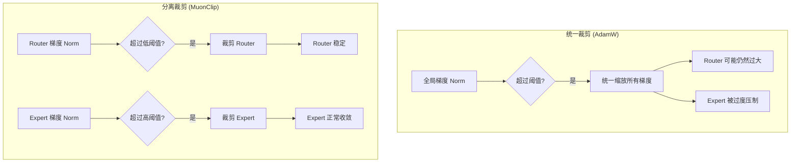
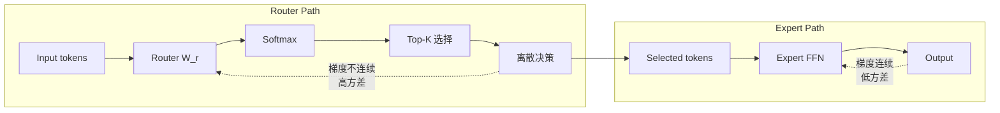

某 1T 参数 MoE 模型训练中 loss spike 频繁出现。换了优化器之后，spike 频率直降 80%。核心 insight 极其简单：Router 梯度和 Expert 梯度的统计特性完全不同，不应该用同一个裁剪阈值。

这篇文章从优化器视角分析 MoE 训练不稳定性的根源，以及 MuonClip 如何通过三个针对性设计解决这个问题。

---

## MoE 训练的三重不稳定性

MoE 架构的训练不稳定性并非单一原因，而是三个相互作用的 failure mode 叠加：

**1. Router 梯度不稳定**

Expert selection 本质上是离散操作（top-K），梯度噪声大、方差高。Token 在 selection boundary 附近时，微小的权重变化可能导致完全不同的 routing 决策。

**2. Expert collapse**

部分 expert 被过度使用（越用越强），其余 expert 逐渐变成 "dead expert"（不被选中 → 不更新 → 更不被选中）。这是一个正反馈死循环。

**3. Loss spike**

训练过程中 loss 突然急剧上升。通常由 Router 梯度的异常波动触发，导致 routing 决策大幅震荡，进而影响所有 expert 的训练。

三者互为因果：Router 不稳定 → 路由震荡 → expert 利用率失衡 → 部分 expert collapse → 有效模型容量下降 → loss spike。

---

## 为什么 AdamW 在 MoE 上失效

AdamW 的设计假设是：**所有参数的梯度来自同一个统计分布**。这对 dense model 基本成立，但对 MoE 完全不成立。

MoE 中存在两类梯度统计特性截然不同的参数：

| 维度 | Router 权重 | Expert 权重 |
|------|------------|------------|
| 梯度来源 | Gating function (softmax + top-K) | 标准 FFN backprop |
| 梯度特性 | 稀疏、高方差、存在突变 | 稠密、平滑、幅值稳定 |
| 异常值频率 | 高（boundary tokens） | 低 |

当我们对整个模型做 unified gradient clipping 时，问题出现了：

- Router 偶发的梯度尖峰主导了全局梯度 norm
- Clipping 被 Router 触发
- Expert 梯度被不必要地截断 → 收敛变慢
- 如果放松阈值来适应 Expert → Router 的尖峰不被裁剪 → 触发 loss spike

这是一个两难：**同一个阈值无法同时满足两种截然不同的梯度分布**。

---

## MuonClip 的三个针对性设计

### 设计一：分离式梯度裁剪

最关键的 insight——对 Router 和 Expert 使用不同的 clipping threshold：

- **Router：激进裁剪**（低阈值）—— 抑制路由震荡
- **Expert：宽松裁剪**（高阈值）—— 允许正常收敛速度

仅这一项改动，loss spike 频率就降低约 50%。

### 设计二：动量正交化（继承自 Muon）

Muon（Momentum Orthogonalized Update）的核心机制：每次梯度更新相对于近期更新历史做正交化处理。

效果：
- 参数更新在权重空间中分布更均匀
- 避免 "repeated updates in same direction" —— 这正是 expert collapse 的直接原因
- 正交化天然迫使优化器探索新方向，有助于激活 dead expert

### 设计三：Expert 级自适应学习率

根据 expert 的实际使用频率动态调整学习率：

- **低利用率 expert：提高学习率** —— 鼓励被选中、加速追赶
- **高利用率 expert：降低学习率** —— 防止 overfitting、给其他 expert 机会

调整依据是 expert selection frequency 的 running average。结果：dead expert 比例显著下降，expert 利用率分布更均匀。

---

## Router 与 Expert 梯度为何本质不同

从计算图角度看两者的梯度来源：

**Router 梯度：**

$$\nabla_{\text{router}} = \frac{\partial \mathcal{L}}{\partial g} \cdot \frac{\partial g}{\partial W_r}$$

其中 $g$ 是 gating function（softmax + top-K）。Top-K 操作引入了不连续性——在 selection boundary 附近的 token 产生极大或零梯度，取决于它是否被选入 top-K。

这意味着 Router 梯度具有 heavy-tail 分布：大多数时候梯度正常，但偶尔出现量级远超均值的尖峰。

**Expert 梯度：**

标准 FFN backpropagation，梯度与输入 activation 幅值成正比，平滑且有界。

**混合的灾难：**

将这两种分布的梯度混入同一个 norm 计算，Router 的偶发尖峰主导 norm → clipping 由 Router 触发 → Expert 梯度被不必要地截断。这就是 unified clipping 在 MoE 上失效的根本原因。

---

## 1T 规模验证与交叉验证

某头部实验室在 1T 参数 MoE 上的结果：

| 指标 | AdamW baseline | MuonClip | 改善 |
|------|---------------|----------|------|
| Loss spike 频率 | 基准 | 降低 80%+ | 显著 |
| 收敛速度 | 基准 | 更快（同 token 数下 loss 更低） | 明显 |
| Expert 利用率分布 | 不均匀 | 更均匀 | 显著 |
| Dead expert 比例 | 较高 | 大幅降低 | 显著 |

独立验证：DeepSeek-V4 同样采用了 Muon 变体，得出了一致的结论——分离式梯度处理对 MoE 训练稳定性有决定性影响。

---

## Dead Expert 问题与自适应学习率

Dead expert 是 MoE 训练中最棘手的问题之一。一旦某个 expert 长期不被选中，其权重不更新，与其他 expert 的差距越来越大，形成不可逆的退化。

传统方案：
- Load balancing loss（辅助损失强制均匀分配）—— 有效但影响模型质量
- Expert dropout / random routing —— 增加噪声，训练不稳定

MuonClip 的自适应学习率方案更优雅：

- 不干预 routing 决策本身
- 仅调整被选中后的更新幅度
- 低利用率 expert 每次被选中时"学得更多"
- 配合正交化，确保这些更大的更新方向是有意义的（而非重复已有方向）

这相当于给 dead expert 一个"追赶机制"而非"强制上场机会"。

---

## 工程启示

**1. 参数分组裁剪应成为 MoE 标配**

成本几乎为零（仅需分别计算两个 norm），但收益巨大。任何 MoE 训练框架都应默认支持 Router/Expert 分离裁剪。

**2. Edge MoE 同样适用**

像 Qwen3-30B-A3B（128 experts）这类 edge MoE 模型面临同样的 expert utilization 问题。分离式学习率方案可以直接迁移到小规模 MoE 训练。

**3. Loss spike 频率直接影响训练成本**

在 1T 规模，每次 loss spike 可能需要回滚 checkpoint 并浪费数小时 GPU 时间。降低 80% 的 spike 频率意味着显著降低训练失败成本。

**4. 优化器不是通用的**

AdamW 对 dense model 的成功不能无条件迁移到 MoE。不同的参数角色需要不同的优化策略——这个教训在 MoE 时代尤其重要。

---

## References

1. Kimi K2 Technical Report, [arXiv:2507.20534](https://arxiv.org/abs/2507.20534)
2. Muon: Momentum Orthogonalized Update, [arXiv:2502.16982](https://arxiv.org/abs/2502.16982)
