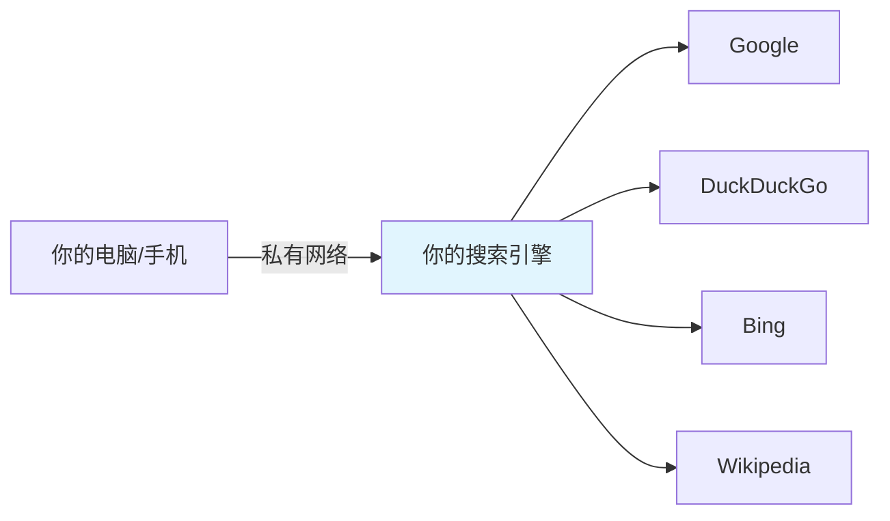

## 这篇文章给谁看

你是产品经理、运营、分析师——不会写代码，但：

- 你有一个 AI 编程助手（Claude Code / Cursor / Windsurf / Codex，任何一个都行）
- 你有一台境外云服务器（没有的话，AI 也能帮你买）
- 你想拥有一个**完全属于自己的、无广告、无追踪、带 API 的搜索引擎**

**你要做的事只有两件**：复制一段 Prompt 给 AI → 打开浏览器验收结果。

---

## 你将得到什么



| 和商业产品对比 | Google | Perplexity Pro | 你的私有搜索 |
|---------------|--------|---------------|-------------|
| 隐私 | 全量追踪 | 存储对话 | 零追踪零日志 |
| 广告 | 满屏 | 无 | 无 |
| 月费 | 免费但交数据 | $20 | ¥0（服务器除外） |
| JSON API | 付费 | 付费 | 免费无限调用 |
| 可控性 | 不可 | 不可 | 想改就改 |

---

## 全流程：复制一段 Prompt，然后验收

### 🟢 情况 A：你已经有一台境外服务器，且 AI Agent 能 SSH 上去

把下面这一整段复制，粘贴给你的 AI Agent（Claude Code / Cursor / Windsurf 均可）：

````markdown
帮我在服务器上部署一个 SearXNG 私有搜索引擎，要求：

1. 如果服务器没有 Docker，先帮我装上
2. 在 /opt/services/searXNG/ 下创建以下两个文件并启动容器：

docker-compose.yml:
- 镜像 searxng/searxng:latest
- 端口 8080:8080
- 内存限制 256MB
- 日志轮转 max-size 10m, max-file 3
- restart: unless-stopped
- 时区设为 Asia/Shanghai
- 挂载 ./settings.yml 到 /etc/searxng/settings.yml

settings.yml:
- use_default_settings 模式，只保留 google、bing、duckduckgo、wikipedia 四个引擎
- 开启 JSON API（formats: [html, json]）
- default_lang 设为空字符串（不限制语言，这样英文源质量最高）
- autocomplete 用 duckduckgo
- secret_key 用 openssl rand -hex 32 随机生成
- public_instance: false
- limiter: false（私有实例不需要，开了没 Redis 会疯狂报错）
- request_timeout: 8 秒
- max_request_timeout: 15 秒

3. 启动后帮我验证：
   - 容器在运行（docker ps 能看到 searxng）
   - 搜索可用：curl 'http://localhost:8080/search?q=hello&format=json' 能返回结果
   - 告诉我从我本机浏览器怎么访问到这个搜索引擎（给我具体地址或 SSH 隧道命令）

4. 最终把访问地址告诉我，我要在浏览器里打开它。
````

---

### 🟡 情况 B：你还没有服务器

先把这段发给 AI Agent：

````markdown
帮我买一台最便宜的境外轻量云服务器（阿里云或腾讯云，新加坡或香港区域），
1核1G 内存就够，系统选 Ubuntu 24.04，帮我配好 SSH 免密登录。
配好后告诉我，然后继续帮我在上面部署 SearXNG 搜索引擎（我下一条消息给你部署要求）。
````

等 Agent 告诉你服务器配好了，再发情况 A 的那段 Prompt。

---

## 验收：打开浏览器，做这一件事

AI Agent 完成后会给你一个地址，格式类似：

- `http://100.x.x.x:8080`（如果用了 Tailscale）
- `http://localhost:8080`（如果用了 SSH 隧道）
- `http://你的公网IP:8080`（如果直接开了端口）

**在浏览器地址栏打开它。**

✅ **验收通过的标志**：

1. 看到一个干净的搜索框页面（没有广告、没有登录）
2. 在搜索框里输入任何词，点搜索
3. 出现来自多个引擎的搜索结果

就这样。如果看到了搜索结果——恭喜，你的私人搜索引擎已经上线了。

---

## 验收没通过？把这段发给 AI

如果浏览器打不开、搜不出结果、或看到报错，不用自己排查。复制这段给 AI Agent：

````markdown
我的 SearXNG 搜索引擎有问题，帮我排查并修复：
1. 检查容器状态：docker ps --filter name=searxng
2. 看最近日志：docker logs searxng --tail 50
3. 测试搜索：curl 'http://localhost:8080/search?q=test&format=json'
根据输出帮我修好它，修好后再告诉我一次访问地址。
````

---

## 搞定之后，三个进阶玩法

部署成功后你可能会想做这些事。每个都是一段 Prompt：

### 把它设为浏览器默认搜索引擎

在 Chrome/Edge 设置 → 搜索引擎 → 管理搜索引擎 → 添加：

```
名称：My Search
关键字：s
URL：http://你的地址:8080/search?q=%s
```

之后地址栏输入 `s` + 空格 + 关键词，直接走你的私有引擎。

### 让 AI 用你的搜索引擎做深度研究

````markdown
请用我的私有搜索引擎 http://我的地址:8080/search?q=关键词&format=json
搜索"你想研究的主题"，获取前 10 条结果，
逐一阅读每个链接的内容，帮我写一份 500 字的研究摘要。
````

### 在手机上也能用

````markdown
帮我在服务器上装 Tailscale，告诉我怎么在手机上也装 Tailscale 加入同一个网络。
这样我手机浏览器就能直接访问搜索引擎了。
````

---

## FAQ：你可能会问的

**Q: 之后要不要管它？会不会挂？**

不用管。配置了自动重启，服务器重启后搜索引擎也会自动恢复。日志有轮转限制，不会撑爆磁盘。

**Q: 每月多少钱？**

只有服务器的钱。阿里云/腾讯云最低配境外轻量约 ¥24-34/月。搜索引擎本身零成本。

**Q: 安全吗？别人能用我的搜索引擎吗？**

默认只有你能访问（通过 SSH 隧道或 Tailscale 内网）。除非你主动开放端口，否则外人无法使用。

**Q: 能搜中文吗？**

能。配置了 `default_lang: ""`，搜中文关键词自动返回中文结果，搜英文返回英文结果。两边都不耽误。

**Q: 和直接用 Google 搜有什么区别？**

你的搜索同时聚合了 Google + DuckDuckGo + Bing + Wikipedia 的结果，覆盖面更广，而且零追踪。Google 只给你 Google 自己的结果，还会根据你的画像个性化（信息茧房）。

---

## 一句话总结

2026 年，有了 AI Agent，"部署"这件事的门槛已经降到了"说一句话"。你不需要懂 Docker、YAML、端口、SSH——你只需要知道你**想要什么**，然后让 AI 去做。这篇文章里唯一需要你做的事就是：复制 → 粘贴 → 打开浏览器看一眼。
