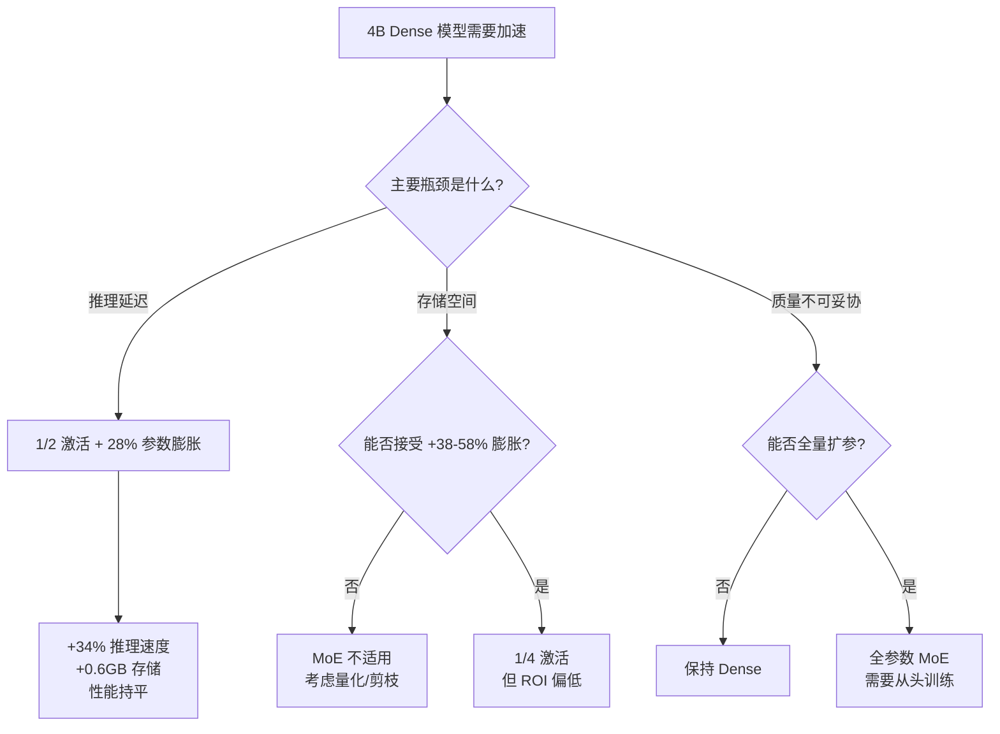

某 4B Dense 模型想要推理加速——把后 16 层 FFN 换成 MoE。Scaling Law 估算的结论出人意料：1/8 激活比直接丢了 17-19% 性能（判死刑），即使 1/2 激活也要把总参数从 4B 扩到 5.2B（+28-33%）才能追平。这笔账到底该怎么算？

## 为什么只换"后半段"？

这个 4B Dense 模型的架构是 32 层、H=2560，但 FFN 维度并不均匀：

- **L0-15**：intermediate=6912，每层 FFN 约 53M params
- **L16-31**：intermediate=12032，每层 FFN 约 92.4M params

后 16 层的 FFN 占了模型参数的大头。更关键的是，这些层已经采用了 SwiftKV（从 layer_idx=16 开始共享 KV cache），KV 维度很小，天然适配 MoE 的 expert routing。前 16 层保持 Dense 不动，attention 层（SWA w=512 + 每 4 层一次 full-attn）完全不受影响。

Partial MoE 的工程动机很简单：**只动最"胖"的部分，收益最大化、风险最小化。**

## 两条 Scaling Law：一条保守，一条乐观

要估算 Dense→MoE 的等效性能，核心公式是：

$$N_{\text{eff}} = N_{\text{active}} \times E^{\gamma}$$

其中 $N_{\text{active}}$ 是每次推理实际激活的参数量，$E$ 是专家数，$\gamma$ 是"专家利用效率指数"。

**Clark et al. 2022**（$\gamma = 0.07$）：在小规模实验上拟合，标准粒度 MoE，结论偏保守——多专家带来的增益极其有限。

**Krajewski et al. 2024**（$\gamma = 0.2$）：在 $10^{22}$-$10^{23}$ FLOPs 规模上验证，考虑了 fine-grained MoE 的效果，结论更乐观——专家数翻倍能带来约 15% 的等效参数提升。

结合 Dense loss scaling（Chinchilla）：

$$L \propto N^{-0.34}$$

可以将"等效参数差距"直接换算成"loss 劣化百分比"。

**两条 scaling law 的预测差距约 5%，刚好 bracket 了真实答案。** 工程决策取平均值即可。

## Result 1：总参数不变（4.0B），不同激活比的性能代价

将后 16 层 FFN（共 92.4M × 16 = 1.478B params）拆成 $E$ 个专家，每次只激活 $1/E$，总参数保持 4.0B 不变。

### Clark 估算（$\gamma = 0.07$，保守）

| 激活比 | 专家数 | Active/layer | 等效模型规模 | Loss 劣化 |
|--------|--------|-------------|-------------|-----------|
| 1/2 | 2 | 46.2M | 2.45B equiv | **+9%** |
| 1/4 | 4 | 23.1M | 2.08B equiv | **+15%** |
| 1/8 | 8 | 11.55M | 1.89B equiv | **+19%** |

### Krajewski 估算（$\gamma = 0.2$，乐观）

| 激活比 | 专家数 | Active/layer | 等效模型规模 | Loss 劣化 |
|--------|--------|-------------|-------------|-----------|
| 1/2 | 2 | 53.1M | 2.52B equiv | **+7.5%** |
| 1/4 | 4 | 30.5M | 2.16B equiv | **+13%** |
| 1/8 | 8 | 17.5M | 1.96B equiv | **+17%** |

**结论：1/8 激活比在两种估算下都丢了 17-19%——这是判死刑的数字。** 即使最乐观的 Krajewski 估算，1/4 也有 13% 的劣化。想在不扩参数的前提下用 MoE 加速，代价远超直觉。

## Result 2：追平原始性能需要多少参数膨胀？

反过来算：要让 partial MoE 模型的 $N_{\text{eff}}$ 等于原始 4.0B Dense，总参数需要扩到多少？

| 激活比 | Clark ($\gamma=0.07$) | Krajewski ($\gamma=0.2$) |
|--------|----------------------|-------------------------|
| 1/2 | 5.1B (+28%) | 4.8B (+20%) |
| 1/4 | 6.3B (+58%) | 5.5B (+38%) |
| 1/8 | 7.9B (+98%) | 6.4B (+60%) |

**实际工程选择：1/2 激活比，总参数扩到 ~5.1-5.3B（+28-33%）。** 这是唯一一个"膨胀可控"的方案。1/4 以上的激活比，参数膨胀已经超过 38%，存储和加载开销开始吃掉推理加速的收益。

## 推理加速实测：5.2B MoE vs 4.0B Dense

采用 1/2 激活方案（总参数 5.2B，每次推理激活约 3.4B）：

| 指标 | Dense 4.0B | MoE 5.2B (1/2 active) | 提升 |
|------|-----------|----------------------|------|
| First token latency | baseline | **+36% 更快** | Prefill 阶段激活参数更少 |
| Output token speed | baseline | **+32% 更快** | Decode 阶段只加载活跃专家 |
| 存储 (4-bit quant) | ~2.0 GB | ~2.6 GB | +0.6 GB |

**核心 trade-off：用 0.6GB 额外存储，换 30%+ 的推理加速，同时维持原始 Dense 的性能水平。**

## 决策框架

三条路径的总结：

1. **推理延迟是瓶颈**：1/2 激活 + 28% 参数膨胀 → +34% 速度，+0.6GB 存储，性能持平。这是最实际的方案。
2. **存储是瓶颈**：1/4 激活需要 +38-58% 膨胀，ROI 不划算。不如走量化路线。
3. **质量不可妥协**：要么保持 Dense，要么用 MoE 但必须承受全量参数膨胀的成本。

## 工程经验

**1. 两条 Scaling Law 取平均是靠谱的工程方法。** Clark 和 Krajewski 的预测差距约 5%，对架构决策而言是可接受的不确定性。不需要等实验跑完才能做初步判断。

**2. Partial MoE 的"最小可行方案"是 1/2 激活。** 任何更激进的激活比（1/4、1/8）要么需要不可接受的参数膨胀，要么承受不可接受的性能损失。

**3. "只换后半段"是正确的工程直觉。** 后 16 层 FFN 占总参数 ~37%，但只动这部分就能获得 30%+ 的推理加速。前 16 层保持 Dense 保证了浅层表征的稳定性。

**4. 存储膨胀是 MoE 在端侧的隐形成本。** +0.6GB 在云端不算什么，但在端侧（手机、嵌入式）可能是 deal-breaker。4-bit 量化后 2.6GB vs 2.0GB，需要结合目标设备的内存约束决策。

**5. $\gamma$ 的物理含义值得记住。** $\gamma=0.07$ 意味着专家数翻倍只带来 5% 的等效参数提升；$\gamma=0.2$ 意味着 15%。两者的差距来源于 expert specialization 的程度——fine-grained routing 做得越好，$\gamma$ 越接近 0.2。

## References

1. Clark, A., et al. (2022). Unified Scaling Laws for Routed Language Models. *ICML 2022*.
2. Krajewski, J., et al. (2024). Scaling Laws for Fine-Grained Mixture of Experts. *[arXiv:2402.07871](https://arxiv.org/abs/2402.07871)*.
3. Hoffmann, J., et al. (2022). Training Compute-Optimal Large Language Models (Chinchilla). *NeurIPS 2022*.
