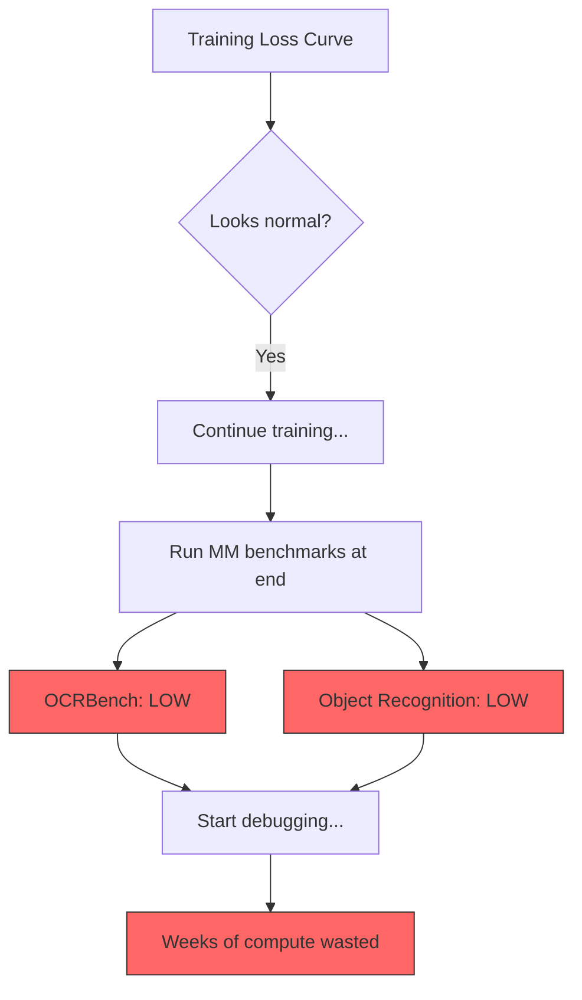
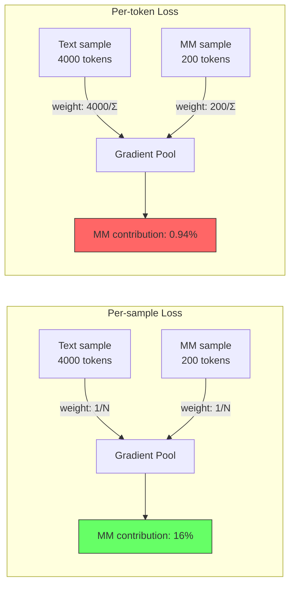

某 3B 多模态模型完成了 5.2T token 的 PT-1 阶段，多模态指标（OCRBench、物体识别）全线偏低。排查了数据、模型结构、学习率……最后发现是训练脚本里多了一个 Megatron flag：`--calculate-per-token-loss=true`。这个 flag 把多模态梯度贡献从 16% 稀释到了 0.94%——整整 17 倍。

一个 boolean 参数，吃掉了几百万 GPU hours 的多模态学习效果。这篇文章复盘整个事故的数学原理、代码路径和工程教训。

---

## 背景：Per-sample vs Per-token Loss Normalization

训练框架在计算 batch loss 时，有两种归一化方式：

**Per-sample loss（按样本平均）：** 每个 sample 不管长短，对最终梯度的贡献权重相同，都是 $1/N$（$N$ 为 batch 内样本数）。

**Per-token loss（按 token 平均）：** 先把所有样本的 loss 拉平到 token 粒度，再除以 batch 内总 token 数。每个 sample 的梯度贡献正比于它的 label token 数。

对于纯文本 LLM，两种方式差异不大——样本长度分布相对均匀。但多模态训练中，文本和图文样本的 label token 数差了一个数量级，这个选择就变成了"生死攸关"的超参。

---

## 事故现场的数据特征

| 数据类型 | 样本占比 | 平均 label tokens/sample |
|---------|---------|------------------------|
| 纯文本 | ~84% | ~4000（全部 token 参与 loss） |
| 多模态 | ~16% | ~200（仅 AI answer 部分） |

文本样本的平均有效 token 是多模态样本的 20 倍。这个 20 倍的差距，在 per-token loss 下直接转化为梯度权重的 20 倍悬殊。

---

## 数学推导：17 倍稀释从何而来

### Per-sample loss 下的梯度贡献

每个样本权重相同为 $1/N$，多模态样本的梯度贡献等于其样本比例：

$$\text{Grad}_{\text{mm}} = \frac{|M|}{N} \approx 16\%$$

### Per-token loss 下的梯度贡献

每个样本的权重正比于其 label token 数 $n_i$：

$$w_i = \frac{n_i}{\sum_{k=1}^{N} n_k}$$

多模态总梯度贡献：

$$\text{Grad}_{\text{mm}} = \frac{\sum_{i \in M} n_i}{\sum_{k=1}^{N} n_k} = \frac{0.16N \times 200}{0.84N \times 4000 + 0.16N \times 200}$$

$$= \frac{32N}{3360N + 32N} = \frac{32}{3392} \approx 0.94\%$$

**稀释倍数：** $16\% / 0.94\% \approx 17\times$

换句话说，多模态数据虽然占了 16% 的样本，但在 per-token 归一化下，它们对模型参数更新的实际影响力不到 1%。模型几乎没在学"看图说话"。

---

## 代码级根因：Megatron schedules.py 的两条路径

```python
# Path A: Per-sample loss (WITHOUT --calculate-per-token-loss)
if not config.calculate_per_token_loss:
    # 每个 sample 内部先除以自己的 token 数 → 得到 per-sample 平均 loss
    output_tensor /= torch.clamp(num_tokens, min=1)
    # 再除以 microbatch 数量 → 所有 sample 等权
    output_tensor /= num_microbatches

# Path B: Per-token loss (WITH --calculate-per-token-loss)
# 跳过 per-sample 归一化
# 在 finalize_model_grads_func 中统一除以 global total_num_tokens
# → 长样本天然获得更大权重
```

关键区别：Path A 中每个 sample 无论含 200 还是 4000 个 label token，对梯度贡献相同。Path B 中 4000-token 的文本样本获得 20 倍于 200-token 多模态样本的梯度权重。

---

## 为什么这个 bug 是"静默"的

这是最阴险的部分：**loss 曲线看起来完全正常**。

原因很简单——loss 本身就是 per-token 计算的。84% 的文本 token 贡献了绝大部分 loss 数值，而这些文本 token 的学习不受影响。loss 稳步下降，checkpoint 指标看起来正常，直到你专门跑多模态 benchmark 才发现问题。

而多模态 benchmark 通常是在训练末期或阶段性评测时才跑——对于一个 5.2T token 的训练任务，这意味着你可能浪费了几周的计算资源才发现问题。



---

## 梯度流对比



---

## 业界方案：Qwen3-VL 的 $\sqrt{N}$ 归一化

Qwen3-VL 给出了一个优雅的折中方案：用 $\sqrt{N}$ 做归一化，而非 $N$ 或 $1$。

设文本样本 token 数为 $n_t = 4000$，多模态为 $n_m = 200$，则各方案下的梯度权重比为：

| 归一化方式 | 文本:多模态 梯度权重比 | 效果 |
|-----------|---------------------|------|
| Per-token ($\div N$) | $4000:200 = 20:1$ | 多模态几乎被忽略 |
| $\sqrt{N}$ | $\sqrt{4000}:\sqrt{200} \approx 4.47:1$ | 适度 downweight 长序列 |
| Per-sample ($\div 1$) | $1:1$ | 完全等权 |

$\sqrt{N}$ 归一化的直觉：它承认长序列包含更多信息（因此值得更多权重），但拒绝线性放大——用开方来压缩这种优势。这是一个 principled 的 interpolation。

独立验证来自 Apple AFM 技术报告，他们在消融实验中确认：per-token loss 导致多模态能力退化约 18%，与我们观察到的现象高度一致。

---

## 修复方案对比

针对这个事故，有三条修复路径：

**方案 1：移除 `--calculate-per-token-loss`**
- 恢复 per-sample 平均，多模态梯度贡献回到 16%
- 最简单，但可能影响纯文本性能（长文本样本被 underweight）

**方案 2：保持 per-token，大幅提升多模态数据比例**
- 将多模态占比从 16% 提升到 ~80% 以补偿
- 数据获取成本极高，不现实

**方案 3：保持 per-token，加补偿系数**
- 对多模态样本的 loss 乘以系数 $\alpha = \bar{n}_{\text{text}} / \bar{n}_{\text{mm}} \approx 20$
- 等价于手动恢复 per-sample 的效果，但更灵活——可以调 $\alpha$ 微调比例

生产中我们选择了方案 1 + 监控加固。简单、可验证、风险最低。

---

## 工程教训

1. **多模态训练必须监控"分模态梯度贡献比"。** 总 loss 下降不代表所有模态在学习。需要按模态分别统计 gradient norm 占比，设置告警阈值。

2. **框架升级时逐 flag diff。** 新版本引入的 default 值变化比代码 bug 更危险——因为它们不报错、不 crash、不在 loss 上留痕。`--calculate-per-token-loss` 在旧版不存在（等价于 false），新版默认值或配置模板可能悄悄改为 true。

3. **Loss normalization 不是"工程细节"，是超参。** 它直接决定了各模态的有效学习率比，应该和 learning rate、batch size 一样被显式讨论和记录。

4. **多模态 benchmark 必须 early & often。** 不能等到 PT-1 结束才跑 OCRBench。至少每 500B tokens 做一次多模态 eval，早发现早止损。

5. **"代码审查 = 看新增参数"是不够的。** 真正的 review 要问："这个参数在我们的数据分布下，数学上意味着什么？"。一行 `--calculate-per-token-loss=true` 看起来无害，但结合 20 倍的 token 数差异，它是一个 17 倍的隐式降权。

---

## References

- Megatron-LM, `megatron/core/pipeline_parallel/schedules.py` — loss normalization logic
- Qwen3-VL Technical Report — $\sqrt{N}$ sequence-length normalization
- Apple Foundation Models (AFM) Tech Report — per-token loss multimodal degradation ablation (~18%)
- [OpenBMB MiniCPM Series](https://arxiv.org/abs/2506.07900) — WSD learning rate schedule with modality-aware scaling
