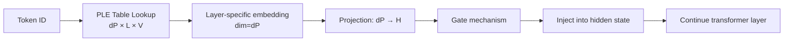
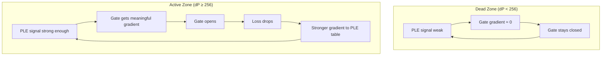
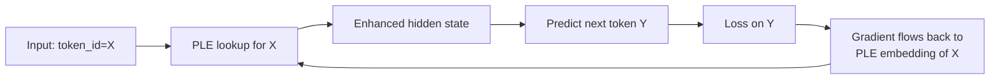
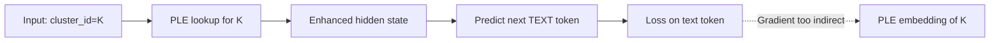

## 开场：一个反直觉的实验结果

PLE 从 dP=64 扩到 dP=128，参数多花了 220M，loss 一丝不动——2.149→2.149。而从 128 跳到 256，突然降了 0.017。

这不是噪声。多次复现，结果稳定。某 3B 模型的 PLE scaling 曲线上，存在一个清晰的"死区"（dead zone）：参数加了，但模型完全无感。这迫使我们重新审视一个假设——**参数量与 loss 之间是否真的是单调递减关系？**

答案是：不一定。存在激活阈值。

---

## 什么是 PLE（Per-Layer Embedding）

PLE 的核心思想：为 vocabulary 中的每个 token 在每一层维护一个独立的 embedding vector（维度为 dP），通过 gate 机制注入到该层的 hidden state 中。

传统 Transformer 只在第 0 层做 token embedding lookup，之后所有层共享同一个初始表征。PLE 打破这一限制——每一层都能"重新查表"，获取 token-specific 的信号。

机制流程：

每层的注入公式：

$$h_l = h_l + \text{gate}_l \cdot \text{proj}_l(\text{PLE}_l[\text{token_id}])$$

其中 gate 是 learned scalar/vector，proj 是 dP→H 的线性映射。

---

## Scaling 实验：完整数据

**模型配置**：H=2560, 32 layers, GQA 20Q/4KV, FFN=6912, 原始参数量 2,458,421,760（≈2.46B）

**训练配置**：400B tokens, seq_len=4096, global_batch=4096

| dP | 新增参数量 | 占比 | Loss | ΔLoss vs baseline |
|---:|---:|---:|---:|---:|
| 0 (baseline) | — | — | 2.155 | — |
| 64 | +220.8M | +8.98% | 2.149 | -0.006 |
| 128 | +441.5M | +17.96% | 2.149 | -0.006 |
| 256 | +883.0M | +35.92% | 2.132 | -0.023 |
| 512 | +1765.9M | +71.83% | 2.122 | -0.033 |

关键观察：

1. **Dead zone**：dP 64→128，参数翻倍（+220M），loss 完全不动（2.149→2.149）
2. **Phase transition**：dP 128→256，loss 突降 0.017
3. **Diminishing returns**：dP 256→512，参数再翻倍，仅降 0.010

---

## PLE 参数构成解析（以 dP=256 为例）

| 组件 | 计算公式 | 参数量 |
|:-----|:---------|-------:|
| PLE Embedding Table | dP × L × V = 256 × 32 × 100096 | 819.99M |
| Model-level Projection | H × dP × L + dP = 2560 × 256 × 32 + 256 | 20.97M |
| Per-layer Gate+Proj+Norm | (H × dP × 2 + H) × L = (2560×256×2 + 2560)×32 | 42.01M |
| **Total** | | **882.98M (+35.9%)** |

Embedding table 占绝对大头（93%）。这意味着 PLE 的参数效率极度依赖于这张表能否被有效利用。

---

## Dead Zone 根因分析

为什么 dP < 128 时 PLE "不起作用"？

核心论点：**当 PLE injection 的信号强度低于 trunk network 的噪声地板时，主网络会将其视为噪声并忽略。**

具体机制：

1. **Signal-to-noise ratio 不足**：hidden state 的 L2 norm 通常在数百量级（H=2560），而 dP=64 的 projection 输出只是一个 64→2560 的线性映射结果。即使 gate 完全打开，注入的向量在 2560 维空间中的"影响力"极其有限。

2. **Gate 学习困境**：gate 的梯度来自下游 loss。当注入信号太弱时，有无 PLE 对 loss 的影响在数值精度边缘，gate 无法获得有意义的梯度信号来学习"打开"。这形成恶性循环——gate 不开，信号更弱，梯度更小。

3. **阈值效应的物理类比**：类似于神经科学中的 action potential——刺激低于阈值时，神经元完全不响应；超过阈值后才会 fire。dP=256 就是这个系统的 firing threshold。

4. **dP=64 和 dP=128 为什么 loss 相同**：两者都处于"亚阈值"区间。dP=64 的微小改善（-0.006）可能来自 embedding table 本身作为额外 regularization 的副作用，而非 PLE 机制真正生效。dP=128 虽然参数翻倍，但仍在噪声地板之下，无法突破。

---

## Visual PLE：一个完整的失败案例

在 text PLE 的死区问题之外，我们还尝试将 PLE 思想扩展到 visual tokens——为图像 patch 分配 cluster ID，然后用类似机制注入 per-layer embedding。

**尝试的 5 种 visual tokenization 方法**：

1. VQ-VAE codebook
2. LFQ (Lookup-Free Quantization)
3. BSQ (Binary Spherical Quantization)
4. DCT + K-means clustering
5. SigLIP feature clustering

**结果：全部失败。**

NTP loss 变化仅在千分位级别（0.001–0.002），与 random baseline 无统计显著差异。

**诊断指标**：

- 不同 cluster embedding 之间的 cos_sim ≈ 0.000（6000 steps 后）
- Effective rank: 255.1/256（几乎满秩 = 没有学到任何聚类结构）
- PC1 explained variance: max 0.011 at Layer 8（random baseline 约为 0.004）

这些指标说明：PLE table 中不同 cluster 的 embedding 完全没有分化，模型根本没有利用 visual cluster ID 信息。

---

## 自监督闭环理论：Text PLE 为什么能工作

Text PLE 和 Visual PLE 的根本区别在于**自监督闭环是否完整**。

**Text PLE 的闭环**：

Token ID 同时出现在 input side 和 target side。NTP loss 强制模型区分不同的 token ID——如果 PLE embedding 对 "the" 和 "a" 给出相同向量，模型就无法利用这个信号来更好地预测下一个 token。这提供了强监督信号。

**Visual PLE 的断裂闭环**：

Visual cluster ID 只出现在 input side，**永远不会作为预测目标**。NTP loss 只在 text token 上计算。模型没有任何动力去区分 cluster_id=37 和 cluster_id=152——因为无论给哪个 ID，对预测下一个文字 token 的帮助都微乎其微。

自监督闭环的断裂导致 visual PLE embedding 得不到有效梯度，最终退化为随机向量（cos_sim≈0，effective rank≈满秩）。

---

## 工程教训

### 1. 参数不是线性起效的，存在激活阈值

Scaling law 的光滑曲线是在"所有参数都有效工作"的前提下成立的。PLE dead zone 告诉我们：**新增参数必须在信号强度上超过主网络的噪声地板，否则就是纯浪费。**

在做 ablation 时，不能只看两个点然后线性外推。dP=64 有效不代表 dP=128 更好——它可能恰好卡在阈值之下。

### 2. 自监督信号的完整性是机制能否生效的前提

任何 auxiliary embedding 机制，如果其 ID 不参与 loss 计算（至少间接参与），就很难通过纯 NTP 训练学到有意义的表征。Visual PLE 的失败不是 tokenization 方法的问题（5 种方法全败），而是监督信号结构性缺失。

### 3. 诊断优于试错

在发现 dead zone 后，通过 cos_sim、effective rank、PC1 variance 等诊断指标，可以在不跑完整 400B tokens 的情况下早期判断机制是否生效。建议在训练初期（~6000 steps）就检查这些指标。

### 4. PLE 的实际推荐配置

基于实验结果，对于 H=2560 的模型：
- dP < 256：不建议使用（大概率处于死区）
- dP = 256：性价比最优（+35.9% 参数换取 -0.023 loss）
- dP = 512：收益递减明显（参数翻倍仅多降 0.010）

---

## 参考文献

1. Gemma 3 Technical Report — Per-layer embedding 的工程实现参考
2. PLE: Per-Layer Embedding for language model scaling — 原始方法论文

---

*核心结论：参数扩展存在"死区"——低于信号阈值的新增参数不会产生任何收益。设计 auxiliary mechanism 时，确保（1）注入信号强度足够，（2）自监督闭环完整。这两个条件缺一不可。*
