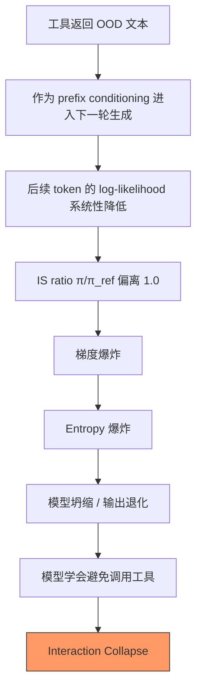
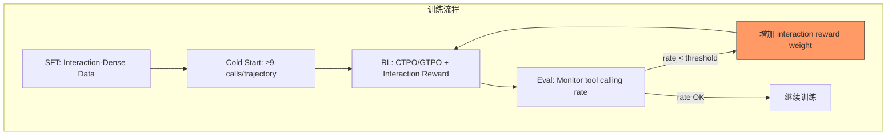

## 一个真实的训练事故

某团队在一个 4B 参数的端侧模型上做 Tool-Integrated Reasoning (TIR) 的 GRPO 训练。任务是数学推理 + 代码解释器调用。训练配置如下：

```
模型: 4B dense, 32 layers, hidden 3072
RL 算法: GRPO, group_size=16, max_seq_len=32K
工具: Python code interpreter (sandbox), max_tool_calls=15
数据: 2000 math problems (AIME/AMC/Olympiad 级别)
Reward: binary (correct answer = 1, incorrect = 0)
Training: 3 days, ~800 steps, batch_size=64
```

训练前模型的 tool calling rate 是 85%，reward 曲线前 48 小时稳步上升。第三天早上拉 eval，发现模型几乎不再调用工具。

### 事故时间线

**Day 1 (Step 0-250):**
- Tool calling rate: 85% → 82%（轻微自然下降）
- Training reward: 0.12 → 0.31
- Avg tool calls per trajectory: 4.2

**Day 2 (Step 250-550):**
- Tool calling rate: 82% → 45%（加速下降！）
- Training reward: 0.31 → 0.48（仍在上升！）
- Avg tool calls per trajectory: 4.2 → 1.3
- 新现象: 模型开始在 `<tool_call>` 标签内写伪代码但不执行

**Day 3 (Step 550-800):**
- Tool calling rate: 45% → 12%
- Training reward: 0.48 → 0.52
- Avg tool calls per trajectory: 1.3 → 0.2
- Eval accuracy (hard problems requiring tools): 67% → 23%

模型学会了"纯文本硬算"——准确率比调工具还低，但 reward variance 更小。

### 根因排查

排查过程：

1. **首先检查 reward function 是否 leak tool usage 信号** → 没有，纯 binary outcome reward
2. **然后检查 GRPO 的 group statistics** → 发现问题：16 个 response 中，不调工具的 response reward 方差为 0.18，调工具的 response reward 方差为 0.47。GRPO 的 advantage = (reward - group_mean) / group_std，而高方差组的 std 分母更大 → advantage 被系统性压缩
3. **更深层原因**: tool execution 引入随机性（相同代码不同执行环境可能 timeout），这种随机性被 GRPO 的 normalization 惩罚

这就是 **Interaction Collapse**：模型发现避免调用工具可以减少 reward 方差，而 GRPO 的 group normalization 机制恰好奖励了这种低方差策略。reward 还在涨，是因为模型在简单题上的纯文本正确率确实够高——但在真正需要工具的困难题上已经彻底放弃。

作为对比，另一项工作 [ASTER] 用 interaction-dense 冷启动（每条轨迹 ≥9 次工具调用）+ 显式 interaction reward，在同等规模的 4B 模型上实现了 AIME 90%——证明小模型 + 工具可以远超大模型纯推理，前提是 RL 设计正确。

这不是个案。多篇论文独立报告了相同现象 [6][7]。本文梳理 Tool Use RL 与纯推理 RL 的结构性差异，以及六个已被验证的修复方案。

---

## 1. 为什么纯推理 RL 在 Tool Use 上系统性失败

纯文本推理 RL（如 DeepSeek-R1 风格的 GRPO）在 Tool Use 场景下面临六个结构性不匹配：

| 维度 | 纯推理 RL | Tool Use RL |
|------|-----------|-------------|
| **轨迹结构** | 单轮生成，完整可控 | 多轮交互，中间插入 OOD 的工具返回 |
| **坍缩模式** | 基本不存在 | Interaction Collapse：模型主动回避工具调用 |
| **信用分配** | 轨迹级 reward 即可工作 | 需要 turn-level 或 step-level 的细粒度归因 |
| **Reward 设计** | 二元结果 reward 足够 | 需要更密集的中间信号（调用质量、参数正确性） |
| **环境随机性** | 确定性（模型输出即最终答案） | 工具返回是 OOD 文本，引入不可控随机性 |
| **IS 比率** | Token-level 无偏 | Token-level 有偏（prefix distribution shift） |

核心矛盾：GRPO 假设同一 prompt 下采样的多条轨迹是"可比的"，但在 Tool Use 场景下，不同轨迹可能经历完全不同的工具反馈序列，导致 group 内的 reward 比较失去意义。

---

## 2. LLD 死亡螺旋：为什么 Tool Use 轨迹的似然会系统性下降



这个机制被称为 **Log-Likelihood Displacement (LLD)**，其核心论据来自实验观察 [5][7]：

> "Increasing the number of tool-interaction rounds consistently reduces response likelihood, even when the final answer is correct."

**为什么纯文本 GRPO 不受影响？** 因为纯文本生成中，所有 prefix 都是模型自己产生的，分布内生一致。而 Tool Use 场景中，工具返回的文本（如一段 Python traceback 或计算结果）是 out-of-distribution 的——模型从未在训练时见过这种"别人插入的中间文本"作为自己的 prefix。

**量化影响**：某开源框架的实验显示，3 轮工具交互后，response log-likelihood 平均下降 2.3 nats；5 轮后下降 4.1 nats。对应的 IS ratio 膨胀到 10x-100x 量级，远超 PPO/GRPO clip 范围的设计假设。

---

## 3. 信用分配的三个粒度

纯推理 RL 可以用轨迹级 reward（答案对了给 +1），但 Tool Use 场景中一条轨迹可能包含 5-10 次工具调用，每次调用的质量参差不齐。轨迹级 reward 无法区分"第 3 次调用选错了工具"和"最后一次调用参数写错了"。

### 3.1 GTPO：Turn-Level Discounted Return [2]

GTPO 将多轮对话拆分为 turns，每个 turn 分配一个中间 reward $r_{i,j}$，然后计算 discounted return：

$$R_{i,j} = \sum_{m=j}^{T} \gamma^{m-j} \cdot r_{i,m}$$

其中 $\gamma$ 是折扣因子，$T$ 是总 turn 数。这样每个 turn 的 advantage 估计可以考虑"当前 turn 对未来所有 turn 的贡献"。

**优势**：保持了 GRPO 的无 critic 架构，只需在 reward model 层面提供 turn-level 信号。

**局限**：一个 turn 内部如果包含多个推理步骤（如 think → tool_call → observe），仍然是粗粒度的。

### 3.2 StepPO：Step-Level MDP [3]

StepPO 将粒度进一步细化到"步骤"级别——一个 step 可以是一段推理文本、一次工具调用、或一次观察。每个 step 被视为 MDP 中的一个 action，使用 step-level value function 估计 advantage。

$$A_{\text{step}}(s_t, a_t) = Q(s_t, a_t) - V(s_t)$$

**优势**：能精确定位"哪一步工具调用出了问题"。

**代价**：需要训练一个 step-level critic，增加了工程复杂度。

### 3.3 GEAR：自蒸馏自适应粒度 [4]

GEAR 的思路是：不预设粒度，而是让模型自己决定在哪些位置切分。通过 self-distillation 机制，模型生成多条轨迹后，自动识别"关键决策点"并在这些点上分配更细粒度的 reward。


---

## 4. CTPO：累积 IS 比率修正 [5]

标准 GRPO/PPO 使用 token-level IS ratio：

$$\rho_t = \frac{\pi_\theta(a_t | s_t)}{\pi_{\text{ref}}(a_t | s_t)}$$

但这个公式隐含假设：在位置 $t$ 时，两个策略面对的 state $s_t$ 是相同的。在纯文本生成中这个假设成立（prefix 是固定的 prompt）。但在 Tool Use 场景中，**prefix 本身就包含了之前轮次的工具返回**，而 $\pi_\theta$ 和 $\pi_{\text{ref}}$ 在之前轮次的行为不同，导致它们面对的 prefix 分布不同。

CTPO 的修复：

**累积 Token IS Ratio（Prefix Correction）**：

$$\hat{\rho}_t = \prod_{k=1}^{t} \frac{\pi_\theta(a_k | s_k)}{\pi_{\text{ref}}(a_k | s_k)}$$

这个累积比率正确地考虑了"到达位置 $t$ 时，整条路径的概率比"。

**位置自适应 Clipping**：

由于累积比率随 $t$ 增大而方差指数增长，CTPO 引入了位置相关的 clip 范围：

$$\epsilon_t = \epsilon_0 \cdot \sqrt{t}$$

即越靠后的 token，允许的 clip 范围越大，避免过度约束长轨迹后段的梯度。

**实验效果**：在某开源框架的 TIR 任务上，CTPO 相比标准 GRPO 将 interaction collapse 发生率从 67% 降低到 11%，同时最终任务准确率提升 8-12 个点。

---

## 5. 防止 Interaction Collapse 的工程方案

除了算法层面的修复，工程实践中有几个被验证有效的方案：

### 5.1 Interaction-Dense Cold Start

训练初期使用高工具交互密度的轨迹做 warm-up：

- 每条轨迹至少包含 **9 次工具调用**
- 确保模型在 RL 训练开始前已经"习惯"多轮交互模式
- 来源：ASTER [1] 的实验表明，cold start 阶段的交互密度对后续 RL 稳定性有决定性影响

### 5.2 Explicit Interaction Reward

在 reward function 中加入显式的交互奖励项：

$$r = r_{\text{outcome}} + \alpha \cdot r_{\text{interaction}}$$

其中 $r_{\text{interaction}}$ 奖励"合理的工具调用行为"（不是简单地奖励调用次数，而是奖励"在需要调用时调用了"）。

### 5.3 Minimum Tool Calling Frequency Constraint

作为 hard constraint 加入训练：如果一个 batch 中模型的 tool calling rate 低于阈值（如 50%），则对该 batch 施加额外的 KL penalty 或直接 reject。

### 5.4 ASTER 范式：小模型 + 工具 > 大模型纯推理 [1]

ASTER 证明了一个重要结论：

> 某 4B 模型通过 code interpreter 在 AIME 上达到 90% 准确率，超越了许多 70B+ 的纯推理模型。

这说明 Tool Use RL 做对了的话，端侧小模型的 ceiling 远高于纯推理路线。关键不是"要不要做"，而是"怎么做对"。



---

## 6. 端侧模型的特殊困难

端侧模型（1B-4B）在 Tool Use RL 上面临额外的挑战：

| 挑战 | 原因 | 应对 |
|------|------|------|
| 更容易 collapse | 参数少 → 表征能力有限 → 策略空间窄 | 更保守的 learning rate + 更强的 KL constraint |
| Group size 受限 | 显存限制 → 每个 prompt 只能采样 4-8 条轨迹 | GRPO group 内方差估计不准 → 用 GTPO 的 turn-level 信号补偿 |
| LLD 更严重 | 小模型对 OOD prefix 更敏感 | CTPO 的累积 IS 修正 + LLDS regularization |
| 长轨迹困难 | Context window 小 → 工具交互轮数受限 | 设计更紧凑的 tool calling protocol |

**推荐组合**：对于端侧 Tool Use RL，建议采用：

1. **CTPO** 解决 IS ratio 偏差
2. **GTPO** 提供 turn-level 信用分配
3. **LLDS regularization** 防止似然位移导致的梯度爆炸
4. **Interaction-dense cold start** 建立稳定的工具调用习惯

---

## 总结

Tool Use RL 不是"把纯推理 RL 的 reward 改一改"就能工作的。它面临的六个结构性问题——OOD prefix、interaction collapse、信用分配失效、IS ratio 偏差、reward 稀疏、环境随机性——每一个都需要针对性的解决方案。

好消息是：这些问题在 2025-2026 年已经被逐一定位并给出了可验证的修复。ASTER 证明了小模型 + 工具的 ceiling 远高于纯推理，CTPO/GTPO 解决了训练稳定性，interaction-dense cold start 解决了初始化问题。

对于正在做端侧 Tool Use RL 的团队：如果你的 tool calling rate 在训练中下降了，大概率不是 reward 设计的问题，而是 GRPO 的结构性缺陷在 Tool Use 场景下的必然表现。

---

## References

- [1] ASTER: Natural Code-Integrated Reasoning, [arXiv:2602.01204](https://arxiv.org/abs/2602.01204)
- [2] GTPO: Group Relative Policy Optimization with Turn-Level Reward, [arXiv:2511.14846](https://arxiv.org/abs/2511.14846)
- [3] StepPO: Step-Level Policy Optimization, [arXiv:2604.18401](https://arxiv.org/abs/2604.18401)
- [4] GEAR: Granularity-Adaptive Reward, [arXiv:2605.11853](https://arxiv.org/abs/2605.11853)
- [5] CTPO: Cumulative Token-Level Policy Optimization, [arXiv:2605.07331](https://arxiv.org/abs/2605.07331)
- [6] On the Limitations of GRPO, [arXiv:2512.04220](https://arxiv.org/abs/2512.04220)
- [7] Teaching Tool-Integrated Reasoning, [arXiv:2605.06326](https://arxiv.org/abs/2605.06326)
- [8] Tool-R0: Tool-Augmented Reasoning, [arXiv:2602.21320](https://arxiv.org/abs/2602.21320)
