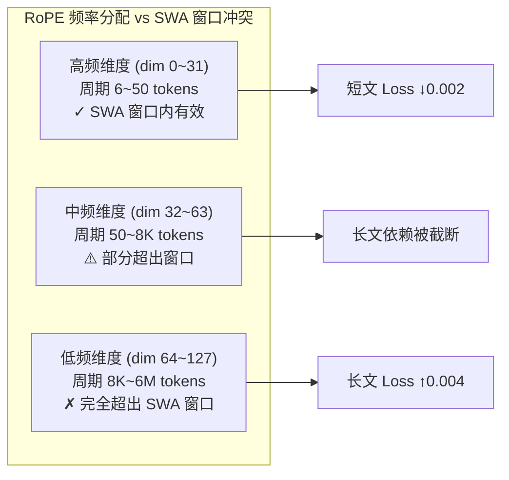
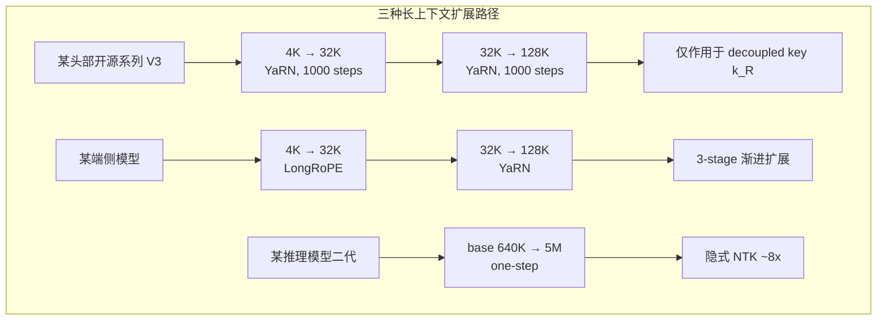
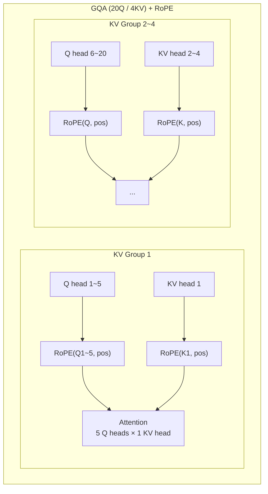
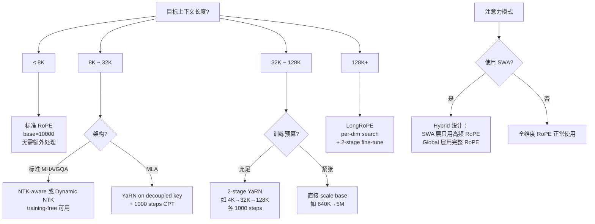

## 引子：一次出乎意料的长文 Loss 恶化

某 3B 模型项目中，我们尝试将 SWA（Sliding Window Attention）与 Hybrid RoPE 组合使用。假设很简单：SWA 节省长序列显存，RoPE 负责长距离位置建模，各司其职。短文本 PT（Pretraining）阶段的指标也确实验证了这个预期——**loss 下降了 0.002**，一切看起来很美好。

但切到长文本 FD（Fine-tuning on Document）阶段时，loss 反向飙了 **+0.004**。对一个 3B 模型来说，0.004 的 loss 差距在下游任务上体感非常明显。

问题出在哪里？

**SWA 的滑动窗口截断，恰好把 RoPE 低频维度编码的长程位置信号给"切"断了。** RoPE 靠低频维度区分远距离 token 的位置差异，但 SWA 只让每个 token 看到窗口内的邻居——那些低频维度根本没有机会发挥作用，相当于花了计算预算旋转了一圈，但 attention score 根本不会算到这些远距离 pair。

教训很直接：**位置编码和注意力模式必须协同设计。** 你不能把两个独立"看起来都对"的组件拼在一起就期望它们自动配合。

这次复盘让我把 RoPE 从数学底层到工程实践重新梳理了一遍。下面从原理开始，结合真实的工程配置和数据，系统讲清楚 RoPE 以及主流长上下文扩展方案。

---

## RoPE 的数学本质：旋转编码相对距离

### 核心机制

RoPE 把位置信息编码为 query/key 向量的"旋转角度"。位置 $m$ 处的 query $q$ 和位置 $n$ 处的 key $k$：

$$f(q, m) = R_m \cdot q, \quad f(k, n) = R_n \cdot k$$

旋转矩阵 $R_m$ 的核心性质：

$$f(q, m)^T f(k, n) = q^T R_{n-m} k$$

attention score 只依赖相对位置 $n - m$，绝对位置在内积中被消去了。这正是 RoPE 相对于 sinusoidal/learned positional encoding 的根本优势。

### 频率分配：多尺度位置编码

$d$ 维 head dimension 被拆成 $d/2$ 个二维子空间，每个子空间的旋转频率为：

$$\theta_i = \text{base}^{-2i/d}, \quad i = 0, 1, \ldots, d/2 - 1$$

位置 $m$ 处第 $i$ 个子空间的旋转角 = $m \cdot \theta_i$。

**关键设计：低维度高频、高维度低频。** 以某 3B 模型的标准配置 `base=10000, head_dim=128` 为例：

| 维度对 | 频率 $\theta_i$ | 完整周期 (tokens) | 编码角色 |
|--------|---------|---------|---------|
| dim 0-1 | 1.0 | ~6.3 | 区分相邻 token（精确近距离） |
| dim 32-33 | ~0.01 | ~628 | 段落级位置差异 |
| dim 64-65 | ~0.0001 | ~62.8K | 文档级位置差异 |
| dim 126-127 | ~0.000001 | ~6.28M | 极长距离粗粒度编码 |

这就是 **SWA 实验失败的数学原因**：dim 64+ 的低频维度负责 62K+ token 距离的编码，但 SWA 窗口通常只有几千 token，这些维度的旋转差异永远不会出现在 attention 计算中。



---

## Base Frequency 选择：从实验数据出发

### 某 3B 模型的真实决策

该 3B 模型 baseline 使用标准 RoPE，`base=10000`，训练序列长度 4096。当需要扩展到 128K context 时，面临一个核心抉择：

**方案 A**：YaRN scaling，$s = L'/L = 128K/4K = 32$（实际配置中用 $s=40$ 留 margin），只对 decoupled shared key $k_t^R$ 施加

**方案 B**：直接将 base 从 10000 提升到 500K+，等价于隐式 NTK scaling

两种方案的 trade-off：

| | YaRN ($s=40$) | 大 base ($\geq 500K$) |
|--|--|--|
| 短文本性能 | 几乎无损（分段保护高频） | 高频分辨率下降（近距离编码模糊） |
| 长文本能力 | 需要 continued pretraining 1000+ steps | 原生支持，但训练早期收敛慢 |
| 工程复杂度 | 需配合 MLA 架构（只作用于 $k_t^R$） | 改一个数即可 |
| 实际案例 | 某头部开源系列 V3 采用 | 某端侧模型直接 scale base 到 5M |

### 真实配置数据对比

从公开的技术报告中，可以看到三种截然不同的长上下文训练路径：

**某头部开源系列 V3** ([arXiv:2412.19437](https://arxiv.org/abs/2412.19437))：
- 2-stage YaRN 扩展
- Stage 1: 4K → 32K，continued pretraining 1000 steps
- Stage 2: 32K → 128K，continued pretraining 1000 steps
- YaRN 只作用于 decoupled shared key $k_t^R$（MLA 架构下的 RoPE key）
- 关键细节：content key $k_t^C$ 不带位置信息，保持 latent 压缩的兼容性

**某端侧模型** ([arXiv:2506.07900](https://arxiv.org/abs/2506.07900))：
- 3-stage 逐步扩展
- RoPE (base=10000, 4K) → LongRoPE (32K) → YaRN (128K)
- 每个阶段都有 continued pretraining
- 渐进式策略，对端侧模型的稳定性友好

**某推理模型第二代**：
- 激进的 one-step scaling
- 直接将 base 从 640K 拉到 5M
- 等价于 ~8x 的隐式 NTK scaling
- 适合本身就用大 base 训练的模型



---

## 长上下文扩展方案：数学与工程

### Position Interpolation (PI)：最直觉的方案

训练长度 $L$，目标 $L'$。把每个位置压缩：$m \rightarrow m \cdot L/L'$。等价于所有频率乘以 $L/L'$。

**问题**：以 4K→128K 为例，压缩比 32x。dim 0-1 的周期从 6.3 token 变成 0.2 token——相邻 token 的旋转角差异变得 FP16 不可分辨。这就是为什么 PI 必须做大量 fine-tuning 来"学会"在被压扁的空间里区分位置。

### NTK-aware Interpolation：不均匀压缩

核心洞察：高频维度不应压缩，低频维度需要大幅压缩。实现方式——修改 base：

$$\text{base}' = \text{base} \cdot \alpha^{d/(d-2)}$$

$\alpha = L'/L$。效果是低频维度被大幅拉伸，高频维度几乎不变。

### YaRN：分段 + 温度补偿

YaRN ([arXiv:2309.00071](https://arxiv.org/abs/2309.00071)) 在 NTK 基础上增加两个关键改进：

1. **三段式处理**：
   - 高频区（有效波长 < 原始训练长度）：完全不动
   - 低频区（有效波长 > 目标长度）：做完整的 NTK scaling
   - 中间区：线性插值过渡

2. **Attention scaling factor** $\sqrt{1/s}$：长序列下 attention logits 幅度下降（旋转角分布变稀疏），需要温度补偿

**某 3B 模型的 YaRN 配置细节**：
- 扩展因子 $s = 40$（4K → 160K 的理论覆盖，为 128K 目标留余量）
- 只作用于 decoupled key（MLA 风格的 $k_t^R$，维度通常 64）
- Content key $k_t^C$ 保持不变，不参与 RoPE 旋转
- Continued pretraining 约 1000 steps，学习率为原始 PT 的 1/10

### LongRoPE：搜索式最优 scaling

LongRoPE ([arXiv:2402.13753](https://arxiv.org/abs/2402.13753)) 放弃公式化方案，直接搜索每个维度的最优 scaling factor：

1. 用 evolutionary search 在 validation set 上找 per-dimension 最优 scaling
2. 两阶段扩展：先到 256K fine-tune，再搜索 2048K 的 scaling
3. 额外搜索一组短序列 scaling，推理时根据 seq_len 动态切换

搜索成本不低，但对于大型项目是一次性投入。某端侧模型的 LongRoPE 阶段（32K 扩展）就使用了这种方法。

### Dynamic NTK：推理时自适应

```python
def get_rope_freqs(seq_len, base=10000, dim=128, max_train_len=4096):
    if seq_len <= max_train_len:
        # 短序列完全不动，保持原始精度
        theta = base ** (-2 * torch.arange(0, dim, 2).float() / dim)
    else:
        # 超出训练长度时动态调整
        alpha = seq_len / max_train_len
        new_base = base * alpha ** (dim / (dim - 2))
        theta = new_base ** (-2 * torch.arange(0, dim, 2).float() / dim)
    return theta
```

优势：training-free，短序列无损。局限：没有 fine-tuning 配合时，长序列质量不如 YaRN。

---

## RoPE 与注意力架构的交互

### GQA：语义透明

某 3B 模型使用 GQA 配置：**20 个 attention heads，4 个 query groups**（即 4 个 KV heads，每个 KV head 服务 5 个 Q heads）。

RoPE 在 GQA 下的行为：
- 每个 Q head 独立施加 RoPE（20 次旋转）
- 每个 KV head 施加一次 RoPE（4 次旋转），结果被对应的 5 个 Q heads 共享
- GQA 不改变 RoPE 的语义——因为旋转是 per-position、per-dimension 的操作，与 head 数量无关



### MLA：RoPE 必须解耦

MLA 把 KV 压缩为低秩 latent $c$，推理时从 $c$ 恢复 K/V。如果对恢复出的 K 施加 RoPE，KV Cache 就不能只缓存 $c$（因为恢复 K 时还需要知道位置来旋转）。

解决方案：**将 K 分为两个独立部分**：

- $k_t^C$（Content Key）：从 latent $c$ 恢复，不带位置信息，缓存在压缩的 $c$ 中
- $k_t^R$（RoPE Key）：独立的小维度向量（通常 64 维），施加 RoPE 后直接缓存

最终 attention score：

$$\text{score}(m, n) = (q_C)_m^T (k_C)_n + (q_R)_m^T R_{n-m} (k_R)_n$$

**这就是为什么某头部开源系列 V3 的 YaRN 只作用于 $k_t^R$**——content key 根本没有 RoPE，对它做 scaling 没有意义。

---

## 从 SWA 实验回到设计原则

回到开头的 SWA + Hybrid RoPE 实验。现在可以精确分析失败的机制：

### 冲突的本质

| RoPE 维度范围 | 编码的位置距离 | SWA 窗口能看到？ | 后果 |
|---|---|---|---|
| dim 0~31 (高频) | 1~50 tokens | 是 | 正常工作，贡献短文 loss ↓ |
| dim 32~63 (中频) | 50~8K tokens | 部分 | 窗口边界处信号截断 |
| dim 64~127 (低频) | 8K~6M tokens | 否 | 完全浪费，且 FD 阶段模型困惑 |

短文本 PT loss 改善（-0.002）来自 SWA 对高频维度 attention 的正则化效果。但长文本 FD loss 恶化（+0.004）来自低频维度的位置信号完全失效——模型在 FD 阶段遇到长距离依赖时，只能靠 content-based attention（没有位置引导），效果退化。

### 正确的协同设计

如果真要用 SWA 节省显存，需要配合的位置编码方案是：

1. **SWA 层不使用 RoPE 低频维度**（只用 dim 0~31 的高频部分）
2. **非 SWA 层（全局 attention 层）使用完整 RoPE**（所有维度）
3. 两种层交替出现，形成 Hybrid 架构

这正是某些模型（如 Gemma 2 系列）的设计思路：local attention 层 + global attention 层交替，位置编码策略与注意力范围匹配。

---

## 工程实践 Checklist

### 数值精度

RoPE 在长序列下旋转角很大（position 100000 × $\theta_0 = 100000$ 弧度）。FP16 下 `sin`/`cos` 精度崩溃。

**最佳实践**：频率计算和三角函数在 FP32 下完成，结果 cast 到 BF16。如果你发现长序列 perplexity 异常升高，**第一件事检查 RoPE 的计算精度**。

### Interleaved vs Non-interleaved

两种 dimension pairing 方式：
- Interleaved：$(d_0, d_1), (d_2, d_3), \ldots$（原始论文）
- Non-interleaved：$(d_0, d_{d/2}), (d_1, d_{d/2+1}), \ldots$（部分实现）

数学等价但转换模型权重时搞混会导致 attention 完全错乱。做模型格式转换前务必确认。

### 高效实现

```python
def apply_rope(x, freqs_cos, freqs_sin):
    """x: (batch, seq_len, n_heads, head_dim)"""
    x_r = x[..., ::2]   # 偶数维度
    x_i = x[..., 1::2]  # 奇数维度
    # 复数乘法
    out_r = x_r * freqs_cos - x_i * freqs_sin
    out_i = x_r * freqs_sin + x_i * freqs_cos
    return torch.stack([out_r, out_i], dim=-1).flatten(-2)
```

不要构造完整旋转矩阵——逐元素操作效率高得多。

---

## 总结：位置编码的工程决策树



从这次 SWA + RoPE 的冲突复盘中，最大的收获是：**位置编码不是一个可以独立于注意力机制设计的"模块"，它和 attention pattern、KV cache 策略、甚至训练阶段的数据分布都存在强耦合。**

具体到工程决策：
1. **注意力范围决定 RoPE 的有效维度**——SWA 窗口外的低频维度是死权重
2. **MLA/GQA 架构决定 RoPE 的施加对象**——MLA 必须解耦 RoPE key
3. **目标长度决定扩展路径**——小步渐进（某端侧模型 3-stage）vs 大步跨越（base 640K→5M）
4. **训练数据的长度分布决定 scaling 参数**——$s=40$ 对应 160K 理论覆盖，为 128K 目标留安全余量

---

## References

1. Su, J. et al. "RoFormer: Enhanced Transformer with Rotary Position Embedding." [arXiv:2104.09864](https://arxiv.org/abs/2104.09864), 2021.
2. Ding, Y. et al. "LongRoPE: Extending LLM Context Window Beyond 2 Million Tokens." [arXiv:2402.13753](https://arxiv.org/abs/2402.13753), 2024.
3. Peng, B. et al. "YaRN: Efficient Context Window Extension of Large Language Models." [arXiv:2309.00071](https://arxiv.org/abs/2309.00071), 2023.
4. DeepSeek-AI. "DeepSeek-V3 Technical Report." [arXiv:2412.19437](https://arxiv.org/abs/2412.19437), 2024.
5. OpenBMB. "MiniCPM4: Ultra-Efficient LLM on Your Phone." [arXiv:2506.07900](https://arxiv.org/abs/2506.07900), 2025.
6. bloc97. "NTK-Aware Scaled RoPE." Reddit/LocalLLaMA, 2023.
7. Chen, S. et al. "Extending Context Window of Large Language Models via Positional Interpolation." [arXiv:2306.15595](https://arxiv.org/abs/2306.15595), 2023.
