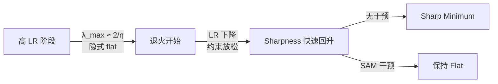

某 1B 模型做 4-bit 量化后精度掉了一截。调了各种量化方案都不管用。最后发现问题出在预训练阶段——换了一下退火阶段的优化器（仅最后 10% 步数），4-bit 量化退化直接减少了 40%。原因是 loss landscape 的几何形状比 loss 值本身更重要。

---

## 1. 低 Loss 不等于好部署

预训练的优化目标是最小化 loss。所有人默认：loss 越低 → base model 越好 → 下游能力越强。

但部署时会发生两件事：
- **量化**：INT4/INT8 压缩权重，每个参数引入微小扰动
- **Fine-tuning**：SFT/RLHF 修改权重，偏离预训练最优点

两者本质相同：权重从预训练最优点 $\theta_{\text{PT}}$ 移动到 $\theta_{\text{PT}} + \Delta$。问题是：移动之后，预训练学到的能力还剩多少？

这就是 **catastrophic forgetting** 的几何学视角。一个在 sharp minimum 的模型，哪怕 loss 值更低，只要权重稍有偏移，loss 就会剧烈上升——预训练知识大量丢失。反之，flat minimum 处的模型对扰动天然鲁棒。

---

## 2. Forgetting 的 Taylor 展开：曲率 x 位移

对预训练 loss 在 $\theta_{\text{PT}}$ 做二阶展开：

$$\mathcal{L}_{\text{PT}}(\theta_{\text{FT}}) - \mathcal{L}_{\text{PT}}(\theta_{\text{PT}}) \approx \frac{1}{2} \|\Delta\|^2 \cdot \kappa(\Delta; H)$$

其中 $H$ 是 Hessian，$\kappa(\Delta; H)$ 是沿 $\Delta$ 方向的曲率（Rayleigh quotient）。

这个公式说明 **forgetting = 位移幅度² x 沿位移方向的曲率**。Fine-tuning 时位移方向由下游任务决定，我们控制不了。但曲率——loss landscape 的 sharpness——是预训练阶段可以优化的。

关键推论：**预训练不应该只追求最低 loss，还应该追求 flat minima**。两个 loss 相同的模型，flat 的那个在量化和 fine-tuning 后保留更多能力。

---

## 3. 降低曲率的三条路径

### 3.1 SAM (Sharpness-Aware Minimization)

显式 min-max 优化：先在扰动方向找到 loss 最高的点，再对那个点做梯度下降。直接惩罚 sharp minima。代价：每步约 2x 计算量（两次前向+反向）。

### 3.2 大 Learning Rate — Edge-of-Stability 的隐式正则化

高 LR 训练时，loss 的最大特征值 $\lambda_{\max}(H)$ 会被约束在 $\approx 2/\eta$。这是 Edge-of-Stability 现象：如果曲率超过 $2/\eta$，梯度下降会发散，迫使优化器自动找到更平坦的区域。

这意味着 **高 LR 本身就是隐式的 sharpness regularizer**，而且是免费的。

### 3.3 短退火 (Short Annealing)

退火阶段降低 LR → Edge-of-Stability 约束放松 → 曲率快速回升（sharpness rebound）。缩短退火时间 = 减少 sharpness 回升的窗口。

---

## 4. 反直觉的 LR 发现：最优 LR 差 10 倍

| 设置 | 追求最低 base loss | 追求最强 anti-forgetting |
|------|:---:|:---:|
| Peak LR | 3e-4 | **3e-3 (10x larger!)** |
| Annealing ratio | 20% | **5% (越短越好!)** |

最优抗遗忘 LR 是最优 base loss LR 的 **10 倍**。这完全违反直觉——你会以为更好的 base model 迁移性更强，但实际上大 LR 虽然 base loss 稍高，却把模型放在了极度 flat 的区域，使其对任何后续扰动（量化或 SFT）都更鲁棒。

短退火同理：20% 退火给 base loss 更多时间收敛，但也给 sharpness rebound 更多时间恶化。5% 退火牺牲一点 base loss，换来大幅更平坦的最终 landscape。

---

## 5. 实际方案：仅在退火阶段用 SAM

全程 SAM = 2x 计算量 → 对数万 GPU-hours 的大规模预训练不可接受。

但观察 sharpness 的动态变化：

高 LR 阶段 Edge-of-Stability 已经在维持 flatness，不需要额外干预。真正需要 SAM 的是退火阶段——LR 下降后曲率约束消失，sharpness 开始反弹。

**方案：仅在最后 10% 步数（退火阶段）启用 SAM。**

开销计算：
- 退火阶段占总训练的 ~10%
- SAM 使该阶段计算量翻倍
- 总额外开销 = 10% × 2x = **仅 10% 总训练计算量**

---

## 6. 大规模验证：OLMo-2-1B

小规模验证（OLMo-60M, 192B tokens）：

| 方法 | Forgetting (SFT 后 PT loss 上升) | 降幅 |
|------|:---:|:---:|
| AdamW baseline | +0.5 | — |
| SAM | +0.1 | **-80%** |

大规模验证（OLMo-2-1B, 4T pretrain + 50B mid-training）：

| 后训练方法 | Forgetting 降低 (SAM vs AdamW) |
|------|:---:|
| MetaMath SFT | -31% |
| StackMath QA SFT | -35% |
| Tulu-3 SFT | -22% |
| **4-bit PTQ (量化)** | **-40%** |

注意 4-bit 量化的 -40% 是最大的改善。这合理——量化的扰动是均匀的、无方向偏好的，而 sharp minimum 在所有方向上都脆弱，所以 flat minima 的优势在量化场景下最为显著。

---

## 7. 对 Edge 部署的意义

Edge 模型的部署 pipeline 几乎必然包含：

1. **量化**：INT4/INT8 是端侧必选项，权重压缩 = 对 $\theta_{\text{PT}}$ 的扰动
2. **领域 fine-tuning**：端侧模型通常需要针对特定场景（车载语音、智能家居等）做 SFT
3. **持续更新**：OTA 推送新能力 = 多轮 fine-tuning

每一步都是对预训练权重的扰动。如果预训练收敛到 sharp minimum，这些扰动的叠加效应是灾难性的——每一步都在丢失通用能力。

Flat minima 使模型对这些操作天然鲁棒。具体收益：
- 4-bit 量化退化减少 40% → 同等质量下可以用更激进的量化方案 → 进一步缩小模型体积
- SFT forgetting 减少 22-35% → fine-tuned 模型保留更多通用能力 → 减少"训完一个任务忘了其他任务"的问题
- 两个效果可以叠加：先 flat pretrain → 再量化 → 再 SFT，每一步的退化都更小

---

## 8. 工程启示

**预训练不再只有一个目标**。传统 recipe 只优化 validation loss。现在需要同时考虑 loss landscape geometry——尤其是当模型确定要量化部署时。

**实操 checklist：**

1. **退火阶段启用 SAM**：最后 10% 步数，额外 10% 总计算量，换取 30-40% 的量化/SFT 退化减少
2. **不要过度退火**：5% annealing ratio 优于 20%。更长的退火让 base loss 好看但 sharpness 恶化
3. **LR 调参要看两个指标**：不只看 final loss，还要看 fine-tuning/quantization 后的 retained capability
4. **如果目标模型确定走 INT4 部署**：宁可 base loss 稍高（大 LR + 短退火），也要拿到 flat minima
5. **评估 metric 升级**：在预训练 eval 中加入 "quantization sensitivity"（做一次 PTQ 看 loss 涨幅）作为 sharpness proxy

**不适用的场景：**
- 模型不做量化也不做 fine-tuning（纯 API 部署 FP16）→ 直接追求最低 loss 即可
- 计算预算极度紧张、连 10% 额外开销都无法承受 → 至少用短退火 + 大 LR 拿到隐式 flatness

---

## 9. References

- Hägele et al., "Scaling Laws for the Geometry of Pretraining", ICML 2026. [arXiv:2605.02105](https://arxiv.org/abs/2605.02105)
- Foret et al., "Sharpness-Aware Minimization for Efficiently Improving Generalization", ICLR 2021
- Cohen et al., "Gradient Descent on Neural Networks Typically Occurs at the Edge of Stability", ICLR 2022
