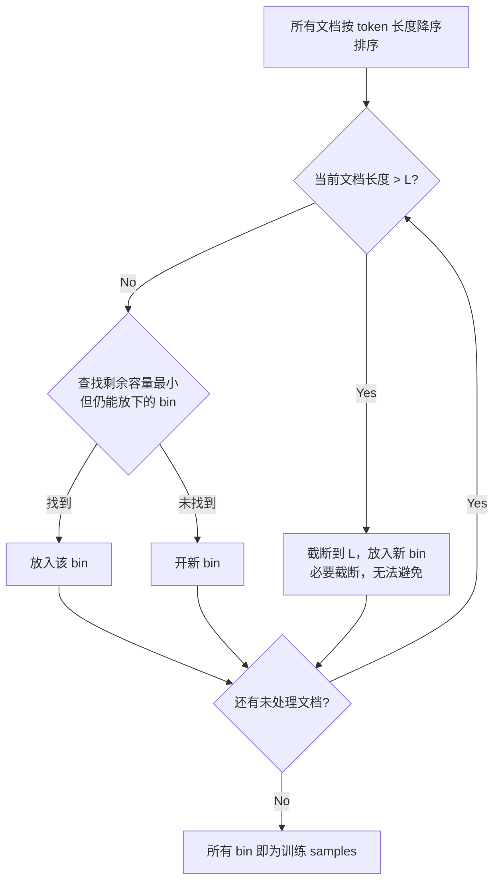

13B 模型预训练 500B tokens，仅仅把数据组织方式从 Concatenation 换成 Best-Fit Packing + Attention Masking，HumanEval 的 undefined variable rate 就降了 52.7%。没改一行模型代码。

这个结果让我重新审视了一个长期被忽略的工程细节：我们喂给模型的 token sequence 到底是怎么拼出来的？

---

## 随机截断为什么会训出幻觉

传统做法叫 Concatenation：把所有文档首尾相连成一条超长 token stream，然后按固定长度 L 切片。每个切片就是一个训练 sample。

问题在于切割位置完全随机。一段 Python 代码，变量定义在第 47 行，使用在第 120 行——如果切割点恰好落在中间，模型看到的 sample 里只有变量的使用而没有定义。更糟的是，切割后前后两段可能被分配到完全不同的 batch，模型永远学不到它们之间的依赖关系。

对于短文档（一条 tweet、一个函数签名），情况更荒谬：它们大概率被切割后和前后不相关的文档片段拼在一起。模型在同一个 attention window 里同时看到一段法语新闻和半个 Python 函数，cross-attention 会让它学到虚假的关联。

这就是 hallucination 的数据层面根源之一：模型被训练去"续写"它从未完整见过的上下文。

---

## Best-Fit-Decreasing Packing

解决思路很直接：不要切割完整文档，而是把不同长度的文档像行李一样装进固定大小的箱子（bin）。这就是经典的 Bin Packing 问题。

BFD（Best-Fit-Decreasing）算法流程：

核心原则：

1. **只截断超过 context length 的文档**——这是无论如何都避免不了的截断
2. **降序排列**——大块先放，小块后填缝隙，这是 bin packing 的经典启发式
3. **Best-Fit**——找剩余空间最小但够用的 bin，最大化利用率
4. **同一 bin 内的多个文档各自完整**——不存在跨文档的 token 断裂

---

## OBFD：Segment Tree 加速

BFD 的朴素实现对每个文档要遍历所有 bin 找 best-fit，复杂度是 $O(N \log N)$（用平衡树维护 bin 容量）。但当 $N$ 达到十亿级别时仍然太慢。

OBFD（Optimized BFD）的关键 insight：token 长度是整数，且范围有限——$[1, L]$，而 $L$ 通常只有 2048 或 8192，远小于文档数 $N$。

做法：用一棵有 $L$ 个叶节点的 segment tree，每个叶节点 $i$ 存储"剩余容量恰好为 $i$ 的 bin 集合"。查询 best-fit 变成：在 $[\text{chunk_len}, L]$ 区间内找最小值对应的 bin，复杂度 $O(\log L)$。

| 文档规模 | BFD 耗时 | OBFD 耗时 | 加速比 |
|---------|---------|----------|-------|
| 1M | 17s | 10s | 1.7x |
| 100M | 2311s | 1066s | 2.2x |
| 1B | 26354s | 10816s | 2.4x |
| 2B | 55074s | 22244s | 2.5x |

单线程 CPU 处理 10 亿文档只需约 3 小时。规模越大加速越明显，因为 $O(\log L)$ vs $O(\log N)$ 的差距随 $N$ 增长而放大。

---

## Padding 开销可以忽略

一个常见顾虑：packing 后最后一个 bin 会不会浪费大量空间做 padding？实际数据给出了答案：

| 数据集 | Context Length | Concat 序列数 | Pack 额外序列数 | 开销比例 |
|--------|--------------|--------------|---------------|---------|
| RefinedWeb | 2048 | 260M | +6253 | 0.0024% |
| RefinedWeb | 8192 | 65M | +411 | 0.00063% |
| The Stack | 2048 | 64M | +1786 | 0.0028% |

额外序列数占比不到万分之一。原因很直观：当文档数量足够多时，BFD 几乎总能找到合适的小文档来填满每个 bin 的缝隙。

---

## Attention Masking：阻止跨文档污染

Packing 把多个文档放进同一个 sequence，但如果不做处理，self-attention 会让文档 A 的 token attend 到文档 B——这就是 cross-document contamination。

解决方案是 document-level attention masking：在 attention score 矩阵上，对不属于同一文档的 token pair 施加 $-\infty$ mask。每个文档只能看到自己内部的 token。

实现上，FlashAttention2 原生支持 block attention（也叫 variable-length attention），通过传入每个文档的起止位置索引即可。**计算量与不加 mask 完全相同**——因为 FlashAttention 本身就是 block-wise 计算的，mask 只影响哪些 block 参与计算。

---

## Ablation：Mask 和 Packing 各贡献多少

13B 模型，2048 context length，三种配置对比：

| 方法 | 是否 Mask | PPL | 阅读理解 | NLI | 上下文跟随 | 摘要 R-2 | 常识推理 |
|------|----------|-----|---------|-----|-----------|---------|---------|
| Concat | No | 9.64 | 46.71% | 49.26% | 40.60% | 12.16 | 64.38% |
| Concat+Mask | Yes | 9.53 | 47.92% | 50.35% | 42.41% | 11.79 | 64.77% |
| Pack+Mask | Yes | 9.53 | 48.92% | 52.31% | 46.30% | 13.14 | 64.84% |

关键发现：

- **Mask 单独贡献约 1/3 的增益**——仅在 concat 基础上加 mask，上下文跟随从 40.60% 到 42.41%
- **Packing 贡献约 2/3**——从 concat+mask 到 pack+mask，上下文跟随从 42.41% 跳到 46.30%
- PPL 在加 mask 后就已经饱和（9.53），说明 packing 的收益不体现在 perplexity 上，而体现在下游任务

Packing 的贡献更大是合理的：mask 只阻止了错误的 cross-attention，而 packing 还额外保证了文档完整性——模型每次都能看到完整的定义-使用链。

---

## 完整结果：代码幻觉大幅下降

13B 模型，500B tokens，Pack+Mask vs Concat 的 headline 数据：

| 指标 | 提升 | 说明 |
|------|------|------|
| HumanEval undefined variable rate | **-52.7%** | 代码幻觉核心指标 |
| MBPP undefined variable rate | **-58.3%** | 另一代码 benchmark 验证 |
| MemoTrap (context following) | **+16.8%** | 模型更忠实于给定上下文 |
| SQuAD EM | +14.4% | 抽取式问答 |
| CNN/DM SummaC (faithfulness) | +20.7% | 摘要忠实度 |
| 所有任务 | 无显著退化 | 纯正收益 |

代码任务的改善最为显著：undefined variable 本质上就是模型在续写时"发明"了一个从未在上下文中定义的变量名。当训练数据中变量定义和使用总是在同一个 sample 内时，模型自然学会了先定义后使用的模式。

---

## 工业界采用现状

这不是一个新 idea，但直到最近才被系统性地验证和规模化采用：

- **DeepSeek-V4** 明确采用了 sample-level attention masking（注意 V3 并没有）
- **PaLM** 使用 multi-document packing + masking
- **T5** 是早期 packing 的先驱，但当时未做 cross-contamination 防护
- 实现层面，FlashAttention2 的 block attention 接口让这一切几乎零额外成本

---

## 工程启示

1. **数据组织方式是被低估的超参数**。同样的数据、同样的模型、同样的算力，仅仅改变 sequence 的组装方式就能带来两位数的下游指标提升。

2. **Bin Packing 是一个已解决的问题**。BFD 是 1970 年代的算法，OBFD 的 segment tree 优化也不复杂。真正的 barrier 不是算法难度，而是"意识到这件事值得做"。

3. **Padding 恐惧是多余的**。实测数据表明额外开销不到万分之一，在工程决策时可以直接忽略。

4. **FlashAttention2 让 masking 免费**。不需要额外的 CUDA kernel，不需要改 forward pass 逻辑，只需要传入正确的 sequence boundary 索引。

5. **PPL 不反映一切**。Pack+Mask 的 PPL 和 Concat+Mask 完全相同（都是 9.53），但下游任务差距显著。如果只看 PPL，你会错过 packing 的全部价值。

最后一点可能是最重要的：我们经常用 perplexity 作为预训练的唯一 proxy metric，但这个 case 清楚地表明，数据完整性带来的收益在 PPL 上是隐形的，只有在下游 evaluation 时才会浮现。
