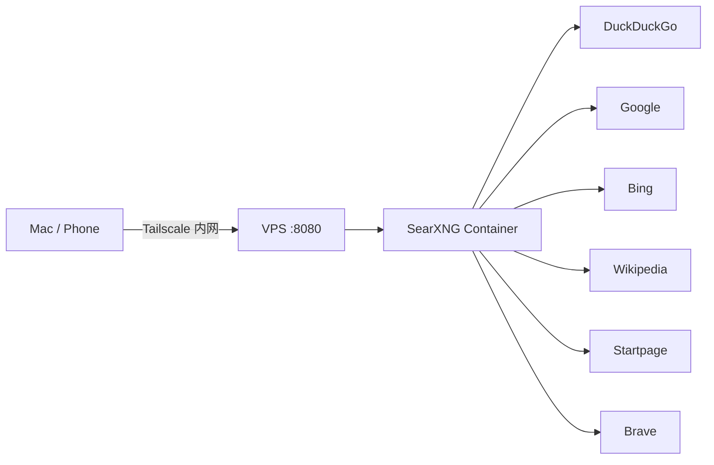

## 背景与动机

日常技术调研需要频繁搜索 GitHub、Reddit、X (Twitter)、V2EX、Stack Overflow 等平台，但：

1. **商业搜索引擎隐私成本高** — Google/Bing 每次搜索都在喂数据
2. **AI 搜索（Perplexity 等）不透明** — 不知道它读了哪些源，也无法控制搜索范围
3. **需要 JSON API** — 后续接入本地 LLM 做 RAG 或 Agent 的 web search tool
4. **不想依赖第三方 SaaS** — 一台 VPS + Docker 搞定，永久免费

SearXNG 是目前最成熟的开源元搜索引擎，聚合多个上游引擎结果，不追踪用户，支持 JSON API 输出。本文记录从选型到生产可用的完整过程。

---

## 最终架构



| 组件 | 说明 |
|------|------|
| VPS | 境外云厂商 Ubuntu 24.04, 1C/1GB/30GB |
| 访问 | Tailscale 内网 only, 公网防火墙不开 8080 |
| 容器 | `searxng/searxng:latest`, 256MB 内存限制 |
| 存储 | 无状态，仅挂载 settings.yml |
| 反代 | 无（私有实例不需要 HTTPS） |
| Redis | 无（limiter 关闭，无需状态存储） |

---

## 部署文件

### docker-compose.yml

```yaml
services:
  searxng:
    image: searxng/searxng:latest
    container_name: searxng
    ports:
      - "8080:8080"
    volumes:
      - ./settings.yml:/etc/searxng/settings.yml:ro
    environment:
      - SEARXNG_BASE_URL=http://localhost:8080/
      - TZ=Asia/Singapore
    restart: unless-stopped
    deploy:
      resources:
        limits:
          memory: 256M
        reservations:
          memory: 128M
    logging:
      driver: json-file
      options:
        max-size: "10m"
        max-file: "3"
```

要点：
- 所有路径用 `./` 相对路径，目录可整体 `scp` 到任意节点
- 内存硬限 256MB 防止 OOM 拖垮小内存 VPS
- 日志轮转 10MB × 3 = 最多 30MB 磁盘占用

### settings.yml

```yaml
use_default_settings:
  engines:
    keep_only:
      - google
      - bing
      - duckduckgo
      - wikipedia
      - startpage
      - brave

general:
  debug: false
  instance_name: "SearXNG"
  enable_metrics: false

search:
  safe_search: 0
  autocomplete: "duckduckgo"
  default_lang: ""
  formats:
    - html
    - json

server:
  port: 8080
  bind_address: "0.0.0.0"
  secret_key: "<openssl rand -hex 32 生成>"
  public_instance: false
  image_proxy: true
  request_timeout: 8
  limiter: false

ui:
  default_theme: simple
  default_locale: ""

outgoing:
  request_timeout: 8
  max_request_timeout: 15
```

---

## 关键配置决策与踩坑

### 1. `use_default_settings` 必须用继承模式

**错误做法**：`use_default_settings: false` + 手动写全部字段

SearXNG 期望几十个默认字段（`default_doi_resolver`、各种 plugin 配置等），缺一个就 500。正确做法是用 `use_default_settings.engines.keep_only` 来选择性启用引擎，继承所有其他默认值。

### 2. `default_lang: ""` 而非 `"zh-CN"`

这是**信息质量的关键开关**：

| 设置 | GitHub/Reddit/X 结果 | 中文结果 |
|------|---------------------|----------|
| `zh-CN` | 几乎搜不到，或只返回 CSDN/知乎转载 | 优先 |
| `""` (auto) | 一手英文源直达 | query 含中文时自动返回中文 |

技术调研场景下，一手英文源（原始 README、Reddit 讨论、Twitter thread）的信息密度远高于中文转述。设 `""` 让引擎根据 query 语言自动匹配。

### 3. `limiter: false` — 没 Redis 就别开

开 `limiter: true` 会激活 bot detection 的 `link_token` 机制，它需要 Valkey/Redis 存储状态。没有 Redis 时，**每一次 HTTP 请求**都会产生一条完整的 Python traceback：

```
ValueError: No connection to the Valkey database has been established.
```

这是日志膨胀的头号风险——一个用户一分钟几次搜索，日志就能以 MB/hour 的速度增长。私有实例不需要防 bot，直接关闭。

### 4. `default_locale` 的合法值

- 错误：`"zh"` → `ValidationException: Invalid value: "zh"`
- 正确：`"zh-Hans-CN"` 或 `""` (空字符串表示跟随浏览器)

SearXNG 使用 IETF 语言标签，不是 ISO 639-1 两字母码。如果不确定，设 `""` 最安全。

### 5. 日志轮转是必须项

Docker 默认 `json-file` driver **无大小限制**。一个 SearXNG 容器即使正常运行，引擎 CAPTCHA 报错也会持续写 ERROR 日志。在 30GB 磁盘的小 VPS 上，不加 `max-size` 最终一定会撑爆。

---

## 引擎实际可用性（SG 节点实测）

| 引擎 | 状态 | 行为 |
|------|------|------|
| **DuckDuckGo** | 主力 | 稳定返回；连续快速查询触发 CAPTCHA，自动恢复 |
| **Google** | 可用 | `default_lang: ""` 后解锁；部分查询有结果 |
| **Bing** | 静默失败 | SG IP 被地域封锁，返回 0 结果无报错 |
| **Startpage** | CAPTCHA | Google 代理引擎，反爬严格，小时级 suspended |
| **Brave** | 限流 | 几次请求后 "too many requests"，180s 冷却 |
| **Wikipedia** | 可靠 | 始终正常 |

**结论**：实际双引擎工作（DDG + Google），覆盖绝大部分场景。

---

## JSON API 使用

### 基本调用

```bash
curl -s 'http://<tailscale-ip>:8080/search?q=YOUR_QUERY&format=json'
```

### 解析注意事项

SearXNG 的 JSON 响应中，`content` 字段可能包含从网页抓取的控制字符（`\x00`-`\x1f`），导致标准 JSON parser 报错。解决方案：

```python
import json, re

raw = response.text
# 清理控制字符
clean = re.sub(r'[\x00-\x08\x0b\x0c\x0e-\x1f]', ' ', raw)
data = json.loads(clean, strict=False)

for r in data['results'][:5]:
    print(f"[{r['engine']}] {r['title']}")
    print(f"  {r['url']}")
```

### 响应结构

```json
{
  "query": "...",
  "results": [
    {
      "url": "https://...",
      "title": "...",
      "content": "...",
      "engine": "duckduckgo",
      "score": 1.0
    }
  ],
  "unresponsive_engines": [["brave", "Too many request"]]
}
```

`unresponsive_engines` 字段告诉你哪些引擎没返回以及原因，方便做 fallback 逻辑。

---

## Smoke Test 结果

使用优化后的配置，从 macOS 通过 Tailscale 调用 API：

| 测试场景 | 结果数 | 引擎 | 质量评估 |
|----------|--------|------|----------|
| `site:github.com searxng docker` | 9 | DDG | 直达官方 repo |
| `site:x.com AI agent 2025` | 10 | DDG | 真实推文链接 |
| `site:reddit.com selfhosted search` | 0→9 | DDG | CAPTCHA 冷却后恢复 |
| `SearXNG vs Perplexity` | 18 | DDG+Google | 双引擎覆盖 |
| `best AI agent frameworks 2025` | 10 | Google | Reddit/Langfuse/Deepchecks 一手源 |

---

## 资源占用

```
CONTAINER    CPU %    MEM USAGE / LIMIT    NET I/O
searxng      0.02%    ~80MB / 256MB        minimal
```

日常空闲 ~80MB，搜索峰值不超过 150MB。256MB limit 给了足够余量。

---

## 后续可选优化

| 方向 | 做法 | 收益 |
|------|------|------|
| 代理池 | `outgoing.proxies` 配多个 SOCKS5 | 避免单 IP 被引擎封禁 |
| 接入 LLM | SearXNG JSON → Local LLM RAG | 构建私有 Perplexity |
| MCP Server | 包装为 Claude Code 的 web_search tool | Agent 直接调用 |
| 多节点 | 同一份配置 `scp` 到家里 NAS | 低延迟本地搜索 |

---

## 一句话总结

一台 1GB VPS + 一个 Docker 容器 + 40 行 YAML = 永久免费的私有搜索 API，接 Tailscale 后全设备可用，再也不用给 Google 交隐私税。
