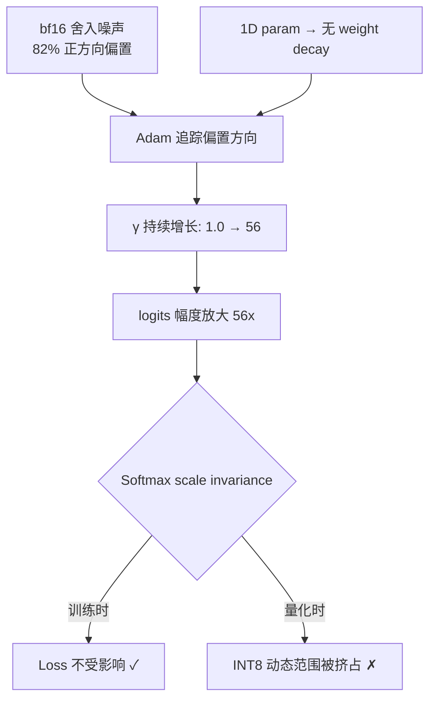
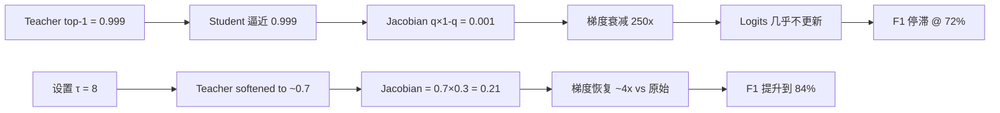
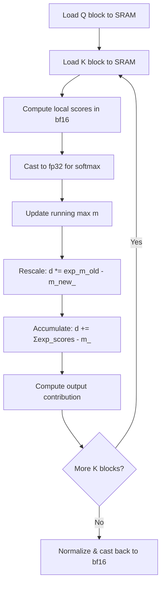
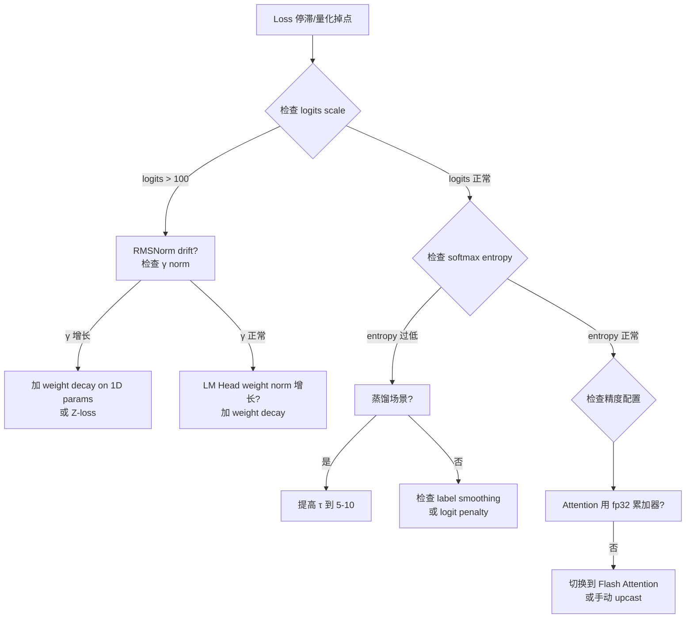

一个 3B 模型训练到中后期，RMSNorm 最后一层的 learnable scalar 从初始值 1.0 悄悄漂移到了 56。训练 loss？纹丝不动。验证 perplexity？看不出异常。直到模型做 INT8 量化部署——精度断崖式下跌，top-1 accuracy 掉了 12 个点。这篇文章从这个真实 case 出发，把 softmax 的数值陷阱、温度调控、精度问题串成一条线。

---

## 1. Case：RMSNorm Scalar 漂移到 56，Loss 为什么不动

### 现象

一个 3B 参数的语言模型，采用标准的 Pre-RMSNorm + LM Head 结构。训练过程中监控发现最后一层 RMSNorm 的 learnable scale parameter $\gamma$ 持续增长，最终稳定在 ~56（初始值为 1.0）。

诡异的是：**训练 loss 全程平稳下降，没有任何异常信号**。

### 根因分析

这个 scalar 的漂移有三个协同的推手：

**推手 1：Adam 在零梯度参数上的行为。** 当一个参数对 loss 没有贡献时（梯度为 0），Adam 的一阶动量 $m_t$ 虽然会衰减，但二阶动量 $v_t$ 也在衰减。关键在于 bf16 训练中，即使"理论梯度为 0"，实际梯度也不会精确为 0——bf16 的舍入噪声会产生微小的方向性偏差。

**推手 2：bf16 的方向性噪声。** 实测统计显示，bf16 下这个 scalar 的梯度噪声有 **82% 为正方向**。这不是巧合——bf16 的 round-to-nearest-even 在特定数值分布下会产生系统性偏置。Adam 会忠实地跟踪这个偏置方向，缓慢但持续地推高参数值。

**推手 3：Megatron 的 weight decay 启发式。** 很多大模型训练框架（Megatron-LM 等）采用一个广泛使用的启发式规则：`len(param.shape) == 1` 的参数不施加 weight decay。RMSNorm 的 $\gamma$ 是一维向量，因此没有任何正则化力量来对抗漂移。



### 为什么 Loss 不受影响：Softmax 的 Scale Invariance

这是 softmax 最基本的数学性质。对任意常数 $c > 0$：

$$\text{softmax}(c \cdot z)_i = \frac{e^{c \cdot z_i}}{\sum_j e^{c \cdot z_j}}$$

当 $c$ 作为全局缩放因子时，softmax 的输出分布的**形状**不变（但**锐度**会变）。更准确地说，softmax 具有 shift invariance（加常数不变），但对**乘法缩放**实际上会改变分布的 entropy。

等等，那为什么 loss 不动？

关键在于：RMSNorm scalar 的漂移是**渐进的**，模型的 LM Head 权重会协同调整。训练过程中，LM Head 的权重 norm 实际上在**缓慢缩小**，部分抵消了 $\gamma$ 的增长。最终 logits 的有效 scale 增长远小于 56 倍，但仍然显著高于正常范围。Cross-entropy loss 对 logits 的绝对 scale 不敏感（只要 argmax 不变），所以 loss 曲线看起来完全正常。

### 量化时的灾难：5.8 bits 动态范围损失

INT8 量化需要把 float 值映射到 $[-128, 127]$ 的整数范围。当 logits 因为 $\gamma = 56$ 而具有异常大的幅度时：

$$\text{scale} = \frac{\max(|z|)}{127}$$

假设正常模型 logits 范围是 $[-15, 15]$，量化 scale = 15/127 ≈ 0.118。而漂移后 logits 范围是 $[-840, 840]$（15 × 56），量化 scale = 840/127 ≈ 6.61。

有效精度损失：$\log_2(56) \approx 5.8$ bits。在 INT8 总共只有 8 bits 有效精度的情况下，丢失 5.8 bits 意味着量化后只剩下约 2.2 bits 的有效分辨率——几乎退化为 ternary quantization。

### 修复方案

| 方案 | 效果 | 代价 |
|------|------|------|
| 对 1D params 也施加 weight decay（$\lambda = 0.01$） | 彻底阻止漂移 | 需要修改优化器配置 |
| 冻结最后一层 RMSNorm 的 $\gamma = 1$ | 物理消除漂移源 | 可能微损模型表达力 |
| Z-loss: $\alpha \cdot \log^2(\sum_j e^{z_j})$ | 惩罚 logits scale 增长 | 引入超参 $\alpha$（典型值 $10^{-4}$） |
| Logit capping: $z \leftarrow c \cdot \tanh(z/c)$, $c = 30$ | 硬性约束幅度 | 可能影响 tail token 概率 |

---

## 2. Softmax 数学：从 Case 中提炼通用公式

上面的 case 引出了 softmax 的核心数学性质。系统梳理一遍。

### 定义与数值稳定实现

给定 logits 向量 $z \in \mathbb{R}^n$：

$$\text{softmax}(z_i) = \frac{e^{z_i}}{\sum_{j=1}^{n} e^{z_j}}$$

直接实现会溢出。标准做法是 **Log-Sum-Exp trick**——减去最大值：

$$\text{softmax}(z_i) = \frac{e^{z_i - m}}{\sum_{j=1}^{n} e^{z_j - m}}, \quad m = \max_j z_j$$

这正是某些优化器采用极小 epsilon（如 $\epsilon = 10^{-20}$）时不会影响 softmax 稳定性的原因——softmax 的数值稳定性靠的是 LSE trick，不是 optimizer 的 epsilon。Optimizer epsilon 管的是参数更新的分母，和 forward pass 中的 softmax 计算是两条独立的数值通路。

### Log-Softmax 不等于 Softmax + Log

$$\log \text{softmax}(z_i) = z_i - m - \log \sum_{j=1}^{n} e^{z_j - m}$$

PyTorch 的 `F.log_softmax` 直接用 LSE 公式，避免先算出 $[0,1]$ 范围内的极小概率值再取 log。在 cross-entropy 中永远用 `F.cross_entropy`（内部调 log-softmax），不要手动 `softmax` → `log` → `nll_loss`。

### Jacobian 与饱和

设 $q_i = \text{softmax}(z_i)$，偏导数为：

$$\frac{\partial q_i}{\partial z_j} = q_i(\delta_{ij} - q_j)$$

对角项：$\frac{\partial q_i}{\partial z_i} = q_i(1 - q_i)$

这个形式决定了梯度的"通量"。下一节的蒸馏 case 会直接用到这个公式。

---

## 3. Case：蒸馏中 KL Loss 在降但 F1 不涨

### 现象

一个 IE（信息抽取）任务的知识蒸馏场景。Teacher 模型（7B）在 entity extraction 上表现优秀，top-1 概率高达 ~0.999。Student 模型（1.5B）用标准 KL divergence loss 蒸馏。

观察到：**KL loss 持续下降，但下游 F1 停在 72% 不再提升**（teacher F1 = 89%）。

### 根因：Jacobian 梯度衰减 250x

Teacher 输出 $q_{\text{top}} = 0.999$ 时，student 在逼近 teacher 分布的过程中，自身 softmax 输出对 logits 的梯度为：

$$\frac{\partial q_i}{\partial z_i} = q_i(1 - q_i) = 0.999 \times 0.001 = 0.001$$

对比 $q_i = 0.5$（最大梯度点 $0.25$），梯度衰减了 **250 倍**。

KL loss 还在降的原因：student 在非 top-1 token 上仍有优化空间（比如把第二名从 0.0008 调整到 0.0005），这些微调会减小 KL，但对下游 F1 几乎没有贡献。



### 修复：Task-Specific Temperature τ = 8

对 teacher logits 除以 $\tau = 8$ 后：

$$q_{\text{top}}^{(\tau=8)} = \frac{e^{z_{\text{top}}/8}}{\sum_j e^{z_j/8}} \approx 0.7$$

此时 Jacobian = $0.7 \times 0.3 = 0.21$，相比原始的 $0.001$ 提升了约 **210 倍**。

标准 KD loss 带温度补偿：

$$\mathcal{L}_{\text{KD}} = \tau^2 \cdot \text{KL}\left(\text{softmax}(z^T/\tau) \| \text{softmax}(z^S/\tau)\right)$$

$\tau^2$ 的存在是因为：温度 $\tau$ 让 logits 缩小 $\tau$ 倍，梯度因此也缩小 $\tau$ 倍（链式法则），乘以 $\tau^2$ 恰好补偿一个 $\tau$，使得有效梯度 scale 正比于 $\tau$（放大信号）而非 $1/\tau$（衰减信号）。

### Dark Knowledge 的物理意义

Hinton (arXiv: 1503.02531) 的核心洞察：teacher 在"错误"类别上的概率分布包含结构化信息。比如在 NER 任务中，teacher 把一个 PERSON entity 的非正确 label 概率分配为 LOC: 0.0006, ORG: 0.0003, DATE: 0.00001——这编码了"人名长得更像地名而非日期"的知识。

低温下这些概率差异被压缩到 bf16 的精度极限以下，无法被 student 学到。$\tau = 8$ 把它们拉回可区分的范围。

### 不同场景的温度选择

| 场景 | 推荐 τ | 原因 |
|------|---------|------|
| 代码生成（部署） | 0.1 – 0.3 | 需要高精度，降低随机性 |
| 创意写作（部署） | 0.7 – 1.0 | 需要多样性 |
| Sharp teacher 蒸馏 | 5 – 10 | 恢复 dark knowledge |
| Soft teacher 蒸馏 | 2 – 4 | Teacher 本身不太 confident |
| Label smoothing 等效 | 1 – 2 | 轻度平滑即可 |

---

## 4. Case：bf16 训练的 Attention 精度问题

### 背景

同一个 3B 模型，训练配置为 `precision=bf16`（全 bf16 训练，非混合精度）。Sequence length = 4096。训练过程中发现长文档的 perplexity 比短文档异常偏高，差距超出 context length 的自然影响。

### bf16 的精度限制

bf16 格式：1 bit sign + 8 bit exponent + 7 bit mantissa。有效精度约 $2^{-7} \approx 0.78\%$（相对误差）。

在 attention softmax 中，需要对 4096 个 $e^{s_j - m}$ 值求和。每次累加引入的相对舍入误差为 $\epsilon_{\text{bf16}} \approx 2^{-8}$（因 mantissa 7 bit）。累加 $N$ 次后，最坏情况误差增长为 $O(N \cdot \epsilon)$：

$$\text{相对误差} \approx 4096 \times 2^{-8} = 16$$

这意味着 bf16 直接累加 4096 个值，相对误差可能达到 **1600%**——完全不可用。实际上由于数值不均匀分布，误差不会达到最坏情况，但即使是典型情况下也会有 5-10% 的相对误差。

### Flash Attention 的解决方案

Flash Attention (arXiv: 2205.14135) 在 SRAM 中使用 **fp32 累加器** 来做 softmax 的归一化计算：

```
inputs (bf16) → cast to fp32 in SRAM → subtract max → exp → sum (fp32 accumulator) → divide → cast back to bf16
```

这不是可选的优化——是正确性的保证。论文 Section 3.1 明确指出，softmax 的数值稳定性要求内部计算在更高精度下完成。

### Online Softmax 算法

Flash Attention 用 online softmax (Milakov & Gimelshein, 2018) 实现分块计算，避免 materialize $N \times N$ attention matrix：

```python
# 伪代码：single-pass online softmax
m = -inf  # running max
d = 0.0   # running sum (fp32)
for block in K_blocks:
    scores = Q @ block.T / sqrt(d_k)  # local scores
    m_new = max(m, max(scores))
    d = d * exp(m - m_new) + sum(exp(scores - m_new))  # fp32 accumulation
    m = m_new
```

关键步骤是第 4 行的修正因子 $e^{m_{\text{old}} - m_{\text{new}}}$：当新 block 出现更大的 score 时，之前所有累加值需要"重新校准"到新的 baseline。这个操作在 bf16 下如果不提升精度，修正因子本身的精度就不够。



---

## 5. Optimizer Epsilon 与 Softmax 稳定性的独立性

### 一个常见困惑

有些大模型使用极小的 optimizer epsilon（如 $\epsilon = 10^{-20}$，对比 Adam 标准默认值 $10^{-8}$）。初看会担心：这么小的 epsilon 会不会影响数值稳定性？

答案是：**与 softmax 无关**。两者属于完全不同的计算通路。

### Optimizer 中的 epsilon

Adam 的参数更新公式：

$$\theta_{t+1} = \theta_t - \frac{\eta \cdot \hat{m}_t}{\sqrt{\hat{v}_t} + \epsilon}$$

Epsilon 的作用是防止分母为零。标准 Adam 用 $\epsilon = 10^{-8}$ 是因为 fp32 下 $\sqrt{\hat{v}_t}$ 可能非常小。但某些优化器（如 Muon）对二阶矩的处理方式不同——它们可能对梯度做了 normalize 或 orthogonalize，使得 $\hat{v}_t$ 始终在一个有意义的范围内，此时 epsilon 的大小就不重要了，设成 $10^{-20}$（事实上的零）也不会触发数值问题。

### Forward Pass 中的 Softmax

Softmax 的数值稳定性完全靠 **LSE trick**（减去最大值），与任何 optimizer 超参无关：

$$\text{softmax}(z_i) = \frac{e^{z_i - \max(z)}}{\sum_j e^{z_j - \max(z)}}$$

即使 logits 绝对值很大（比如 case 1 中因 $\gamma = 56$ 导致的大 logits），只要实现了减最大值，$\exp$ 的输入就在 $(-\infty, 0]$，输出在 $(0, 1]$，不会溢出。

---

## 6. 综合诊断框架

把三个 case 的教训串起来，形成一个系统的监控和诊断框架：

### 监控指标

| 指标 | 正常范围 | 异常信号 | 关联 Case |
|------|---------|---------|-----------|
| RMSNorm $\gamma$ 的 L2 norm | 0.5 – 3.0 | 持续单调增长 | Case 1 |
| Logits 的绝对值范围 | [-30, 30] | 超过 [-100, 100] | Case 1 |
| Softmax output entropy | 任务相关 | 过早坍缩到 < 0.1 | Case 2 |
| Teacher top-1 probability | < 0.95 最佳 | > 0.999 需加温 | Case 2 |
| Attention score 方差 | 随层变化 | 长序列上异常 | Case 3 |

### 诊断决策树



### 实践 Checklist

1. **训练配置审查**
   - 确认 weight decay 策略：1D params（包括 RMSNorm $\gamma$、bias）是否有正则化
   - 确认 attention 实现是否使用 fp32 softmax 累加器
   - 如使用 bf16 训练，确认 loss scaling 策略

2. **蒸馏配置审查**
   - 检查 teacher 在目标任务上的 confidence 分布
   - 如果 top-1 > 0.99，必须引入 temperature（典型 τ = 5-10）
   - 验证 F1/accuracy 与 KL loss 是否同步下降

3. **量化前检查**
   - 统计 logits 的动态范围（max - min）
   - 如果动态范围 > 60，排查 norm layer scalar drift
   - 考虑量化前做 logit rescaling 或 SmoothQuant

4. **长序列部署**
   - 对比 fp32 baseline 和实际推理精度（attention output 误差 < 1%）
   - 监控不同序列长度下的 perplexity 曲线是否有异常拐点

---

## 7. 总结

三个 case 揭示了 softmax 作为"logits → probability"的映射，其数值行为在不同阶段的表现：

- **训练时**：Scale invariance 让 logit 漂移"静默"发生，loss 是聋子——它听不到 scale 的变化。但量化是照妖镜，INT8 的有限动态范围会暴露一切隐藏的 scale 问题。
- **蒸馏时**：Jacobian $q(1-q)$ 的饱和特性让 sharp teacher 的知识"锁死"在极窄的梯度通道里。Temperature 是钥匙，但需要针对任务校准，不是万能的 τ = 4。
- **推理时**：bf16 的 7-bit mantissa 在长序列累加中不堪重负。Flash Attention 的 fp32 累加器不是性能优化，而是正确性保证。

这三个问题看似独立，但根源相同：**softmax 把无界的 logits 压缩到 $[0, 1]$，这个压缩在边界处是剧烈非线性的，而有限精度的浮点数无法忠实表达这种非线性的全部细节**。理解这一点，上述所有"trick"就不再是独立的经验补丁，而是对同一个数学事实在不同工程约束下的必然应对。

---

## References

1. Milakov, M. & Gimelshein, N. (2018). *Online normalizer calculation for softmax*. [arXiv:1805.02867](https://arxiv.org/abs/1805.02867)
2. Dao, T. et al. (2022). *FlashAttention: Fast and Memory-Efficient Exact Attention with IO-Awareness*. [arXiv:2205.14135](https://arxiv.org/abs/2205.14135)
3. Hinton, G., Vinyals, O. & Dean, J. (2015). *Distilling the Knowledge in a Neural Network*. [arXiv:1503.02531](https://arxiv.org/abs/1503.02531)
4. Chowdhery, A. et al. (2022). *PaLM: Scaling Language Modeling with Pathways*. [arXiv:2204.02311](https://arxiv.org/abs/2204.02311) (Z-loss for logit stabilization)
5. Dao, T. (2023). *FlashAttention-2: Faster Attention with Better Parallelism and Work Partitioning*. [arXiv:2307.08691](https://arxiv.org/abs/2307.08691)
6. Blanchard, P. et al. (2020). *Accurately computing the log-sum-exp and softmax functions*. [arXiv:2001.04438](https://arxiv.org/abs/2001.04438)
