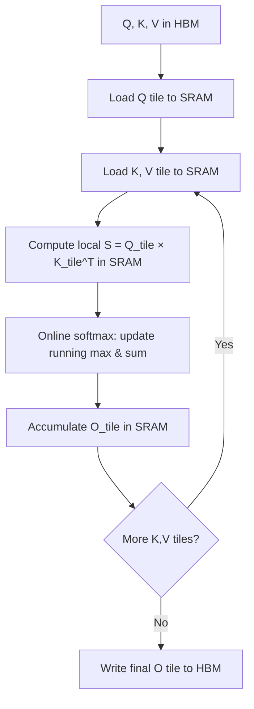
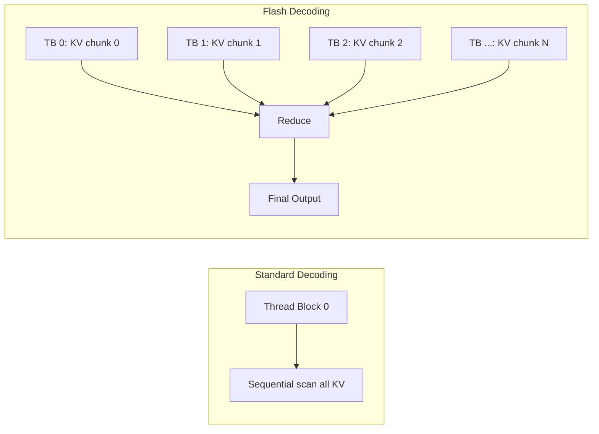
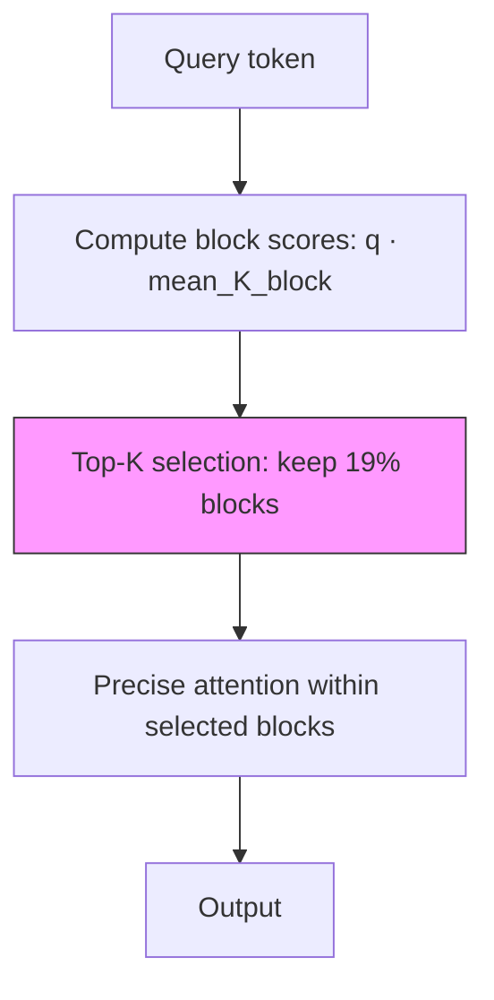
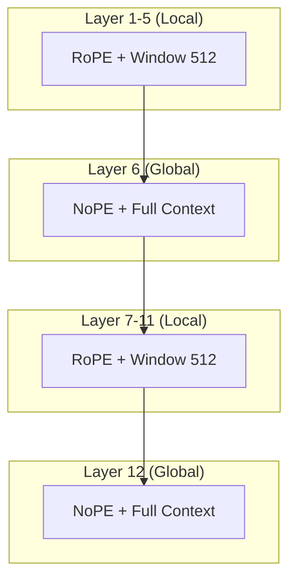
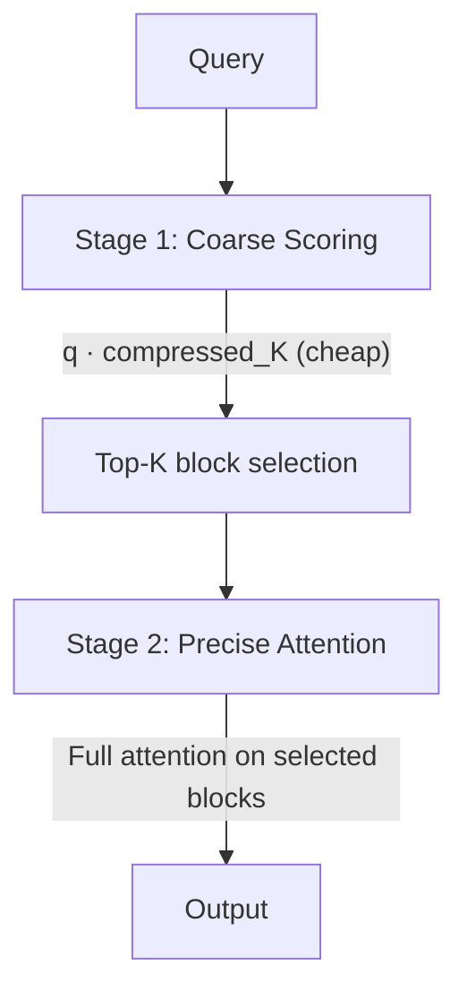
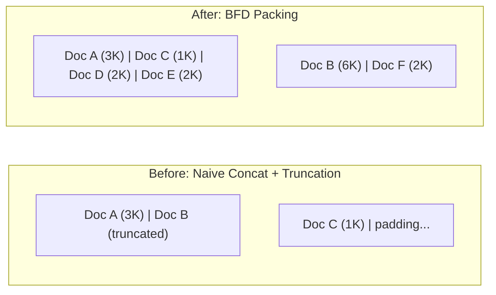
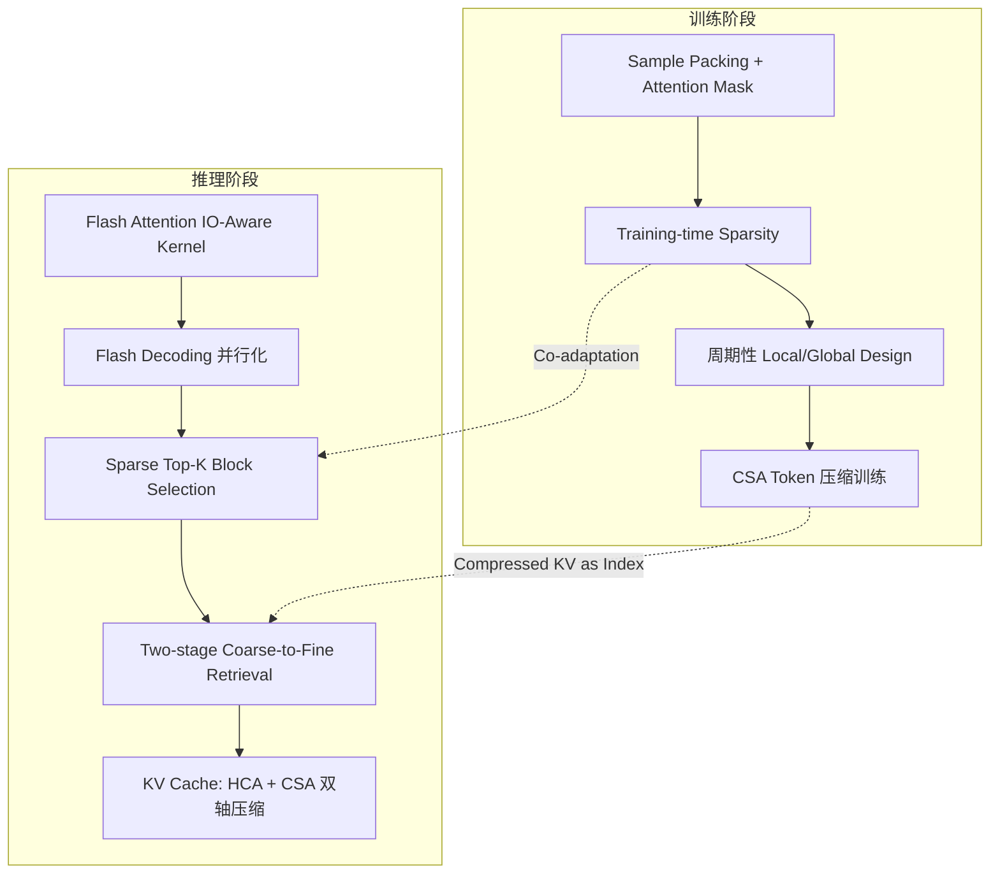

## 开场：Post-hoc 剪枝为什么在实测中翻车

我们在某 2.7B 端侧模型上做 128K 长文推理加速。第一个尝试是 post-hoc Top-K attention pruning——推理时对每个 query 只保留 attention score 最高的 19% KV block（81% sparsity）。

基准测试一跑，傻眼了：

```
# 128K context, needle-in-a-haystack retrieval
Full attention:         score 94.2, latency 4.7s/token
Post-hoc 81% sparse:   score 89.1 (-5.1!), latency 1.2s/token

# 128K context, long-document QA (multi-hop)
Full attention:         score 71.8, latency 4.7s/token
Post-hoc 81% sparse:   score 67.3 (-4.5!), latency 1.2s/token
```

4x 加速没问题，但 4-5 分的质量损失在生产中不可接受。更诡异的是：同样 81% sparsity，如果从**预训练阶段就引入** Top-K block selection：

```
Training-time 81% sparse: score 93.7 (-0.48!), latency 0.67s/token (7x!)
```

0.48 分 vs 5 分，差了 10 倍。而且训练时稀疏的模型推理更快（7x vs 4x），因为它的 attention pattern 更结构化、更适合硬件 tiling。

### Co-adaptation：为什么训练时稀疏效果好 10 倍

为了理解为什么差距这么大，我们导出了两个模型的 attention heatmap（layer 16, head 4, 128K context）：

- **Post-hoc 模型**：attention score 分布平坦，信息均匀分散在整个序列中。Top-19% 只能捕获约 60% 的 attention mass → 剩余 40% 被丢弃 → 信息严重丢失
- **Training-time sparse 模型**：attention score 高度集中，Top-19% 的 block 承载了 >95% 的 attention mass → 几乎无信息丢失

这就是 co-adaptation：模型在训练中学会了"我只能看 Top-K block，所以我要把重要信息写入容易被 Top-K 选中的位置"。这本质上是一种 learned information layout——representation 和 attention pattern 互相适应。

### 完整方案对比

| 方案 | Sparsity | Quality Δ | Speedup | 是否需从头训练 | 适用场景 |
|------|----------|-----------|---------|--------------|---------|
| Full Attention | 0% | baseline | 1x | — | 短文本 |
| Post-hoc Top-K | 81% | -2.5~-5.0 | 4x | 否 | 快速验证 |
| Training-time Sparse | 81% | -0.48 | 7x | 是 | 生产部署 |
| Periodic Local+Global | ~83% | -0.3~-0.8 | 5-6x | 是 | 超长文 (1M+) |
| CSA (compressed) | ~90% | -0.5~-1.0 | 3-4x | 是 | 极长文 + KV cache 受限 |

这背后的技术栈，从底层的 IO-Aware 计算到上层的稀疏 attention 设计，构成了一条完整的优化链路。本文将从 Flash Attention 出发，逐层展开这幅全景。

---

## 1. Flash Attention 的 IO-Aware 核心思想

### 内存层级：被忽视的瓶颈

GPU 的计算单元（CUDA cores / Tensor Cores）算力惊人，但内存系统存在显著的层级差异：

| 存储层级 | 容量 | 带宽 | 延迟 |
|---------|------|------|------|
| SRAM (on-chip) | ~20 MB | ~19 TB/s | ~ns |
| HBM (off-chip) | 40-80 GB | ~2 TB/s | ~100 ns |

**关键洞察**：现代 GPU 上，计算是便宜的（FLOPs 充裕），真正的瓶颈是 HBM 带宽。Attention 的 O(N^2) 中间矩阵一旦写入 HBM 再读回，IO 代价远超计算本身。

### 标准 Attention 的 IO 灾难

```
Q, K, V ∈ HBM
S = QK^T → 写入 HBM (O(N²) 存储)
P = softmax(S) → 读 S, 写 P 回 HBM
O = PV → 读 P, 读 V, 写 O
```

三次 O(N^2) 的 HBM 读写，attention matrix 完全 materialized。

### Flash Attention：Tiling + Online Softmax

Flash Attention 的核心是**永远不把 N x N 矩阵写入 HBM**：



**Online Softmax Trick**：不需要完整的一行 attention scores 就能计算 softmax。维护 running maximum `m` 和 running sum `l`，每处理一个新 tile 时：

$$m_{new} = \max(m_{old}, m_{tile})$$
$$l_{new} = l_{old} \cdot e^{m_{old} - m_{new}} + l_{tile} \cdot e^{m_{tile} - m_{new}}$$

已经累积的输出通过 rescaling 修正：$O_{new} = O_{old} \cdot \frac{l_{old}}{l_{new}} + O_{tile} \cdot \frac{l_{tile} \cdot e^{m_{tile}-m_{new}}}{l_{new}}$

结果：IO 复杂度从 O(N^2) 降到 O(N^2 d / M)（M 为 SRAM 大小），实际 wall-clock 提速 2-4x，且**数值精确**（不是近似）。

---

## 2. Flash Decoding — 推理时的 IO 优化

### 解码阶段的特殊性

自回归生成时，每步只有**一个 query token** 对全部 KV cache 做 attention。这是典型的 memory-bound 场景：

- Batch size = 1 时，矩阵乘退化为 matrix-vector product
- GPU 利用率极低（大量 SM 空闲）
- KV cache 随序列长度线性增长

### Flash Decoding 的并行策略



核心思路：
1. **Split**：将 KV cache 切分到多个 thread blocks
2. **Partial Attention**：每个 block 独立计算 partial softmax（携带 local max 和 local sum）
3. **Reduce**：用 log-sum-exp 技巧合并所有 partial results

这样 GPU 的并行度从 `batch_size × num_heads` 提升到 `batch_size × num_heads × num_splits`，在长序列解码时显著提升 SM 利用率。

### 进阶优化

- **FlashDecoding++**：引入统一的 max value 预估，避免 reduce 阶段的 rescaling 开销
- **DFlash**：针对 variable-length batches（continuous batching）优化 warp 调度
- **PagedAttention**：KV cache 分页管理，配合 Flash Decoding 实现低碎片、高并行

---

## 3. 训练时稀疏 vs 推理时稀疏

### Post-hoc Sparsity 的困境

传统方案：用 full attention 训练模型，推理时做 Top-K 近似。

**问题**：模型从未见过稀疏 pattern，attention 分布是"弥散"的——信息分散在所有 token 上。强行 prune 掉 81% 的 attention 造成严重的 distribution mismatch。

### Training-time Sparsity 的优势

某端侧模型的做法（基于 InfLLM v2 架构）：

1. **预训练即引入 block-level Top-K**：每个 query 只 attend to top-K 个 block（block size = 64 tokens）
2. **Gate scoring**：用轻量的 scoring function（如 mean-pooled key 与 query 的点积）选择 blocks
3. **Straight-through estimator**：Top-K 选择不可微，使用 STE 或 Gumbel-Softmax 近似梯度



**Co-adaptation 效应**：经过数百 billion tokens 的训练后，模型学会了：
- 将关键信息"写入"少数 block 的 KV 表示中
- Query 端的 scoring function 精确定位这些 block
- 冗余信息自然被压缩或消除

结果：81% sparsity 下质量几乎无损（-0.48 分），且 scoring + sparse attention 的总 FLOPs 远小于 full attention，在 128K 上下文中实现 7x 解码加速。

---

## 4. 周期性 Local/Global Attention 设计

### 并非所有层都需要看全部 token

某 962B MoE 模型的 thinking 变体采用了一种优雅的周期设计：

| 层类型 | 比例 | Position Encoding | Window | 功能 |
|--------|------|------------------|--------|------|
| Local | 5/6 | RoPE (base 10000) | 512 tokens | 局部语义处理 |
| Global | 1/6 | NoPE (无位置编码) | Full context | 跨距信息聚合 |

**5:1 周期**：每 6 层中 5 层是 local attention，1 层是 global attention。

### 为什么 Global 层用 NoPE？

实验发现：
- NoPE 在 global 层的性能与 RoPE **持平或略优**
- NoPE 的 KV cache 在推理时更 inference-efficient（不需要 position-dependent 的 RoPE rotation）
- Global 层的职责是**信息聚合**而非位置敏感的 pattern matching

### 设计原则



KV cache 成本分析：
- Local 层：每层仅存 512 tokens 的 KV → 极低内存
- Global 层：存全量 KV → 但只有 1/6 的层
- 总 KV cache ≈ 全 global 方案的 **~20%**

---

## 5. CSA + HCA — 双轴 KV Cache 压缩

当上下文达到百万级 token 时，即使有 Flash Attention，KV cache 的**内存占用**本身也成为瓶颈。某大规模 MoE 模型提出了双轴压缩方案：

### Head 轴压缩 (HCA)

- **GQA**：多个 query heads 共享一组 KV heads（如 8:1）
- **MLA**：进一步将 KV 压缩到低秩 latent space

### Token 轴压缩 (CSA)

**Block-level Aggregation**：将连续 4 个 token 的 KV 聚合为 1 个 compressed KV：

$$\tilde{K}_i = \text{Aggregate}(K_{4i}, K_{4i+1}, K_{4i+2}, K_{4i+3})$$

聚合方式：weighted mean pooling（权重可学习），实现 4x token 维度压缩。

### 联合效果

| 压缩轴 | 方法 | 压缩比 |
|--------|------|--------|
| Head | GQA/MLA | 4-8x |
| Token | CSA (block=4) | 4x |
| **联合** | **Head + Token** | **16-32x** |

在 1M context 下，KV cache 从 ~160 GB 降至 ~16 GB，实现 **90% 压缩**。

### Two-stage Retrieval

CSA 的 compressed KV 同时充当**检索索引**：



1. **Coarse scoring**：query 与 compressed KV 点积，O(N/4) 复杂度
2. **Top-K selection**：选出最相关的 blocks
3. **Precise attention**：仅在选中 blocks 的原始 KV 上做 full attention

### 工程细节

- **Overlapped compression windows**：相邻 compression block 有 50% overlap，避免边界信息丢失
- **Single-Softmax normalization**：coarse 和 precise 阶段共享一个 softmax 归一化，比 learned gates（如 sigmoid 加权）更简洁且训练更稳定

---

## 6. Sample Packing 与 Attention Masking

### 问题：短文档被截断造成的浪费

预训练时，文档长度服从 heavy-tail 分布。固定序列长度（如 8192）下：
- 长文档被截断：丢失上下文
- 短文档 padding：浪费算力
- 简单拼接：跨文档 attention 造成信息泄漏

### Best-Fit-Decreasing Bin Packing

将文档视为"物品"，序列长度视为"箱子容量"：



**BFD 算法**：
1. 将所有文档按长度降序排列
2. 依次将每个文档放入剩余空间最合适的 bin（best-fit）
3. 无合适 bin 则开新 bin

### Sample-level Attention Masking

关键约束：**同一序列中的不同文档彼此不可见**。

```
Sequence: [Doc A tokens | Doc B tokens | Doc C tokens]
Mask:     Doc A 只 attend to Doc A
          Doc B 只 attend to Doc B  
          Doc C 只 attend to Doc C
```

实现上，在 Flash Attention 的 tiling loop 中加入 document boundary 检查，开销极小。

### OBFD 优化

原始 BFD 对大规模语料（数十亿文档）的 O(N^2) 复杂度不可接受。优化方案：
- 使用 **segment tree** 维护 bin 的剩余容量
- 查询"容量 >= doc_len 的最满 bin"：O(log L)（L 为 bin 数）
- 总复杂度：**O(N log L)**

效果：相比简单拼接+截断，sample packing 使有效训练 token 利用率提升 15-25%，且消除了跨文档信息泄漏。

---

## 全景图：IO-Aware 优化的完整链路



从 Flash Attention 的 tiling 消除 O(N^2) IO，到 Flash Decoding 的并行化提升 SM 利用率，再到训练时稀疏实现 quality-preserving 的 7x 加速——这条链路的核心哲学始终是：

> **让计算去适应硬件的内存层级，而非让硬件去适应算法的内存需求。**

训练时稀疏的成功更进一步说明：当我们把硬件约束（sparse access pattern）作为 inductive bias 注入训练过程，模型会学会比人工设计更优雅的信息组织方式。

---

## 参考文献

- [1] Dao, T. et al. "FlashAttention: Fast and Memory-Efficient Exact Attention with IO-Awareness." [arXiv:2205.14135](https://arxiv.org/abs/2205.14135)
- [2] Dao, T. "FlashAttention-2: Faster Attention with Better Parallelism and Work Partitioning." [arXiv:2307.08691](https://arxiv.org/abs/2307.08691)
- [3] Dao, T. "Flash-Decoding for long-context inference." Blog post, 2023.
- [4] MiniCPM4 Technical Report (InfLLM v2). [arXiv:2506.07900](https://arxiv.org/abs/2506.07900)
- [5] MAI-Thinking-1. Microsoft Technical Report, 2025.
- [6] DeepSeek-V4 (CSA). Technical Report, 2026.
- [7] Shi, H. et al. "Fewer Truncations Improve Language Modeling." ICML 2024.
- [8] TST (Token Superposition Training). [arXiv:2605.06546](https://arxiv.org/abs/2605.06546)
