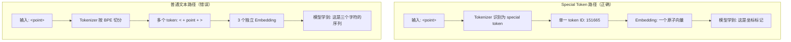

某 3B 多模态模型做 special token 重命名（防止与纯文本冲突），UIAgent 指标直接崩了。其它评测全部正常。排查了一天发现原因荒谬地简单：`<point>` 没有进重命名列表，被当成了普通文本训练。把它注册为 special token 后指标立即恢复。

这篇文章记录这个 bug 的完整排查过程，以及它揭示的 special token 工程陷阱。

## 背景：为什么要重命名 Special Token

多模态模型使用大量 special token 来标记不同模态的边界和结构化输出：`<image>`、`<video>`、`<box>`、`<point>` 等。

问题在于：这些 token 长得和普通 HTML/XML 标签一模一样。当训练数据包含网页内容、代码片段或技术文档时，`<image>` 可能就是一段 HTML 描述中的纯文本。Tokenizer 无法区分"这个 `<image>` 是模态标记"还是"这个 `<image>` 是用户在讨论 HTML 标签"。

解决方案：将 special token 重命名为更独特的格式（类似 Qwen 的 `<|image_pad|>` 风格），从根本上消除碰撞：

```python
token_rename_map = {
    "<image>": "<|image_pad|>",
    "<video>": "<|video_pad|>",
    "<vision_start>": "<|vision_start|>",
    "<vision_end>": "<|vision_end|>",
    "<box>": "<|box_start|>",
    "</box>": "<|box_end|>",
    "<ref>": "<|ref_start|>",
    "</ref>": "<|ref_end|>",
    # ... 其他 token
}
```

实现路径：替换所有训练数据中的 special token + 更新 tokenizer 词表。听起来很直接。

## 实验时间线

| 实验 | 配置 | UIAgent 结果 |
|------|------|-------------|
| Baseline（橙色） | 旧代码，旧 token，image+video | 正常 |
| Exp 1（粉色） | 新代码，重命名 token，image+video | **崩溃** |
| Exp 2（红色） | 新代码，重命名 token，仅 image | **崩溃** |
| Exp 3（绿色） | 新代码，重命名 token，`<point>` → special token | **恢复** |

关键观察：
- Exp 1 vs Baseline：重命名后 UIAgent 崩了，但 VQA、captioning、OCR 等通用指标全部正常
- Exp 2：排除 video 数据干扰，问题依旧 → 不是 video 的锅
- Exp 3：唯一变量是把 `<point>` 注册为 special token → 指标恢复到 baseline 水平

## Root Cause：文本分词 vs Special Token 语义

核心问题用一张图说清楚：



当 `<point>` 是 special token 时：
- 它是一个**原子单元**，有独立的 embedding
- 模型将其作为坐标系统的**语义锚点**
- 生成时，一步输出完整的 `<point>` token

当 `<point>` 是普通文本时：
- 它被 BPE 拆成 `<` + `point` + `>` 三个（或更多）subword
- 模型学到的是"在坐标前后输出尖括号和字母"
- 生成时，逐字符拼出 `<point>`，但 token ID 序列完全不同

UIAgent 的评测脚本期望在模型输出中 decode 出 special token ID。模型输出的是普通文本 token 序列。ID 不匹配 → 解析失败 → 指标归零。

## 为什么训练时完全看不出来

这个 bug 的阴险之处在于它在训练阶段**完全隐形**：

**1. 训练 Loss 正常**

模型学习生成 `<` + `point` + `>` 这个序列，cross-entropy loss 照样下降。从优化角度看，模型确实"学会了"在正确位置输出坐标标记——只不过是用错误的 token 形式。

**2. 通用 Benchmark 不受影响**

VQA、Image Captioning、一般 OCR 这些任务不依赖 `<point>` token。它们的评测只看文本内容，不关心特定 token 是 special 还是 regular。

**3. 没有显式报错**

Tokenizer 遇到 `<point>` 时不会报错。它只是按照标准 BPE 流程把它切成 subword——这是 tokenizer 的正常行为。没有 warning，没有 assertion，静默处理。

**4. 只有特定下游任务暴露问题**

UIAgent（UI 操作代理）、Grounding（目标定位）、OCR GRD（带坐标的 OCR）——这些任务的评测逻辑会显式检查 special token ID 来解析坐标。只有它们会暴露这个问题。

## 同类 Bug Pattern

这不是孤例。Special token 被意外当作普通文本（或反过来）是一整类工程 bug：

**Function Calling：**
如果 `<tool_call>` 没有注册为 special token，模型可能在 BPE 边界处把它拆开。推理时 `<tool` 和 `_call>` 分属不同 token，解析逻辑无法识别。

**Thinking Mode：**
如果 tool description 中包含文本 `<think_start>`（比如在说明文档里提到），tokenizer 可能把它编码为实际的 special token ID。推理时这段"文本"被解析引擎误认为是 thinking 模式的开始标记，破坏输出结构。

**Code Generation：**
训练数据中的代码样本可能包含 `<|end|>` 这样的字符串（比如某个模板引擎的语法）。如果这个 token 同时是 EOS special token，模型可能在不该停止的地方停止生成。

共性：**special token 的语义边界模糊，而 tokenizer 的处理是确定性的、静默的**。

## Special Token Hygiene Checklist

基于这次教训，总结一份工程检查清单：

**注册阶段：**
- [ ] 所有出现在结构化输出中的标记（坐标、bbox、函数调用分隔符）必须注册为 special token
- [ ] 使用带 `<|...|>` 或其他不可能出现在自然文本中的格式
- [ ] 在 tokenizer 的 `added_tokens.json` 中验证每个 special token 的 `special: true` 属性

**重构阶段：**
- [ ] 生成完整的 special token 清单（从 tokenizer config + 训练数据 schema 双向对比）
- [ ] 重命名映射必须覆盖**所有**训练 pipeline 中使用的 special token，不能遗漏
- [ ] 写脚本扫描训练数据：任何被 `<...>` 包裹但不在 special token 列表中的 pattern 都应该触发 warning

**验证阶段：**
- [ ] 单元测试：对每个 special token 调用 `tokenizer.encode()`，断言返回单一 token ID
- [ ] 集成测试：必须覆盖依赖 special token 的下游任务（不能只跑通用 benchmark）
- [ ] Decode 一致性：`tokenizer.decode(tokenizer.encode(special_token))` 必须还原为原始 token

## Engineering Lessons

**1. Silent failure 是最危险的 failure**

这个 bug 不触发任何异常、不影响训练曲线、不影响大多数评测。它只在特定任务的特定评测逻辑中暴露。如果团队没有跑 UIAgent benchmark，这个问题可能永远不会被发现——模型会带着一个"坐标标记功能退化"的隐藏缺陷上线。

**2. Tokenizer 是模型的"DNA 编码层"**

所有下游能力都建立在 tokenizer 的编码决策之上。一个 token 是原子的还是可分割的，决定了模型能否学到对应的语义概念。重构 tokenizer 等同于改写模型的"基因"——必须全量验证。

**3. 覆盖率的定义需要扩展**

"测试覆盖率"不能只看代码行数或 benchmark 数量。对于多模态模型，覆盖率必须包括：每种 special token 的编码路径、每种结构化输出格式的生成+解析路径、每个依赖 special token 语义的下游任务。

## References

- Qwen-VL tokenizer 设计：使用 `<|...|>` 格式避免纯文本碰撞
- HuggingFace Tokenizers 文档：`added_tokens.json` 中 `special` 字段的语义
- LLaMA 3 tokenizer：special token 与 BPE 词表的交互机制
