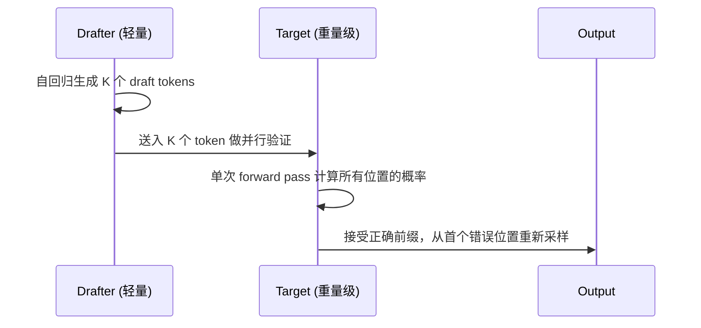
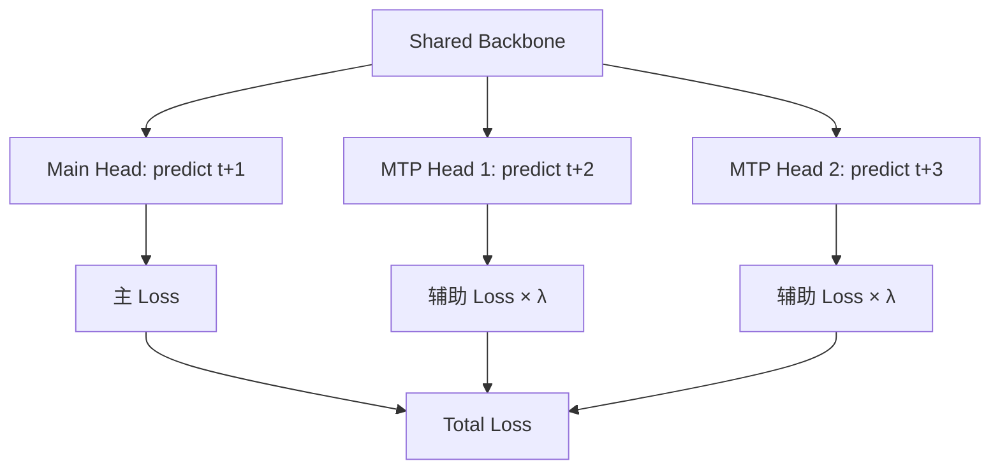
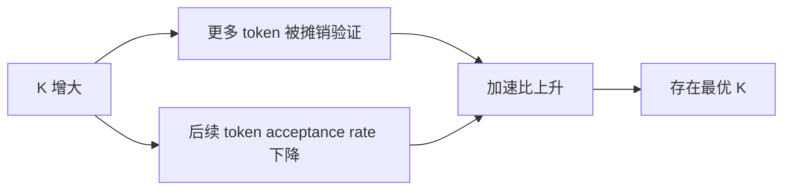
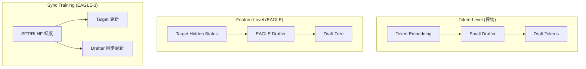
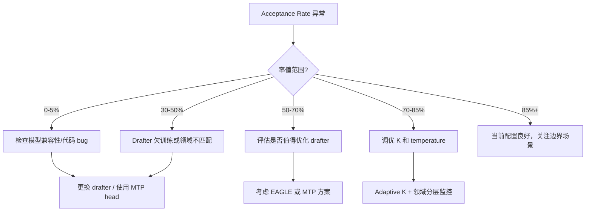

## 一个真实的 Debug 案例：接受率为 0%

上个月，我们在部署某 671B MoE 模型的投机解码时，遇到了一个令人崩溃的问题：**acceptance rate 恒定为 0%**。每一个 draft token 都被 target model 拒绝，投机解码不仅没有加速，反而因为额外的 drafter 推理开销导致整体吞吐下降了 15%。

### 五步排查过程

第一反应是翻代码，逐项检查：

- **Step 1：检查 logits alignment** —— drafter output vocab size 与 target 一致 ✓
- **Step 2：检查 sampling temperature** —— 两侧均设置为 0.6 ✓
- **Step 3：检查 tokenizer 一致性** —— 同一 tokenizer，token mapping 无错位 ✓
- **Step 4：打印实际 logit 分布并逐位置对比** —— **问题暴露**。Drafter 的 top-1 probability 集中在错误的 token 上，平均 KL divergence 高达 **4.7 nats**（对于一个合格的 drafter，该值应 < 0.5 nats）
- **Step 5：定位根因** —— fine-tuned drafter 仅训练了 3000 步的通用语料，从未对齐 target model 的专业领域分布。Target 经过领域 SFT 后，token preference 已大幅偏移，而 drafter 对此一无所知

最终定位到根因：**drafter 模型本身的质量**。团队为了快速上线，用了一个仅在通用语料上 fine-tune 了 3000 步的独立小模型作为 drafter，与 target model 的 token 分布严重不对齐。而该 671B 模型自带的 MTP heads（预训练阶段作为 auxiliary loss 联合训练）接入后，acceptance rate 直接飙到 85-90%。

### Acceptance Rate 作为质量探针：诊断对照表

| Drafter 类型 | Avg Acceptance Rate | KL(target‖draft) | 诊断 |
|---|---|---|---|
| Fine-tuned 3K steps | 0% | 4.7 nats | catastrophic mismatch |
| Fine-tuned 30K steps | 34% | 1.2 nats | undertrained |
| Joint MTP head (λ=0.3) | 85-90% | 0.08 nats | well-aligned |

### 为什么 MTP Head 能达到 85-90%？

MTP 的 acceptance rate 高达 85-90% 的原因是数学上可证的：MTP loss $\lambda \cdot \text{CE}_{\text{MTP}}$ 的梯度直接回流到主模型的 shared embedding 和 unembedding head，这意味着 MTP head 的输出分布与主模型的 NTP 分布天然强耦合——它们共享相同的 token representation space。

这一点被 MTP 消融实验有力验证。以 Small MoE（2.4B activated / 15.7B total）在 1.33T tokens 上的训练结果为例：

| Benchmark | Baseline (无 MTP) | +MTP (D=1, λ=0.3) | 提升 |
|---|---|---|---|
| HumanEval | 20.7 | 26.8 | **+6.1** |
| GSM8K | 25.4 | 31.4 | **+6.0** |
| MMLU | 50.0 | 53.3 | **+3.3** |

MTP 训练配置：D=1（single-step lookahead），λ=0.3，shared token embedding & unembedding head。MTP module 结构极其轻量——单个 Transformer layer + shared unembedding projection，参数开销可忽略不计。

这个案例给了我一个核心认知：**acceptance rate 不仅是速度指标，更是 drafter 质量的探针**。它直接反映了 draft model 与 target model 在 token 分布上的对齐程度。独立训练的 drafter 需要海量对齐数据才能逼近可用水平，而联合训练的 MTP head 通过梯度共享天然获得分布一致性。

---

## 1. 投机解码的基本机制

投机解码（Speculative Decoding）的核心思想简洁而优雅：用一个轻量模型"猜"多个 token，再让重量级模型一次性验证。



关键要点：

| 步骤 | 计算量 | 说明 |
|------|--------|------|
| Draft 生成 K tokens | 低 | 小模型或 MTP head，成本极低 |
| Target 验证 K tokens | ≈ 生成 1 token | Transformer 的并行性：验证 K 个和生成 1 个的 forward 成本几乎相同 |
| 接受/拒绝 | 0 | 纯比较操作 |

**理论加速**：$\text{Speedup} \approx \frac{K \times \alpha}{1 + K \times c}$，其中 $\alpha$ 是 acceptance rate，$c$ 是 drafter 相对于 target 的成本比。当 drafter 成本趋近于 0（如 MTP head），简化为 $\approx K \times \alpha$。

但 acceptance rate 随序列位置递减 —— 第 1 个 draft token 被接受的概率最高，越往后越难猜对。这决定了 K 不能无限增大。

---

## 2. MTP 作为 Drafter — 训练时的辅助 Loss、推理时的加速器

Multi-Token Prediction（MTP）是一种在预训练阶段引入的辅助目标：模型不仅预测下一个 token，还同时预测接下来的 2-4 个 token。



### 训练阶段：辅助 Loss

在某 671B MoE 模型的预训练中，MTP 的训练策略如下：

- 预测深度：额外 1 个 token（即 depth=1 的 MTP head）
- Loss 权重 $\lambda$：训练前期 0.3，后期退火至 0.1
- MTP head 结构：共享 embedding + 独立的轻量 Transformer 层 + projection

MTP 的训练收益不仅在于推理加速，还能**提升主模型本身的质量**：

| Benchmark | 无 MTP | 有 MTP | 提升 |
|-----------|--------|--------|------|
| HumanEval | 基线 | +6.1 | 代码能力增强 |
| GSM8K | 基线 | +6.0 | 数学推理增强 |
| MMLU | 基线 | +1.2 | 通用知识微弱提升 |

推测机制：MTP 迫使模型在 hidden states 中编码更长远的规划信息，而非仅关注 next-token。

### 推理阶段：内置 Drafter

MTP heads 在推理时直接作为 speculative decoding 的 drafter：

- **无需额外模型**：drafter 参数量极小（相对于 671B backbone），且共享 KV cache
- **天然对齐**：与 target model 联合训练，token 分布高度一致
- **Acceptance rate 85-90%**：远高于独立训练的小 drafter（通常 60-75%）
- **有效加速 1.8x**：以 ~2 draft tokens × 85-90% acceptance 实现

---

## 3. 接受率诊断 — 质量探针

Acceptance rate 是投机解码系统中最重要的单一指标。它不仅决定了加速比，更直接暴露 drafter 与 target 之间的分布对齐质量。

### 诊断分级

| Acceptance Rate | 诊断 | 典型原因 |
|----------------|------|----------|
| 0-5% | 灾难性 | 模型不兼容、tokenizer 不匹配、代码 bug |
| 30-50% | 严重不足 | Drafter 欠训练、领域严重不匹配 |
| 50-70% | 尚可 | 独立小 drafter，通用场景 |
| 70-85% | 良好 | 精心训练的独立 drafter |
| 85-95% | 优秀 | 联合训练的 MTP heads |

### Acceptance Rate 下降的场景

**领域偏移（Domain Shift）**：drafter 在通用语料训练，但 target 被 fine-tune 到专业领域后，两者分布产生偏移。这是开头案例中 0% acceptance rate 的根因 —— 独立 drafter 甚至没有见过 target model 倾向的 token 序列模式。

**高熵位置**：当多个 continuation 都合理时（如创意写作中的形容词选择），drafter 的"猜测"本质上是在高熵分布中采样，命中概率自然降低。

**代码/数学场景**：精确的 token 序列（变量名、运算符、括号匹配）要求 drafter 与 target 在低熵但高精度的位置完全对齐，容错空间极小。

### 监控建议

```
[实时指标]
- 滑动窗口 acceptance rate（窗口 100 tokens）
- 按 token 位置分桶的 acceptance rate（第 1/2/3/... draft token）
- 按输入领域分层的 acceptance rate

[告警阈值]
- acceptance rate < 50% → 触发 drafter 质量告警
- acceptance rate 突降 > 20% → 可能遭遇分布外输入
```

---

## 4. 工程调优决策

### Draft Token 数 K 的选择

K 是投机解码中最关键的超参数：



经验值：

| Drafter 类型 | 推荐 K | 理由 |
|-------------|--------|------|
| MTP Head（联合训练） | 2-4 | 高 acceptance rate 支撑更长 draft |
| 独立小模型 | 3-6 | 需要更多尝试来摊销 drafter 成本 |
| EAGLE 系列 | 4-8 | Feature-level 对齐允许更深 draft tree |

**Adaptive K 策略**：当 drafter 对当前 token 的 confidence（top-1 probability）低于阈值时，提前终止 drafting。这避免了在高不确定性区域浪费 draft 步骤。

### Temperature 对齐

这是一个容易被忽略但后果严重的问题：

> **Drafter 和 Target 必须使用相同的 temperature。**

Temperature 改变了 token 分布的形状。如果 drafter 用 temperature=0.6 生成（分布更尖锐），而 target 用 temperature=1.0 验证（分布更平坦），即使两者底层的 logits 完全对齐，rejection sampling 也会系统性地拒绝 draft tokens。

在我们的调试中，这个问题在代码生成场景尤为明显 —— 某开源框架的默认配置中，drafter 和 target 的 temperature 参数分别在两个不同的 config 文件中设置，极易遗漏。

### Batch Size 的交互

| Batch Size | 投机解码收益 | 原因 |
|-----------|------------|------|
| 1-4 | 最高（1.5-2.5x） | Target model memory-bound，验证几乎免费 |
| 8-16 | 中等（1.2-1.5x） | 开始进入 compute-bound 区域 |
| 32+ | 微弱甚至负收益 | Target 已 compute-bound，drafter 开销成为纯负担 |

投机解码本质上是**用 compute 换 latency 的技术**，在 target model 处于 memory-bandwidth bottleneck 时收益最大。当 batch size 增大到 target model 变为 compute-bound 时，并行验证不再"免费"，收益消失。

---

## 5. EAGLE 系列 — 从特征级别做投机

传统 speculative decoding 的 drafter 只能看到 token embeddings。EAGLE 系列的核心创新是**让 drafter 访问 target model 的 hidden states**。

### EAGLE（v1）：特征级别的 Draft

- Drafter 输入：target model 最后一层的 hidden states（而非 token embedding）
- 优势：hidden states 包含了完整的上下文信息，远比单一 token embedding 丰富
- 效果：acceptance rate 相比 token-level drafter 提升 10-15%

### EAGLE-2：动态 Draft Tree

- 不再线性 draft，而是构建**树形结构**的 draft candidates
- 根据 confidence 动态决定每个节点的分支数
- 高 confidence 位置：少分支，快速推进
- 低 confidence 位置：多分支，覆盖更多可能性
- 结果：在同等验证成本下，有效 acceptance rate 进一步提升

### EAGLE-3：训练时同步

- 核心问题：target model 经过 SFT/RLHF 后分布改变，EAGLE drafter 需要重新训练
- EAGLE-3 的方案：**在 SFT/RLHF 训练过程中同步更新 drafter**
- 确保 drafter 永远不会与 target 失同步
- 与 MTP 的联合训练理念一脉相承



**核心洞察**：Feature-level alignment > Token-level alignment。Hidden states 中蕴含的信息量远超离散 token，让 drafter 能够更准确地预测 target 的下一步行为。

---

## 6. 端侧部署的特殊考量

在端侧（手机、嵌入式设备）场景下，投机解码的工程约束与云端截然不同：

### 内存约束

端侧设备通常只有 8-16GB 共享内存，无法承载独立的 drafter model：

- 一个 7B 模型已占满大部分内存
- 额外加载哪怕 0.5B 的独立 drafter 都可能导致 OOM
- **MTP heads 是理想方案**：仅增加极少参数（<1% 的 backbone 参数量），共享主模型的 KV cache 和 embedding

### 延迟敏感

端侧场景中用户对延迟极度敏感：

- 云端可容忍 200ms TTFT，端侧目标是 <100ms
- 即使 1.5x 加速也意义重大：从 40 tokens/s 到 60 tokens/s 的体感差异明显
- MTP 的低开销（共享 forward pass 的大部分计算）完美适配

### 严格的 Latency SLO

结合投机解码与 early stopping 策略，可以实现严格的延迟 SLO：

- 设定每次 decoding step 的 time budget
- 如果 drafter 在 budget 内未完成 K 个 draft token，提前提交已有结果
- 保证最差情况下退化为普通 autoregressive decoding（而非超时）

某开源端侧模型（4B 参数）通过 MTP head 实现了 1.5x 的端侧加速，在 Qualcomm 8 Gen 3 上达到 35 tokens/s → 52 tokens/s。

---

## 总结：接受率是系统健康的晴雨表

回到开头的案例。投机解码系统的调优本质上围绕一个核心指标展开：**acceptance rate**。



从 0% 到 90% 的接受率之旅，核心教训是：

1. **Drafter 质量 > 一切调优技巧** —— 再好的 K 选择和 temperature 对齐，也救不了一个与 target 分布不匹配的 drafter
2. **联合训练是王道** —— MTP heads 和 EAGLE-3 都证明了：让 drafter 与 target 一起训练/更新，是保持对齐的最可靠方式
3. **Acceptance rate 是探针** —— 把它当作系统健康指标来监控，而非仅仅作为速度 metric

---

## References

- [1] DeepSeek-V3 Technical Report. *[arXiv:2412.19437](https://arxiv.org/abs/2412.19437)*
- [2] Li et al. "EAGLE: Speculative Sampling Requires Rethinking Feature Uncertainty." *[arXiv:2401.15077](https://arxiv.org/abs/2401.15077)*
- [3] Li et al. "EAGLE-2: Faster Inference of Language Models with Dynamic Draft Trees." *[arXiv:2406.16858](https://arxiv.org/abs/2406.16858)*
- [4] Li et al. "EAGLE-3: Scaling up Speculative Decoding against Distributional Shift by Training Consistency." *[arXiv:2503.01840](https://arxiv.org/abs/2503.01840)*
- [5] Leviathan et al. "Fast Inference from Transformers via Speculative Decoding." *[arXiv:2211.17192](https://arxiv.org/abs/2211.17192)*
- [6] Cai et al. "Medusa: Simple LLM Inference Acceleration Framework with Multiple Decoding Heads." *[arXiv:2401.10774](https://arxiv.org/abs/2401.10774)*
- [7] MiniCPM4 Technical Report. *[arXiv:2506.07900](https://arxiv.org/abs/2506.07900)*
