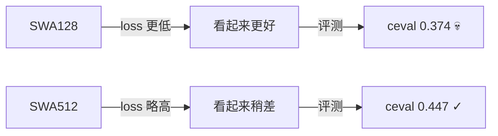
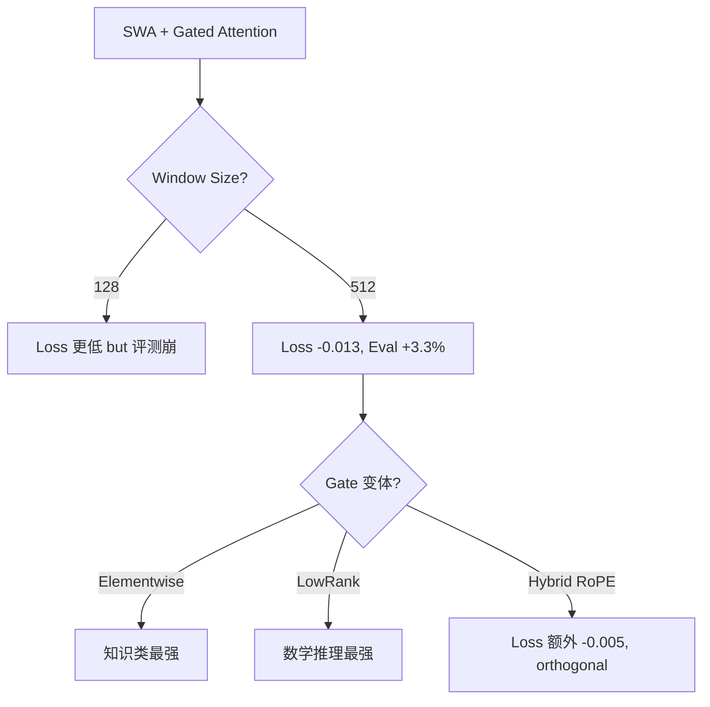

某 3B 模型预训练实验中，SWA128 的 loss 比 SWA512 低了 0.003，我们本以为找到了更优配置。评测结果出来傻了——ceval 直接掉了 7 个点。

这篇文章记录这次 Sliding Window Attention + Gated Attention 的完整实验过程，以及它教会我们的一个朴素道理：**loss 不是唯一的 North Star**。

---

## 实验背景：模型与训练设置

模型规模 3B（H=2560, 32 layers, GQA 20Q/4KV, FFN=6912），在 H800 上训练 400B tokens。我们想验证两个改动的叠加效果：

1. **Sliding Window Attention (SWA)**：限制部分 attention layer 只看固定窗口内的 token，降低 KV cache 和计算量
2. **Gated Attention**：在 attention output 上加 learnable gate，让模型自己学习每个 head/position 的输出权重

Baseline 是标准 full attention、无 gate 的配置。

---

## 什么是 SWA + Gated Attention

**Sliding Window Attention** 的核心想法很简单：不是每一层都需要看全局 context。部分层只看最近 $w$ 个 token（window size），剩下的层保持 full attention。这样既能捕获局部模式，又通过 full attention 层传递远距离信息。Mistral 和 Gemma2 都用了类似设计。

**Gated Attention** 则是在 attention 输出后加一个可学习的 gate：

$$\text{output} = \sigma(g) \odot \text{Attn}(Q, K, V)$$

其中 $g$ 是 learnable parameter，$\sigma$ 是 sigmoid。Elementwise 变体对每个 hidden dimension 独立学一个 gate；LowRank 变体用低秩矩阵参数化 gate 以节省参数。

两者叠加的直觉是：SWA 限制了信息流，gate 让模型学习补偿这个限制。

---

## Case 1：The Paradox — 更低的 loss，更差的评测

我们首先对比了 SWA128 和 SWA512（都搭配 Elementwise Gated）：

| 配置 | 16k steps loss | 28k steps loss | eval avg |
|------|---------------|---------------|----------|
| SWA128 + Elementwise Gated | 2.020 | 1.972 | 0.3680 |
| SWA512 + Elementwise Gated | 2.022 | 1.975 | 0.3914 |

Loss 曲线上，SWA128 一路领先 0.002-0.003。但评测一跑：

| Benchmark | SWA128 | SWA512 | 差距 |
|-----------|--------|--------|------|
| ceval | 0.374 | 0.447 | **-7.3%** |
| mmlu | 0.408 | 0.439 | -3.1% |
| avg | 0.368 | 0.391 | -2.3% |

SWA128 在 ceval 上直接崩了 7 个点。这是个很大的 gap，完全不能用 variance 解释。

---

## 为什么 loss 更低反而评测更差？

我们的假设是 **local pattern overfitting**：

窗口越小，模型越倾向于用局部 n-gram 式的模式来拟合训练数据。这些模式对 next-token prediction 有效（loss 低），但对需要全局推理和知识运用的 downstream task 没有帮助。

具体来说：

1. **128 token 窗口太小了**。中文一个句子平均 30-50 token，128 只能看 2-3 句话。很多知识性问题的 evidence 分布在更远的 context 中。
2. **Loss 衡量的是 local prediction ability**。模型学会了"看前 128 个 token 就能猜下一个 token"，但这种能力不迁移到 ceval 这种需要知识整合的任务。
3. **Full attention layers 没法完全补偿**。虽然有 full attention 层负责远距离信息传递，但 SWA 层学到的 representation 已经是 local-biased 的，上游信息被过滤了。

这个现象和 language modeling 领域的经典 observation 一致：**perplexity 和 downstream performance 的相关性在小模型上不是线性的**，尤其当模型结构引入了 inductive bias 的时候。

---

## Case 2：SWA512 + Gated 是明确的赢家

回到主线：SWA512 + Elementwise Gated vs 纯 Baseline：

| 配置 | Loss (28k) | gsm8k | mmlu | bbh | c3 | ceval | avg |
|------|-----------|-------|------|-----|-------|-------|-----|
| Baseline (no SWA, no gate) | 1.999 | 0.188 | 0.404 | 0.387 | 0.415 | 0.398 | 0.358 |
| SWA512 + Elementwise Gated | 1.986 | 0.182 | 0.439 | 0.390 | 0.500 | 0.447 | 0.391 |
| **Delta** | **-0.013** | -0.006 | **+0.035** | +0.003 | **+0.085** | **+0.049** | **+0.033** |

亮点：
- **c3 暴涨 8.5%**：中文阅读理解直接受益于 gated attention 的选择性信息保留
- **ceval +4.9%**：知识类任务也有显著提升
- **mmlu +3.5%**：英文知识评测同样获益
- **gsm8k 小幅下降**：数学推理略微受损，可能因为 SWA 限制了 chain-of-thought 的长距离依赖

总体 +3.3% 的 eval gain 对应 -0.013 的 loss drop，两者方向一致，但 SWA128 的反例提醒我们：这种一致性不是保证的。

---

## Case 3：Gate 变体对比

我们还测了不同的 gating 机制：

| Gate 变体 | Loss | gsm8k | mmlu | ceval | avg |
|----------|------|-------|------|-------|-----|
| Elementwise Gated | 1.986 | 0.182 | 0.439 | 0.447 | 0.391 |
| LowRank Gated | 1.988 | **0.199** | 0.435 | 0.421 | 0.385 |
| Hybrid RoPE + LowRank Gated | 1.981 | 0.191 | 0.432 | 0.438 | 0.388 |

观察：

- **Elementwise Gated** 整体最优，尤其在知识类 benchmark 上（mmlu, ceval）
- **LowRank Gated** 在 gsm8k 上最强（0.199 vs 0.182），可能因为低秩约束迫使模型学习更 structured 的 representation，有利于数学推理
- **Hybrid RoPE + LowRank Gated** 带来额外 loss -0.005（相对 LowRank），说明 RoPE 和 gating 的 benefit 是正交的。但评测上并没有进一步拉开差距，提示这 0.005 的 loss gain 可能又是"local pattern"类型的

---

## Engineering Lessons

这次实验给我们的几条教训：

### 1. Loss 不是唯一的 North Star

这句话说起来容易，做起来难。在 400B token 的训练中，你不可能每 1k steps 就跑一次 full eval。大部分时间你只能盯着 loss 曲线做决策。但 SWA128 的案例明确告诉我们：**当模型结构引入了 inductive bias（如 window size 限制），loss 和 downstream 可以解耦**。

实际操作建议：对结构性改动（attention pattern, normalization, gate mechanism），至少在 10-20% 训练量时跑一次轻量 eval（如只跑 mmlu 和 ceval）。

### 2. Window size 的选择要考虑目标任务的 context 需求

128 token 的窗口对英文可能还行（约 100 词），对中文就太短了。中文 token 效率低，128 token 可能只有 60-80 个汉字，两三句话而已。如果你的目标任务涉及段落级理解，窗口至少要 512+。

### 3. Gated Attention 是低风险高收益的改动

SWA512 + Elementwise Gated 相比 baseline 是全面提升（除了 gsm8k 微降）。额外参数量很少（每层一个 hidden_dim 大小的 gate vector），训练开销几乎为零，但带来了 3.3% 的 eval gain。这类改动值得 default on。

### 4. 不同 gate 变体适合不同任务 profile

如果你的目标场景偏数学推理，LowRank Gated 值得一试。如果是通用知识能力，Elementwise Gated 是更稳的选择。

---

## 总结

核心 takeaway：在预训练中引入结构性 inductive bias 时，一定要用 downstream eval 来验证，而不是只看 loss 曲线。SWA128 的 loss 曲线骗了所有人。

---

## References

1. Jiang et al., "Mistral 7B", 2023 — SWA 在 production model 中的应用
2. Team Gemma, "Gemma 2: Improving Open Language Models at a Practical Size", 2024 — SWA + logit soft-capping
3. Hua et al., "Transformer Quality in Linear Time", 2022 — Gated attention mechanism
4. Zhang & Sennrich, "Root Mean Square Layer Normalization", 2019 — RMSNorm 与 gating 的关系
