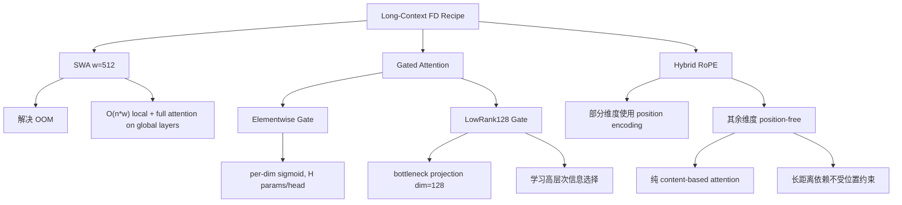

某 3B 模型的 baseline 在 multi_doc_qa 上只有 0.086（几乎是 random）。加上 SWA + LowRank Gated + Hybrid RoPE 三件套后涨到 0.200——2.3 倍提升。最关键的组件不是 SWA（它只解决 OOM），而是 Hybrid RoPE（它让 attention 能做跨文档的内容匹配）。

---

## 1. 背景：长文 Fine-tuning 阶段的架构选择

模型预训练阶段已经引入了 SWA + Gated Attention，但 16K+ 的长上下文能力需要专门的 fine-tuning 阶段（FD stage）来激活。问题是：attention 机制 + position encoding 的哪种组合在 FD 阶段表现最好？

我们测试了 4 个变体，逐步叠加组件。

---

## 2. 四个变体与评测结果

| Model | Average | longbench_16k | multi_doc_qa | passage | single_doc_qa | summary |
|-------|---------|---------------|--------------|---------|---------------|---------|
| baseline | 0.167 | 0.139 | 0.086 | 0.027 | 0.208 | 0.206 |
| SWA+ElemGated | 0.187 | 0.155 | 0.110 | 0.027 | 0.239 | 0.212 |
| SWA+ElemGated+HybridRoPE | 0.209 | 0.174 | 0.129 | 0.030 | 0.295 | 0.204 |
| **SWA512+LowRank128+HybridRoPE** | **0.216** | **0.179** | **0.200** | **0.030** | 0.230 | **0.217** |

关键数字：

- Hybrid RoPE 单独贡献 +2.2% precision（0.187 → 0.209）
- LowRank128 Gated 再加 +0.7%（0.209 → 0.216）
- multi_doc_qa 的绝对增益最大：0.086 → 0.200，2.3x

---

## 3. 各组件的作用



### SWA (Sliding Window Attention, w=512)

强制局部层只在窗口内做 attention，节省长序列显存：

- 无 SWA：O(n^2) attention → 16K+ 直接 OOM
- 有 SWA：局部层 O(n·w)，仅全局层做 full attention

SWA 是必要条件（没它跑不起来），但不是性能增益的主要来源。

### Gated Attention

两种实现：

- **Elementwise**：每个 attention head 对输出做 per-dimension sigmoid gate，参数量 = H per head
- **LowRank (dim=128)**：attention 输出先投影到 128 维 bottleneck，再做 gating

LowRank gate 在更高抽象层次上学习"传递哪些信息"——对 multi-document reasoning 特别有效，因为模型需要在多个文档间选择相关信息。

### Hybrid RoPE

标准 RoPE 对所有 attention 维度施加 position encoding。Hybrid RoPE 只对**部分维度**使用位置编码，其余维度完全 position-free。

position-free 维度的 attention 完全基于**内容匹配**，不受相对位置影响。这对跨文档的长距离依赖至关重要——不同文档中的相关信息，位置可能相距数千 token，但内容语义是对齐的。

---

## 4. 为什么 Hybrid RoPE 是 multi_doc_qa 的关键

Multi-document QA 的核心需求：

1. **跨文档信息检索**：答案可能在第 3 个文档的某段，而问题在最后——纯位置编码会让模型偏好"近"的 token
2. **跨文档信息对比/综合**：需要比较不同位置的内容片段
3. **Position 不是有效信号**：哪个文档排第几跟答案无关

Hybrid RoPE 的 position-free 维度天然适配这三个需求。模型可以在这些维度上做纯 content-based matching，不被位置距离"惩罚"。

数据验证：multi_doc_qa 从加入 Hybrid RoPE 开始跳涨（0.110 → 0.129 → 0.200），而 passage retrieval（强位置依赖）几乎不变（0.027 → 0.030）。

---

## 5. LowRank vs Elementwise Gating：什么时候 bottleneck 更好

| 指标 | Elementwise | LowRank128 | Delta |
|------|-------------|------------|-------|
| multi_doc_qa | 0.129 | 0.200 | **+0.071** |
| single_doc_qa | 0.295 | 0.230 | **-0.065** |
| average | 0.209 | 0.216 | +0.007 |

LowRank gate 的 bottleneck 强制模型学习"粗粒度的信息选择策略"——在多文档场景下，这等价于学习"哪个文档的信息值得传递"。

Elementwise gate 保留了更细粒度的 per-dimension 控制，在 single_doc_qa（局部推理、位置相关）中表现更好。

直觉：multi_doc_qa 是一个"选择哪个文档"的高层决策问题，LowRank 的 abstraction 恰好匹配这个粒度；single_doc_qa 是"精确定位文档内位置"的低层问题，Elementwise 的细粒度控制更合适。

---

## 6. Trade-off 与工程决策

最终选择 SWA512 + LowRank128 + Hybrid RoPE，接受了一个 trade-off：

- multi_doc_qa: +0.071（0.129 → 0.200）
- single_doc_qa: -0.065（0.295 → 0.230）

为什么接受这个 trade-off：
- multi_doc_qa 更代表真实长上下文使用场景（用户不会只给一个文档然后问问题）
- single_doc_qa 的 0.230 仍然远高于 baseline 的 0.208
- 总 average 仍然是最高的（0.216 vs 0.209）

---

## 7. Loss 排序确认层级

训练 loss 的排序：

```
SWA+LowRank+HybridRoPE < SWA+Elem+HybridRoPE < SWA+Elem < baseline
```

（lower = better）

Loss 排序与下游评测完全一致。这说明这些组件的增益不是"碰巧在某个 benchmark 上有效"，而是genuinely 提升了模型的长文本建模能力。Loss 作为更稳定的信号，给了我们更强的信心。

---

## 8. 长文配方的工程经验

**组件叠加顺序有逻辑**：

1. SWA 解决"能不能跑"——没它 16K 直接 OOM
2. Gated Attention 解决"信息选择"——不是所有 token 都值得传递
3. Hybrid RoPE 解决"跨位置匹配"——长距离内容对齐不应被位置惩罚

**不要只看 average**：

如果只看 average（0.209 vs 0.216），会觉得 LowRank gate 的提升微不足道。但拆开看 multi_doc_qa（+0.071），才能理解它的真正价值——以及代价（single_doc_qa -0.065）。

**Hybrid RoPE 的适用条件**：

- 任务越依赖"跨位置内容匹配"，Hybrid RoPE 收益越大
- 任务越依赖"位置本身就是信号"，Hybrid RoPE 收益越小甚至有害
- multi_doc_qa 是前者的典型；passage retrieval 接近后者

**LowRank gate 的适用条件**：

- 信息选择粒度越粗（"选哪个文档"），LowRank 越好
- 信息选择粒度越细（"选哪个 token"），Elementwise 越好

---

## 9. References

1. Beltagy et al., "Longformer: The Long-Document Transformer," [arXiv:2004.05150](https://arxiv.org/abs/2004.05150) — SWA 的经典实现
2. Su et al., "RoFormer: Enhanced Transformer with Rotary Position Embedding," [arXiv:2104.09864](https://arxiv.org/abs/2104.09864) — RoPE 原始论文
3. Child et al., "Generating Long Sequences with Sparse Transformers," [arXiv:1904.10509](https://arxiv.org/abs/1904.10509) — local + global attention pattern
4. Press et al., "Train Short, Test Long: Attention with Linear Biases Enables Input Length Extrapolation," [arXiv:2108.12409](https://arxiv.org/abs/2108.12409) — position encoding 对长度外推的影响
