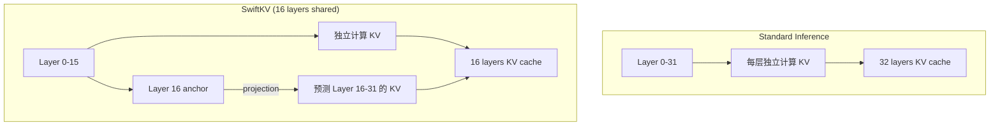
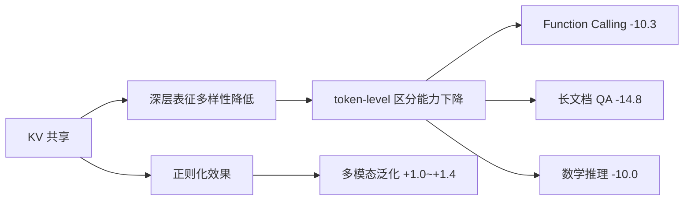
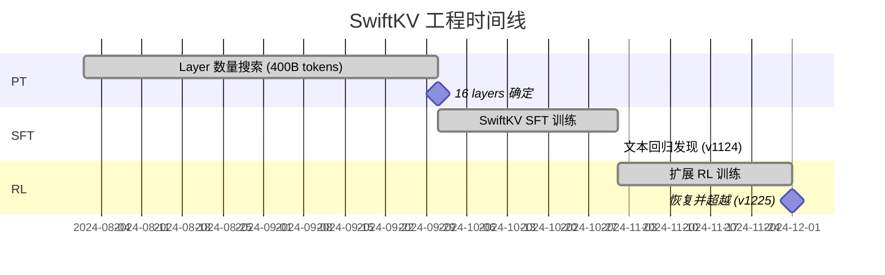

我们拿到某 3B 模型的跨层 KV 共享版本，整体指标涨了 0.3%，但文本榜单掉了 1.9%——BFCL 直接掉了 10 个点（39.3 → 29.0），LV_multifieldqa 掉了 14.8（42.5 → 27.7），AIME2025 pass@16 掉了 10（43.3 → 33.3）。怎么办？

这不是一个简单的"超参没调好"能解释的问题。Training loss 对比 baseline 只高了 0.003，说明 KV 共享在 token-level modeling 上确实存在信息瓶颈。但放弃它意味着放弃 50% 的 KV cache 节省和 24-35% 的 first-token 加速——对端侧部署来说，这几乎是不可接受的。

最终我们通过 RL 阶段的持续训练，不仅恢复了 SFT 阶段的回归，还在多个维度超越了 baseline。这篇文章记录整个工程决策链：从 PT 阶段的 layer 数量搜索，到 SFT 的回归分析，再到 RL 的恢复叙事。

## 背景：SwiftKV 是什么，为什么端侧需要它

KV cache 是 autoregressive inference 的核心瓶颈之一。对于一个 3B 模型（H=2560, 32 layers, GQA 20Q/4KV），在 8K context 下 KV cache 占用：

```
2 × 32 × 4 × 64 × 8192 × 2 bytes = ~256 MB (FP16)
```

在端侧设备（某 DX5 平台）上，这个数字直接决定了 context length 上限和 first-token latency。

SwiftKV 的核心思想：模型的深层（后 N 层）不再独立计算 KV，而是由某个中间层（anchor layer）的隐状态通过轻量 projection 预测得到。这样 inference 时后 N 层只做 attention + FFN，跳过 KV 的独立计算。



好处是双重的：
1. **KV cache 减半**：后 16 层不存独立 KV，内存直降 50%
2. **Prefill 加速**：后 16 层的 KV projection 比完整 self-attention 快得多，first-token latency 显著下降

## PT 阶段：Layer 数量搜索

第一个工程决策：到底共享多少层？共享太少，收益不够；共享太多，模型表达力受损。

我们在 400B tokens（seq=4096, global_batch=4096）上跑了一组消融实验：

| 共享层数 | Anchor Layer (layer_idx) | Final Loss |
|---------|--------------------------|------------|
| 0 (baseline) | — | 1.993 |
| 8 | 24 | 1.988 |
| 12 | 20 | 1.983 |
| 16 | 16 | 1.984 |
| 20 | 12 | 1.988 |

几个观察：

**Sweet spot 在 12-16 层。** 12 层（loss 1.983）和 16 层（loss 1.984）几乎持平，都比 baseline 好——是的，共享反而降低了 loss。这不反直觉：cross-layer parameter sharing 本身是一种正则化，在数据充分时可以改善泛化。

**20 层出现 rebound。** Loss 回到 1.988，和只共享 8 层持平。解释：当 anchor layer 被推到第 12 层时，它需要"看到"的语义层次太浅，projection 无法弥补深层表征的多样性损失。

**端侧性能验证（DX5 平台）：**

| Context Length | 16 layers vs 8 layers first-token 加速 |
|---------------|----------------------------------------|
| 2K | +24% |
| 4K | +35% |
| 8K | +35% |

16 层相比 8 层在长 context 上有明显的额外收益（4K/8K 从 +24% 跳到 +35%），而 loss 只高了 0.001。

**最终决策：16 层。** 理由很直接——loss 近乎最优（1.984 vs 最优 1.983），KV cache 节省 50%，first-token 加速 24-35%。工程上的甜点。

## SFT 阶段：文本回归问题

PT 阶段的好消息让我们信心满满地进入 SFT。然而现实给了一记闷棍。

SwiftKV 最后 8 层共享的 SFT 版本（注意这里是 8 层，比 PT 的 16 层保守）整体指标 +0.3%，但拆开看：

| 类别 | 变化 |
|------|------|
| 整体 | +0.3% |
| 文本 benchmarks | -1.9% |
| 多模态 business | +1.0% |
| 多模态 benchmark | +0.5% |
| 多模态 generalization | +1.4% |

文本侧的具体重灾区：

| Benchmark | Baseline | SwiftKV | Delta |
|-----------|----------|---------|-------|
| BFCL | 39.3 | 29.0 | -10.3 |
| LV_multifieldqa | 42.5 | 27.7 | -14.8 |
| AIME2025 pass@16 | 43.3 | 33.3 | -10.0 |

Training loss 比 baseline 高 0.003。数字不大，但在 SFT 阶段这个 delta 足以说明问题：**KV 共享压缩了深层的表征多样性，导致需要精细 token-level 区分能力的任务（function calling、长文档 QA、数学推理）系统性退化。**



有趣的是，多模态方向反而受益——KV 共享的正则化效果帮助了需要跨模态泛化的任务。但文本侧的回归是不可接受的。

当时摆在面前两条路：
1. 回退到 8 层以下的共享，牺牲部署收益
2. 接受 SFT 阶段的回归，寄希望于后续 RL 能恢复

我们选了第二条路。

## RL 阶段：恢复与超越

这个赌注最终赢了。

从 v1124（SFT 版本）到 v1225（经过扩展 RL 训练），SwiftKV 不仅恢复了 SFT 的回归，还在整体上超越了 baseline：

| 模型版本 | 平均分 |
|---------|--------|
| Baseline v1210 | 66.5 |
| SwiftKV v1225 | 67.9 (+1.4) |

关键维度的增益：

| 维度 | Baseline v1210 | SwiftKV v1225 | Delta |
|------|----------------|---------------|-------|
| 搜索问答 | 78.9 | 84.7 | +5.8 |
| 物体识别 | 49.5 | 63.7 | +14.2 |
| 幻觉 | 83.1 | 91.2 | +8.1 |

为什么 RL 能恢复 SFT 的回归？我们的假设：

1. **RL 的 reward signal 是 task-level 的**，不像 SFT 的 token-level cross-entropy。KV 共享损失的 token-level 精度在 task-level 优化下可以被绕过——模型学会用其他路径达成目标。
2. **跨层连接本身提供了 gradient highway**。RL 阶段的梯度信号可以通过 KV projection 更高效地传播到浅层，加速策略更新。
3. **正则化效应在 RL 的高方差环境下更有价值**。RL 训练天然 noisy，KV 共享带来的隐式正则化帮助稳定了训练。

**已知问题：** 文本写作从 75.7 掉到了 53.6，这是目前唯一未恢复的回归点。推测原因是创意写作任务极度依赖深层的 token-level diversity，而 RL 的 task-level reward 难以精确捕捉写作质量的细粒度差异。这需要后续的 reward model 改进或针对性的 SFT 补数据来解决。

## 完整 Pipeline 时间线



## 工程经验总结

1. **PT 阶段的 loss 不能完全预测下游表现。** 16 层共享在 PT loss 上近乎最优，但 SFT 后暴露了 token-level 精度问题。建议在 PT 阶段就加入下游 proxy task 的 early evaluation。

2. **Cross-layer sharing 的损伤是 task-dependent 的。** 需要精细 token 区分的任务（function calling, math）受伤最重，而需要泛化的任务（多模态）反而受益。在评估 trade-off 时必须分维度看数据。

3. **RL 可以恢复结构压缩带来的 SFT 回归。** 这是一个重要的工程结论——它意味着"先激进压缩，后 RL 恢复"是一条可行的 pipeline。但前提是 RL 的 reward coverage 够广。

4. **端侧部署的指标优先级：first-token latency > throughput > accuracy delta。** 对用户体验而言，响应速度的感知远强于 1-2% 的质量差异。50% KV cache 节省换来的部署灵活性（更长 context 或更小内存 footprint）是决定性的。

5. **不要在 SFT 阶段就 panic。** 如果 pipeline 包含 RL 阶段，SFT 的局部回归不一定是终局。但需要有 RL 恢复的信心基础——我们的信心来自 PT 阶段 loss 持平甚至更优的事实。

## References

1. SwiftKV: Fast Prefill-Optimized Inference with Knowledge-Preserving Model Transformation ([arXiv:2410.03960](https://arxiv.org/abs/2410.03960))
2. CLA: Reducing KV Cache with Cross-Layer Attention ([arXiv:2405.12981](https://arxiv.org/abs/2405.12981))
3. YOCO: You Only Cache Once ([arXiv:2405.05254](https://arxiv.org/abs/2405.05254))
4. MLA (Multi-head Latent Attention) — DeepSeek-V2 Technical Report ([arXiv:2405.04434](https://arxiv.org/abs/2405.04434))
5. Layer-Condensed KV Cache for Efficient Inference of Large Language Models ([arXiv:2405.10637](https://arxiv.org/abs/2405.10637))
