某 3B 端侧模型做 SwiftKV 层数消融，发现 12 层共享 loss 最低（-0.010），但最终选了 16 层（-0.009）。差那 0.001？因为 16 层在目标芯片上首词提速 35%，KV cache 省了 50%。这是一个"loss 不是唯一判据"的典型工程决策。

---

## SwiftKV 做了什么

SwiftKV 的核心思路很简单：与其让每一层都独立计算自己的 KV cache，不如让一个"锚点层"（anchor layer）算一次 KV，后续所有层通过一个轻量 linear projection 复用这份 KV。

```mermaid
graph TD
    subgraph "Standard Transformer (32 layers)"
        L0[Layer 0: Q,K,V 独立计算] --> L1[Layer 1: Q,K,V 独立计算]
        L1 --> dots1[...]
        dots1 --> L15[Layer 15: Q,K,V 独立计算]
        L15 --> L16[Layer 16: Q,K,V 独立计算]
        L16 --> dots2[...]
        dots2 --> L31[Layer 31: Q,K,V 独立计算]
    end

    subgraph "SwiftKV (anchor=Layer 16, predict 16 layers)"
        A0[Layer 0-15: Q,K,V 独立计算] --> Anchor[Layer 16: Anchor Layer - 计算 KV]
        Anchor --> P17[Layer 17: Q独立 + KV via projection]
        P17 --> P18[Layer 18: Q独立 + KV via projection]
        P18 --> dots3[...]
        dots3 --> P31[Layer 31: Q独立 + KV via projection]
    end
```

**具体机制：**

- **Anchor layer**（锚点层）：正常计算 K、V，产出完整 KV cache
- **Predicted layers**（预测层）：Q 依旧独立计算，但 K、V 不再走完整的 attention projection，而是从 anchor layer 的 KV 经一个 learned linear transform 得到
- **收益**：prefill 阶段省去预测层的 KV 计算；decode 阶段 KV cache 体积直接按预测层比例缩减

对于端侧推理来说，KV cache 占用是内存瓶颈，prefill 计算量决定首词延迟。SwiftKV 同时缓解这两个痛点。

---

## 层数消融：12 层 loss 最低

实验配置：3B 模型（H=2560, 32 layers, GQA 20Q/4KV, FFN=6912），400B tokens 训练，seq=4096, gbs=4096。

| Predicted Layers | Anchor Layer idx | Loss @400B | Δ vs Baseline |
|:---:|:---:|:---:|:---:|
| 0 (Baseline) | — | 1.993 | — |
| 8 | 24 | 1.988 | -0.005 |
| 12 | 20 | 1.983 | **-0.010** |
| 16 | 16 | 1.984 | -0.009 |
| 20 | 12 | 1.988 | -0.005 |

**关键发现：**

1. Sweet spot 在 12-16 层——loss 不仅没有退化，反而比 baseline **更好**
2. 12 层是绝对最优点（-0.010），16 层紧随其后（-0.009）
3. 20 层时 loss 回升到 baseline 水平，共享过度导致表达力受损

---

## 为什么 KV 共享反而改善 loss？

这是最反直觉的地方：减少了参数自由度，loss 居然下降了。

解释在于 **implicit regularization**：

- Cross-layer KV sharing 强制多层维持一致的 representation geometry——各层不能各自为政地编码完全不同的 key-value 空间
- 这种约束类似于 weight tying 的效果：减少了过参数化带来的训练不稳定，迫使网络学到更紧凑、更泛化的表示
- 在 3B 这个规模上，模型容量相对于 400B tokens 的训练数据来说并不过剩，适度的正则化确实有益

但这个"红利"有上限。当预测层数到 20（占模型 62.5% 的层），约束太紧，模型失去了足够的表达自由度，loss 开始回升。

---

## 真正的决策驱动力：端侧首词速度

如果只看 loss，答案很清楚：选 12 层。但端侧部署不只看 loss。

在某端侧芯片平台上的 first-token latency 实测：

| Sequence Length | 16 layers vs 8 layers 首词提速 |
|:---:|:---:|
| 2K | +24% |
| 4K | +35% |
| 8K | +35% |

16 层预测比 8 层预测在 4K-8K 长度上快 35%。这个数字对端侧用户体验来说是决定性的——首词延迟直接决定用户感知的"响应速度"。

**KV cache 内存节省：**

| Predicted Layers | KV Cache 缩减比例 |
|:---:|:---:|
| 8 | 25% |
| 12 | 37.5% |
| 16 | **50%** |
| 20 | 62.5% |

16 层意味着 KV cache 直接砍半。对于端侧 4-8GB 内存的设备来说，这直接影响可支持的最大上下文长度。

---

## 决策矩阵：为什么是 16 而不是 12

| 维度 | 8 layers | 12 layers | 16 layers | 20 layers |
|:---|:---:|:---:|:---:|:---:|
| Loss vs baseline | -0.005 | -0.010 (BEST) | -0.009 | -0.005 |
| 首词提速 | baseline | 无实测数据 | +24-35% vs 8 | 无实测数据 |
| KV cache 节省 | 25% | 37.5% | **50%** | 62.5% |
| **结论** | 收益不足 | loss 最优但部署收益有限 | **最终选择** | loss 回升 |

**16 胜出的逻辑链：**

1. Loss 差异极小：16 vs 12 仅差 0.001（1.984 vs 1.983），换算到下游 benchmark 几乎不可测
2. 部署收益显著：KV cache 从 37.5% 节省跳到 50%，首词速度多提 24-35%
3. ROI 不对称：0.001 loss 的"损失"几乎免费，但部署端的收益是真金白银的用户体验改善

---

## 当共享走得太远：20 层的教训

20 层预测（anchor 在 layer 12）虽然 KV cache 节省达到 62.5%，但 loss 回升到与 baseline 持平（1.988）。这说明：

- 模型前 12 层的 KV 无法承载后续 20 层的信息需求
- Anchor layer 位置太靠前，此时模型还没有建立足够丰富的 contextual representation
- 后续层被迫用信息量不足的 KV 来做 attention，等于人为制造了信息瓶颈

规律总结：**anchor layer 的位置需要在模型已经充分编码上下文之后**。对于 32 层模型，layer 16-20 是 anchor 的合理区间（模型前半段已完成主要信息整合）。

---

## 工程决策的启示

这个案例揭示了端侧模型架构决策的一般原则：

**1. Loss 是必要条件，不是充分条件**

Loss 用来排除明显不可接受的方案（如 20 层），但在 "loss 相当" 的候选区间内，部署指标才是最终判据。

**2. 端侧决策维度天然更多**

- 首词延迟（用户体验）
- KV cache 大小（支持上下文长度）
- 芯片算力利用率（prefill 计算量）
- 内存带宽占用（decode throughput）

这些维度在云端可以用硬件堆叠来弥补，但在端侧是硬约束。

**3. 消融实验要覆盖部署指标**

纯 loss 消融会误导决策。正确做法是：先用 loss 圈定候选区间，再对候选方案做端侧 profiling，最后联合决策。

**4. "反直觉"的结果往往藏着机会**

KV sharing 改善 loss 这件事本身就是信号——它说明这个模型规模存在正则化需求，架构约束可以作为一种免费的正则化手段。

---

## References

1. SwiftKV: Fast Prefill-Optimized Inference with Knowledge-Preserving Model Transformation. [arXiv:2410.03960](https://arxiv.org/abs/2410.03960)
2. GQA: Training Generalized Multi-Query Transformer Models from Multi-Head Checkpoints. [arXiv:2305.13245](https://arxiv.org/abs/2305.13245)
3. Cross-Layer Attention (CLA): Sharing Key-Value Heads Across Layers. [arXiv:2405.12981](https://arxiv.org/abs/2405.12981)
