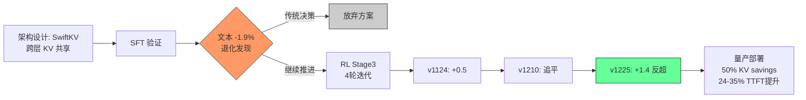

某 3B 端侧模型为省 KV Cache 做跨层共享（最后 8 层复用第 24 层的 KV），SFT 后文本榜单直接掉了 1.9%——工具调用 -10.3，长文检索 -14.8，推理 -10。看起来方案要放弃了。但四轮 RL 迭代后，模型不仅恢复了退化，还反超 baseline 1.4 个点。

这个案例揭示了一个重要的工程规律：**架构层面的 trade-off 不应在 SFT 阶段就下定论，RL post-training 拥有补偿架构退化的能力。**

---

## 1. SFT 阶段的退化：哪些维度受损

SwiftKV 的核心思想是 cross-layer KV prediction——让深层 transformer block 共享浅层已计算好的 KV cache，省去重复的 KV projection 计算。具体配置：最后 8 层（layer 25-32）共享 layer 24 的 KV。

SFT 后的整体表现：

| 维度 | Baseline | SwiftKV | Delta |
|------|----------|---------|-------|
| 综合平均 | 52.5 | 52.8 | **+0.3** |
| 多模态（全项） | — | — | **+0.5~1.4** |
| 文本综合 | 44.5 | 42.6 | **-1.9** |

文本维度的三个重灾区：

- **BFCL (tool calling)**: 39.3 → 29.0，跌幅 -10.3
- **LV_multifieldqa (长文多域检索)**: 42.5 → 27.7，跌幅 -14.8
- **AIME2025 pass@16 (数学推理)**: 43.3 → 33.3，跌幅 -10.0

退化的根因：KV 共享削弱了深层的 representation diversity。Tool calling 需要精确的 format following，长文检索依赖深层 attention 对远距离 token 的区分能力，推理则需要深层逐步精炼 hidden state——这三者恰好都高度依赖最后 8 层的独立表达能力。

如果故事到这里结束，SwiftKV 就是一个"多模态能用、文本不能用"的折中方案。

---

## 2. RL Recovery：四轮迭代的完整时间线

团队没有放弃，而是继续推进 RL Stage3 训练。结果如下：

| 版本 | 时间 | 训练阶段 | 综合得分 | vs Baseline |
|------|------|----------|----------|-------------|
| Baseline v1124 | 11月24日 | RL Stage3 | 65.7 | — |
| SwiftKV v1124 | 11月24日 | RL Stage3 | 66.2 | +0.5 |
| Baseline v1210 | 12月10日 | RL Stage3 | 66.5 | — (升级版) |
| **SwiftKV v1225** | **12月25日** | **RL Stage3** | **67.9** | **+1.4** |

从 SFT 阶段的 -1.9% 到 RL 后的 +1.4%，净翻转 3.3 个百分点。

SwiftKV v1225 的关键增长（vs v1124 初始版本）：

| 任务 | v1124 | v1225 | Delta |
|------|-------|-------|-------|
| Search QA | 78.9 | 84.7 | +5.8 |
| Object Recognition | 49.5 | 63.7 | +14.2 |
| Hallucination | 83.1 | 91.2 | +8.1 |
| Table Extraction | 53.5 | 57.4 | +3.9 |

四轮迭代中，每一轮都在缩小与 baseline 的差距，直到第四轮实现反超。

---

## 3. 为什么 RL 能补偿架构限制

这不是魔法，是机制：

**第一，SFT 退化的本质是"表达路径被截断"。** KV 共享让深层 layer 丧失了独立编码信息的能力，SFT 用 teacher forcing 训练时，模型没有机会探索替代路径——loss 直接反映了表达能力的下降。

**第二，RL reward 是 task-specific 的。** RL 不关心"你用哪一层的 KV"，只关心最终输出是否满足 reward。这给了模型自由度去发现：在 KV 共享约束下，如何利用非共享层（layer 1-24）的 attention pattern 来补偿深层的信息损失。

**第三，多轮迭代 + 多样 reward signal 逐步覆盖。** 四轮 RL 分别引入了 search accuracy、object recognition、safety/hallucination 等不同维度的 reward，每一轮都教会模型在对应任务上找到新的"绕行路径"。

**第四，RL 的 exploration 本身就在发现 architectural workaround。** Policy gradient 让模型尝试不同的 token generation 策略，其中某些策略恰好能在共享 KV 的约束下工作得更好——这些策略在 SFT 的 teacher forcing 中永远不会被发现。

本质上：SFT 暴露了架构的上限，RL 则在这个上限内找到了更优的策略分布。

---

## 4. Trade-off：RL 没有恢复什么

RL 不是万能的。v1225 有一个明显的回退：

- **Text writing**: 75.7 → 53.6（跌幅 -22.1）

这说明 RL 在优化有 reward 的维度时，可能牺牲没有显式 reward 的能力。文本写作质量难以用自动化 reward model 精确衡量，因此在多轮 RL 中逐渐被"挤出"。

工程启示：如果某个能力在量产中是刚需，**必须在 RL reward 设计中显式覆盖**，否则它会成为 RL 优化其他维度的"资源池"。

---

## 5. Cross-Layer + Grouping：效率与质量的平衡点

团队还做了一组并行实验——在 cross-layer 基础上加入 grouping（2 groups × 4 layers）：

Loss 排序（从高到低）：
> direct sharing > cross-layer + group > cross-layer only > baseline

文本平均得分：
- Cross-layer + group: 45.3
- Cross-layer only: 45.1
- 差距仅 0.2，但 grouping 额外节省了 6 层 KV 计算

这意味着 grouping 是一个"几乎免费"的效率提升——质量损失微乎其微，但推理成本进一步降低。对于端侧部署，这 6 层的 KV 节省可能是"能跑"和"跑不动"的区别。

---

## 6. 完整工程生命周期

关键节点的工程收益：
- **KV cache**: 省 50%（8 层 × 2 矩阵 的存储）
- **First-token latency**: 快 24-35%（省掉深层 KV projection）
- **综合质量**: 反超 baseline 1.4%

如果在 SFT 阶段就放弃，这些收益全部归零。

---

## 7. Lessons Learned

**Rule 1: 不要在 SFT 阶段判死刑。** SFT 只暴露了"给定固定策略下的架构上限"，RL 能在同一架构约束内找到更优策略。

**Rule 2: RL 补偿有边界。** 没有 reward 覆盖的维度（如 text writing）不会被恢复，甚至可能退化。Reward 设计决定了 RL 能补偿什么。

**Rule 3: 架构决策的评估周期应覆盖完整 training lifecycle。** 正确的评估路径是：SFT → RL → 量产 benchmark，而非 SFT 一锤定音。

**Rule 4: 端侧模型的效率-质量权衡需要量化。** 50% KV savings + 1.4% 质量提升 vs. text writing 退化 22 点——这个 trade-off 是否可接受，取决于产品场景。

---

## References

1. SwiftKV: Fast Prefill-Optimized Inference with Knowledge-Preserving Model Transformation. [arXiv:2410.03960](https://arxiv.org/abs/2410.03960)
2. DeepSeek-R1: Incentivizing Reasoning Capability in LLMs via Reinforcement Learning. [arXiv:2501.12948](https://arxiv.org/abs/2501.12948)
3. MiniCPM: Unveiling the Potential of Small Language Models with Scalable Training Strategies. [arXiv:2404.06395](https://arxiv.org/abs/2404.06395)
