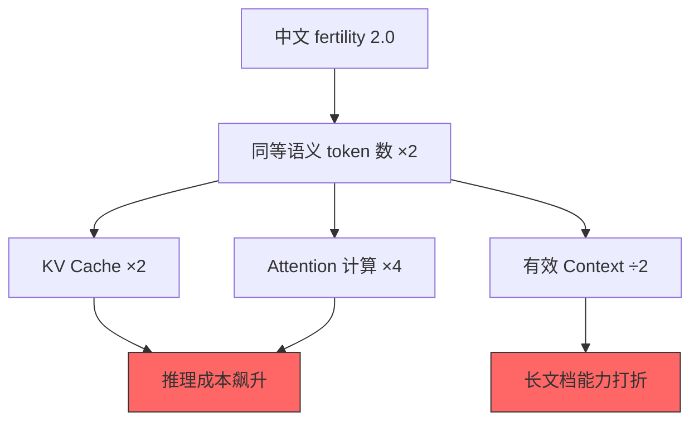
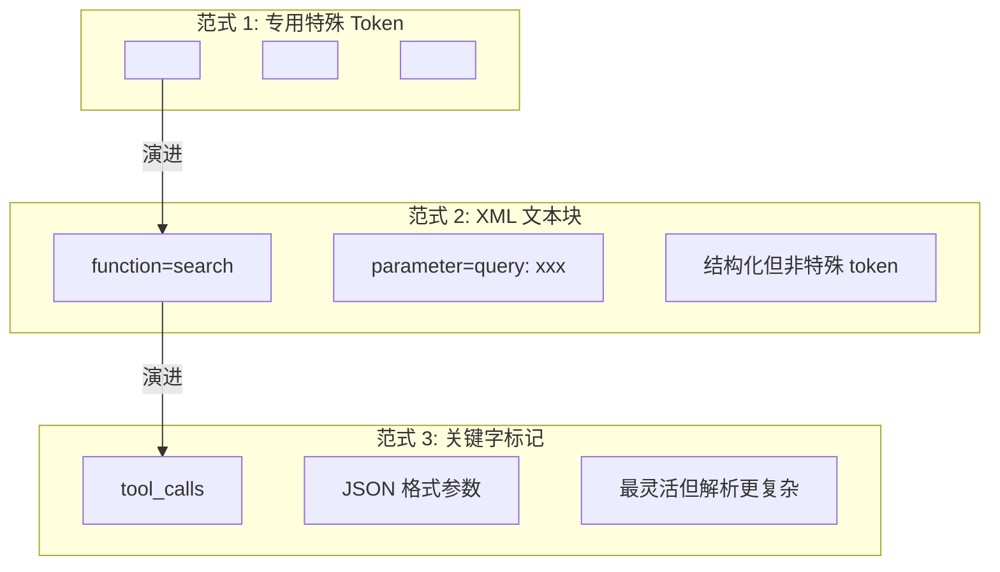
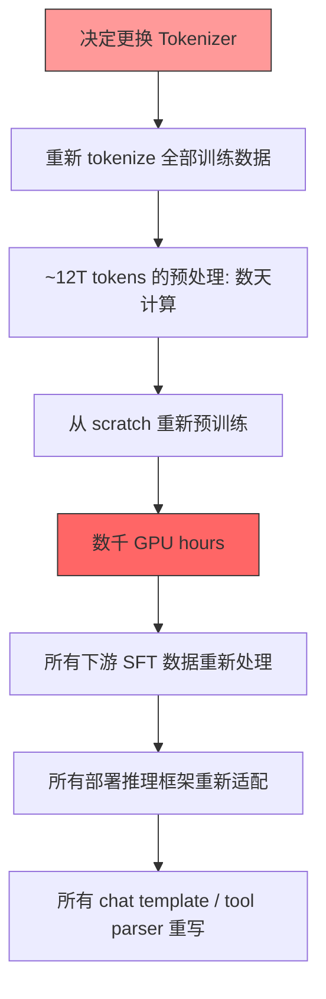
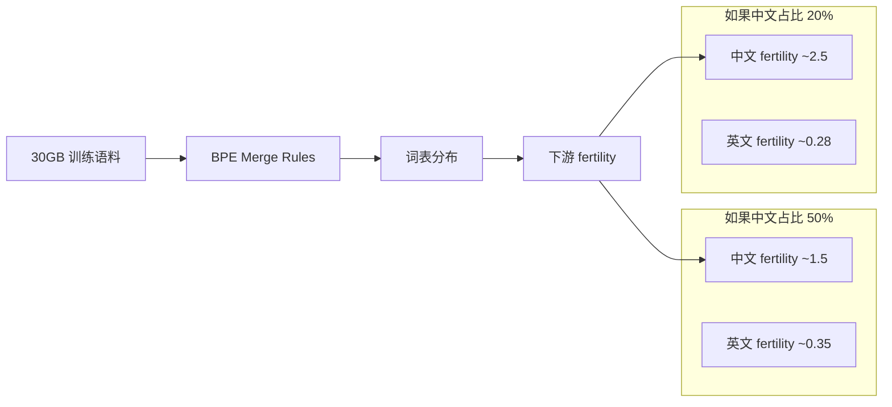
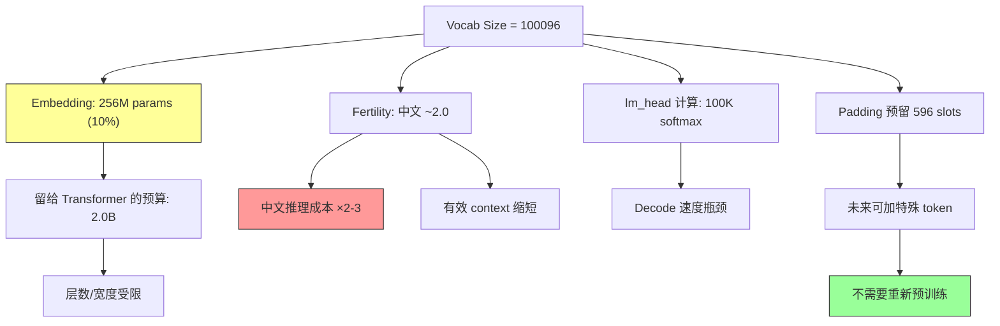

一个 3B 参数的端侧模型，加载 tokenizer 的代码长这样：

```python
tokenizer = AutoTokenizer.from_pretrained(
    "30g_100K_identity",
    add_bos_token=False,
    add_eos_token=False,
    use_fast=False
)
```

看起来人畜无害。但打开词表一看：vocab_size = 100096。hidden_dim = 2560。Embedding 矩阵的参数量 = 100096 × 2560 = **256.2M**（含 input embedding + output lm_head 则更多）。模型总参数 2.46B，**光 embedding 就吃掉了 ~10%**。

这不是一个极端案例——它是所有 ≤3B 模型都必须面对的设计张力：词表越大，分词越高效；但 embedding 层占比越高，留给 Transformer 层做"推理"的参数预算就越少。

本文从这个真实 100K 词表配置出发，剖析词表大小选择、中文 fertility 困境、特殊 token 设计陷阱以及 tokenizer 不可逆性的工程实质。

---

## 一、100K 词表的参数代价：一道简单算术

Embedding 层的参数量公式：

$$P_{emb} = V \times d_{model}$$

其中 $V$ 是词表大小，$d_{model}$ 是隐藏维度。如果 input embedding 和 output lm_head 不共享权重（untied），这个代价翻倍：

$$P_{emb+lm_head} = 2 \times V \times d_{model}$$

对于这个 3B 模型：

| 组件 | 参数量 | 占比 |
|------|--------|------|
| Input Embedding (100096 × 2560) | 256.2M | ~10.4% |
| Transformer Layers | ~2.0B | ~81.3% |
| lm_head (tied with embedding) | — | — |
| 其他 (LayerNorm, etc.) | ~200M | ~8.3% |
| **总计** | **~2.46B** | 100% |

这里用了 tied embeddings（input/output 共享权重），否则 embedding 占比直接翻到 20%。即便如此，10% 的参数"只做查表不做推理"的现实依然扎眼。

为什么还要选 100K？因为这是一个**中英双语**模型。32K 词表下中文 fertility 太高，等效上下文窗口被压缩到不可用。100K 是在"参数效率"和"中文覆盖"之间反复实验后的折中点。

---

## 二、行业词表大小全景对比

```mermaid
graph LR
    subgraph 小词表 ≤100K
        A["3B 端侧模型: 100K"]
        B["某中英高效模型: 73K"]
    end
    subgraph 大词表 128K+
        C["某 MoE 架构: 128K"]
        D["某多语言系列: 152K"]
    end
    subgraph 演进路径
        E["某系列 v1: 32K"] --> F["v2: 32K"] --> G["v3: 128K"]
    end
```

### 典型配置对比

| 模型系列 | 词表大小 | hidden_dim | Embedding 参数 | 总参数 | Emb 占比 |
|----------|---------|-----------|---------------|--------|----------|
| 3B 端侧模型 | 100096 | 2560 | 256M | 2.46B | 10.4% |
| 某中英高效模型 (4B) | 73440 | 2304 | 169M | 4B | 4.2% |
| 某 MoE 架构 (671B dense) | 129280 | 7168 | 927M | 671B | 0.14% |
| 某多语言系列 (32B) | 151936 | 5120 | 778M | 32B | 2.4% |
| 某系列 v1-v2 (7B) | 32000 | 4096 | 131M | 7B | 1.9% |
| 某系列 v3 (8B) | 128256 | 4096 | 525M | 8B | 6.6% |

**关键洞察**：

1. **模型越小，词表大小越敏感。** 671B 模型用 128K 词表，embedding 占比 0.14%，可以忽略。但 3B 模型用 100K，占比直接到 10%。这解释了为什么 73K 的设计选择在 4B 模型上格外有工程意义——它把 embedding 占比压到了 4.2%。

2. **词表从 32K 到 128K 的演进是被逼出来的。** 某系列从 v1 到 v3，词表从 32K 跳到 128K，核心驱动是多语言和代码能力需求。32K 词表在中文和代码场景的 fertility 太差，训练效率被严重拖累。

3. **73K 是一个被低估的甜点。** 相比 100K，少了 27K 词汇量；但参数节省 = 27000 × 2304 = 62M，对于 4B 模型这 62M 可以多加一层 Transformer（实际能力提升远大于 27K 词汇覆盖的边际收益）。这种"用更少词表换更多层"的设计哲学，是小模型必须做的取舍。

4. **100096 这个数字不是巧合。** 实际有效词汇可能只有 ~99000 个，剩余的 padding 到 100096 是为了 GPU 对齐（divisible by 64/128）和**预留特殊 token 空间**。未来加入新的 tool calling token 或 reasoning token 时，不需要改 embedding shape——直接把预留 slot 分配给新 token 即可。

---

## 三、中文 Fertility 困境：同样的语义，2-3 倍的 token 数

Fertility = token 数 / 字符数。对于 BPE tokenizer：

| 语言 | 典型 fertility | 含义 |
|------|---------------|------|
| 英文 | 0.25-0.35 | 平均 3-4 字符 = 1 token |
| 中文 (100K vocab) | 1.5-2.5 | 平均 1 汉字 = 1.5-2.5 tokens |
| 代码 | 0.3-0.5 | 取决于语言和缩进风格 |

### 对推理成本的直接影响

假设一段等价语义的文本：

- 英文版本：500 tokens
- 中文版本（100K 词表）：1000-1500 tokens

这意味着：

1. **KV Cache 内存翻倍**：推理时每个 token 都需要存储 key/value 向量，中文序列的 KV cache 开销是英文的 2-3 倍
2. **Attention 计算量按 $O(n^2)$ 增长**：token 数翻 2 倍，attention 计算量翻 4 倍
3. **有效上下文窗口缩短**：标称 8K context 的模型，处理中文时等效只有 3-4K 字的容量



### 为什么 100K 还是不够

以 100096 词表为例，其中约 256 个是 byte fallback token，约 1000 个是特殊 token，实际有效词汇约 98000 个。按中英 6:4 分配训练 tokenizer，中文 token 约 60000 个。

常用汉字约 3500 个，常用双字词约 20000 个，常用三字及以上词组约 30000 个——加起来就超过 50000 了。而且还需要覆盖技术术语、人名地名、网络用语等。60000 个中文 token 位只能说"勉强够用"，远没有达到每个常见词都是 single token 的理想状态。

这就是 73K 方案的精妙之处：通过更激进的 BPE merge 策略和更精心的训练数据配比，用更少的 token 数实现了接近的中文 fertility——论文报告的中文压缩率优于多数 100K+ 方案（参见 [arXiv:2506.07900](https://arxiv.org/abs/2506.07900)）。

---

## 四、特殊 Token 设计：一个 `<think_start>` 引发的线上事故

特殊 token 看起来是最简单的决策——无非是定义几个特殊字符串嘛。但在 tool calling 和 reasoning 能力逐渐成为标配之后，特殊 token 的设计变成了一个雷区。

### Tool Calling 格式战争

从各代工具调用模型的演进来看，业界经历了至少三种范式：



每种范式都有工程 trade-off：

| 范式 | 优势 | 劣势 |
|------|------|------|
| 专用特殊 token | 解析可靠、可 logit bias 强制 | tokenizer 耦合、迁移成本高 |
| XML 文本块 | 不依赖特殊 token、可读性好 | 解析复杂、易被模型"创造性"破坏 |
| 关键字 + JSON | 灵活、可扩展 | 需要 constrained decoding 保证格式 |

### 致命陷阱：特殊 token 的"意外匹配"

这是真实发生过的事故场景：

1. 模型定义了 `<think_start>` 和 `<think_end>` 作为 reasoning trace 的边界标记
2. 用户通过 tool description 传入了一段包含 `<think_start>` 文本的 prompt（比如在描述另一个模型的输出格式）
3. Tokenizer 将用户输入中的 `<think_start>` 识别为**特殊 token** 而非普通文本
4. 模型的 attention pattern 被破坏——它"以为"中间出现了一段 thinking trace
5. 输出混乱，推理链断裂

**根因**：tokenizer 的 `added_tokens` 配置中，这些特殊 token 被设为 `special=True`，意味着**无论出现在哪里都会被当作特殊 token 处理**，不会被 BPE merge 分解。

**修复方案**：

```python
# 错误：特殊 token 在任何位置都生效
tokenizer.add_special_tokens({"additional_special_tokens": ["<think_start>"]})

# 正确：只在显式标记位置才当作特殊 token
# 方案 A: 使用不可能在自然文本中出现的格式
#   <|think_start|> (加 pipe 分隔)
# 方案 B: 在 tool description 中用 plain-text placeholder
#   "[THINK_BEGIN]" 而非 "<think_start>"
# 方案 C: tokenizer 配置 lstrip/rstrip 规则限制匹配条件
```

### 预留 Token 的工程意义

回到 100096 这个数字。假设实际训练时用了 99500 个 token，剩余 596 个空位。这些空位的价值：

- **未来的 reasoning token**：`<think>`, `<reflect>`, `<plan>` 等
- **未来的 tool calling token**：`<tool_call>`, `<tool_result>`, `<code_exec>` 等
- **未来的 multimodal token**：`<image>`, `<audio>` 等
- **版本兼容**：升级 chat template 时添加新 role 标记

这些 token 加入时只需要初始化对应的 embedding 向量（通常用已有 token 的均值或随机初始化），然后在 SFT 阶段训练几百步就能收敛——**不需要重新预训练**。但如果词表空间满了，扩展 vocab_size 意味着改 embedding shape，整个 checkpoint 格式变化，所有推理框架需要适配。

---

## 五、Tokenizer 的不可逆性：换词表 = 从零开始

这不是修辞。这个 3B 模型在约 30 亿个 sample 上完成了预训练（按平均序列长度 4096 估算，约 12T+ tokens）。如果要换 tokenizer，需要：



### 为什么不能"续训"？

理论上，可以做 vocab extension：保持旧 token 不动，新增 token 的 embedding 随机初始化，然后继续训练。但实践中的问题：

1. **旧 token embedding 的"记忆"**：经过 12T tokens 的训练，每个 token 的 embedding 向量编码了丰富的上下文语义。新增 token 的 embedding 从零开始，需要大量数据才能和旧 embedding 建立合理的语义关系。

2. **lm_head 的权重分布**：output layer 的权重已经在旧词表上形成了稳定的 probability landscape。新增 token 会打破这个分布，导致模型短期内生成质量下降。

3. **数据分布偏移**：如果新 tokenizer 对同一段文本产生不同的切分，模型之前学到的 n-gram 关联就失效了。比如旧 tokenizer 把"人工智能"切成 `["人工", "智能"]`，新 tokenizer 切成 `["人工智能"]` 一个 token——模型之前学到的 "人工" → "智能" 的转移概率变得毫无意义。

### 100096 的 Padding 策略

这就是为什么 vocab_size 被 pad 到 100096 而非恰好等于实际 token 数：

- 64 对齐：100096 / 64 = 1564（整除），GPU tensor core 运算效率最高
- 预留空间：不改 shape 就能加特殊 token
- 训练稳定性：未使用的 token embedding 初始化为零向量，不参与梯度更新，不影响现有模型行为

这种 padding 策略几乎是所有生产级模型的标配。你看到的 128256、129280、151936 这些数字，都不是巧合——它们都满足特定的对齐要求和预留策略。

---

## 六、BPE 训练的工程细节

回到 `30g_100K_identity` 这个 tokenizer 的名字。拆解一下：

- **30g**：tokenizer 训练语料大小约 30GB
- **100K**：目标词表大小 100K
- **identity**：pre-tokenization 策略（推测为 identity mapping，即不做语言特定的预切分）

### Tokenizer 训练数据的隐性影响

Tokenizer 训练数据的分布决定了 merge 的优先级：



30GB 的规模对于训练 100K 词表是合理的——经验法则是每个目标 token 需要在训练语料中出现至少 100 次。100K tokens × 100 次 × 平均 token 长度 5 bytes ≈ 50MB 是理论下限，但实际需要远多于此来确保 merge 顺序的稳定性。30GB 给出了充足的统计信号。

### `use_fast=False` 的含义

这个参数选择了 Python 实现的 tokenizer 而非 Rust 后端（HuggingFace Tokenizers）。可能的原因：

1. **确定性要求**：Rust 版本在某些 edge case 上和 Python 版本的行为不完全一致
2. **自定义 pre-tokenization**：`identity` 策略可能有 Python 端的特殊处理逻辑
3. **调试友好**：预训练阶段 tokenizer 的 encode 速度不是瓶颈（data loading pipeline 有 prefetch），但确定性和可调试性很重要

### `add_bos_token=False, add_eos_token=False`

这意味着 BOS/EOS 的添加由**数据处理 pipeline** 而非 tokenizer 自动完成。好处是：

- 多轮对话拼接时可以灵活控制 BOS/EOS 的位置
- Packing 多个 sample 时不会出现多余的 BOS/EOS
- Chat template 有完全的控制权

这是大规模预训练的标准做法——tokenizer 只负责 text ↔ token ID 的映射，序列结构由上层决定。

---

## 七、设计决策的连锁反应

把所有决策画在一起，可以看到 tokenizer 选择如何级联影响整个系统：



### 一个 Tokenizer 决策的完整影响面

| 影响维度 | 具体表现 | 量级 |
|----------|---------|------|
| 参数预算 | 10% 参数"浪费"在查表 | 256M params |
| 训练效率 | 中文序列更长 → 更多 FLOPs | +50-150% |
| 推理成本 | KV cache 更大，attention 更贵 | +100-200% |
| 工程锁定 | 12T+ tokens 的预处理不可回退 | 不可逆 |
| 可扩展性 | 预留 slot 支持未来能力 | 596 tokens |
| 下游兼容 | 所有 chat template 基于此词表 | 全链路 |

---

## 八、实战建议：如果你正在设计 Tokenizer

基于上述分析，给出分场景的建议：

### ≤3B 端侧模型

- **词表 64K-100K**，不要超过 100K
- **严格评估 embedding 占比**：目标控制在 8-12% 以内
- **中文训练数据占比 40%+**（在 tokenizer 训练语料中，不是模型训练语料）
- **预留 padding 至少 256 个 slot**（对齐 + 特殊 token 扩展）
- **从第一天就规划好所有特殊 token**，包括未来可能需要的 tool calling 和 reasoning 标记

### 7B-13B 通用模型

- **词表 100K-128K** 是合理区间
- Embedding 占比降到 3-6%，不再是主要矛盾
- 重点关注 **fertility 的平衡**——确保中英文 fertility 差距不超过 3 倍
- 可以接受稍大的词表来换取更好的代码/数学 token 覆盖

### 大规模 MoE/Dense 模型

- **词表 128K-152K** 都可以
- Embedding 占比 <1%，不是设计约束
- 重点是 **lm_head 的计算成本**：152K softmax 在 decode 时的延迟
- 考虑 tied embeddings 节省显存（但不节省计算）

---

## 九、总结：Tokenizer 是模型的"宪法"

Tokenizer 之于模型，如同宪法之于法律体系——一旦确立，后续所有决策都在它的框架内运行。改动它的成本不是"重新训练一下"，而是"整个系统推倒重来"。

这个 100K 词表 3B 模型的案例完美体现了小模型设计的核心张力：

1. **想要好的中文覆盖** → 需要大词表 → embedding 吃掉更多参数
2. **想要强的推理能力** → 需要更多 Transformer 层 → 参数预算被 embedding 挤压
3. **想要未来可扩展** → 需要预留 token 空间 → 词表更大

没有完美解。只有在充分理解 trade-off 之后，做出最适合你场景的选择——然后和它一起走到底。

---

## 参考文献

1. Kudo, T., & Richardson, J. (2018). SentencePiece: A simple and language independent subword tokenizer and detokenizer for Neural Text Processing. *EMNLP*. [arXiv:1808.06226](https://arxiv.org/abs/1808.06226)

2. Sennrich, R., Haddow, B., & Birch, A. (2015). Neural Machine Translation of Rare Words with Subword Units. *ACL 2016*. [arXiv:1508.07909](https://arxiv.org/abs/1508.07909)

3. Hu, S., et al. (2025). MiniCPM4: Ultra-Efficient LLMs via Lossless Model Compression. [arXiv:2506.07900](https://arxiv.org/abs/2506.07900)

4. Liu, A., et al. (2024). DeepSeek-V3 Technical Report. [arXiv:2412.19437](https://arxiv.org/abs/2412.19437)

5. Petrov, A., et al. (2024). Language Model Tokenizers Introduce Unfairness Between Languages. *NeurIPS 2024*. [arXiv:2305.15425](https://arxiv.org/abs/2305.15425)

6. Yu, L., et al. (2023). MEGABYTE: Predicting Million-byte Sequences with Multiscale Transformers. *NeurIPS 2023*. [arXiv:2305.07185](https://arxiv.org/abs/2305.07185)
