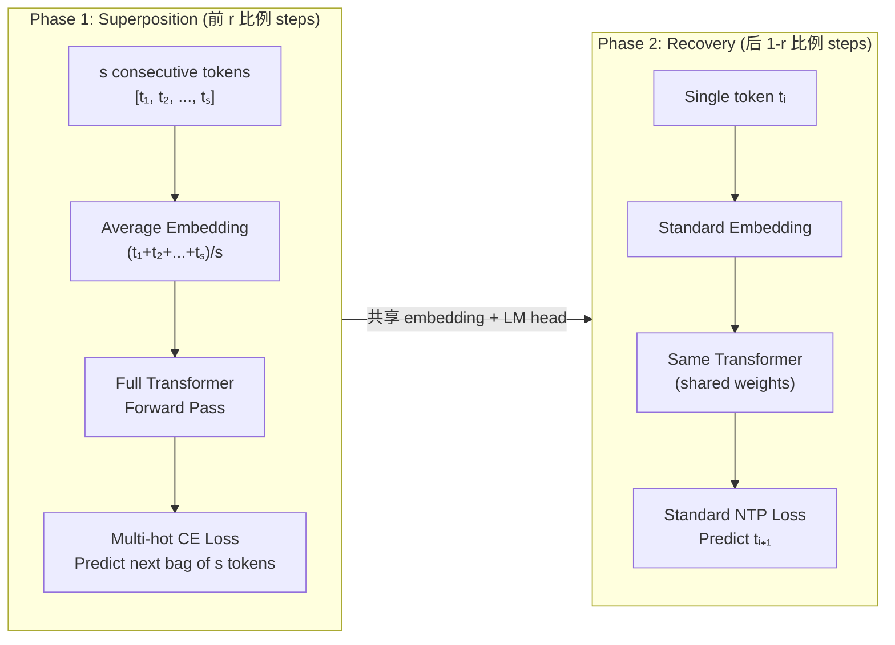

某 10B MoE 模型预训练，用 Token Superposition Training 消耗了 2T tokens 但只花了 4768 B200-hours——baseline 的 1.05T tokens 反而花了 12311 B200-hours。等效加速 2.5 倍，loss 还低了 0.016。但有个致命约束：如果在阶段切换时重新初始化 embedding，loss 直接比 baseline 还差。

这篇文章拆解 TST 的机制、scaling 表现、以及那个看起来不起眼但足以毁掉整个训练的 design constraint。

## 什么是 Token Superposition Training

TST 的核心思想：在训练前期，把连续 s 个 token 的 embedding 平均成一个 "superposed token"，用一次 forward pass 同时处理 s 个 token 的信息。这让模型在相同 compute 下看到 s 倍的 data。训练分两个阶段：

**Phase 1 — Superposition（粗粒度学习）：**
- Input superposition：将连续 s 个 token 的 embedding 做 average pooling，得到一个 latent vector
- Output superposition：用 multi-hot cross-entropy 预测下一个 bag-of-tokens（s 个 token 的集合）
- 每个 forward step 实际覆盖 s 倍的 token，但 FLOPs 不变

**Phase 2 — Recovery（标准 NTP）：**
- 切回标准的 next-token prediction
- 关键：embedding 和 LM head 直接从 Phase 1 继承，不做任何重新初始化

Phase 1 中模型学到的是 coarse-grained 的语言结构——哪些 token 倾向于共现、句子级别的语义关系。Phase 2 用标准 NTP 把这个粗粒度理解 refine 到 token 级别精度。

## 10B MoE 的 Headline Result

在某 10B-A1B MoE 架构上的对比：

| 配置 | Steps | Tokens | B200-Hours | Final Loss | HellaSwag |
|------|-------|--------|------------|------------|-----------|
| Baseline | 125,000 | 1.05T | 12,311 | 2.252 | 70.1 |
| TST (s=16) | 49,983 | 2.0T | 4,768 | 2.236 | 71.2 |

几个关键数字：
- **Wall-clock speedup: 2.58×**（12311 / 4768 B200-hours）
- **Loss improvement: -0.016**（TST 略胜）
- **HellaSwag: +1.1 points**（TST 在下游 benchmark 同样不输）
- TST 模型消耗了更多 tokens（2T vs 1.05T），但 compute 大幅减少

这不是 "用更多数据换更好结果" 的故事——是 "用相同 compute 处理更多数据" 的故事。每个 forward step 的 FLOPs 相同，但每步覆盖 16 个 token 的信息。

## 致命约束：重新初始化 Embedding 就翻车

这是整篇论文最重要的 ablation。在 3B dense 模型上：

| Setting | Final Loss |
|---------|-----------|
| Baseline（标准 NTP） | 2.808 |
| TST (s=6, r=0.3) | 2.676 (**比 baseline 好**) |
| TST + 在 phase switch 时 reinitialize embed/LM head | 2.938 (**比 baseline 差！**) |

重新初始化 embedding 和 LM head 之后，loss 不仅没有恢复，反而比完全不用 TST 还差了 0.13。这意味着：

**Phase 1 训练的 embedding 包含了关键信息，而且这个信息是 Phase 2 能正常 recover 的前提。**

为什么？Phase 1 的 multi-hot prediction 迫使 embedding 空间学到了一种 "token 之间的共现结构"——哪些 token 经常出现在同一个 bag 里。这种 coarse structure 是 Phase 2 做 fine-grained NTP 的 initialization prior。如果你把这个 prior 扔掉，transformer 的 hidden states 和新的 random embedding 之间存在 representational mismatch，Recovery phase 不仅要学语言模型，还要重新 align embedding space，额外的 optimization burden 导致最终 loss 更差。

**工程启示：** TST 的加速不是免费的 "trick"，它要求 embedding layer 在两个 phase 之间保持 representational continuity。任何会破坏这个 continuity 的操作（reinit、aggressive pruning、vocabulary expansion）都可能让整个训练策略失效。

## 跨规模的 Scaling 表现

从 270M 到 3B，TST 的收益 consistently 存在：

| Model | Steps | Bag Size | Tokens Seen | B200-Hours | Loss | HellaSwag |
|-------|-------|----------|-------------|------------|------|-----------|
| 270M Baseline | 20k | - | 42B | 34 | 3.212 | 36.3 |
| 270M TST | 20k | 6× | 105B | 34 | 3.142 | 38.6 |
| 600M Baseline | 20k | - | 42B | 61 | 3.019 | 43.5 |
| 600M TST | 20k | 6× | 105B | 61 | 2.943 | 48.2 |
| 3B Baseline | 20k | - | 42B | 247 | 2.808 | 57.6 |
| 3B TST | 20k | 6× | 105B | 247 | 2.676 | 62.4 |

几个观察：
1. **B200-Hours 完全相同**——TST 没有增加任何 compute overhead
2. **Loss gap 随模型变大而扩大**：270M 差 0.07，600M 差 0.076，3B 差 0.132
3. **HellaSwag 增益也在放大**：+2.3 → +4.7 → +4.8
4. 在 equal-compute 条件下，TST 一致性地用 2.5× 的 token throughput 换取更好的 loss

这暗示 TST 的收益可能随 model scale 进一步增长——larger model 有更强的 capacity 来 leverage superposition phase 学到的 coarse structure。

## Design Constraints: s、r 和 U-shaped Curve

**Bag size s：** 存在 U-shaped loss curve。

- s 太小（2-3）：speedup 不够大，coarse phase 学到的结构太接近 standard NTP，收益有限
- s 太大（>12 对小模型）：信息损失过大，average pooling 抹掉了太多 positional 和 local structure 信息
- Sweet spot：**s = 4-8**（小模型），**s = 16**（10B 级别模型 capacity 足够大可以 handle 更粗的 granularity）

**Phase ratio r：** 典型值 **r = 0.3**（30% steps 做 superposition，70% 做 recovery）。

r 太小：superposition phase 太短，没来得及建立有意义的 coarse representation。r 太大：recovery phase 不够长，无法完全 refine 到 token-level precision。

**Equal-token comparison 的陷阱：** 如果固定 token 总量（而非 compute），TST 很可能反而 hurt performance。因为 superposition phase 的 per-token supervision signal 是稀释的（s 个 token 共享一个 gradient signal），在 token-limited setting 下这种稀释是净损失。

## 什么时候用 TST

**适用场景：Compute-limited + Data-abundant**

你有足够的数据（比如 18T tokens），但 GPU 预算有限。TST 让你在相同 B200-hours 内 "看到" 2.5 倍的 tokens。

以 3B 模型、18T token 目标为例：
- Baseline：18T tokens，约 28.8 天
- TST (s=8, r=0.3)：实际消耗约 34T tokens 等效量，但只需约 11.5 天
- 结果：相同 quality，**2.5× faster wall-clock**

**不适用场景：Token-limited**

如果你的 token budget 是固定的（比如只有 2T tokens 的 curated data，不能重复），TST 在等 token 对比下大概率 hurt——每个 token 的 supervision signal 被稀释了。

**Architecture-orthogonal：** TST 不改变模型架构。Phase 2 结束后的 model 就是一个标准 transformer，inference 完全不受影响。不需要任何 serving-side 的适配。

## 工程教训

1. **Representation continuity 是非协商的。** Embedding/LM head 在 phase transition 时必须 share，任何 reinit 都会 catastrophically fail。这不是 "微调一下就好" 的问题——reinit 后的 loss 比不用 TST 还差。

2. **Coarse-to-fine 不是新想法，但 execution 细节决定生死。** Curriculum learning、progressive resolution 在 CV 里用了很多年。TST 的贡献是找到了一种 NLP 中 works 的具体实现——并且用 ablation 证明了哪些细节不能动。

3. **Compute efficiency ≠ Token efficiency。** TST 是 compute-efficient（相同 FLOPs 更好的 loss），但不是 token-efficient（相同 tokens 可能更差）。在 data 越来越多、compute 越来越贵的趋势下，这是正确的 trade-off 方向。

4. **Bag size 需要和 model capacity 匹配。** 270M 模型用 s=6 就好，10B 模型可以 push 到 s=16。更大的模型有更强的 "从粗粒度信号中提取有用结构" 的能力。

5. **Multi-hot CE 是关键设计选择。** 不是 predict s tokens 的 sequence（那样需要 autoregressive decoding），而是 predict 一个 bag（unordered set）。这保持了 single forward pass 的简洁性，同时提供了足够的 supervision signal。

## References

- Token Superposition Training ([arXiv:2605.06546](https://arxiv.org/abs/2605.06546))
