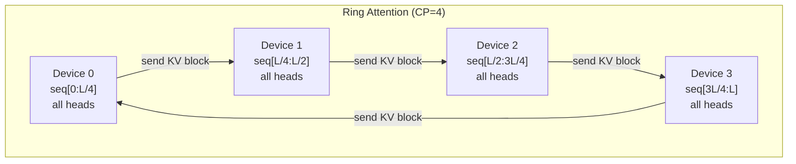
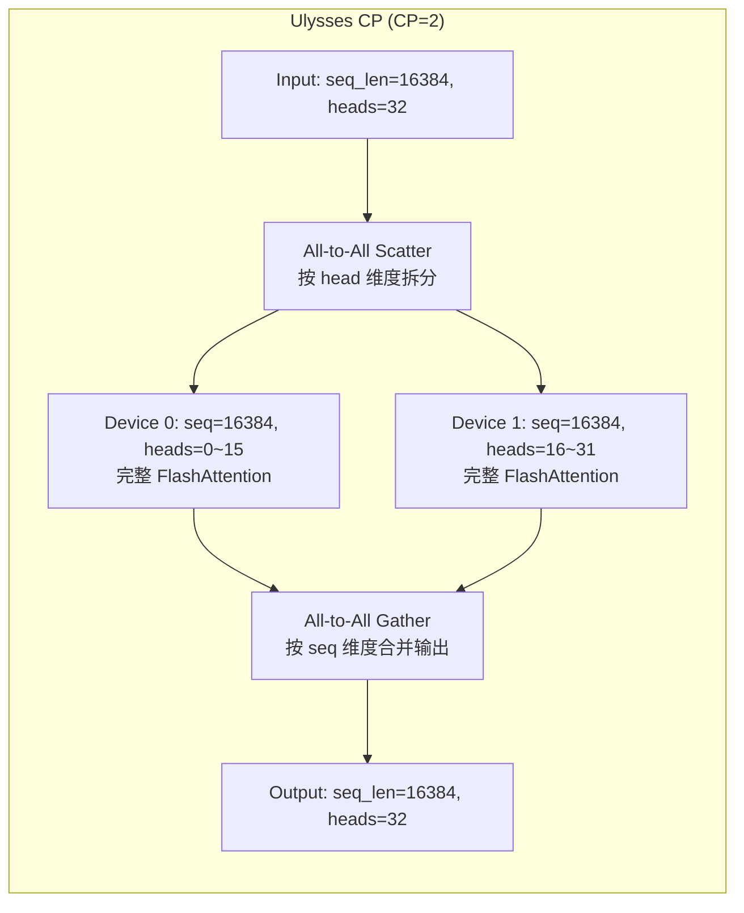
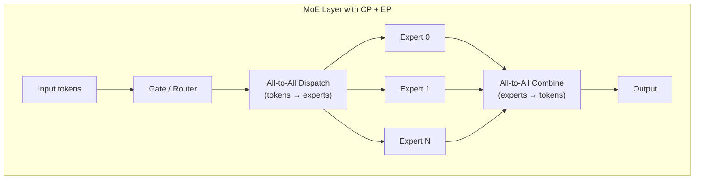
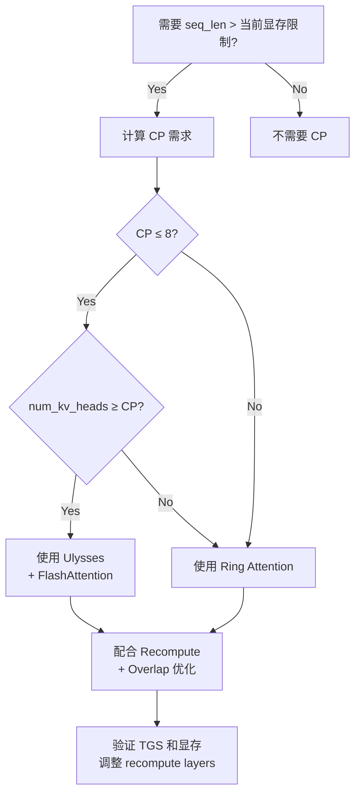

## 开场：一个 FD 阶段的性能骤降事故

我们在某 3B 多模态模型的 Fast Decay (FD) 阶段，需要将序列长度从 4096 推到 16384。这是长上下文训练的标准操作——在短序列完成主体预训练后，拉长序列让模型学习长距离依赖。

训练集群：2048 × L40S，GBS=1024。

改动看起来很简单：

```yaml
# PT 阶段 (seq=4096)
context-parallel-size: 1
recompute-num-layers: 0  # baseline 不启用
GBS: 16384
micro_bs_per_gpu: 1
grad_accum: 8

# FD 阶段 (seq=16384)
context-parallel-size: 2   # 开启 Ulysses CP
recompute-num-layers: 8    # 必须开 recompute 否则 OOM
GBS: 1024                  # 降低以适配显存
```

结果：训练速度比 PT 阶段慢了 **20%**（TGS 从 >2600 降到 ~2080）。

这 20% 的性能损耗来自三个叠加因素：

1. **All-to-All 通信**：Ulysses CP 在每个 attention 层做两次 all-to-all（scatter heads → gather heads），L40S 的 NVLink 带宽有限
2. **Recompute 开销**：为了装下 4x 长的序列，必须重算 8/32 层的 activation（约 25% 层数）
3. **Batch size 缩小**：GBS 从 16384 降到 1024，GPU 利用率下降

目标是 TGS > 1600 且 5 天完成 2T tokens 的 FD 训练。实际 2080 虽然超了目标，但团队想知道：能不能把 20% 拿回来？

最终通过三步优化：

- 将 `recompute-num-layers` 从 8 调到 4（显存刚好卡在阈值，不够就回退到 6）
- 开启 `overlap-grad-reduce` + `overlap-param-gather` 覆盖 DP 通信
- 使用 `NVTE_BATCH_MHA_P2P_COMM=1` 让 attention 通信与计算 overlap

TGS 从 2080 提到 ~2400，回收了大约 **60%** 的性能损耗。剩下的 40% 是 recompute 和 batch size 的硬开销，无法消除。

---

## 1. Ulysses vs Ring Attention——两种 CP 的本质区别

Context Parallelism 的核心思想：把一条长序列切到多张卡上并行算 attention。但「怎么切」决定了通信模式和瓶颈。

### 1.1 Ring Attention：切序列，保留全部 head



每个 device 持有完整的 attention heads，但只持有 1/CP 的序列。计算时，KV blocks 沿 ring 传递，每一步计算当前 block 的 partial attention，同时异步传输下一个 block。

### 1.2 Ulysses：切 head，保留全部序列



每个 device 持有完整序列，但只负责部分 attention heads。进入 attention 前做一次 all-to-all 把 sequence 维度换成 head 维度，出来后再做一次 all-to-all 换回来。

### 1.3 对比总结

| 维度 | Ulysses | Ring Attention |
|------|---------|---------------|
| 通信模式 | All-to-All（2次/layer） | P2P Ring（逐步传递 KV） |
| 通信量 | O(seq_len × hidden / CP) | O(seq_len × head_dim × num_kv_heads) |
| 与 GQA 的兼容性 | 受限（CP ≤ num_kv_heads） | 无限制 |
| 通信-计算 overlap | 困难（all-to-all 是 blocking） | 自然 overlap（计算当前 block 时传下一个） |
| Flash Attention 兼容 | 天然兼容（每个 device 做完整 attention） | 需要 tiled/incremental softmax |
| 适用规模 | CP=2~8 | CP=8~128 |
| 实际案例 | MAI-Thinking-1, 某 3B 模型 FD 阶段 | Megatron-LM long sequence training |

---

## 2. 为什么小 CP 用 Ulysses、大 CP 用 Ring

这不是信仰问题，是数学问题。

**Ulysses 的通信成本**：每层 2 次 all-to-all，每次搬运的数据量 = `seq_len × hidden_dim / CP`（对 CP 组内所有卡做 all-to-all）。操作次数固定为 2，不随 CP 增大。

**Ring 的通信成本**：每层做 CP-1 步 ring 传递，每步传 `seq_len/CP × head_dim × num_kv_heads`。总通信量 = `(CP-1)/CP × seq_len × head_dim × num_kv_heads`，约等于 `seq_len × head_dim × num_kv_heads`。

关键差异在 **overlap 能力**：

- Ring 的每一步通信量小，且可以与当前 block 的计算完美 overlap（发下一个 KV block 的同时算当前 block）
- Ulysses 的 all-to-all 是 collective 操作，所有卡必须同步参与，几乎无法与计算 overlap

**Crossover point**：当 CP > 8 时，Ring 的增量 overlap 策略胜过 Ulysses 的 blocking all-to-all。经验值：

- CP=2~4：Ulysses 更快（all-to-all 次数少，绝对延迟低）
- CP=8：两者接近
- CP=16+：Ring 明显更优

**GQA 约束是硬限制**：如果模型只有 8 个 KV heads（GQA-8），那 Ulysses CP 最多设为 8——因为每个 device 至少要分到 1 个完整 KV head。而 Ring Attention 不受此限。

某 962B MoE 模型（MAI-Thinking-1）使用 Ulysses-style CP 配合 FlashAttention-4，在 8K GB200 NVL72 机柜上实现 >20% MFU。它的 KV heads = 8，所以 CP 也恰好设为 8，刚好卡在 Ulysses 上限。

---

## 3. Context Parallelism 的显存数学

为什么非要开 CP？因为长序列的 activation memory 会爆。

Transformer 单层 activation memory（FP16，不含 recompute）：

```
activation_per_layer ≈ seq_len × hidden × (10 + 12/TP)  bytes
```

对于 3B 模型（hidden=3072, layers=32, TP=1）：

| seq_len | 单层 activation | 32 层总计 | 备注 |
|---------|----------------|-----------|------|
| 4096 | ~270 MB | ~8.6 GB | L40S 48GB 装得下 |
| 16384 | ~1.08 GB | ~34.5 GB | 加上权重和优化器 → OOM |
| 65536 | ~4.3 GB | ~138 GB | 必须 CP≥4 + recompute |

开 CP=2 后，每张卡只持有 1/2 的序列片段（Ulysses 下是 1/2 的 heads 但完整序列——activation 同样减半因为只算部分 heads 的中间结果）。34.5 GB → ~17 GB，配合 recompute 8 层再省 ~4 GB，刚好塞进 L40S 的 48GB 显存。

某开源 7B/32B 模型（OLMo 3）的配置参考：

| 模型 | 集群 | seq_len | CP | TP | 备注 |
|------|------|---------|----|----|------|
| 7B | 256×H100 | 65536 | 8 | 1 | Ring-style, GQA-8 |
| 32B | 1024×H100 | 65536 | 8 | 4 | Ring-style, GQA-8 |

---

## 4. Recompute 策略的精细选择

Recompute（Gradient Checkpointing）是显存不够时的标准手段：forward 不保存中间 activation，backward 时重新计算。代价是增加约 33% 的 FLOPs（重算一遍 forward）。

但实际工程中有多种 granularity：

### 4.1 Full Recompute

重算所有层的 activation。显存节省最大，但计算开销固定 ~33%。

### 4.2 Selective Recompute（只重算 attention）

Attention 的 activation 占大头（O(N²) 的 softmax 中间结果），但 FlashAttention 本身就不存完整 attention matrix。所以 selective recompute 在 FA 时代收益缩小。

### 4.3 Partial Block Recompute（我们的选择）

只对 K/L 层做 recompute，其余层正常保存 activation。

```python
# Megatron-LM 配置
recompute-num-layers: 8   # 32 层中重算 8 层
recompute-method: block    # 按 block 而非 uniform
```

我们的实测数据：

| recompute-num-layers | 显存占用 | TGS | 能否跑通 |
|---------------------|---------|-----|---------|
| 0 | OOM | - | 不行 |
| 4 | 46.2 GB | 2400 | 刚好（偶尔 spike 到 47.8） |
| 6 | 44.1 GB | 2250 | 稳定 |
| 8 | 41.8 GB | 2080 | 稳定，初始配置 |
| 12 | 38.5 GB | 1890 | 过于保守 |

最终选择 `recompute-num-layers: 4`，在显存 spike 时切换到 6 作为 fallback。

### 4.4 MAI-Thinking-1 的极致方案

某 962B MoE 模型采用 per-expert-per-round 的细粒度 recompute + activation offloading 到 host memory。对于 MoE 模型，每个 expert 的 activation 独立，可以单独决定是 recompute 还是 offload。配合 NVL72 的高带宽 CPU-GPU 互联，offloading 延迟可控。

对于 ViT 编码器部分，某 3B 多模态模型还使用了动态 gradient checkpointing：

```yaml
v-vit-dynamic-gradient-checkpointing: yes  # 按显存压力动态选层
```

---

## 5. All-to-All 与 DeepEP 的维度约束

当模型既有 Context Parallelism 又有 Expert Parallelism（MoE）时，all-to-all 操作出现在两个地方：

1. **CP 的 all-to-all**：resharding attention heads（Ulysses）
2. **EP 的 all-to-all**：dispatch tokens to experts / combine expert outputs



### DeepEP 的硬件对齐约束

DeepEP（DeepSeek 开源的 expert parallelism 库）对 all-to-all 的 tensor 维度有严格要求：**每个 token 发送到 expert 的 hidden dimension 必须能被 512 整除**。这是 GPU warp/bank 对齐的硬性需求。

实际案例：某 962B MoE 模型原始设计的 expert input dimension 是 3328（来自 latent 压缩），不满足 512 对齐。解决方案：

```
原始：hidden → down_proj(7168→3328) → dispatch → expert FFN
修改：hidden → down_proj(7168→3072) → dispatch → expert FFN(3072→10240→3072)
```

3072 = 512 × 6，满足约束。这个改动虽然损失了 ~8% 的 latent 表达维度，但换来的 all-to-all 效率提升远超这点损失。

### LatentMoE 设计模式

某开源模型（MiniCPM4）采用类似的 LatentMoE 架构：

- Shared down-projection 将 hidden 压缩到 latent space（满足 512 对齐）
- All-to-all dispatch 在低维空间完成（通信量大幅减少）
- Expert FFN 在低维输入上做计算
- All-to-all combine 后再 up-projection 回原始维度

通信量减少 = hidden_dim / latent_dim 倍。如果 hidden=7168, latent=3072，通信量减少 2.3x。

---

## 6. Long Context 训练性能优化清单

以下是我们在 2048×L40S 集群上验证过的优化项，按收益排序：

### 6.1 通信-计算 Overlap

```yaml
# Megatron-LM 配置
overlap-grad-reduce: true        # gradient all-reduce 与 backward overlap
overlap-param-gather: true       # ZeRO parameter gather 与 forward overlap
```

收益：~8% TGS 提升。原理是 DP 通信被隐藏在计算后面。

### 6.2 Attention P2P 通信批处理

```bash
export NVTE_BATCH_MHA_P2P_COMM=1
```

将 multi-head attention 中的多次小 P2P 通信合并为一次大通信，减少 kernel launch 开销。收益：~5% TGS 提升。

### 6.3 Selective Recompute 调优

从 recompute 8 层降到 4 层，直接减少 12.5% 的冗余计算。收益：~10% TGS 提升（但需要密切监控显存）。

### 6.4 FP8 通信（如果硬件支持）

All-to-all 通信数据用 FP8 传输，带宽需求减半。H100/GB200 原生支持 FP8 tensor core + FP8 transport。L40S 不支持，所以我们没用。

### 6.5 Data Prefetch + Manual GC

```python
# 避免 Python GC 在训练 step 中间触发
import gc
gc.disable()
# 每 N steps 手动触发
if step % 100 == 0:
    gc.collect()
```

收益：消除 TGS jitter（从 ±15% 波动降到 ±3%）。

### 6.6 实测性能汇总

| 配置 | 集群 | 模型 | seq_len | CP | TGS | MFU |
|------|------|------|---------|----|----|-----|
| 基线 PT | 2048×L40S | 3B | 4096 | 1 | 2600 | ~42% |
| FD 初始 | 2048×L40S | 3B | 16384 | 2 | 2080 | ~34% |
| FD 优化后 | 2048×L40S | 3B | 16384 | 2 | 2400 | ~39% |
| MAI-Thinking-1 | 8K×GB200 | 962B MoE | 32768 | 8 | N/A | >20% |
| OLMo 3 32B | 1024×H100 | 32B | 65536 | 8 | ~1300/GPU | ~38% |

---

## 7. Long Context 评测——训了就有效果吗？

长序列训练的工程做对了，不代表模型效果就好。RULER benchmark 的结果很说明问题。

### 7.1 某开源 7B/32B 模型的 RULER 表现

| 模型 | 4K | 8K | 16K | 32K | 65K | 128K |
|------|----|----|-----|-----|-----|------|
| 7B | 94.89 | 92.47 | 89.63 | 78.79 | 67.96 | - |
| 32B | 96.10 | 94.83 | 92.57 | 86.22 | 79.70 | - |
| Qwen 2.5 32B | 96.03 | 95.57 | 94.63 | 92.67 | 80.73 | - |

### 7.2 关键发现

1. **所有模型在长序列上都衰减**，区别只是衰减速度
2. **32B 比 7B 衰减慢**——更大的模型天然有更好的长距离建模能力
3. **Qwen 2.5 32B 在 32K 处明显更强**（92.67 vs 86.22），说明数据策略的差异比架构更重要

### 7.3 数据策略比 CP 工程更重要

长上下文训练的真正难点不是把 seq_len 开大——那只是工程问题。真正的挑战是：

- **数据中是否包含长距离依赖**：如果训练数据只是把短文档拼接到 16K，模型学不到跨文档的长距离关系
- **长文档的质量**：低质量的长文本（SEO spam、重复内容）反而会伤害模型
- **渐进式训练**：4K → 8K → 16K → 32K 的多阶段训练通常比直接上 32K 效果好
- **RoPE base 频率调整**：配合序列长度增加而调整 RoPE theta（如从 10000 调到 500000）

某开源 7B/32B 模型在 FD 阶段使用了专门策划的长依赖数据集，包含：跨章节引用的书籍、长对话、多轮推理链等。这比简单的文档拼接有效得多。

---

## 总结：CP 选型决策树



核心原则：

1. **CP 是最后手段**——先尝试减小 micro batch size、开 selective recompute
2. **小 CP 用 Ulysses**——通信简单，与 FlashAttention 天然兼容
3. **大 CP 用 Ring**——overlap 能力强，不受 GQA head 数限制
4. **Recompute 要精确到层数**——不要一刀切 full recompute
5. **通信 overlap 是免费午餐**——overlap-grad-reduce 永远要开

---

## References

1. Jacobs et al., "DeepSpeed Ulysses: System Optimizations for Enabling Training of Extreme Long Sequence Transformer Models", [arXiv:2309.14509](https://arxiv.org/abs/2309.14509), 2023.
2. Liu et al., "Ring Attention with Blockwise Transformers for Near-Infinite Context", [arXiv:2310.01889](https://arxiv.org/abs/2310.01889), 2023.
3. Microsoft, "MAI-Thinking-1 Technical Report", 2026.
4. AI2, "OLMo 3: The Next Generation of Open Language Models", [arXiv:2512.13961](https://arxiv.org/abs/2512.13961), 2025.
5. DeepSeek-AI, "DeepSeek-V3 Technical Report", [arXiv:2412.19437](https://arxiv.org/abs/2412.19437), 2024.
6. OpenBMB, "MiniCPM4 Technical Report", [arXiv:2506.07900](https://arxiv.org/abs/2506.07900), 2025.
7. NVIDIA, "Megatron-LM Context Parallelism Documentation", 2024.
