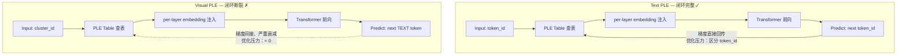

Text PLE 给某 3B 多模态模型带来了 loss -0.023 的显著收益，仅增加 +883M 参数（dP=256）。我们自然想把同样的思路用到视觉 token 上。结果：5 种方法全军覆没，NTP loss 变化全在千分位级别。cos_sim 诊断显示 embedding 结构和随机初始化无异。这篇文章是对这次失败的完整诊断。

---

## 1. PLE 机制回顾：为什么 Text PLE 能工作

Per-Layer Embedding (PLE) 的核心思想：为每个 token_id 在每一层都注入一个独立的 embedding，让模型获得比单一 input embedding 更丰富的 per-layer 表征。

Text PLE 的工作流程：

1. Input 阶段：token_id 查 PLE table → 得到 per-layer embedding → 注入每层 hidden state
2. Target 阶段：模型预测下一个 token_id → 预测目标就是 PLE table 的索引空间
3. 优化压力：模型必须区分不同 token_id 才能做好 next-token prediction → PLE embedding 被迫编码有意义的区分信息

关键点：**input 和 target 共享同一套离散 ID 体系**，形成了完美的自监督闭环。

---

## 2. 五种 Visual PLE 方案：全部失败

我们尝试了三类 online 量化和两类 offline 聚类方案，覆盖了从纯频域到语义特征的完整频谱：

| 方法 | Token ID 语义性 | 训练稳定性 | NTP Loss 变化 | 结果 |
|------|:---:|:---:|:---:|:---:|
| VQ-VAE (online) | 有 | 差（codebook 翻转） | 千分位微升 | FAIL |
| LFQ (online) | 有 | 差（codebook 翻转） | 千分位微升 | FAIL |
| BSQ (online) | 有 | 差（codebook 翻转） | 千分位微升 | FAIL |
| DCT + K-means (offline freq) | 无（纯频率） | 好（离线固定） | 千分位微降 | FAIL |
| SigLIP clustering (offline semantic) | 有（SigLIP 特征） | 好（离线固定） | 千分位微降 | FAIL |

**Online 三件套（VQ-VAE / LFQ / BSQ）**：在训练过程中对 vision encoder 输出做在线量化，将连续特征映射到离散 codebook。优点是 token_id 具有语义对应关系；致命缺点是 codebook 持续更新导致 id 不稳定。

**DCT + K-means**：离线对 image patch 做 DCT 变换，对频率系数做 K-means 聚类。Cluster ID 固定且稳定，但完全基于频率特征，缺乏语义信息。

**SigLIP clustering**：离线用预训练 SigLIP 提取 patch 特征，再做 K-means 聚类。Cluster ID 既稳定又具有语义信息——理论上最优的方案，实际上依然失败。

---

## 3. 诊断深潜：Embedding 到底学到了什么

以 DCT 方案训练 6000 步的诊断结果为例。

### 3.1 Cosine Similarity 分析

我们计算不同 cluster_id 对应的 PLE embedding 之间的 cosine similarity：

$$\text{cos_sim} \approx 0.000$$

不同 cluster 的 embedding 之间几乎**零可区分结构**。作为对比，text PLE 的 embedding 在同样步数下已经形成了明确的语义聚类（high-frequency token 和 low-frequency token 的 embedding 呈现清晰分化）。

### 3.2 Effective Rank

$$\text{effective rank} = 255.1 / 256$$

PLE embedding table 的有效秩几乎等于维度 $d_P = 256$。这意味着 embedding 仍然是近满秩的——没有发生任何低维聚类学习。正常收敛的 embedding table 有效秩应该显著低于维度（信息被压缩到少数主方向）。

### 3.3 PC1 Explained Variance

$$\text{PC1 explained variance} = \max 0.011 \text{ (at layer 8)}$$

作为参考，一个完全随机的 Gaussian 矩阵，其 PC1 explained variance 约为 $1/d = 1/256 \approx 0.004$。我们观察到的 0.011 虽然略高于随机基线，但远不足以表明任何有意义的结构被学习。

### 3.4 SigLIP vs DCT 的对比（Step 1.4k）

| 方案 | NTP Loss |
|------|----------|
| Baseline（无 visual PLE） | 1.555 |
| SigLIP v6 | 1.554 |
| DCT v5 | 1.556 |

差异 < 0.002。即便是语义最丰富的 SigLIP 聚类，也没有比纯频率聚类带来实质性改善。这说明**问题不在于 cluster ID 的语义质量，而在于整个机制的优化回路**。

---

## 4. 根因分析：断裂的自监督闭环

这是整个诊断的核心发现。对比 text PLE 和 visual PLE 的优化回路：

**Text PLE 的闭环**：
- Input：token_id → PLE embedding → 注入每层
- Target：模型预测 NEXT token_id → 与 PLE 共享同一套 vocab
- 自监督回路：**完整**
- 区分不同 ID 的优化压力：**强**

**Visual PLE 的断裂**：
- Input：cluster_id → PLE embedding → 注入每层
- Target：模型预测 next TEXT token → 与 cluster_id 完全无关
- 自监督回路：**断裂**
- 区分不同 ID 的优化压力：**接近零**

模型的 training objective 是预测下一个 text token。Visual PLE 的 cluster_id 只出现在 input 端，从不出现在 target 端。这意味着模型没有任何直接的优化信号来区分不同的 visual cluster_id——PLE table 自然不会收敛到有意义的结构。

---

## 5. Online 量化的 ID 翻转问题

VQ-VAE / LFQ / BSQ 除了共享上述闭环断裂的根本问题，还额外叠加了一个稳定性灾难。

**ID 翻转的破坏机制：**

- Step $t$：某 image patch 被 quantize 到 cluster_id = A
- 模型开始学习"A 这个 ID 代表某种语义"→ embedding A 开始编码有用信息
- Step $t+1$：codebook 更新后，**同一个 patch** 被分配到 cluster_id = B
- 之前在 A 上的学习全部浪费，B 从头开始
- 结果：PLE embedding table **持续震荡**，永远无法收敛

这解释了为什么 online 方案的 NTP loss 呈微升趋势——不仅没有帮助，反而引入了不稳定信号干扰训练。

对比之下，offline 方案（DCT / SigLIP）的 ID 固定不变，因此 loss 不会恶化（微降）。但固定 ID 解决的只是稳定性问题，闭环断裂的根本问题依然存在。

---

## 6. 为什么间接梯度路径不足以驱动学习

有人可能会问：即使 target 不是 cluster_id，梯度不是仍然可以通过 hidden state 回传到 PLE table 吗？理论上是的，但实际效果接近于零。原因有三：

### 6.1 信息冗余：连续通道已经足够好

Vision encoder 已经提供了 rich continuous features。从信息论角度：

$$H(\text{continuous vision features}) \gg H(\text{discrete cluster_id})$$

离散 cluster_id 是连续特征的有损压缩。当连续通道已经传递了完整信息时，模型没有任何理由去利用 PLE 提供的窄带离散通道。

### 6.2 梯度衰减路径过长

从 NTP loss 到 visual PLE table 的梯度路径：

$$\text{NTP loss} \rightarrow \text{lm_head} \rightarrow \text{text hidden states} \rightarrow \text{cross-attention} \rightarrow \text{visual hidden states} \rightarrow \text{PLE table}$$

每经过一层 attention + FFN，梯度量级至少衰减一个数量级。经过数十层的传播，到达 PLE table 时梯度已经严重稀释。

### 6.3 优化竞争：其他参数更高效

同样的梯度信号，流向 attention weights、FFN 参数时能更直接地降低 NTP loss。PLE table 在优化竞争中完全处于劣势——模型选择"忽略"PLE 是 loss landscape 的最优策略。

---

## 7. 修复方向：引入生成 loss 闭合回路

诊断指向了明确的修复方向：**让 visual discrete token 同时出现在 input 和 target 两端**。

### 7.1 外部验证

UniWeTok 和 LongCAT 两项工作独立地得出了相同结论：它们引入了 image generation loss，使得 visual discrete tokens 不仅作为 input representation，还作为 prediction target：

$$\mathcal{L} = \mathcal{L}_{\text{NTP}}^{\text{text}} + \lambda \cdot \mathcal{L}_{\text{NTP}}^{\text{visual}}$$

当模型需要预测下一个 visual token_id 时，区分不同 cluster_id 就变成了 training objective 的直接要求——自监督闭环恢复完整，PLE table（或等价的 visual codebook）自然收敛。

### 7.2 为什么 text PLE 不需要额外 loss

Text PLE 天然闭环的原因在于：text token 本身就是 NTP 的 target。不需要任何额外 loss 项，tokenizer 的离散 ID 空间同时服务于 input 和 target——这是 text modality 的天然优势。

Visual modality 缺乏这个天然条件：image 被 vision encoder 编码为连续向量后进入 LLM，而 LLM 的 NTP target 只有 text tokens。除非显式引入 visual token prediction objective，否则 visual discrete ID 永远只是"被动输入"，不会获得任何区分性优化信号。

---

## 8. 工程教训

这次系统性失败提供了几条可迁移的工程教训：

**1. 自监督闭环是离散表征学习的必要条件**

任何 discrete representation 如果只出现在 input 端而不在 target 端，就不会获得足够的优化压力来收敛。在设计离散表征方案前，先画出完整的 gradient flow 图，确认是否存在 direct supervision signal。

**2. 诊断指标的选择**

- cos_sim 是最直观的一阶指标：embedding 是否形成了可区分结构
- Effective rank 揭示 table 是否从满秩收敛到低秩（正常学习的标志）
- PC1 explained variance 给出量化的"学到了多少结构"的度量

三者一致指向"未学到任何东西"时，可以确信问题在机制层面，而非超参调优。

**3. 控制变量的价值**

DCT（无语义） vs SigLIP（强语义）的对比实验明确排除了"cluster quality 不够好"这个假设。如果两个质量差异巨大的方案产生相同结果（差异 < 0.002），那么问题一定在于更上层的架构机制。

**4. Online vs Offline 的正交性**

稳定性问题（online codebook flip）和闭环断裂问题是正交的两个 failure mode。Offline 方案解决了前者但暴露了后者——这种分离式实验设计帮助我们精确定位了 root cause。

---

## 9. References

- Text PLE 实验：内部实验记录，某 3B 多模态模型，dP=256，loss -0.023
- VQ-VAE: van den Oord et al., "Neural Discrete Representation Learning", NeurIPS 2017
- LFQ (Lookup-Free Quantization): Yu et al., "Language Model Beats Diffusion", 2023
- BSQ (Binary Spherical Quantization): Zhao et al., 2024
- SigLIP: Zhai et al., "Sigmoid Loss for Language Image Pre-Training", ICCV 2023
- UniWeTok: Unified Visual Tokenization with generation loss, 2025
- LongCAT: Long Context with Autoregressive Token prediction, 2025
- DCT (Discrete Cosine Transform): Standard signal processing baseline

---

*Visual PLE 的失败不是调参问题，而是架构层面的根本缺陷。NTP-only 训练范式下，任何只出现在 input 端的离散表征都注定无法获得足够的优化信号。修复它需要改变训练目标本身——从"预测 text token"扩展到"预测 visual token"。这不是 PLE 的问题，而是 NTP-only 多模态训练范式的固有局限。*
