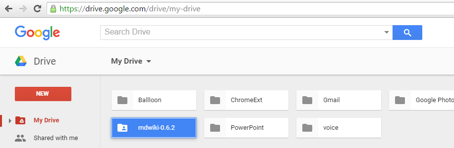
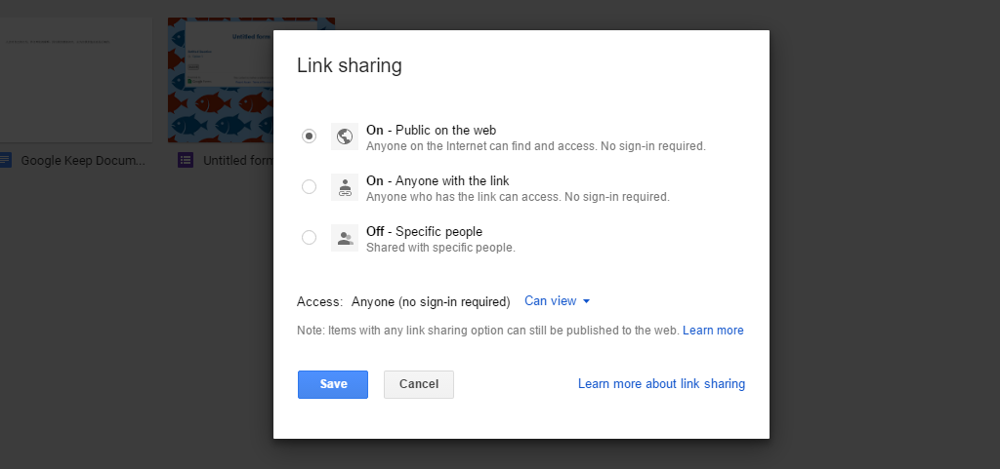
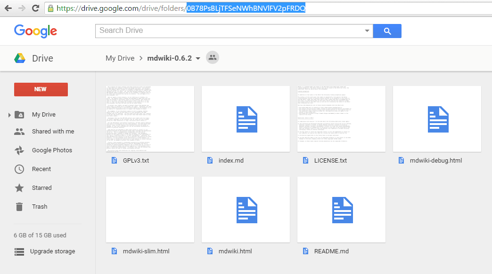

Note:  这一篇是Step by Step，给大家分享出来怎么用Google Drive 搭建mdwiki。

## 下载mdwiki，上传到Google Drive  

 [点击下载][mdwiki-dl] mdwiki ，然后``解压``上传至Google Drive中。(可以直接解压后的文件夹直接拖进登录后的Google Drive 浏览器页面完成上传)。

 

其实只有``mdwiki.html``这个文件是有用的，其他都是版权文件。如果你自己明白这个，可以在这里下载单独的这个单独的[mdwiki.html](https://drive.google.com/open?id=0B78PsBLjTFSedm9YUE0yVDlqcjQ) 文件，然后你随手扔进一个公开的目录就可以啦。
## 把mdwiki的目录设置公开目录
在刚才上传的mdwiki这个目录上面，点鼠标右键 Share --> Advanced 设置所有人可以找到并查看。 

 
 

## 获取mdwiki的公开文件夹ID
 点开你的mdwiki所在的这个文件夹，然后地址栏上可以看到这个文件夹的id，一串字符串。

 

 记住地址栏的那一串ID, 下文当中我把它称为 ``<FOLDER_ID>`` 到时候替换成你自己的就Ok。比如我的是这个：

>   0B78PsBLjTFSeNWhBNVlFV2pFRDQ

## 揭秘属于你的mdwiki地址
上一步中，你已经拿到了你的mdwiki的文件夹ID ``<FOLDER_ID>`` ，下面改揭晓你的mdwiki地址： 

```
https://googledrive.com/host/<FOLDER_ID>/mdwiki.html
```
  ``<FOLDER_ID>`` 到时候替换成你自己的就Ok。比如我的替换完成之后是：

```
https://googledrive.com/host/0B78PsBLjTFSeNWhBNVlFV2pFRDQ/mdwiki.html
```
看到这里，相信聪明的你肯定已经会了！

**小技巧**
当然，如果你不喜欢这样后面还带个mdwiki.html后缀的地址，可以有个小的tricks。把第一步中上传到Google Drive中的``mdwiki.html``重命名为``index.html`` ; 然后你的mdwiki地址就变得简洁多了。如下面格式；
```
https://googledrive.com/host/<FOLDER_ID>/
```
比如我的精简完就是：

```
https://googledrive.com/host/0B78PsBLjTFSeNWhBNVlFV2pFRDQ/#
```
So easy~


  [mdwiki-dl]: https://drive.google.com/open?id=0B78PsBLjTFSeZ1FlZW9FSzBnSDA
  [download]: download.md
  
  
